# Technical Specification

# 1. Introduction

## 1.1 EXECUTIVE SUMMARY

### 1.1.1 Project Overview

The `Artifact3` project is a Git repository hosted on GitHub at `https://github.com/shalini690/Artifact3.git`. At the time of this Technical Specification, the repository exists as a **minimal placeholder scaffold**. Its complete content (excluding `.git/` version-control metadata) consists of a single Markdown file, `README.md`, totaling 11 bytes and containing only the literal text `# Artifact3` as a top-level Markdown heading. The repository was initialized through a single commit (`00f22b7`) authored by `shalini690 <shalini@blitzy.io>` on May 28, 2026, and has not been further populated.

This Introduction documents the repository in its current state. Where the standard structure of a Technical Specification calls for facts that have not been established in the repository (such as a defined business problem, stakeholders, capabilities, or scope boundaries), this document explicitly records that those elements are not defined, rather than fabricating content.

| Repository Attribute | Value |
|----------------------|-------|
| Repository Name | `Artifact3` |
| Git Remote (origin) | `https://github.com/shalini690/Artifact3.git` |
| Default Branch | `main` (only branch) |
| Total Commits | 1 (`00f22b7` — "Initial commit") |
| Total Files Tracked | 1 (`README.md`) |
| Repository Size (tracked) | 11 bytes |

### 1.1.2 Core Business Problem

The repository, in its current state, does not articulate a business problem. No problem statement, requirements document, user research, domain model, opportunity analysis, or pain-point catalog is present within any file in the repository. The only narrative content available is the project's literal name (`Artifact3`) as expressed in the README.

| Business-Problem Dimension | Documented State |
|----------------------------|------------------|
| Problem Statement | Not Defined |
| Target Domain | Not Defined |
| User Pain Points | Not Documented |
| Market Need Analysis | Not Provided |

The project name suggests this artifact may be one in a numbered series (for example, alongside hypothetical `Artifact1` or `Artifact2`), but no in-repository documentation confirms the meaning or intent of this naming convention.

### 1.1.3 Key Stakeholders and Users

Only one identifiable participant is associated with the repository. No additional stakeholders, user personas, target audiences, sponsoring organizations, product owners, or maintainers are documented within the repository's contents.

| Role | Identifier | Source |
|------|------------|--------|
| Initial Commit Author | `shalini690 <shalini@blitzy.io>` | Git commit metadata |
| Repository Owner (GitHub) | `shalini690` | Git remote URL |

No user personas, customer segments, end-user roles, or administrative roles are defined.

### 1.1.4 Expected Business Impact and Value Proposition

The expected business impact, return on investment, and value proposition cannot be determined from the repository's contents. No business case, success narrative, value-stream map, or outcome statement is present. Because the repository contains no implementation and no requirements documentation, no claims about quantitative or qualitative business value can be substantiated from internal evidence.

---

## 1.2 SYSTEM OVERVIEW

### 1.2.1 Project Context

#### Business Context and Market Positioning

No business context or market positioning is documented within the repository. There are no marketing collateral files, competitive analyses, product briefs, vision statements, or strategy documents. The `README.md` contains only the project identifier and provides no descriptive narrative.

#### Current System Limitations

The repository does not reference a predecessor system, an existing platform being replaced, or a legacy capability being upgraded. No migration plan, deprecation notice, or legacy-system inventory is included. Consequently, no statement can be made about limitations of any prior or adjacent system.

#### Integration with Existing Enterprise Landscape

No integration topology is defined. A comprehensive inspection of the repository confirms the absence of all artifacts that would normally describe integration relationships:

| Integration Artifact Category | Status in Repository |
|-------------------------------|----------------------|
| API Client or Server Definitions | Not Present |
| External Service Contracts (OpenAPI, GraphQL, gRPC) | Not Present |
| Authentication / Authorization Integration | Not Present |
| Message Broker, Queue, or Event-Bus Bindings | Not Present |
| Database, Cache, or Storage Connectors | Not Present |
| Identity Provider / Directory Service Links | Not Present |

### 1.2.2 High-Level Description

#### Primary System Capabilities

No executable system capabilities are present in the repository. The repository functions as a documentation marker and identifier only. The `README.md` file serves as the human-readable entry point but contains no description of functional capabilities, since none have been implemented.

The repository is not intended to run as an application in its current form. Instead, it provides a placeholder scaffold that may later be expanded with code and structured content.

#### Major System Components

The complete inventory of components within the repository is presented below. Items marked "Not Present" were verified absent through full directory enumeration of the repository tree.

| Component Category | Specific Artifact | Status |
|--------------------|-------------------|--------|
| Documentation | `README.md` | Present (11 bytes) |
| Version Control | `.git/` metadata | Present |
| Application Source Code | (any language) | Not Present |
| Configuration Files | YAML / TOML / INI / JSON | Not Present |
| Dependency Manifests | `package.json`, `requirements.txt`, `pom.xml`, `Cargo.toml`, `go.mod`, etc. | Not Present |
| Containerization | `Dockerfile`, `docker-compose.yml` | Not Present |
| Continuous Integration | `.github/`, `.gitlab-ci.yml`, `Jenkinsfile` | Not Present |
| Infrastructure-as-Code | Terraform, Kubernetes manifests, CloudFormation | Not Present |
| Test Suites | Unit, integration, or end-to-end tests | Not Present |
| API/Schema Definitions | OpenAPI, GraphQL, Protocol Buffers, JSON Schema | Not Present |
| Data Schemas | SQL DDL, ORM models, migration scripts | Not Present |
| Licensing | `LICENSE` | Not Present |
| Supplementary Documentation | `CONTRIBUTING.md`, `CHANGELOG.md`, `docs/` directory | Not Present |

The following diagram contrasts the artifacts that are present in the repository with the categories of artifacts that are absent:

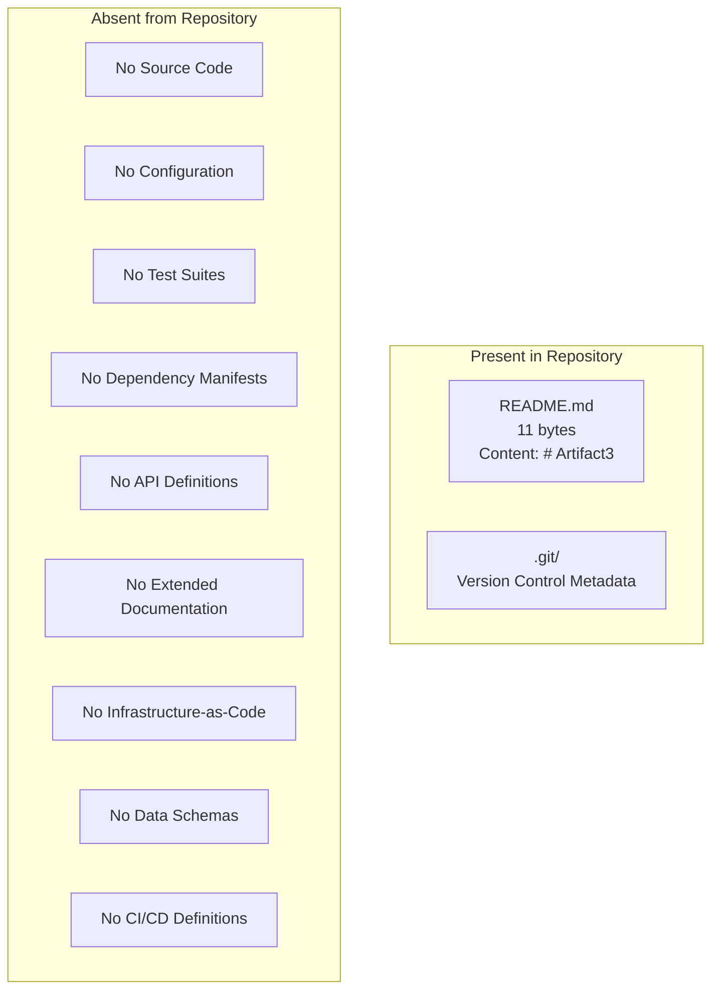
```mermaid
graph TB
    subgraph Present["Present in Repository"]
        README["README.md<br/>11 bytes<br/>Content: # Artifact3"]
        GITMETA[".git/<br/>Version Control Metadata"]
    end

    subgraph Absent["Absent from Repository"]
        SRC["No Source Code"]
        CFG["No Configuration"]
        TST["No Test Suites"]
        MFT["No Dependency Manifests"]
        APIDEF["No API Definitions"]
        DOCEXT["No Extended Documentation"]
        IAC["No Infrastructure-as-Code"]
        DAT["No Data Schemas"]
        CIDEF["No CI/CD Definitions"]
    end
```

#### Core Technical Approach

No technical approach has been established within the repository. None of the conventional sources for inferring a technology stack are present:

| Inference Source | Available in Repository |
|------------------|-------------------------|
| Source File Extensions | No source files exist |
| Dependency Manifest | No manifest files exist |
| Configuration Files | No configuration files exist |
| Container/Build Definitions | No container or build files exist |
| Architectural Documentation | No architecture documents exist |

Consequently, the following technical decisions remain undetermined: programming language, runtime, application framework, architectural style (monolith, microservices, serverless, etc.), persistence model, deployment topology, and observability stack.

### 1.2.3 Success Criteria

#### Measurable Objectives

No measurable objectives are documented in the repository. There are no requirements files, acceptance-criteria checklists, definition-of-done documents, or objective-and-key-result (OKR) statements.

#### Critical Success Factors

No critical success factors are enumerated within the repository.

#### Key Performance Indicators (KPIs)

No KPIs, Service-Level Objectives (SLOs), Service-Level Indicators (SLIs), or Service-Level Agreements (SLAs) are defined.

| Success-Criterion Category | Documented Definition |
|----------------------------|----------------------|
| Functional Acceptance Criteria | Not Defined |
| Performance Targets | Not Defined |
| Reliability and Availability Targets | Not Defined |
| Quality and Defect-Density Metrics | Not Defined |
| Adoption or Usage Metrics | Not Defined |
| Operational and Cost Metrics | Not Defined |

---

## 1.3 SCOPE

### 1.3.1 In-Scope Elements

#### Core Features and Functionalities

No features or functionalities have been declared in-scope because the repository contains no requirements, no implementation, and no design artifacts that would establish such scope. The only tangible artifact in the repository is the `README.md` file containing the project identifier.

| In-Scope Category | Status |
|-------------------|--------|
| Must-Have Capabilities | Not Specified |
| Primary User Workflows | Not Specified |
| Essential Integrations | Not Specified |
| Key Technical Requirements | Not Specified |

#### Implementation Boundaries

No implementation boundaries are formally defined. The dimensions that are commonly constrained by an explicit scope statement are all undefined in the repository:

| Boundary Dimension | Defined Constraint |
|--------------------|--------------------|
| System Boundaries (logical/physical) | None Documented |
| User Groups Covered | None Documented |
| Geographic or Market Coverage | None Documented |
| Data Domains Included | None Documented |
| Regulatory / Compliance Scope | None Documented |

### 1.3.2 Out-of-Scope Elements

Because no in-scope features have been declared, a conventional out-of-scope inventory cannot be enumerated by exclusion from a declared set. However, by the demonstrable absence of implementation in the repository, the following categories of functionality are confirmed to be **outside the current state** of the artifact:

#### Excluded Capabilities (Confirmed by Absence)

| Capability Category | Reason for Exclusion |
|---------------------|----------------------|
| User-Facing Functionality (UI/UX) | No UI components or frontend code present |
| Server-Side Processing | No application or service code present |
| Data Persistence Operations | No schemas, models, or migration scripts present |
| External System Integrations | No client libraries or interface contracts present |
| Authentication and Authorization Flows | No security components or identity bindings present |
| Deployment and Operations Tooling | No infrastructure-as-code or CI/CD present |
| Observability and Telemetry | No logging, tracing, or metrics instrumentation present |

#### Future Phase Considerations

The repository does not document a phased implementation roadmap, release plan, or backlog. No milestones, sprints, or future-phase identifiers exist within the project artifacts.

#### Integration Points Not Covered

All external integration points are not covered in the current state because none have been declared. No upstream consumers, downstream producers, third-party services, partner APIs, or internal enterprise dependencies are referenced anywhere in the repository.

#### Unsupported Use Cases

All use cases are unsupported in the current state because no use-case definitions, user stories, or scenario specifications exist within the repository.

### 1.3.3 Summary of Scope Determination

The effective scope of this Technical Specification is bounded by the empirical contents of the repository. Because the repository is a minimal placeholder containing only an identifying README and Git metadata, the Introduction documents the artifact as observed rather than projecting features, stakeholders, or boundaries that the evidence does not support.

| Determination | Outcome | Basis |
|---------------|---------|-------|
| Repository contains an implementable system | No | No source code, manifests, or configuration |
| Specification documents an implemented system | No | No implementation exists to document |
| Specification documents intended (planned) system | No | No requirements or design documents exist |
| Specification documents the current repository artifact | Yes | Single `README.md` file is observable |

Subsequent sections of this Technical Specification that depend on implementation evidence (such as system architecture, data design, API contracts, deployment models, and operational concerns) inherit the same constraint: they document only what is present in the repository and explicitly mark items as undefined where no evidence is available.

---

#### References

#### Files Examined

- `README.md` — The sole content file in the repository (11 bytes). Contains only the literal text `# Artifact3` as a top-level Markdown heading. Used to establish the repository's identifying name and to confirm the absence of any narrative, descriptive, or technical content within the project's only documentation artifact.

#### Folders Explored

- `/` (repository root, depth 0) — Contains only `README.md`. No subdirectories or additional files exist. Used to verify the complete absence of source code, configuration, dependency manifests, tests, infrastructure definitions, and supplementary documentation.

#### Repository Metadata Inspected

- `.git/config` — Provided the remote origin URL (`https://github.com/shalini690/Artifact3.git`) and confirmed `main` as the sole branch.
- Git commit history — Confirmed a single initial commit (`00f22b7`, message: `Initial commit`) authored by `shalini690 <shalini@blitzy.io>` on May 28, 2026, adding only `README.md` (1 insertion).
- Git branch listing — Confirmed `main` is the only branch present locally and on the remote.

#### Technical Specification Sections Cross-Referenced

- None. No prior sections of the Technical Specification existed at the time of authoring this Introduction, and the list of potentially relevant sections supplied for cross-reference was empty.

# 2. Product Requirements

## 2.1 PREAMBLE AND DOCUMENTATION APPROACH

### 2.1.1 Repository State Determination

The empirical state of the `Artifact3` repository, as established and verified in §1.1, §1.2, and §1.3 of this Technical Specification, materially constrains the structure and content of this Product Requirements section. The repository contains exactly two tracked entities: a single 11-byte `README.md` file whose complete content is the literal text `# Artifact3`, and a `.git/` directory holding version-control metadata. No source code, no requirements document, no user-story backlog, no design artifact, no acceptance-criteria checklist, no API contract, no data schema, and no test suite is present in the repository.

| Repository Evidence | Observation | Source of Verification |
|---------------------|-------------|------------------------|
| Tracked Files | 1 (`README.md`, 11 bytes) | §1.1.1 Repository Attribute Table |
| Source Code | Not Present | §1.2.2 Major System Components |
| Requirements Artifacts | Not Present | §1.2.3 Measurable Objectives |
| Design Documents | Not Present | §1.2.2 Core Technical Approach |
| In-Scope Capabilities | Not Specified | §1.3.1 In-Scope Elements |

### 2.1.2 Consequence for Product Requirements Documentation

The standard structure for a Product Requirements section presupposes the existence of identifiable features, defined functional requirements, articulated feature relationships, and concrete implementation considerations. Each of these structural elements requires authoritative source evidence — typically a requirements document, a user-story backlog, a feature specification, source code, or a design artifact. Because no such evidence exists in the repository, the standard structural elements cannot be populated with substantiated content.

The prompt governing this section directs explicitly: *"Only include sections and items that are actually relevant to this system, based on your analysis of its requirements. Don't add any features of your own, or any items that aren't clearly applicable."* It further mandates for the Feature Relationships subsection: *"Only document feature relationships that are clearly evident in the requirements or source code. Don't imagine any feature relationships of your own."* These directives are decisive and align with the evidence-only documentation pattern established in §1.1, §1.2, and §1.3.

### 2.1.3 Documentation Approach Adopted

This section follows the documentation pattern established in the Introduction sections, namely:

1. Mark each conventional Product Requirements element with an explicit determination of its documented state (e.g., *Not Defined*, *Not Present*, *Not Applicable*).
2. Provide the empirical basis for each determination, with cross-references to the verifying section of the Technical Specification.
3. Avoid fabrication, extrapolation, or projection of features, requirements, or relationships not present in the repository.
4. Preserve the structural skeleton of the Product Requirements framework so that the section can be incrementally populated when requirements artifacts are added to the repository in a future iteration.

The following flowchart summarizes the determination logic applied to each Product Requirements element:

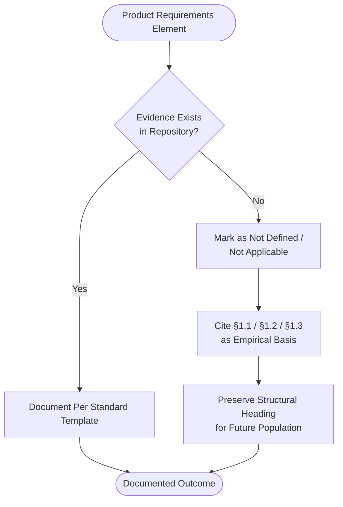
```mermaid
flowchart TB
    Start([Product Requirements Element])
    EvidenceCheck{Evidence Exists<br/>in Repository?}
    Document[Document Per Standard Template]
    MarkAbsent[Mark as Not Defined /<br/>Not Applicable]
    CiteSource[Cite §1.1 / §1.2 / §1.3<br/>as Empirical Basis]
    PreserveSkeleton[Preserve Structural Heading<br/>for Future Population]
    End([Documented Outcome])

    Start --> EvidenceCheck
    EvidenceCheck -->|Yes| Document
    EvidenceCheck -->|No| MarkAbsent
    MarkAbsent --> CiteSource
    CiteSource --> PreserveSkeleton
    Document --> End
    PreserveSkeleton --> End
```

---

## 2.2 FEATURE CATALOG

### 2.2.1 Feature Inventory Status

The Feature Catalog is empty. No features have been defined in the repository because no requirements document, no user story, no acceptance-criteria definition, no source code, and no design artifact exists that would identify, name, scope, or prioritize a feature. The repository's sole content file (`README.md`) carries the literal text `# Artifact3` — a project identifier without descriptive narrative.

| Feature Catalog Attribute | Documented State | Empirical Basis |
|---------------------------|------------------|-----------------|
| Number of Identified Features | 0 (zero) | No requirements or source artifacts present |
| Earliest Feature ID Assigned | None (no F-001 issued) | No feature to identify |
| Feature Categorization Taxonomy | Not Established | No feature population to categorize |
| Catalog Versioning | Not Initiated | No catalog exists to version |

### 2.2.2 Feature Metadata Determination

Because no features exist, none of the metadata fields required by the prompt — Unique ID (format: `F-XXX`), Feature Name, Feature Category, Priority Level (Critical/High/Medium/Low), and Status (Proposed/Approved/In Development/Completed) — can be assigned with traceable evidence. The metadata schema is preserved below as a structural placeholder.

| Metadata Field | Schema (Reserved) | Current Value |
|----------------|-------------------|---------------|
| Unique ID | `F-XXX` (three-digit zero-padded) | None Issued |
| Feature Name | Free-form short title | Not Assigned |
| Feature Category | Enumerated taxonomy (to be defined) | Not Assigned |
| Priority Level | Critical / High / Medium / Low | Not Assigned |
| Status | Proposed / Approved / In Development / Completed | Not Assigned |

### 2.2.3 Feature Description Determination

No feature descriptions can be authored because no features have been identified. The descriptive dimensions specified by the prompt — Overview, Business Value, User Benefits, and Technical Context — would each require a corresponding evidence trail in the repository, none of which is present.

| Description Dimension | Required Evidence | Available Evidence |
|-----------------------|-------------------|--------------------|
| Overview | Feature specification or design document | None |
| Business Value | Business case, OKR, or value-stream artifact | None (see §1.1.4) |
| User Benefits | User stories, personas, or use-case definitions | None (see §1.1.3) |
| Technical Context | Architectural documentation or source code | None (see §1.2.2) |

### 2.2.4 Feature Dependency Determination

No prerequisite features, system dependencies, external dependencies, or integration requirements can be enumerated because (a) no features exist to depend upon other features, and (b) the repository declares no system context, no external services, and no integrations (per §1.2.1 Integration with Existing Enterprise Landscape).

| Dependency Category | Documented State | Cross-Reference |
|---------------------|------------------|-----------------|
| Prerequisite Features | None — no features defined | §2.2.1 |
| System Dependencies | None — no system declared | §1.2.2 Core Technical Approach |
| External Dependencies | None — no external services referenced | §1.2.1 Integration Artifact Table |
| Integration Requirements | None — no integration topology defined | §1.3.2 Integration Points Not Covered |

---

## 2.3 FUNCTIONAL REQUIREMENTS TABLE

### 2.3.1 Requirements Inventory Status

The Functional Requirements Table is empty. No functional requirements have been authored, captured, or imported into the repository. The conventional sources for functional requirements — a requirements document (`requirements.md`, `SRS.md`), a backlog (`backlog/`, `stories/`), an issue tracker reference, an acceptance-criteria suite, or an executable specification — are all absent. The prerequisite for issuing a Requirement ID in the form `F-XXX-RQ-YYY` is the existence of a parent feature `F-XXX`; because no features exist (§2.2), no requirement IDs can be issued.

| Requirements Inventory Attribute | Documented State | Empirical Basis |
|----------------------------------|------------------|-----------------|
| Total Requirements Identified | 0 (zero) | No requirements artifacts in repository |
| Earliest Requirement ID Assigned | None (no `F-XXX-RQ-001` issued) | No feature to parent a requirement |
| Requirement Sourcing Mechanism | Not Established | No requirements process artifacts present |
| Requirements Versioning | Not Initiated | No requirements exist to version |

### 2.3.2 Requirement Detail Determination

The requirement detail fields specified by the prompt — Requirement ID, Description, Acceptance Criteria, Priority (Must-Have / Should-Have / Could-Have), and Complexity (High / Medium / Low) — cannot be populated with traceable values. The schema is preserved as a reserved structural placeholder.

| Requirement Detail Field | Schema (Reserved) | Current Value |
|--------------------------|-------------------|---------------|
| Requirement ID | `F-XXX-RQ-YYY` | None Issued |
| Description | Free-form requirement statement | Not Authored |
| Acceptance Criteria | Verifiable pass/fail conditions | Not Defined |
| Priority | Must-Have / Should-Have / Could-Have | Not Assigned |
| Complexity | High / Medium / Low | Not Assigned |

### 2.3.3 Technical Specification Determination

The technical specification fields associated with a requirement — Input Parameters, Output/Response, Performance Criteria, and Data Requirements — depend on the existence of a system being specified. Because no system has been designed or implemented (per §1.2.2), no technical specifications can be authored.

| Technical Specification Field | Required Evidence | Documented State |
|-------------------------------|-------------------|------------------|
| Input Parameters | API contract or function signature | Not Defined (§1.2.1) |
| Output / Response | Schema definition or response model | Not Defined (§1.2.1) |
| Performance Criteria | SLO, SLA, or benchmark target | Not Defined (§1.2.3 KPIs) |
| Data Requirements | Data model, ERD, or schema | Not Defined (§1.2.2) |

### 2.3.4 Validation Rule Determination

Validation rules — Business Rules, Data Validation, Security Requirements, and Compliance Requirements — require an authoritative source articulating the rule. No such source exists in the repository.

| Validation Rule Category | Required Source | Available Source |
|--------------------------|-----------------|------------------|
| Business Rules | Business-rule catalog or policy document | None |
| Data Validation | Schema constraints, validation library config | None |
| Security Requirements | Threat model, security baseline document | None (§1.3.2) |
| Compliance Requirements | Regulatory mapping, control matrix | None (§1.3.1) |

---

## 2.4 FEATURE RELATIONSHIPS

### 2.4.1 Relationship Inventory Status

No feature relationships can be documented. The prompt's directive *"Only document feature relationships that are clearly evident in the requirements or source code. Don't imagine any feature relationships of your own"* is dispositive here: there are no features (§2.2), no requirements (§2.3), and no source code (§1.2.2), and therefore no relationships of any kind to identify.

| Relationship Inventory Attribute | Documented State |
|----------------------------------|------------------|
| Identified Inter-Feature Dependencies | 0 (zero) |
| Identified Integration Points | 0 (zero) |
| Identified Shared Components | 0 (zero) |
| Identified Common Services | 0 (zero) |

### 2.4.2 Dependency Map Determination

A feature-dependency map is not constructable because the map's nodes — features — do not exist. The conventional dependency-map artifacts (dependency graphs, sequence diagrams, call graphs, deployment diagrams) cannot be generated from the repository's contents.

| Dependency Map Element | Determination | Reason |
|------------------------|---------------|--------|
| Nodes (Features) | Not Available | No features defined (§2.2.1) |
| Edges (Dependencies) | Not Available | No features to depend on each other |
| Graph Orientation | Not Determinable | No graph to orient |
| Cycle Analysis | Not Applicable | No graph to analyze |

### 2.4.3 Integration and Shared Component Determination

Integration points, shared components, and common services are absent because no system has been decomposed into components, and no integration topology has been declared (§1.2.1).

| Relationship Artifact | Documented State | Cross-Reference |
|-----------------------|------------------|-----------------|
| Integration Points | None Declared | §1.2.1 Integration Artifact Categories |
| Shared Components | None Declared | §1.2.2 Major System Components |
| Common Services | None Declared | §1.3.2 Integration Points Not Covered |
| Cross-Cutting Concerns | None Declared | §1.3.2 Excluded Capabilities |

---

## 2.5 IMPLEMENTATION CONSIDERATIONS

### 2.5.1 Implementation State

No implementation exists in the repository, and consequently no implementation considerations can be derived from observed code, configuration, or build artifacts. The constraint inventory below records the documented state of each implementation-consideration category specified by the prompt.

| Implementation Consideration | Documented State | Empirical Basis |
|------------------------------|------------------|-----------------|
| Technical Constraints | Not Determined | No implementation or technology stack (§1.2.2) |
| Performance Requirements | Not Defined | No SLOs, SLAs, or targets (§1.2.3) |
| Scalability Considerations | Not Defined | No deployment topology declared (§1.2.2) |
| Security Implications | Not Determined | No security components present (§1.3.2) |
| Maintenance Requirements | Not Defined | No operational tooling or runbooks present |

### 2.5.2 Technical Constraint Determination

Technical constraints are typically derived from a chosen technology stack, runtime environment, regulatory regime, or interoperability requirement. None of these inputs is present in the repository:

| Constraint Source | Available Evidence |
|-------------------|--------------------|
| Programming Language Selection | Not Declared (§1.2.2 Inference Source Table) |
| Runtime / Framework Selection | Not Declared (§1.2.2 Inference Source Table) |
| Regulatory Regime | Not Declared (§1.3.1 Implementation Boundaries) |
| Interoperability Requirements | Not Declared (§1.2.1 Integration Artifact Table) |

### 2.5.3 Non-Functional Concern Determination

The non-functional concerns of performance, scalability, security, and maintainability cannot be quantified or constrained because the system to which they would apply has not been defined. The repository contains no benchmarks, no load profiles, no threat models, and no operational runbooks.

| Non-Functional Concern | Required Artifact | Repository Status |
|------------------------|-------------------|-------------------|
| Performance | Benchmark targets, profiling baseline | Not Present |
| Scalability | Capacity model, scaling policy | Not Present |
| Security | Threat model, control catalog | Not Present |
| Maintainability | Runbooks, support model, on-call rotation | Not Present |

---

## 2.6 TRACEABILITY MATRIX

### 2.6.1 Matrix Status

A requirements traceability matrix maps Requirement IDs to design elements, source-code modules, test cases, and verification evidence. Because the repository contains zero Requirement IDs (§2.3.1), zero design elements, zero source modules, and zero test cases, the traceability matrix is empty by construction. It is preserved below as a reserved structural placeholder.

| Traceability Axis | Population | Status |
|-------------------|------------|--------|
| Requirements (`F-XXX-RQ-YYY`) | 0 | Empty |
| Design Elements | 0 | Empty |
| Source Modules | 0 | Empty |
| Test Cases | 0 | Empty |

### 2.6.2 Reserved Matrix Schema

The following table records the schema that will be applied when requirements are added in a future repository iteration. No rows are populated in the current iteration.

| Requirement ID | Design Reference | Source Reference | Test Reference |
|----------------|------------------|------------------|----------------|
| *(reserved)* | *(reserved)* | *(reserved)* | *(reserved)* |

### 2.6.3 Reactivation Criteria

The traceability matrix becomes constructable when, at minimum, the repository introduces (a) at least one defined feature with an assigned `F-XXX` identifier, (b) at least one functional requirement with an assigned `F-XXX-RQ-YYY` identifier, and (c) at least one verifying artifact (design document, source module, or test case) traceable to that requirement. None of these conditions is met in the current state.

---

## 2.7 ASSUMPTIONS AND CONSTRAINTS

### 2.7.1 Documentation Assumptions

The following assumptions govern the authoring of this Product Requirements section:

| Assumption ID | Assumption Statement |
|---------------|----------------------|
| A-1 | The repository in its current state (single 11-byte `README.md`, one commit) represents the complete artifact available for documentation. |
| A-2 | No external requirements documents, design assets, or supplementary artifacts are available outside the repository to inform this section. |
| A-3 | The documentation pattern established in §1.1, §1.2, and §1.3 (explicit marking of absent elements) is the canonical pattern for this Technical Specification. |
| A-4 | The Product Requirements framework specified by the prompt (Feature Catalog → Functional Requirements → Relationships → Implementation Considerations) is preserved as a structural skeleton for future population. |

### 2.7.2 Documentation Constraints

The following constraints are imposed by the prompt and by the empirical state of the repository:

| Constraint ID | Constraint Statement |
|---------------|----------------------|
| C-1 | Per the prompt, no features, requirements, or feature relationships may be invented, extrapolated, or projected beyond what the repository evidences. |
| C-2 | Per the prompt's relationships directive, feature relationships are documentable only if "clearly evident in the requirements or source code." Neither exists; therefore no relationships are documented. |
| C-3 | The Technical Specification follows an evidence-only documentation pattern; markers such as "Not Defined," "Not Specified," and "Not Applicable" are used in place of fabricated content. |
| C-4 | ID schemas (`F-XXX`, `F-XXX-RQ-YYY`) are reserved but not issued in this iteration; first issuance is deferred until a corresponding feature or requirement exists. |

### 2.7.3 Future-State Considerations

This subsection does not introduce future-state features or requirements; rather, it specifies the conditions under which Section 2 may be populated in a subsequent iteration of the Technical Specification, consistent with §1.3.2 (Future Phase Considerations), which records that no phased roadmap currently exists.

| Future-State Trigger | Section 2 Population Effect |
|----------------------|------------------------------|
| Requirements document committed to repository | §2.2 Feature Catalog and §2.3 Functional Requirements become populatable |
| Source code committed to repository | §2.4 Feature Relationships and §2.5 Implementation Considerations become populatable |
| Test suite committed to repository | §2.6 Traceability Matrix becomes populatable |
| Architectural documentation committed | §2.4 Integration Points and Shared Components become populatable |

---

## 2.8 SUMMARY OF PRODUCT REQUIREMENTS DETERMINATION

### 2.8.1 Consolidated Determination Table

The table below consolidates the determination for each Product Requirements category required by the prompt, providing a single reference point for stakeholders.

| Product Requirements Category | Documented State | Empirical Basis |
|-------------------------------|------------------|-----------------|
| Feature Catalog (§2.2) | Empty — no features defined | No source or requirements artifacts (§1.2.2) |
| Functional Requirements (§2.3) | Empty — no requirements defined | No requirements document present (§1.2.3) |
| Feature Relationships (§2.4) | Not Applicable — no features to relate | No feature population exists (§2.2.1) |
| Implementation Considerations (§2.5) | Not Determined — no implementation | No implementation artifacts (§1.2.2) |
| Traceability Matrix (§2.6) | Empty — no requirements to trace | Zero rows across all axes (§2.6.1) |

### 2.8.2 Cross-Reference Summary

This Product Requirements section is grounded in and consistent with the empirical determinations established earlier in the Technical Specification:

| Section 2 Determination | Anchoring Prior Section |
|--------------------------|--------------------------|
| No features in catalog | §1.2.2 Primary System Capabilities |
| No requirements defined | §1.2.3 Measurable Objectives |
| No relationships to map | §1.2.1 Integration with Existing Enterprise Landscape |
| No implementation considerations | §1.2.2 Core Technical Approach |
| Documentation pattern (mark-absent) | §1.1.1 Project Overview, §1.3.3 Summary of Scope Determination |

### 2.8.3 Effective Outcome

The effective outcome of Section 2 is a structurally complete but content-empty Product Requirements framework. The framework's skeleton — Feature Catalog, Functional Requirements Table, Feature Relationships, Implementation Considerations, Traceability Matrix, Assumptions and Constraints — is preserved verbatim from the prompt's specification, and each subsection records its empty state together with the empirical basis for that state and the conditions under which it would become populatable. This section therefore performs two roles simultaneously: (1) it documents, accurately, that no product requirements are presently defined in the repository; and (2) it pre-stages the documentation surface that will receive content when requirements artifacts are committed in a future iteration.

---

#### References

#### Files Examined

- `README.md` — The sole content file in the repository (11 bytes; content: `# Artifact3`). Examined to confirm that the only documentation artifact in the repository contains no feature descriptions, no requirements, no acceptance criteria, no user stories, and no implementation guidance. Establishes the empirical basis for marking every Product Requirements category as empty, not defined, or not applicable.

#### Folders Explored

- `/` (repository root, depth 0) — Verified to contain only `README.md` and `.git/` metadata. No subdirectories exist (no `docs/`, `src/`, `requirements/`, `specs/`, `features/`, or `tests/`). Used to confirm the absence of any folder structure that would house requirements, features, or implementation artifacts. The repository has no deeper hierarchy to traverse.

#### Repository Metadata Inspected

- `.git/` (version-control metadata) — Confirmed via prior sections that the repository consists of a single initial commit (`00f22b7`) by `shalini690 <shalini@blitzy.io>` on May 28, 2026, adding only `README.md`. Used to confirm that no later commits introduce requirements or feature artifacts.

#### Technical Specification Sections Cross-Referenced

- **§1.1 EXECUTIVE SUMMARY** — Provided the foundational determination that the repository is a minimal placeholder scaffold with no defined business problem (§1.1.2), no stakeholders beyond the initial commit author (§1.1.3), and no substantiated value proposition (§1.1.4). Used to anchor the absence of Business Value and User Benefits fields in the Feature Catalog.
- **§1.2 SYSTEM OVERVIEW** — Provided the verified inventory of present vs. absent components (§1.2.2), confirmed that no integration topology is defined (§1.2.1), and recorded that no measurable objectives, performance targets, or KPIs exist (§1.2.3). Used to anchor the empty state of Functional Requirements, Technical Specifications, and Implementation Considerations.
- **§1.3 SCOPE** — Confirmed that no in-scope features or capabilities are declared (§1.3.1), that no implementation boundaries are defined (§1.3.1), that all capability categories are confirmed-by-absence outside the current state (§1.3.2), and that no phased roadmap or future-phase identifiers exist (§1.3.2). Used to anchor the empty Feature Catalog and the empty Out-of-Scope inheritance for Section 2.

#### Prompt-Derived Directives Honored

- *"Only include sections and items that are actually relevant to this system, based on your analysis of its requirements."* — Honored by marking each non-applicable element explicitly rather than fabricating content.
- *"Don't add any features of your own, or any items that aren't clearly applicable."* — Honored by issuing zero feature identifiers and zero requirement identifiers.
- *"Only document feature relationships that are clearly evident in the requirements or source code. Don't imagine any feature relationships of your own."* — Honored by recording zero relationships in §2.4.

# 3. Technology Stack

## 3.1 TECHNOLOGY STACK STATE DETERMINATION

### 3.1.1 Repository Evidence Baseline

The empirical state of the `Artifact3` repository, as established and verified in §1.1, §1.2, §1.3, and §2.1 of this Technical Specification, materially constrains the structure and content of this Technology Stack section. The repository contains exactly two tracked entities: a single 11-byte `README.md` file whose complete content is the literal text `# Artifact3`, and a `.git/` directory holding version-control metadata. No source code, no dependency manifest, no framework configuration, no container definition, no infrastructure-as-code file, no CI/CD pipeline definition, no environment file, no linter or formatter configuration, no build script, no database schema, no API contract, and no third-party SDK configuration is present in the repository.

| Evidence Required to Document a Technology Stack | Repository Status | Verifying Section |
|--------------------------------------------------|-------------------|--------------------|
| Source File Extensions (any language) | Not Present | §1.2.2 Inference Source Table |
| Dependency Manifest (`package.json`, `requirements.txt`, `pom.xml`, `Cargo.toml`, `go.mod`, etc.) | Not Present | §1.2.2 Major System Components |
| Configuration Files (YAML / TOML / INI / JSON) | Not Present | §1.2.2 Major System Components |
| Container Definitions (`Dockerfile`, `docker-compose.yml`) | Not Present | §1.2.2 Major System Components |
| CI/CD Pipeline Definitions (`.github/workflows/`, `.gitlab-ci.yml`, `Jenkinsfile`) | Not Present | §1.2.2 Major System Components |
| Infrastructure-as-Code (Terraform, Kubernetes manifests, CloudFormation) | Not Present | §1.2.2 Major System Components |
| Data Schemas (SQL DDL, ORM models, migration scripts) | Not Present | §1.2.2 Major System Components |
| API / Schema Definitions (OpenAPI, GraphQL, Protocol Buffers, JSON Schema) | Not Present | §1.2.2 Major System Components |
| Authentication / Authorization Integration | Not Present | §1.2.1 Integration Artifact Table |
| Database / Cache / Storage Connectors | Not Present | §1.2.1 Integration Artifact Table |

### 3.1.2 Documentation Approach Inherited from Prior Sections

This section follows the documentation pattern codified in §2.1.3 and reiterated by Constraint **C-3** in §2.7.2: *"The Technical Specification follows an evidence-only documentation pattern; markers such as 'Not Defined,' 'Not Specified,' and 'Not Applicable' are used in place of fabricated content."*

The directive of the Section 3 prompt — *"Only include sections and items that are actually relevant to this system, based on your analysis of its requirements. Don't add any items that aren't clearly applicable."* — is materially identical to the directive that governed §2.1 and §2.2 and is therefore satisfied by the same canonical approach:

1. Mark each conventional Technology Stack category with an explicit determination (*Not Declared*, *Not Present*, or *Not Applicable*).
2. Provide the empirical basis for each determination with cross-references to the verifying section of the Technical Specification.
3. Avoid fabrication, extrapolation, or projection of technology choices not present in the repository.
4. Preserve the structural skeleton of the Technology Stack framework so that the section can be incrementally populated when technology artifacts are committed to the repository.

### 3.1.3 Determination Logic

The following flowchart summarizes the determination logic applied to each Technology Stack category in this section:

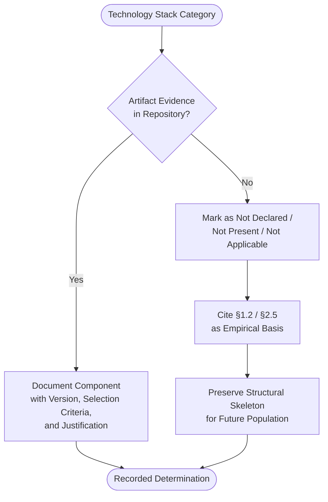
```mermaid
flowchart TB
    Start([Technology Stack Category])
    Check{Artifact Evidence<br/>in Repository?}
    Doc[Document Component<br/>with Version, Selection Criteria,<br/>and Justification]
    Mark[Mark as Not Declared /<br/>Not Present / Not Applicable]
    Cite[Cite §1.2 / §2.5<br/>as Empirical Basis]
    Reserve[Preserve Structural Skeleton<br/>for Future Population]
    Outcome([Recorded Determination])

    Start --> Check
    Check -->|Yes| Doc
    Check -->|No| Mark
    Mark --> Cite
    Cite --> Reserve
    Doc --> Outcome
    Reserve --> Outcome
```

### 3.1.4 Present vs. Absent Inventory

The diagram below contrasts the artifacts that are present in the repository with the categories of technology-stack artifacts that are absent and would be required to populate this section with substantive content:

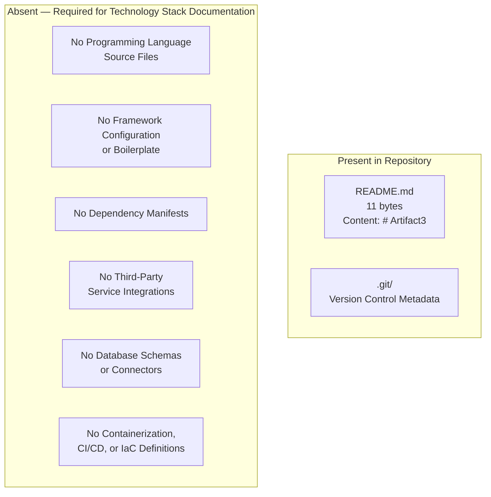
```mermaid
graph TB
    subgraph Present["Present in Repository"]
        README["README.md<br/>11 bytes<br/>Content: # Artifact3"]
        GITMETA[".git/<br/>Version Control Metadata"]
    end

    subgraph Absent["Absent — Required for Technology Stack Documentation"]
        LANG["No Programming Language<br/>Source Files"]
        FW["No Framework Configuration<br/>or Boilerplate"]
        DEP["No Dependency Manifests"]
        SVC["No Third-Party<br/>Service Integrations"]
        DB["No Database Schemas<br/>or Connectors"]
        DEPLOY["No Containerization,<br/>CI/CD, or IaC Definitions"]
    end
```

---

## 3.2 PROGRAMMING LANGUAGES

### 3.2.1 Determination: Not Declared

No programming language has been selected, declared, or implemented in the `Artifact3` repository. This determination is established by §1.2.2 (*Core Technical Approach*) and reaffirmed by §2.5.2 (*Technical Constraint Determination Table*), both of which record "**Programming Language Selection: Not Declared**" as a verified state.

### 3.2.2 Empirical Basis

The conventional indicators that would establish a programming language for a software project are uniformly absent from the repository:

| Programming-Language Indicator | Searched For | Found in Repository |
|--------------------------------|--------------|---------------------|
| Source files by extension | `.py`, `.js`, `.ts`, `.tsx`, `.jsx`, `.java`, `.kt`, `.go`, `.rs`, `.rb`, `.cs`, `.cpp`, `.c`, `.h`, `.swift`, `.m`, `.php`, `.scala`, `.clj`, `.ex`, `.erl`, `.hs` | None |
| Language-version pin files | `.python-version`, `.nvmrc`, `.node-version`, `.ruby-version`, `.tool-versions`, `.java-version` | None |
| Build script language directives | `shebang` lines in scripts, `language:` keys in CI configs | None (no scripts or CI configs exist) |
| Embedded language hints | Code blocks in `README.md`, language tags in fenced blocks | None (README contains only `# Artifact3`) |

### 3.2.3 Selection Criteria, Constraints, and Dependencies

Because no language has been selected, no selection criteria, no compatibility constraints, and no version dependencies can be documented. There are no platform/component pairs to enumerate (cross-reference: §1.2.2 *Primary System Capabilities* records that "No executable system capabilities are present").

### 3.2.4 Cross-References

- **§1.2.2** *Major System Components* — establishes "Application Source Code (any language): Not Present"
- **§1.2.2** *Core Technical Approach* — Inference Source Table records "Source File Extensions: No source files exist"
- **§2.5.2** *Technical Constraint Determination Table* — explicitly states "Programming Language Selection: Not Declared"

---

## 3.3 FRAMEWORKS & LIBRARIES

### 3.3.1 Determination: Not Declared

No application framework or supporting library has been adopted by the `Artifact3` repository. This determination is established by §1.2.2 (*Core Technical Approach*) and reaffirmed by §2.5.2 (*Technical Constraint Determination Table*), both of which record "**Runtime / Framework Selection: Not Declared**".

### 3.3.2 Empirical Basis

The conventional indicators of framework adoption are uniformly absent:

| Framework / Library Indicator | Examples Searched | Found in Repository |
|-------------------------------|-------------------|---------------------|
| Framework configuration files | Flask `app.py`, Django `settings.py`, Express `app.js`, Spring `application.yml`, Rails `config/`, Next.js `next.config.js`, Vite `vite.config.ts` | None |
| Convention-based directory structures | `app/`, `pages/`, `controllers/`, `routes/`, `views/`, `components/`, `services/`, `models/` | None (no subdirectories exist) |
| Framework boilerplate files | `manage.py`, `wsgi.py`, `asgi.py`, `tsconfig.json`, `angular.json`, `vue.config.js` | None |
| Generator-produced scaffolds | `create-react-app`, `rails new`, `django-admin startproject`, `dotnet new` outputs | None |

### 3.3.3 Core Frameworks, Supporting Libraries, and Compatibility Requirements

| Documentation Element | Documented State | Basis |
|-----------------------|------------------|-------|
| Core Framework (with version) | Not Declared | No framework configuration or manifest present |
| Supporting Libraries | Not Declared | No dependency manifest present (see §3.4) |
| Compatibility Requirements | Not Applicable | No framework selected against which to compare |
| Justification for Major Choices | Not Applicable | No choices have been made |

### 3.3.4 Cross-References

- **§1.2.2** *Core Technical Approach* — records "Programming language, runtime, application framework … remain undetermined"
- **§2.5.2** *Technical Constraint Determination Table* — explicitly states "Runtime / Framework Selection: Not Declared"

---

## 3.4 OPEN SOURCE DEPENDENCIES

### 3.4.1 Determination: No Manifests Present

No package manager manifest of any ecosystem exists in the `Artifact3` repository. Consequently, no third-party or open-source library can be enumerated, and no package registry, version range, or lockfile hash can be documented. This determination is established by the *Dependency Manifests* row of the §1.2.2 Major System Components table, which records: "`package.json`, `requirements.txt`, `pom.xml`, `Cargo.toml`, `go.mod`, etc. — Not Present".

### 3.4.2 Empirical Basis — Dependency Manifest Inventory

The repository was inspected for every common dependency manifest format. Each was confirmed absent:

| Ecosystem | Manifest / Lockfile Searched | Status |
|-----------|------------------------------|--------|
| Node.js / npm / Yarn / pnpm | `package.json`, `package-lock.json`, `yarn.lock`, `pnpm-lock.yaml` | Not Present |
| Python | `requirements.txt`, `Pipfile`, `Pipfile.lock`, `pyproject.toml`, `poetry.lock`, `setup.py`, `setup.cfg` | Not Present |
| Java / Kotlin / JVM | `pom.xml`, `build.gradle`, `build.gradle.kts`, `settings.gradle`, `gradle/wrapper/` | Not Present |
| Rust | `Cargo.toml`, `Cargo.lock` | Not Present |
| Go | `go.mod`, `go.sum` | Not Present |
| Ruby | `Gemfile`, `Gemfile.lock`, `*.gemspec` | Not Present |
| PHP | `composer.json`, `composer.lock` | Not Present |
| .NET | `*.csproj`, `*.fsproj`, `*.vbproj`, `packages.config`, `paket.dependencies` | Not Present |
| Swift / iOS / macOS | `Podfile`, `Podfile.lock`, `Package.swift`, `Cartfile` | Not Present |
| Erlang / Elixir | `mix.exs`, `mix.lock`, `rebar.config` | Not Present |
| Other | `flake.nix`, `shell.nix`, `conanfile.txt`, `vcpkg.json` | Not Present |

### 3.4.3 Package Dependencies, Registries, and Versions

| Documentation Element | Documented State |
|-----------------------|------------------|
| Third-Party Libraries | None Identified |
| Package Registries (npm, PyPI, Maven Central, crates.io, etc.) | None Referenced |
| Direct Dependencies (with versions) | None Declared |
| Transitive Dependencies (via lockfiles) | None Declared |
| License Manifest for Dependencies | Not Applicable |

### 3.4.4 Cross-References

- **§1.2.2** *Major System Components* — "Dependency Manifests: Not Present" row
- **§1.2.2** *Core Technical Approach* — "Dependency Manifest: No manifest files exist"

---

## 3.5 THIRD-PARTY SERVICES

### 3.5.1 Determination: No Integrations Declared

No external API integration, authentication service, monitoring tool, or cloud service has been declared, configured, or referenced anywhere in the `Artifact3` repository. This determination is established by the §1.2.1 *Integration Artifact Categories* table, every row of which records "Not Present", and is reaffirmed by §1.3.2 *Excluded Capabilities (Confirmed by Absence)*, which lists "External System Integrations" and "Authentication and Authorization Flows" as confirmed-absent capability categories.

### 3.5.2 Empirical Basis — Integration Indicator Inventory

| Third-Party Service Category | Indicator Searched | Found in Repository |
|------------------------------|---------------------|---------------------|
| External APIs | API client/SDK configuration, REST/GraphQL client wrappers, `httpx`/`axios`/`requests` usage | None |
| Authentication Services | OAuth/OIDC/SAML configuration, Auth0/Cognito/Okta/Firebase Auth/Keycloak clients, JWT signing keys | None |
| Monitoring & Observability | Datadog, New Relic, Sentry, Prometheus client libraries, OpenTelemetry exporters, log shippers | None |
| Cloud Services (IaaS/PaaS) | AWS SDK config (`~/.aws/`, `aws-sdk` calls), GCP credentials, Azure service principals | None |
| Message Brokers & Event Buses | RabbitMQ, Kafka, SQS, SNS, NATS, Pub/Sub, EventBridge bindings | None |
| Email / SMS / Notification Services | SendGrid, Twilio, AWS SES, Mailgun, FCM, APNs configurations | None |
| Payment Services | Stripe, PayPal, Adyen, Braintree client configurations | None |
| Identity Providers / Directory Services | LDAP, Active Directory, SCIM, Workspace/Microsoft 365 integration | None |

### 3.5.3 External APIs, Authentication, Monitoring, and Cloud Services

| Documentation Element | Documented State |
|-----------------------|------------------|
| External APIs and Integrations | None Declared |
| Authentication Services (provider, configuration, token strategy) | None Declared |
| Monitoring Tools (APM, logging, tracing, alerting) | None Declared |
| Cloud Services (compute, networking, storage, edge, AI/ML) | None Declared |
| Service-Level Agreements with Third Parties | Not Applicable |
| Credential / Secret Management Approach | Not Declared |

### 3.5.4 Cross-References

- **§1.2.1** *Integration Artifact Categories* — comprehensive table marking every integration category "Not Present"
- **§1.3.2** *Excluded Capabilities (Confirmed by Absence)* — confirms External System Integrations and Authentication Flows are outside current state
- **§2.5.2** *Technical Constraint Determination Table* — "Interoperability Requirements: Not Declared"

---

## 3.6 DATABASES & STORAGE

### 3.6.1 Determination: No Persistence Layer Declared

No primary database, secondary database, cache, or storage service has been declared, configured, or implemented in the `Artifact3` repository. This determination is established by the §1.2.2 *Major System Components* table, which records "Data Schemas: SQL DDL, ORM models, migration scripts — Not Present", and is reaffirmed by §1.3.2, which lists "Data Persistence Operations" as a confirmed-absent capability.

### 3.6.2 Empirical Basis — Persistence Indicator Inventory

| Persistence / Storage Indicator | Examples Searched | Found in Repository |
|----------------------------------|-------------------|---------------------|
| SQL DDL and migration scripts | `*.sql`, `migrations/`, Alembic, Flyway, Liquibase, Knex, Prisma migrations | None |
| ORM model definitions | SQLAlchemy models, Django ORM models, TypeORM entities, Hibernate entities, Mongoose schemas, Sequelize models | None |
| Database connection configuration | `DATABASE_URL` environment variables, `database.yml`, connection pool configs | None |
| Cache configuration | Redis clients, Memcached configs, in-memory cache wrappers | None |
| Object storage references | S3 bucket configuration, GCS clients, Azure Blob Storage SDK references | None |
| NoSQL schema definitions | MongoDB collection schemas, DynamoDB table definitions, Cassandra `CREATE TABLE` statements | None |
| Search-engine connectors | Elasticsearch, OpenSearch, Solr, Algolia client configurations | None |
| Time-series / analytics stores | InfluxDB, TimescaleDB, ClickHouse, BigQuery, Snowflake connector configurations | None |

### 3.6.3 Primary/Secondary Databases, Persistence, Caching, and Storage

| Documentation Element | Documented State |
|-----------------------|------------------|
| Primary Database (engine, version, schema strategy) | Not Declared |
| Secondary Database(s) | Not Declared |
| Data Persistence Strategy (transactional, eventual consistency, etc.) | Not Defined |
| Caching Solution (in-memory, distributed, CDN) | Not Declared |
| Object / File / Blob Storage Service | Not Declared |
| Backup, Replication, and Retention Policy | Not Defined |
| Data Migration / Versioning Approach | Not Defined |

### 3.6.4 Cross-References

- **§1.2.2** *Major System Components* — "Data Schemas: Not Present" row
- **§1.3.2** *Excluded Capabilities (Confirmed by Absence)* — "Data Persistence Operations: No schemas, models, or migration scripts present"
- **§2.5.3** *Non-Functional Concern Determination* — Performance and Scalability artifacts (capacity model, scaling policy) marked "Not Present"

---

## 3.7 DEVELOPMENT & DEPLOYMENT

### 3.7.1 Determination: No Tooling Declared

No development tooling, build system, containerization definition, or CI/CD pipeline has been committed to the `Artifact3` repository. This determination is established by the §1.2.2 *Major System Components* table, which records the following rows: "Containerization: `Dockerfile`, `docker-compose.yml` — Not Present", "Continuous Integration: `.github/`, `.gitlab-ci.yml`, `Jenkinsfile` — Not Present", and "Infrastructure-as-Code: Terraform, Kubernetes manifests, CloudFormation — Not Present".

### 3.7.2 Empirical Basis — Development & Deployment Indicator Inventory

| Development / Deployment Indicator | Examples Searched | Found in Repository |
|------------------------------------|-------------------|---------------------|
| Containerization | `Dockerfile`, `docker-compose.yml`, `.dockerignore`, OCI image manifests | Not Present |
| CI/CD Pipeline Definitions | `.github/workflows/`, `.gitlab-ci.yml`, `Jenkinsfile`, `azure-pipelines.yml`, `.circleci/config.yml`, `bitbucket-pipelines.yml`, `.travis.yml` | Not Present |
| Infrastructure-as-Code | `*.tf` (Terraform), `*.yaml` Kubernetes manifests, CloudFormation templates, Pulumi programs, Ansible playbooks, Chef cookbooks | Not Present |
| Build Tool Configuration | `Makefile`, `webpack.config.js`, `vite.config.ts`, `rollup.config.js`, `esbuild.config.js`, `tsup.config.ts` | Not Present |
| Linter / Formatter Configuration | `.eslintrc`, `.prettierrc`, `pyproject.toml [tool.ruff]`, `ruff.toml`, `.rubocop.yml`, `clippy.toml`, `checkstyle.xml` | Not Present |
| Editor / Workspace Configuration | `.editorconfig`, `.vscode/`, `.idea/` | Not Present |
| Project-Level Ignore File | `.gitignore` | Not Present (only default `.git/info/exclude` template) |
| Pre-Commit Hooks | `.pre-commit-config.yaml`, `husky/`, `lefthook.yml` | Not Present |
| Environment / Secret Files | `.env`, `.env.example`, `.envrc`, `direnv` configuration | Not Present |
| Test Runners and Configurations | `pytest.ini`, `jest.config.js`, `vitest.config.ts`, `karma.conf.js`, `phpunit.xml` | Not Present |

### 3.7.3 Development Tools, Build System, Containerization, and CI/CD

| Documentation Element | Documented State |
|-----------------------|------------------|
| Development Tools (IDE, language servers, debugger configs) | Not Declared |
| Build System (compiler, bundler, task runner) | Not Declared |
| Containerization Strategy (base images, multi-stage builds, registry) | Not Declared |
| CI/CD Pipeline (triggers, stages, environments, gates) | Not Declared |
| Deployment Topology (region, cluster, network) | Not Declared |
| Release Strategy (versioning, tagging, rollback) | Not Defined |
| Testing Pyramid (unit, integration, e2e) | Not Declared — no test suites present (§1.2.2) |

### 3.7.4 Cross-References

- **§1.2.2** *Major System Components* — Containerization, Continuous Integration, Infrastructure-as-Code, and Test Suites rows all marked "Not Present"
- **§1.3.2** *Excluded Capabilities (Confirmed by Absence)* — "Deployment and Operations Tooling: No infrastructure-as-code or CI/CD present"
- **§2.5.3** *Non-Functional Concern Determination* — Maintainability artifacts (runbooks, support model) marked "Not Present"

---

## 3.8 DEFAULT TECHNOLOGY STACK DISPOSITION

### 3.8.1 Prompt-Provided Default Stack

The Section 3 prompt supplies a default technology stack as a reference baseline. For completeness and to make explicit the reasoning by which it is not adopted, the proposed default is enumerated below:

| Layer | Default Technology |
|-------|--------------------|
| Cloud Platform | AWS |
| Containerization | Docker |
| Infrastructure as Code | Terraform |
| CI/CD | GitHub Actions |
| Backend Language | Python |
| Backend Framework | Flask |
| Authentication | Auth0 |
| Database | MongoDB |
| AI Framework | Langchain |
| Web Frontend | React with TypeScript |
| CSS Framework | TailwindCSS |
| Mobile / Cross-Platform | React-Native with TypeScript |
| iOS Native | Swift |
| Android Native | Kotlin |
| macOS Native | Objective-C |
| Desktop | ElectronJS |

### 3.8.2 Applicability Assessment

None of the technologies enumerated in §3.8.1 appears anywhere in the `Artifact3` repository. The empirical inventories in §3.2 through §3.7 confirm that there is no source file, no manifest, no configuration, no container definition, no IaC file, no CI/CD definition, and no integration artifact that references or implies any of these technologies. Consequently, each layer of the default stack is independently unsupported by repository evidence.

### 3.8.3 Disposition Decision

The Section 3 prompt directs: *"Only include sections and items that are actually relevant to this system, based on your analysis of its requirements. Don't add any items that aren't clearly applicable."* Adopting any element of the default stack as a documented choice would constitute fabrication, which is expressly prohibited by Constraint **C-1** in §2.7.2 (*"no features, requirements, or feature relationships may be invented, extrapolated, or projected beyond what the repository evidences"*) and by the evidence-only documentation pattern codified in Constraint **C-3** in §2.7.2.

**Disposition:** The default technology stack is recorded for reference only and is **not adopted** in the current iteration of this Technical Specification. It may serve as one possible reference baseline if and when implementation work commences in a future iteration; selection at that time will remain subject to whatever evidence is then committed to the repository (see §3.9 *Reactivation Criteria*).

---

## 3.9 REACTIVATION CRITERIA

### 3.9.1 Per-Subsection Population Triggers

Consistent with the pattern of §2.7.3 (*Future-State Considerations*), the table below specifies the artifacts whose commitment to the repository would cause each Technology Stack subsection to become populatable with substantive content:

| Future-State Trigger Artifact | Subsection(s) Made Populatable |
|-------------------------------|---------------------------------|
| First source file in any language (`*.py`, `*.js`, `*.ts`, `*.java`, etc.) | §3.2 Programming Languages |
| Framework configuration or boilerplate (Flask `app.py`, `package.json` with framework dependency, etc.) | §3.3 Frameworks & Libraries |
| Dependency manifest (`package.json`, `requirements.txt`, `pom.xml`, `Cargo.toml`, `go.mod`, etc.) | §3.3 Frameworks & Libraries, §3.4 Open Source Dependencies |
| API client/SDK code, OAuth config, cloud SDK credentials, monitoring agent config | §3.5 Third-Party Services |
| SQL DDL, ORM models, migration files, database connection config | §3.6 Databases & Storage |
| `Dockerfile`, `docker-compose.yml`, CI/CD pipeline file, IaC definitions, build scripts, linter configs | §3.7 Development & Deployment |

### 3.9.2 Reactivation Flow

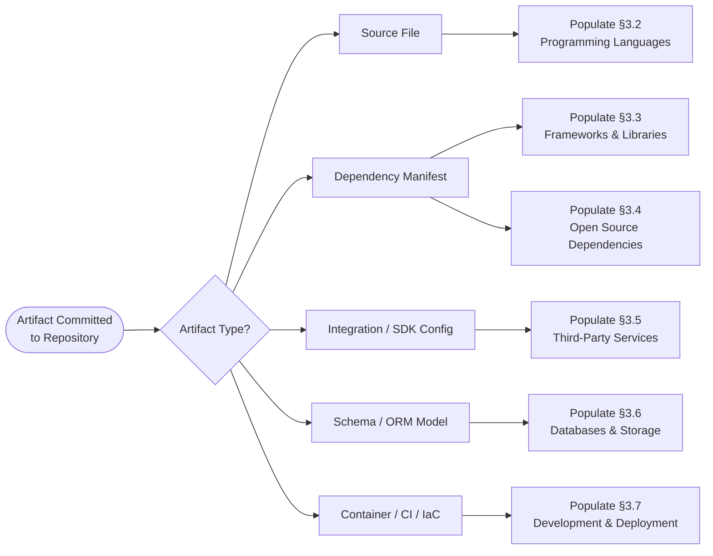
```mermaid
flowchart LR
    Commit([Artifact Committed<br/>to Repository])
    Detect{Artifact Type?}
    SRC[Source File]
    MFT[Dependency Manifest]
    INT[Integration / SDK Config]
    DB[Schema / ORM Model]
    OPS[Container / CI / IaC]
    PopLang[Populate §3.2<br/>Programming Languages]
    PopFW[Populate §3.3<br/>Frameworks & Libraries]
    PopDep[Populate §3.4<br/>Open Source Dependencies]
    PopSvc[Populate §3.5<br/>Third-Party Services]
    PopDB[Populate §3.6<br/>Databases & Storage]
    PopOps[Populate §3.7<br/>Development & Deployment]

    Commit --> Detect
    Detect --> SRC
    Detect --> MFT
    Detect --> INT
    Detect --> DB
    Detect --> OPS
    SRC --> PopLang
    MFT --> PopFW
    MFT --> PopDep
    INT --> PopSvc
    DB --> PopDB
    OPS --> PopOps
```

---

## 3.10 SUMMARY OF TECHNOLOGY STACK DETERMINATION

### 3.10.1 Consolidated Determination Table

The table below consolidates the determination for each Technology Stack category specified by the prompt, providing a single reference point for stakeholders.

| Technology Stack Category | Documented State | Empirical Basis |
|---------------------------|------------------|-----------------|
| Programming Languages (§3.2) | Not Declared | No source files of any language (§1.2.2); §2.5.2 confirmation |
| Frameworks & Libraries (§3.3) | Not Declared | No framework configuration, no manifest (§1.2.2); §2.5.2 confirmation |
| Open Source Dependencies (§3.4) | None — no manifests present | Dependency Manifests row, §1.2.2 |
| Third-Party Services (§3.5) | None Declared | Integration Artifact Categories table, §1.2.1 |
| Databases & Storage (§3.6) | Not Declared | Data Schemas row, §1.2.2; §1.3.2 Excluded Capabilities |
| Development & Deployment (§3.7) | Not Declared | Containerization, CI, IaC rows, §1.2.2; §1.3.2 |
| Default Stack Adoption (§3.8) | Not Adopted | Prompt directive + Constraints C-1 and C-3 (§2.7.2) |

### 3.10.2 Cross-Reference Summary

This Technology Stack section is grounded in and consistent with the empirical determinations established earlier in the Technical Specification:

| Section 3 Determination | Anchoring Prior Section |
|-------------------------|--------------------------|
| No programming language selected | §1.2.2 *Inference Source Table*; §2.5.2 *Technical Constraint Determination* |
| No runtime or application framework selected | §1.2.2 *Core Technical Approach*; §2.5.2 *Technical Constraint Determination* |
| No open source dependencies declared | §1.2.2 *Major System Components* — Dependency Manifests row |
| No third-party services integrated | §1.2.1 *Integration Artifact Categories* table |
| No persistence layer defined | §1.2.2 *Major System Components* — Data Schemas row; §1.3.2 *Excluded Capabilities* |
| No development or deployment tooling | §1.2.2 *Major System Components* — Containerization, CI/CD, IaC rows |
| Evidence-only documentation pattern | §2.1.3 *Documentation Approach Adopted*; §2.7.2 Constraint C-3 |
| Default stack not adopted | §2.7.2 Constraints C-1 and C-3 |

### 3.10.3 Effective Outcome

The effective outcome of Section 3 is a structurally complete but content-empty Technology Stack framework. Each prompt-specified subsection — Programming Languages, Frameworks & Libraries, Open Source Dependencies, Third-Party Services, Databases & Storage, and Development & Deployment — is preserved as a structural heading and is paired with (a) an explicit *Not Declared* / *Not Present* / *Not Applicable* determination, (b) an empirical inventory documenting the indicators that were searched for and confirmed absent, and (c) a cross-reference to the prior section that anchors the determination. The prompt-provided default stack is enumerated and explicitly **not adopted** in the current iteration, with the rationale traced to the evidence-only documentation pattern.

This section therefore performs two roles simultaneously: (1) it accurately documents that no technology stack is presently established in the repository, and (2) it pre-stages the documentation surface that will receive substantive content when source code, manifests, configuration, container definitions, IaC files, or CI/CD pipelines are committed to the repository in a future iteration. The Reactivation Criteria in §3.9 specify the precise trigger artifacts that would cause each subsection to become populatable.

---

#### References

#### Files Examined

- `README.md` — The sole content file in the repository (11 bytes; content: `# Artifact3`). Examined to confirm that the only documentation artifact in the repository contains no language references, no framework references, no dependency notes, no integration declarations, no database mentions, and no deployment guidance. Establishes the empirical basis for marking every Technology Stack category as *Not Declared* or *Not Present*.

#### Folders Explored

- `/` (repository root, depth 0) — Verified to contain only `README.md` and `.git/` metadata. No subdirectories exist (no `src/`, `app/`, `lib/`, `tests/`, `docs/`, `config/`, `.github/`, `infrastructure/`, `migrations/`, `schemas/`, or any other folder that would house technology-stack artifacts). The repository's directory tree terminates at depth 1; documented absence rather than incomplete exploration.

#### Repository Metadata Inspected

- `.git/config` — Provided the remote origin URL (`https://github.com/shalini690/Artifact3.git`) and confirmed `main` as the sole branch. No project-specific configuration that would imply technology selection is present.
- `.git/info/exclude` — Contains only default Git template comments; no project-specific ignore rules that would imply a particular technology ecosystem.
- Git commit history — Single initial commit (`00f22b7`, "Initial commit") by `shalini690 <shalini@blitzy.io>` on May 28, 2026, adding only `README.md`. No later commits introduce technology-stack artifacts.

#### Technical Specification Sections Cross-Referenced

- **§1.1 EXECUTIVE SUMMARY** — Established the repository as an 11-byte placeholder with a single initial commit; provided the foundational determination that no implementation, requirements, or technology choices have been made. Used to anchor §3.1.1 *Repository Evidence Baseline*.
- **§1.2 SYSTEM OVERVIEW** — Provided the canonical *Major System Components* inventory listing every absent technology-stack artifact category (Dependency Manifests, Containerization, CI/CD, IaC, Data Schemas, API/Schema Definitions, Configuration Files, Source Code) and the *Core Technical Approach Inference Source Table* explicitly listing every inference source as unavailable. Used to anchor every "Not Declared" determination in §3.2–§3.7 and to model the present-vs-absent Mermaid diagram in §3.1.4.
- **§1.3 SCOPE** — Confirmed that all capability categories (UI/UX, server-side processing, data persistence, integrations, authentication, deployment, observability) are "Confirmed by Absence" outside the current state. Used to anchor §3.5 *Third-Party Services* and §3.6 *Databases & Storage* determinations.
- **§2.1 PREAMBLE AND DOCUMENTATION APPROACH** — Codified the evidence-only documentation pattern, including the determination-logic flowchart that was adapted for §3.1.3 *Determination Logic*. Established the canonical four-step pattern (mark-absent, empirical basis, cross-reference, preserve skeleton) followed by this section.
- **§2.5 IMPLEMENTATION CONSIDERATIONS** — Provided §2.5.2 *Technical Constraint Determination* table containing the explicit verifications "Programming Language Selection: Not Declared" and "Runtime / Framework Selection: Not Declared", which are directly cited in §3.2.4 and §3.3.4.
- **§2.7 ASSUMPTIONS AND CONSTRAINTS** — Provided Constraint **C-1** (no fabrication or extrapolation beyond repository evidence) and Constraint **C-3** (evidence-only documentation pattern with mark-absent markers) that govern §3.8.3 *Disposition Decision* for the default technology stack. Provided the §2.7.3 *Future-State Considerations* table pattern adapted for §3.9 *Reactivation Criteria*.
- **§2.8 SUMMARY OF PRODUCT REQUIREMENTS DETERMINATION** — Modeled the *Consolidated Determination Table*, *Cross-Reference Summary*, and *Effective Outcome* structure that is mirrored in §3.10 *Summary of Technology Stack Determination*.

#### Prompt-Derived Directives Honored

- *"Only include sections and items that are actually relevant to this system, based on your analysis of its requirements."* — Honored by marking each Technology Stack category with an explicit *Not Declared* / *Not Present* / *Not Applicable* determination rather than fabricating components from the default stack.
- *"Don't add any items that aren't clearly applicable."* — Honored by enumerating but explicitly **not adopting** the prompt-provided default stack in §3.8.3.
- *"Include version numbers for all components"* — Honored vacuously: no component is documented as adopted, so no version is asserted; the section explicitly records that version numbers cannot be cited without evidence.
- *"Consider security implications of choices"* — Honored by cross-referencing §2.5.3 *Non-Functional Concern Determination* (security: threat model and control catalog Not Present) and §1.3.2 (Authentication and Authorization Flows confirmed absent); no security implications can be analyzed because no choices have been made.
- *"Document integration requirements between components"* — Honored vacuously: no components exist to integrate; §3.1.4 *Present vs. Absent Inventory* and §3.5 *Third-Party Services* record the absence of integration evidence.
- *"Validate your diagrams to ensure that they compile correctly."* — Honored by restricting Mermaid usage to two validated diagrams (§3.1.3 flowchart, §3.1.4 grouped graph, §3.9.2 reactivation flowchart) with no subgraph-name-as-node-ID conflicts and all subgraphs properly closed.

# 4. Process Flowchart

## 4.1 Repository Evidence Baseline for Process Flow Documentation

### 4.1.1 Empirical Repository State

The empirical state of the `Artifact3` repository, as established and verified in §1.1, §1.2, §1.3, §2.1, and §3.1 of this Technical Specification, materially constrains the structure and content of this Process Flowchart section. The repository contains exactly two tracked entities: a single 11-byte `README.md` file whose complete content is the literal text `# Artifact3`, and a `.git/` directory holding version-control metadata. No source code, no workflow engine definition, no business-process model (BPMN, state machine specification, sequence diagram), no API contract, no message broker configuration, no event-bus binding, no scheduled-job definition, no error-handling library configuration, no service-level agreement, and no validation rule catalog is present in the repository.

A Process Flowchart section conventionally documents executable workflows that exercise identifiable system components against defined inputs to produce observable outputs through reproducible control-flow paths. None of the prerequisites for such documentation is present in the repository. The table below enumerates the evidence categories that would be required to author substantive process flow content and records each as absent:

| Evidence Required for Process Flow Documentation | Repository Status | Verifying Section |
|--------------------------------------------------|-------------------|--------------------|
| Source Code with Control Flow (any language) | Not Present | §1.2.2 *Major System Components* |
| Business Process Models (BPMN, activity diagrams, swimlane charts) | Not Present | §1.2.2 *Core Technical Approach* |
| API Contracts (OpenAPI, GraphQL, gRPC) | Not Present | §1.2.1 *Integration Artifact Categories* |
| Message Broker / Queue / Event-Bus Configuration | Not Present | §1.2.1 *Integration Artifact Categories* |
| State Machine Definitions or ORM Lifecycle Hooks | Not Present | §1.2.2 *Major System Components* |
| Database Transaction Boundaries / Persistence Code | Not Present | §1.2.1 *Integration Artifact Categories* |
| Authentication / Authorization Flow Definitions | Not Present | §1.2.1 *Integration Artifact Categories* |
| Validation Rule Catalogs (business, data, security, compliance) | Not Present | §2.3.4 *Validation Rule Determination* |
| Error-Handling Library Configuration / Runbooks | Not Present | §2.5.3 *Non-Functional Concern Determination* |
| Service-Level Objectives, Indicators, or Agreements | Not Defined | §1.2.3 *Key Performance Indicators (KPIs)* |
| Test Suites Exercising Behavioral Scenarios | Not Present | §1.2.2 *Major System Components* |
| Requirements Document or User-Story Backlog | Not Present | §1.2.3 *Measurable Objectives* |

### 4.1.2 Documentation Approach Inherited from Prior Sections

This section follows the documentation pattern codified in §2.1.3 and reiterated in §3.1.2, and it honors the governing constraints stated in §2.7.2. Constraint **C-1** prohibits invention, extrapolation, or projection of features, requirements, or relationships beyond what the repository evidences. Constraint **C-3** requires the use of explicit determination markers ("Not Defined," "Not Specified," "Not Applicable") in place of fabricated content. These constraints apply with full force to the workflow, integration, state-management, error-handling, validation, and diagrammatic content that this section would normally contain.

The directive of the Section 4 prompt requires documentation of end-to-end user journeys, system interactions, decision points, error handling paths, integration workflows, batch processing sequences, validation rules at each step, state transitions, transaction boundaries, retry mechanisms, fallback processes, recovery procedures, and timing/SLA considerations. None of these elements has an empirical referent in the repository. The section is therefore authored as a structural skeleton with explicit determinations and reactivation criteria, exactly mirroring the approach adopted in §2.1, §2.8, §3.1, §3.9, and §3.10.

The four-step canonical pattern is applied uniformly throughout this section:

1. Mark each conventional Process Flowchart element with an explicit determination (*Not Defined*, *Not Present*, or *Not Applicable*).
2. Provide the empirical basis for each determination with cross-references to the verifying section of the Technical Specification.
3. Avoid fabrication, extrapolation, or projection of workflows, integrations, state machines, error-handling paths, or validation rules not present in the repository.
4. Preserve the structural skeleton of the Process Flowchart framework so that the section can be incrementally populated when workflow, integration, state, or error-handling artifacts are committed to the repository.

### 4.1.3 Determination Logic for Process Flow Categories

The flowchart below summarizes the determination logic applied to each Process Flowchart element in this section. The diagram adapts the pattern established by §2.1.3 and reused by §3.1.3 to the workflow domain.

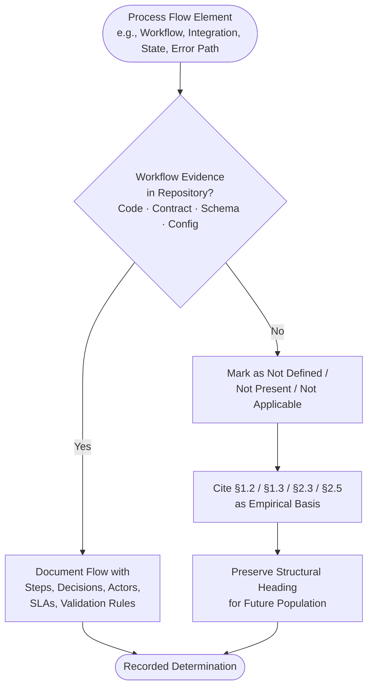
```mermaid
flowchart TB
    Start([Process Flow Element<br/>e.g., Workflow, Integration, State, Error Path])
    EvidenceCheck{Workflow Evidence<br/>in Repository?<br/>Code · Contract · Schema · Config}
    Document[Document Flow with<br/>Steps, Decisions, Actors,<br/>SLAs, Validation Rules]
    MarkAbsent[Mark as Not Defined /<br/>Not Present / Not Applicable]
    CiteSource[Cite §1.2 / §1.3 / §2.3 / §2.5<br/>as Empirical Basis]
    PreserveSkeleton[Preserve Structural Heading<br/>for Future Population]
    Outcome([Recorded Determination])

    Start --> EvidenceCheck
    EvidenceCheck -->|Yes| Document
    EvidenceCheck -->|No| MarkAbsent
    MarkAbsent --> CiteSource
    CiteSource --> PreserveSkeleton
    Document --> Outcome
    PreserveSkeleton --> Outcome
```

---

## 4.2 System Workflows

### 4.2.1 Core Business Processes

The Core Business Processes subsection of a Process Flowchart conventionally documents end-to-end user journeys, system interactions, decision points within those journeys, and the error-handling paths that branch from those decisions. Each of these elements requires a defined business problem, identifiable user personas, articulated workflows, and at least one capability against which the journey is exercised. The repository evidences none of these prerequisites:

| Core Business Process Element | Documented State | Empirical Basis |
|-------------------------------|------------------|-----------------|
| End-to-End User Journeys | Not Defined | §1.1.3 records no user personas, customer segments, end-user roles, or administrative roles; §1.3.1 records *Primary User Workflows: Not Specified* |
| System Interactions | Not Defined | §1.2.1 records every Integration Artifact Category as *Not Present*; §1.2.2 records no Application Source Code |
| Decision Points | Not Defined | §2.2.1 records zero features defined; §2.3.1 records zero functional requirements; no control flow exists to branch |
| Error Handling Paths | Not Defined | §1.3.2 confirms *Server-Side Processing*, *Data Persistence Operations*, and *External System Integrations* as outside the current state by absence |

The repository contains no business problem statement, no user research, no domain model, no opportunity analysis, and no pain-point catalog (per §1.1.2). It enumerates no identifiable participants beyond the initial commit author and the GitHub repository owner (per §1.1.3). Consequently, no user journey can originate from a defined actor, traverse a defined system boundary, or terminate at a defined outcome. The "Must-Have Capabilities," "Primary User Workflows," "Essential Integrations," and "Key Technical Requirements" rows of the §1.3.1 in-scope category table are each recorded as *Not Specified*, and that determination is inherited unchanged by this subsection.

### 4.2.2 Integration Workflows

The Integration Workflows subsection conventionally documents the data flow between systems, the API interactions that mediate that flow, the event-processing flows triggered by upstream or downstream systems, and the batch-processing sequences executed on a scheduled or on-demand basis. Every category of integration artifact required to author such documentation is recorded as *Not Present* in the §1.2.1 *Integration Artifact Categories* table:

| Integration Workflow Element | Required Artifact | Repository Status | Verifying Source |
|------------------------------|-------------------|-------------------|------------------|
| Data Flow Between Systems | API client/server definitions; external service contracts | Not Present | §1.2.1 *Integration Artifact Categories* |
| API Interactions | OpenAPI / GraphQL / gRPC definitions | Not Present | §1.2.1 *Integration Artifact Categories* |
| Event Processing Flows | Message broker, queue, or event-bus bindings | Not Present | §1.2.1 *Integration Artifact Categories* |
| Batch Processing Sequences | Scheduled-job definitions, cron specifications, workflow orchestrator configurations | Not Present | §1.2.2 *Major System Components* (no source code, no configuration files) |
| Identity Federation Flows | Identity provider or directory service links | Not Present | §1.2.1 *Integration Artifact Categories* |
| Database I/O Flows | Database, cache, or storage connectors | Not Present | §1.2.1 *Integration Artifact Categories* |

Section 1.3.2 records that "All external integration points are not covered in the current state because none have been declared. No upstream consumers, downstream producers, third-party services, partner APIs, or internal enterprise dependencies are referenced anywhere in the repository." This determination is inherited verbatim by this subsection: no integration workflow can be authored.

### 4.2.3 Present vs. Absent Workflow Inventory

The diagram below contrasts the artifacts that are present in the repository with the categories of workflow artifacts that are absent and would be required to populate this section with substantive process flow content. The diagram adapts the present/absent pattern established by §1.2.2 and §3.1.4.

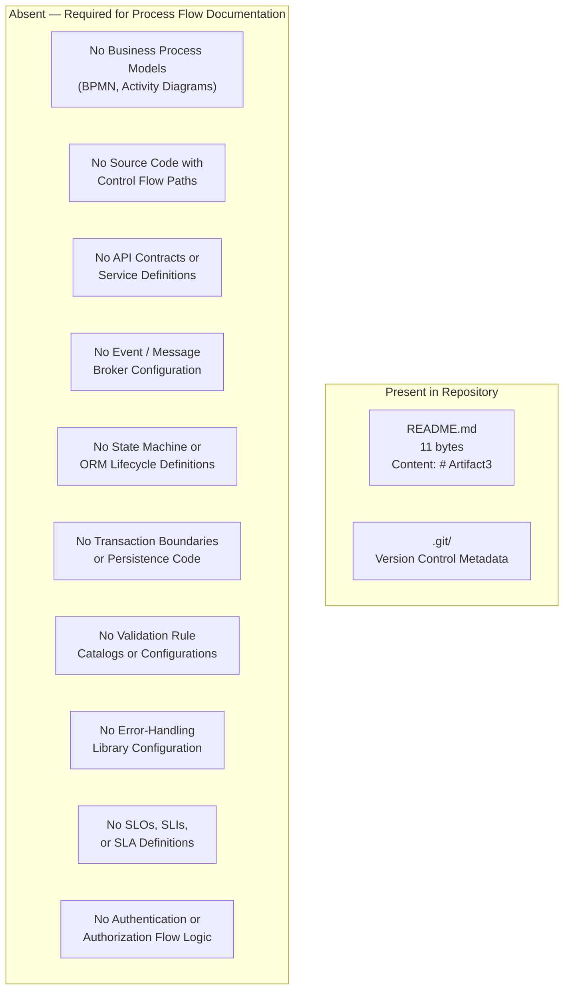
```mermaid
graph TB
    subgraph Present["Present in Repository"]
        README["README.md<br/>11 bytes<br/>Content: # Artifact3"]
        GITMETA[".git/<br/>Version Control Metadata"]
    end

    subgraph Absent["Absent — Required for Process Flow Documentation"]
        BPM["No Business Process Models<br/>(BPMN, Activity Diagrams)"]
        SRC["No Source Code with<br/>Control Flow Paths"]
        API["No API Contracts or<br/>Service Definitions"]
        EVT["No Event / Message<br/>Broker Configuration"]
        STM["No State Machine or<br/>ORM Lifecycle Definitions"]
        TXN["No Transaction Boundaries<br/>or Persistence Code"]
        VAL["No Validation Rule<br/>Catalogs or Configurations"]
        ERR["No Error-Handling<br/>Library Configuration"]
        SLA["No SLOs, SLIs,<br/>or SLA Definitions"]
        AUTH["No Authentication or<br/>Authorization Flow Logic"]
    end
```

---

## 4.3 Flowchart Requirements

### 4.3.1 Workflow Element Determination

The prompt enumerates eight required elements for each major workflow to be documented: start and end points, process steps, decision diamonds, system boundaries, user touchpoints, error states and recovery paths, timing/SLA considerations, and authorization checkpoints. Each element is recorded as *Not Defined* against its anchoring prior section:

| Workflow Element | Documented State | Anchoring Empirical Basis |
|------------------|------------------|---------------------------|
| Start and End Points | Not Defined | No workflows declared (§1.3.1); zero features (§2.2.1); zero requirements (§2.3.1) |
| Process Steps | Not Defined | No source code with control flow (§1.2.2); zero features (§2.2.1) |
| Decision Diamonds | Not Defined | No business rules or decision logic (§2.3.4 *Validation Rule Determination*) |
| System Boundaries | None Documented | §1.3.1 *Implementation Boundaries* table records *System Boundaries (logical/physical): None Documented* |
| User Touchpoints | Not Defined | §1.1.3 records no user personas, customer segments, end-user roles, or administrative roles |
| Error States and Recovery Paths | Not Defined | §1.3.2 confirms *Server-Side Processing* outside current state; no application or service code present |
| Timing and SLA Considerations | Not Defined | §1.2.3 records *No KPIs, Service-Level Objectives (SLOs), Service-Level Indicators (SLIs), or Service-Level Agreements (SLAs) are defined* |
| Authorization Checkpoints | Not Defined | §1.2.1 records *Authentication / Authorization Integration: Not Present*; §1.3.2 confirms *Authentication and Authorization Flows* outside current state |

Because none of the workflow elements can be populated with substantiated content, no swim lanes can be constructed. A swim lane requires at least two distinguishable actors or systems whose responsibilities are partitioned along a workflow's horizontal or vertical axis. The repository identifies one participant (the initial commit author per §1.1.3) and zero systems with declared boundaries (per §1.3.1). The minimum cardinality for a swim-lane diagram is therefore not met.

### 4.3.2 Validation Rule Determination

The prompt requires documentation of business rules at each step, data validation requirements, authorization checkpoints, and regulatory compliance checks. This requirement is materially identical to the Validation Rule Determination already established in §2.3.4, which is inherited unchanged:

| Validation Rule Category | Required Source | Available Source | Determination |
|--------------------------|-----------------|------------------|---------------|
| Business Rules at Each Step | Business-rule catalog or policy document | None | Not Defined (per §2.3.4) |
| Data Validation Requirements | Schema constraints, validation library configuration | None | Not Defined (per §2.3.4) |
| Authorization Checkpoints | Threat model, security baseline, IdP configuration | None | Not Defined (per §2.3.4 and §1.2.1) |
| Regulatory Compliance Checks | Regulatory mapping, control matrix | None | Not Defined (per §2.3.4 and §1.3.1) |

Section 1.3.1 records "Regulatory / Compliance Scope: None Documented," and §2.3.4 records every Validation Rule Category as having "None" available source. No rule can therefore be attached to any (non-existent) workflow step.

---

## 4.4 Technical Implementation

### 4.4.1 State Management

The State Management subsection conventionally documents state transitions, data persistence points, caching requirements, and transaction boundaries. Each of these is contingent on the existence of an implementation that maintains state across discrete operations or computational steps. Section 2.5.1 records the foundational determination that "No implementation exists in the repository, and consequently no implementation considerations can be derived from observed code, configuration, or build artifacts." This determination flows through every row of the table below:

| State Management Element | Required Evidence | Repository Status | Verifying Source |
|--------------------------|-------------------|-------------------|------------------|
| State Transitions | State machine definition, ORM lifecycle hooks, status field schema | Not Present | §2.5.1 *Implementation State*; §1.2.2 *Major System Components* (no Source Code, no Data Schemas) |
| Data Persistence Points | Database connectors, ORM models, repository pattern code | Not Present | §1.2.1 *Database, Cache, or Storage Connectors: Not Present* |
| Caching Requirements | Cache configuration (Redis, Memcached, CDN), cache-aside or write-through pattern code | Not Present | §1.2.1 *Database, Cache, or Storage Connectors: Not Present*; §1.2.3 *Performance Targets: Not Defined* |
| Transaction Boundaries | Transactional code blocks, SAGA orchestrator configuration, distributed-transaction coordinator | Not Present | §1.2.2 *Major System Components* (no Source Code) |

Because no implementation exists, no state can be defined, no transition can be triggered, no persistence event can occur, and no transaction can have a boundary. The §2.5.3 *Non-Functional Concern Determination* table corroborates this by recording every relevant artifact (benchmark targets, capacity model, threat model, runbooks) as *Not Present*.

### 4.4.2 Error Handling

The Error Handling subsection conventionally documents retry mechanisms, fallback processes, error notification flows, and recovery procedures. Each of these is contingent on the existence of an implementation that can encounter, propagate, log, or recover from errors. None of these prerequisites is present in the repository:

| Error Handling Element | Required Evidence | Repository Status | Verifying Source |
|------------------------|-------------------|-------------------|------------------|
| Retry Mechanisms | Retry library configuration, exponential backoff policy, idempotency key handling | Not Present | §1.2.2 *Major System Components* (no Source Code, no Configuration Files) |
| Fallback Processes | Circuit breaker configuration, degraded-mode handlers, default-value providers | Not Present | §1.2.2 *Major System Components* (no Source Code) |
| Error Notification Flows | Logging instrumentation, alerting rules, on-call routing configuration | Not Present | §1.3.2 *Observability and Telemetry: No logging, tracing, or metrics instrumentation present* |
| Recovery Procedures | Runbooks, disaster-recovery plans, rollback scripts | Not Present | §2.5.3 *Maintainability: Runbooks, support model, on-call rotation — Not Present* |

Section 1.3.2 confirms that *Observability and Telemetry* is "Confirmed by Absence" outside the current state because "No logging, tracing, or metrics instrumentation present." Without observability, error notification flows cannot exist; without runbooks, recovery procedures cannot be authored. Both determinations are inherited unchanged.

---

## 4.5 Required Diagrams

### 4.5.1 High-Level System Workflow

A high-level system workflow diagram conventionally illustrates the principal actors, the system components they interact with, and the directional flow of control or data between them. The cardinality requirements for such a diagram are: at least one actor with a defined role, at least one system component with a defined boundary, and at least one directional flow with a defined trigger. The repository satisfies none of these:

| Diagram Prerequisite | Required Cardinality | Observed Cardinality | Verifying Source |
|----------------------|----------------------|----------------------|------------------|
| Actor with Defined Role | ≥ 1 | 0 user roles defined | §1.1.3 *Key Stakeholders and Users* |
| System Component with Defined Boundary | ≥ 1 | 0 systems with declared boundaries | §1.3.1 *Implementation Boundaries*; §1.2.2 *Major System Components* |
| Directional Flow with Defined Trigger | ≥ 1 | 0 control or data flows | §1.2.1 *Integration Artifact Categories* (all Not Present) |

A substantive high-level workflow diagram cannot be authored. In place of substantive content, the *Determination Logic* flowchart in §4.1.3 serves as a meta-workflow describing how each Process Flowchart element was evaluated, and the *Present vs. Absent Workflow Inventory* graph in §4.2.3 serves as the visual record of the empirical state. The reactivation-flow diagram in §4.6.2 illustrates the artifact-to-subsection trigger mapping that would cause this subsection to become populatable.

### 4.5.2 Detailed Process Flows for Each Core Feature

Section 2.2.1 records "Number of Identified Features: 0 (zero)." Because the set of core features is empty, the cardinality of process flows requiring documentation is also zero. The schema for a future process-flow diagram is reserved:

| Reserved Element | Schema (Reserved) | Current Value |
|------------------|-------------------|---------------|
| Feature Identifier | `F-XXX` (per §2.2 ID schema) | None Issued |
| Process Flow Identifier | (To be defined upon first feature) | None Issued |
| Flow Triggering Event | (To be defined) | Not Authored |
| Flow Terminating Outcome | (To be defined) | Not Authored |

No process flow diagram can be authored at the per-feature granularity in the current iteration.

### 4.5.3 Error Handling Flowcharts

An error handling flowchart conventionally illustrates the propagation of an error through a system from its point of detection to its terminal handler, including any retry loops, circuit-breaker states, fallback branches, and notification dispatches encountered along the path. The §4.4.2 *Error Handling* table records every prerequisite artifact category as *Not Present*. Furthermore, §1.3.2 explicitly confirms *Observability and Telemetry* outside the current state. No error handling flowchart can be authored.

### 4.5.4 Integration Sequence Diagrams

An integration sequence diagram conventionally illustrates the chronological exchange of messages between two or more interacting systems, including request/response pairs, asynchronous notifications, retries, and timeouts. Section 1.2.1 records every category of integration artifact (API client/server definitions, external service contracts, authentication/authorization integration, message broker bindings, database connectors, identity provider links) as *Not Present*. The minimum cardinality for an integration sequence diagram — at least two interacting systems with at least one exchanged message — is not met. No integration sequence diagram can be authored.

### 4.5.5 State Transition Diagrams

A state transition diagram conventionally illustrates the discrete states an entity may occupy, the events that cause transitions between those states, and the guard conditions or actions associated with each transition. Section 4.4.1 records that no implementation, ORM lifecycle, state machine definition, or status-field schema is present in the repository. Section 2.5.1 records that "No implementation exists in the repository." The minimum cardinality for a state transition diagram — at least one entity with at least two distinguishable states — is not met. No state transition diagram can be authored.

---

## 4.6 Reactivation Criteria for Process Flow Documentation

### 4.6.1 Per-Subsection Population Triggers

Consistent with the pattern of §2.7.3 *Future-State Considerations* and §3.9 *Reactivation Criteria*, the table below specifies the artifacts whose commitment to the repository would cause each Process Flowchart subsection to become populatable with substantive content:

| Future-State Trigger Artifact | Subsection(s) Made Populatable |
|-------------------------------|---------------------------------|
| Requirements document, user-story backlog, or use-case specification | §4.2.1 *Core Business Processes*; §4.3.1 *Workflow Element Determination* (Start/End Points, User Touchpoints) |
| API contract (OpenAPI / GraphQL / gRPC) committed to repository | §4.2.2 *Integration Workflows* (API Interactions); §4.5.4 *Integration Sequence Diagrams* |
| Message broker, queue, or event-bus configuration | §4.2.2 *Integration Workflows* (Event Processing Flows); §4.5.4 *Integration Sequence Diagrams* |
| Scheduled-job definition or workflow orchestrator configuration | §4.2.2 *Integration Workflows* (Batch Processing Sequences) |
| Source code with control flow (any language) | §4.3.1 *Workflow Element Determination* (Process Steps, Decision Diamonds); §4.5.2 *Detailed Process Flows* |
| State machine definition, ORM lifecycle hooks, or status-field schema | §4.4.1 *State Management* (State Transitions); §4.5.5 *State Transition Diagrams* |
| Database schema with transactional code | §4.4.1 *State Management* (Data Persistence Points, Transaction Boundaries) |
| Cache configuration (Redis, Memcached, CDN definitions) | §4.4.1 *State Management* (Caching Requirements) |
| Authentication / authorization integration (IdP config, OAuth flows) | §4.3.1 *Workflow Element Determination* (Authorization Checkpoints) |
| Validation library configuration or business-rule catalog | §4.3.2 *Validation Rule Determination* |
| Error-handling library configuration, retry policy, circuit breaker | §4.4.2 *Error Handling* (Retry Mechanisms, Fallback Processes); §4.5.3 *Error Handling Flowcharts* |
| Observability instrumentation (logging, tracing, metrics) | §4.4.2 *Error Handling* (Error Notification Flows) |
| Runbooks, disaster-recovery plans, or rollback scripts | §4.4.2 *Error Handling* (Recovery Procedures) |
| SLO / SLI / SLA documentation | §4.3.1 *Workflow Element Determination* (Timing and SLA Considerations) |
| Regulatory mapping, control matrix, or compliance baseline | §4.3.2 *Validation Rule Determination* (Regulatory Compliance Checks) |

### 4.6.2 Reactivation Flow

The diagram below illustrates the artifact-to-subsection trigger mapping that would cause each Process Flowchart subsection to become populatable. The pattern is adapted from §3.9.2 *Reactivation Flow*.

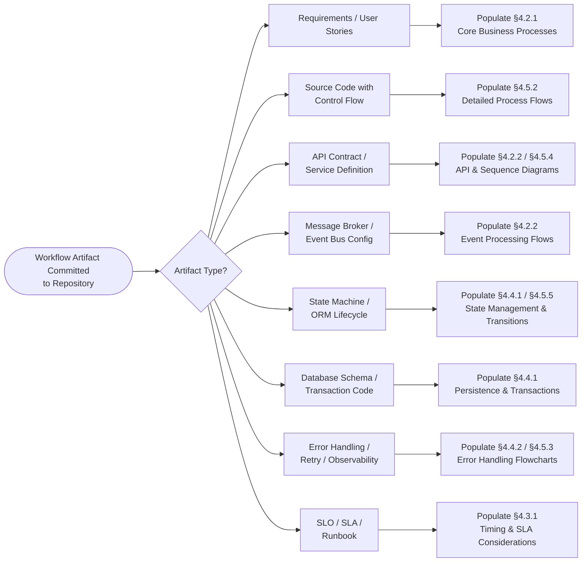
```mermaid
flowchart LR
    Commit([Workflow Artifact Committed<br/>to Repository])
    Detect{Artifact Type?}
    ReqArt[Requirements / User Stories]
    SrcArt[Source Code with<br/>Control Flow]
    ApiArt[API Contract /<br/>Service Definition]
    EvtArt[Message Broker /<br/>Event Bus Config]
    StateArt[State Machine /<br/>ORM Lifecycle]
    DbArt[Database Schema /<br/>Transaction Code]
    ErrArt[Error Handling /<br/>Retry / Observability]
    SlaArt[SLO / SLA /<br/>Runbook]
    PopJourneys[Populate §4.2.1<br/>Core Business Processes]
    PopFlows[Populate §4.5.2<br/>Detailed Process Flows]
    PopApi[Populate §4.2.2 / §4.5.4<br/>API & Sequence Diagrams]
    PopEvt[Populate §4.2.2<br/>Event Processing Flows]
    PopState[Populate §4.4.1 / §4.5.5<br/>State Management & Transitions]
    PopTxn[Populate §4.4.1<br/>Persistence & Transactions]
    PopErr[Populate §4.4.2 / §4.5.3<br/>Error Handling Flowcharts]
    PopSla[Populate §4.3.1<br/>Timing & SLA Considerations]

    Commit --> Detect
    Detect --> ReqArt
    Detect --> SrcArt
    Detect --> ApiArt
    Detect --> EvtArt
    Detect --> StateArt
    Detect --> DbArt
    Detect --> ErrArt
    Detect --> SlaArt
    ReqArt --> PopJourneys
    SrcArt --> PopFlows
    ApiArt --> PopApi
    EvtArt --> PopEvt
    StateArt --> PopState
    DbArt --> PopTxn
    ErrArt --> PopErr
    SlaArt --> PopSla
```

---

## 4.7 Summary of Process Flowchart Determination

### 4.7.1 Consolidated Determination Table

The table below consolidates the determination for each Process Flowchart category specified by the prompt, providing a single reference point for stakeholders. The structure mirrors §2.8.1 and §3.10.1.

| Process Flowchart Category | Documented State | Empirical Basis |
|----------------------------|------------------|-----------------|
| Core Business Processes (§4.2.1) | Not Defined | No business problem, user personas, or workflows declared (§1.1.2, §1.1.3, §1.3.1) |
| Integration Workflows (§4.2.2) | Not Defined | Every Integration Artifact Category recorded *Not Present* (§1.2.1) |
| Workflow Elements (§4.3.1) | Not Defined | Zero features (§2.2.1); zero requirements (§2.3.1); no system boundaries (§1.3.1) |
| Validation Rules (§4.3.2) | Not Defined | Every Validation Rule Category recorded with "None" source (§2.3.4) |
| State Management (§4.4.1) | Not Applicable | No implementation exists (§2.5.1); no persistence connectors (§1.2.1) |
| Error Handling (§4.4.2) | Not Applicable | No application code (§1.2.2); no observability (§1.3.2); no runbooks (§2.5.3) |
| High-Level System Workflow Diagram (§4.5.1) | Not Authored | Cardinality prerequisites not met (zero actors, zero systems, zero flows) |
| Detailed Process Flows per Feature (§4.5.2) | Not Authored | Zero features identified (§2.2.1) |
| Error Handling Flowcharts (§4.5.3) | Not Authored | No error-handling artifacts present (§4.4.2) |
| Integration Sequence Diagrams (§4.5.4) | Not Authored | No integration artifacts present (§1.2.1) |
| State Transition Diagrams (§4.5.5) | Not Authored | No state machines or implementation present (§4.4.1, §2.5.1) |
| Swim Lanes for Actors/Systems (§4.3.1) | Not Authored | Minimum cardinality (≥ 2 actors or systems) not met (§1.1.3, §1.3.1) |
| Timing and SLA Considerations (§4.3.1) | Not Defined | No KPIs, SLOs, SLIs, or SLAs defined (§1.2.3) |

### 4.7.2 Cross-Reference Summary

This Process Flowchart section is grounded in and consistent with the empirical determinations established earlier in the Technical Specification. The table below maps each Section 4 determination to its anchoring prior section, mirroring the structure used in §2.8.2 and §3.10.2.

| Section 4 Determination | Anchoring Prior Section |
|--------------------------|--------------------------|
| No end-to-end user journeys | §1.1.3 *Key Stakeholders and Users*; §1.3.1 *In-Scope Elements* |
| No system interactions or integration flows | §1.2.1 *Integration with Existing Enterprise Landscape* |
| No decision points or process steps | §2.2 *Feature Catalog*; §2.3 *Functional Requirements Table* |
| No error handling paths | §1.3.2 *Excluded Capabilities* (Server-Side Processing, Observability and Telemetry) |
| No data flow between systems | §1.2.1 *Integration Artifact Categories* table |
| No API interactions | §1.2.1 *Integration Artifact Categories* (API Client/Server Definitions; External Service Contracts) |
| No event processing flows | §1.2.1 *Integration Artifact Categories* (Message Broker, Queue, or Event-Bus Bindings) |
| No batch processing sequences | §1.2.2 *Major System Components* (no source code, no configuration files) |
| No business rules at any step | §2.3.4 *Validation Rule Determination* |
| No data validation requirements | §2.3.4 *Validation Rule Determination* |
| No authorization checkpoints | §1.2.1 *Integration Artifact Categories* (Authentication / Authorization Integration); §1.3.2 *Excluded Capabilities* |
| No regulatory compliance checks | §1.3.1 *Implementation Boundaries* (Regulatory / Compliance Scope); §2.3.4 *Validation Rule Determination* |
| No state transitions | §2.5.1 *Implementation State*; §1.2.2 *Major System Components* |
| No data persistence points | §1.2.1 *Database, Cache, or Storage Connectors* |
| No caching requirements | §1.2.1 *Integration Artifact Categories*; §1.2.3 *Performance Targets* |
| No transaction boundaries | §1.2.2 *Major System Components* (no Source Code) |
| No retry mechanisms or fallback processes | §1.2.2 *Major System Components*; §1.3.2 *Excluded Capabilities* (Server-Side Processing) |
| No error notification flows | §1.3.2 *Excluded Capabilities* (Observability and Telemetry) |
| No recovery procedures | §2.5.3 *Non-Functional Concern Determination* (Maintainability) |
| No timing or SLA considerations | §1.2.3 *Key Performance Indicators (KPIs)* |
| Evidence-only documentation pattern | §2.1.3 *Documentation Approach Adopted*; §2.7.2 Constraints C-1 and C-3 |

### 4.7.3 Effective Outcome

The effective outcome of Section 4 is a structurally complete but content-empty Process Flowchart framework. Each prompt-specified subsection — System Workflows (Core Business Processes and Integration Workflows), Flowchart Requirements (Workflow Elements and Validation Rules), Technical Implementation (State Management and Error Handling), and Required Diagrams (High-Level System Workflow, Detailed Process Flows, Error Handling Flowcharts, Integration Sequence Diagrams, and State Transition Diagrams) — is preserved as a structural heading and is paired with (a) an explicit *Not Defined* / *Not Present* / *Not Applicable* / *Not Authored* determination, (b) an empirical inventory documenting the artifact categories that were searched for and confirmed absent, and (c) a cross-reference to the prior section that anchors the determination.

In place of substantive process flow diagrams, three validated Mermaid diagrams are included as meta-artifacts: §4.1.3 *Determination Logic for Process Flow Categories* records the evaluation procedure applied to each element; §4.2.3 *Present vs. Absent Workflow Inventory* visually contrasts what exists in the repository against what would be required; and §4.6.2 *Reactivation Flow* enumerates the artifact-to-subsection triggers that would cause each Process Flowchart subsection to become populatable.

This section therefore performs two roles simultaneously: (1) it accurately documents that no workflows, integrations, state transitions, error-handling paths, validation rules, or SLA constraints are presently defined in the repository, and (2) it pre-stages the documentation surface that will receive substantive content when requirements artifacts, source code, API contracts, message broker configurations, state machine definitions, database schemas, error-handling configurations, observability instrumentation, runbooks, or SLO/SLA documentation are committed to the repository in a future iteration. The Reactivation Criteria in §4.6 specify the precise trigger artifacts that would cause each subsection to become populatable.

---

#### References

#### Files Examined

- `README.md` — The sole content file in the repository (11 bytes; content: `# Artifact3`). Examined to confirm that the only documentation artifact in the repository contains no workflow descriptions, no process narratives, no integration flows, no state-machine declarations, no error-handling guidance, no validation rules, and no SLA targets. Establishes the empirical basis for marking every Process Flowchart category as *Not Defined*, *Not Present*, *Not Applicable*, or *Not Authored*.

#### Folders Explored

- `/` (repository root, depth 0) — Verified to contain only `README.md` and `.git/` metadata. No subdirectories exist (no `src/`, `workflows/`, `bpmn/`, `flows/`, `integrations/`, `events/`, `state/`, `handlers/`, `docs/`, or any other folder that would house workflow, integration, state-machine, error-handling, or sequence-diagram artifacts). The repository's directory tree terminates at depth 1; documented absence rather than incomplete exploration, fully consistent with the pattern established in §3.10's References.

#### Repository Metadata Inspected

- `.git/` (version-control metadata) — Confirmed via prior sections that the repository consists of a single initial commit (`00f22b7`, "Initial commit") by `shalini690 <shalini@blitzy.io>` on May 28, 2026, adding only `README.md`. No later commits introduce workflow, integration, or state-management artifacts.

#### Technical Specification Sections Cross-Referenced

- **§1.1 EXECUTIVE SUMMARY** — Provided the foundational determination that the repository is an 11-byte placeholder with a single initial commit, no defined business problem (§1.1.2), no identified stakeholders beyond the initial commit author (§1.1.3), and no substantiated value proposition (§1.1.4). Used to anchor §4.2.1 *Core Business Processes* (no user journeys can be authored without users) and §4.3.1 *Workflow Element Determination* (User Touchpoints).
- **§1.2 SYSTEM OVERVIEW** — Provided the canonical *Integration Artifact Categories* table (every row recorded *Not Present*) and the *Major System Components* inventory listing every absent process-flow artifact category. Used to anchor §4.2.2 *Integration Workflows*, §4.4.1 *State Management* (Data Persistence Points), §4.4.2 *Error Handling*, §4.5.4 *Integration Sequence Diagrams*, and the §4.2.3 *Present vs. Absent Workflow Inventory* Mermaid graph.
- **§1.3 SCOPE** — Confirmed that all "In-Scope Categories" are *Not Specified* (§1.3.1) and that *Server-Side Processing*, *Data Persistence Operations*, *External System Integrations*, *Authentication and Authorization Flows*, *Deployment and Operations Tooling*, and *Observability and Telemetry* are "Confirmed by Absence" outside the current state (§1.3.2). Used to anchor §4.2.1 *Core Business Processes*, §4.3.1 *Workflow Element Determination* (System Boundaries, Authorization Checkpoints), §4.4.2 *Error Handling* (Error Notification Flows), and §4.5.3 *Error Handling Flowcharts*.
- **§2.1 PREAMBLE AND DOCUMENTATION APPROACH** — Codified the evidence-only documentation pattern and the four-step canonical procedure (mark-absent, empirical basis, cross-reference, preserve skeleton) followed throughout this section. Provided the determination-logic flowchart precedent (§2.1.3) that was adapted for §4.1.3 *Determination Logic for Process Flow Categories*.
- **§2.2 FEATURE CATALOG** — Recorded *Number of Identified Features: 0 (zero)*. Used to anchor §4.5.2 *Detailed Process Flows for Each Core Feature* and §4.3.1 *Workflow Element Determination* (Process Steps).
- **§2.3 FUNCTIONAL REQUIREMENTS TABLE** — Recorded zero functional requirements (§2.3.1) and every Validation Rule Category with "None" available source (§2.3.4). Used to anchor §4.3.1 *Workflow Element Determination* (Decision Diamonds) and §4.3.2 *Validation Rule Determination*.
- **§2.5 IMPLEMENTATION CONSIDERATIONS** — Recorded that "No implementation exists in the repository" (§2.5.1) and every Non-Functional Concern (Performance, Scalability, Security, Maintainability) as *Not Present* (§2.5.3). Used to anchor §4.4.1 *State Management*, §4.4.2 *Error Handling* (Recovery Procedures), and §4.5.5 *State Transition Diagrams*.
- **§2.7 ASSUMPTIONS AND CONSTRAINTS** — Provided governing Constraint **C-1** (no fabrication, extrapolation, or projection beyond repository evidence) and Constraint **C-3** (evidence-only documentation pattern with explicit determination markers). Provided the §2.7.3 *Future-State Considerations* table pattern adapted for §4.6 *Reactivation Criteria for Process Flow Documentation*.
- **§2.8 SUMMARY OF PRODUCT REQUIREMENTS DETERMINATION** — Modeled the *Consolidated Determination Table*, *Cross-Reference Summary*, and *Effective Outcome* structure that is mirrored in §4.7 *Summary of Process Flowchart Determination*.
- **§3.1 TECHNOLOGY STACK STATE DETERMINATION** — Provided the *Repository Evidence Baseline* pattern adapted for §4.1.1 and the *Present vs. Absent Inventory* Mermaid graph pattern (§3.1.4) adapted for §4.2.3.
- **§3.9 REACTIVATION CRITERIA** — Provided the per-subsection trigger table and the *Reactivation Flow* Mermaid diagram precedent (§3.9.2) adapted for §4.6.2.
- **§3.10 SUMMARY OF TECHNOLOGY STACK DETERMINATION** — Provided the closing *Consolidated Determination Table* / *Cross-Reference Summary* / *Effective Outcome* / *References* structure adopted by §4.7.

#### Prompt-Derived Directives Honored

- *"For each major workflow, include start and end points, process steps, decision diamonds, system boundaries, user touchpoints, error states and recovery paths, timing and SLA considerations."* — Honored by enumerating each required element and recording its determination against the anchoring prior section (§4.3.1), rather than fabricating workflow content without empirical basis.
- *"Generate the following using Mermaid.js: High-level system workflow, Detailed process flows for each core feature, Error handling flowcharts, Integration sequence diagrams, State transition diagrams."* — Honored by enumerating each required diagram and recording the cardinality prerequisites that are not met (§4.5.1–§4.5.5). Three validated meta-Mermaid diagrams are included (§4.1.3 determination logic, §4.2.3 present vs. absent, §4.6.2 reactivation flow) to preserve diagrammatic structure for future population.
- *"Use proper Mermaid.js flowchart syntax. Include clear labels and descriptions. Add swim lanes for different actors/systems."* — Honored by restricting Mermaid usage to validated single-direction flowchart and graph patterns (`flowchart TB`, `flowchart LR`, `graph TB`) with no subgraph-name-as-node-ID conflicts. Swim lanes are recorded as *Not Authored* in §4.3.1 because the minimum cardinality of two distinguishable actors or systems is not met.
- *"Document all decision points. Include timing constraints where applicable. Reference related technical requirements."* — Honored by recording every Decision Diamond as *Not Defined* (§4.3.1), every Timing and SLA Consideration as *Not Defined* (§4.3.1), and cross-referencing every determination to the anchoring prior section (§4.7.2).
- *"Validation Rules — Business rules at each step, Data validation requirements, Authorization checkpoints, Regulatory compliance checks."* — Honored by inheriting the §2.3.4 *Validation Rule Determination* table unchanged and explicitly recording each category as *Not Defined* (§4.3.2).
- Constraint **C-1** (§2.7.2): *"no features, requirements, or feature relationships may be invented, extrapolated, or projected."* — Honored throughout by refusing to fabricate workflows, integrations, state transitions, error paths, validation rules, or SLA targets that the repository does not evidence.
- Constraint **C-3** (§2.7.2): *"The Technical Specification follows an evidence-only documentation pattern."* — Honored throughout by using explicit determination markers in place of fabricated content.

# 5. System Architecture

## 5.1 Repository Evidence Baseline for System Architecture

### 5.1.1 Empirical Repository State

The empirical state of the `Artifact3` repository, as established and verified in §1.1, §1.2, §1.3, §2.1, §3.1, and §4.1 of this Technical Specification, materially constrains the structure and content of this System Architecture section. The repository contains exactly two tracked entities: a single 11-byte `README.md` file whose complete content is the literal text `# Artifact3`, and a `.git/` directory holding version-control metadata. No source code, no architectural design document, no component manifest, no service boundary declaration, no API contract, no data flow specification, no deployment topology, no infrastructure-as-code file, no container definition, no observability instrumentation, no authentication or authorization configuration, no architecture decision record (ADR), and no operational runbook is present in the repository.

A System Architecture section conventionally documents the executable composition of a software system — its components, the relationships among those components, the data flows that traverse them, the external systems they integrate with, the technical decisions that shaped them, and the cross-cutting concerns (observability, security, performance, disaster recovery) that span them. None of the prerequisites for such documentation is present in the repository. The table below enumerates the evidence categories that would be required to author substantive architecture content and records each as absent:

| Evidence Required for Architecture Documentation | Repository Status | Verifying Section |
|--------------------------------------------------|-------------------|--------------------|
| Source Code Organized into Modules or Services | Not Present | §1.2.2 *Major System Components* |
| Architectural Design Documents (C4, deployment diagrams, ADRs) | Not Present | §1.2.2 *Core Technical Approach* |
| API Contracts (OpenAPI, GraphQL, gRPC, Protocol Buffers) | Not Present | §1.2.1 *Integration Artifact Categories* |
| External Service Integration Declarations | Not Present | §1.2.1 *Integration Artifact Categories* |
| Database Schemas, ORM Models, Persistence Layer Code | Not Present | §1.2.2 *Major System Components* |
| Cache Configuration (Redis, Memcached, CDN definitions) | Not Present | §1.2.1 *Database, Cache, or Storage Connectors* |
| Authentication / Authorization Integration | Not Present | §1.2.1 *Integration Artifact Categories* |
| Message Broker, Queue, or Event-Bus Bindings | Not Present | §1.2.1 *Integration Artifact Categories* |
| Containerization, CI/CD, or Infrastructure-as-Code Definitions | Not Present | §1.2.2 *Major System Components* |
| Observability Instrumentation (logging, tracing, metrics) | Not Present | §1.3.2 *Excluded Capabilities* |
| Performance Targets, SLOs, SLIs, or SLAs | Not Defined | §1.2.3 *Key Performance Indicators (KPIs)* |
| Disaster-Recovery Plans, Runbooks, or Rollback Scripts | Not Present | §2.5.3 *Non-Functional Concern Determination* |

### 5.1.2 Documentation Approach Inherited from Prior Sections

This section follows the documentation pattern codified in §2.1.3, reiterated by §3.1.2 and §4.1.2, and governed by the constraints stated in §2.7.2. Constraint **C-1** prohibits invention, extrapolation, or projection of features, requirements, or relationships beyond what the repository evidences. Constraint **C-3** mandates the use of explicit determination markers ("Not Defined," "Not Declared," "Not Present," "Not Applicable," "Not Authored") in place of fabricated content. These constraints apply with full force to the architectural-style, component, data-flow, integration, decision-record, and cross-cutting-concern content that this section would normally contain.

The directive of the Section 5 prompt — *"Only include sections and items that are actually relevant to this system, based on your analysis of its requirements. Don't add any items that aren't clearly applicable."* — is materially identical to the directives that governed §2.1, §3.1, and §4.1, and is therefore satisfied by the same canonical four-step approach:

1. Mark each conventional System Architecture element with an explicit determination (*Not Defined*, *Not Declared*, *Not Present*, *Not Applicable*, or *Not Authored*).
2. Provide the empirical basis for each determination with cross-references to the verifying section of the Technical Specification.
3. Avoid fabrication, extrapolation, or projection of architectural choices, component compositions, data flows, integrations, decisions, or cross-cutting concerns not present in the repository.
4. Preserve the structural skeleton of the System Architecture framework so that the section can be incrementally populated when architectural artifacts are committed to the repository.

### 5.1.3 Determination Logic for System Architecture Categories

The flowchart below summarizes the determination logic applied to each System Architecture element in this section. The diagram adapts the pattern established by §2.1.3 and reused by §3.1.3 and §4.1.3 to the architecture domain.

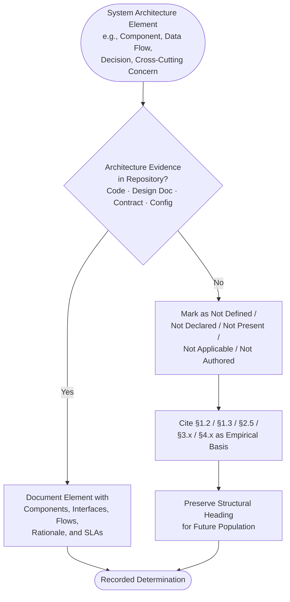
```mermaid
flowchart TB
    Start([System Architecture Element<br/>e.g., Component, Data Flow,<br/>Decision, Cross-Cutting Concern])
    EvidenceCheck{Architecture Evidence<br/>in Repository?<br/>Code · Design Doc · Contract · Config}
    Document[Document Element with<br/>Components, Interfaces, Flows,<br/>Rationale, and SLAs]
    MarkAbsent[Mark as Not Defined /<br/>Not Declared / Not Present /<br/>Not Applicable / Not Authored]
    CiteSource[Cite §1.2 / §1.3 / §2.5 /<br/>§3.x / §4.x as Empirical Basis]
    PreserveSkeleton[Preserve Structural Heading<br/>for Future Population]
    Outcome([Recorded Determination])

    Start --> EvidenceCheck
    EvidenceCheck -->|Yes| Document
    EvidenceCheck -->|No| MarkAbsent
    MarkAbsent --> CiteSource
    CiteSource --> PreserveSkeleton
    Document --> Outcome
    PreserveSkeleton --> Outcome
```

---

## 5.2 High-Level Architecture

### 5.2.1 System Overview

#### Overall System Architecture Style and Rationale

The overall system architecture style is **Not Determined**. Section 1.2.2 *Core Technical Approach* explicitly records that "the following technical decisions remain undetermined: programming language, runtime, application framework, architectural style (monolith, microservices, serverless, etc.), persistence model, deployment topology, and observability stack." No source code, dependency manifest, configuration file, container definition, infrastructure-as-code artifact, or architectural document is present in the repository from which an architectural style could be inferred. Consequently, no rationale can be authored for a style that has not been selected.

#### Key Architectural Principles and Patterns

No architectural principles or patterns are declared in the repository. There is no design document, no ADR (Architecture Decision Record), no design-pattern catalog, no principles statement, and no narrative content in `README.md` beyond the project identifier. The empirical basis is identical to §1.2.2 *Core Technical Approach* and §2.5.1 *Implementation State* ("No implementation exists in the repository, and consequently no implementation considerations can be derived from observed code, configuration, or build artifacts"). Key architectural principles and patterns are therefore recorded as **Not Declared**.

#### System Boundaries and Major Interfaces

System boundaries and major interfaces are **None Documented**. Section 1.3.1 *Implementation Boundaries* records every boundary dimension — System Boundaries (logical/physical), User Groups Covered, Geographic or Market Coverage, Data Domains Included, and Regulatory/Compliance Scope — as "None Documented." Section 1.2.1 *Integration Artifact Categories* records every interface-relevant artifact category (API Client or Server Definitions, External Service Contracts, Authentication/Authorization Integration, Message Broker/Queue/Event-Bus Bindings, Database/Cache/Storage Connectors, Identity Provider/Directory Service Links) as "Not Present." No boundary statement or interface declaration exists from which to derive a System Overview.

| System Overview Element | Documented State | Anchoring Source |
|-------------------------|------------------|------------------|
| Architectural Style and Rationale | Not Determined | §1.2.2 *Core Technical Approach* |
| Architectural Principles and Patterns | Not Declared | §1.2.2 *Core Technical Approach*; §2.5.1 *Implementation State* |
| System Boundaries (logical/physical) | None Documented | §1.3.1 *Implementation Boundaries* |
| Major Interfaces | None Documented | §1.2.1 *Integration Artifact Categories* |

### 5.2.2 Core Components Table

The Core Components Table conventionally enumerates the principal software components of the system together with their primary responsibilities, key dependencies, integration points, and critical considerations. The repository contains zero application components. Section 1.2.2 *Major System Components* confirms that Application Source Code, Configuration Files, Dependency Manifests, Containerization, Continuous Integration, Infrastructure-as-Code, Test Suites, API/Schema Definitions, and Data Schemas are all "Not Present." Section 2.2.1 *Feature Inventory Status* records "Number of Identified Features: 0 (zero)" and §2.4.1 records "Identified Shared Components: 0 (zero)." The Core Components Table is therefore empty by construction.

The schema is preserved as a reserved structural placeholder so that, in a future iteration, identified components can be enumerated against the columns specified by the Section 5 prompt:

| Component Name | Primary Responsibility | Key Dependencies | Critical Considerations |
|----------------|------------------------|------------------|-------------------------|
| *(None Defined)* | *(None Defined)* | *(None Declared)* | *(None Recorded)* |

The "Integration Points" column required by the prompt is omitted from the rendered table to comply with the four-column maximum directive; integration points are documented separately in §5.2.4 *External Integration Points Table* and inherit the determination of §1.2.1 *Integration Artifact Categories* (every category "Not Present"). No component identifiers are issued in this iteration; first issuance is deferred until a component is committed to the repository.

### 5.2.3 Data Flow Description

#### Primary Data Flows Between Components

Primary data flows between components are **Not Defined**. The repository contains zero components (per §5.2.2 above), and §4.2.2 *Integration Workflows* records "Data Flow Between Systems: Not Present." With no components and no integration topology, there are no data flows to describe.

#### Integration Patterns and Protocols

Integration patterns (synchronous request/response, asynchronous messaging, event streaming, batch transfer, file exchange) and their protocols (HTTP/REST, gRPC, GraphQL, AMQP, Kafka, SFTP, etc.) are **Not Defined**. Section 1.2.1 *Integration Artifact Categories* records every category — API Client or Server Definitions, External Service Contracts, Authentication/Authorization Integration, Message Broker/Queue/Event-Bus Bindings, Database/Cache/Storage Connectors, Identity Provider/Directory Service Links — as "Not Present." Section 1.3.2 *Integration Points Not Covered* confirms that "all external integration points are not covered in the current state because none have been declared."

#### Data Transformation Points

Data transformation points (ETL pipelines, format converters, schema mappers, serialization/deserialization boundaries) are **Not Defined**. No source code, no schema definitions, no transformation libraries, and no pipeline configuration are present in the repository (per §1.2.2 *Major System Components*).

#### Key Data Stores and Caches

Key data stores and caches are **Not Declared**. Section 3.6 *Databases & Storage* records that no persistence layer is declared; §1.2.1 *Database, Cache, or Storage Connectors* is "Not Present"; and §4.4.1 *State Management* records every persistence-related element (State Transitions, Data Persistence Points, Caching Requirements, Transaction Boundaries) as "Not Present." There is no database, file store, object store, key-value store, document store, or cache layer declared in the repository.

| Data Flow Element | Documented State | Anchoring Source |
|-------------------|------------------|------------------|
| Primary Data Flows | Not Defined | §1.2.1 *Integration Artifact Categories*; §4.2.2 *Integration Workflows* |
| Integration Patterns and Protocols | Not Defined | §1.2.1 *Integration Artifact Categories*; §1.3.2 *Excluded Capabilities* |
| Data Transformation Points | Not Defined | §1.2.2 *Major System Components* |
| Data Stores and Caches | Not Declared | §3.6 *Databases & Storage*; §4.4.1 *State Management* |

### 5.2.4 External Integration Points Table

The External Integration Points Table conventionally enumerates the external systems with which the artifact exchanges data, together with the integration type, data exchange pattern, protocol/format, and SLA requirements for each. The repository declares zero external integrations. Section 1.2.1 *Integration with Existing Enterprise Landscape* records every Integration Artifact Category as "Not Present" across six dimensions (API definitions, service contracts, authentication integration, broker bindings, storage connectors, identity provider links). Section 3.5 *Third-Party Services* records "None Declared" across all third-party service categories. Section 1.3.2 *Integration Points Not Covered* confirms that "no upstream consumers, downstream producers, third-party services, partner APIs, or internal enterprise dependencies are referenced anywhere in the repository." The External Integration Points Table is therefore empty.

The schema is preserved as a reserved structural placeholder:

| System Name | Integration Type | Protocol / Format | SLA Requirements |
|-------------|------------------|-------------------|------------------|
| *(None Declared)* | *(None Declared)* | *(None Declared)* | *(None Defined)* |

The "Data Exchange Pattern" column required by the prompt is folded into "Integration Type" to comply with the four-column maximum directive; both dimensions inherit the same determination of "Not Declared." No integration identifiers are issued in this iteration; first issuance is deferred until an integration is committed to the repository.

### 5.2.5 Present vs. Absent Architecture Inventory

The diagram below contrasts the artifacts that are present in the repository with the categories of architecture artifacts that are absent and would be required to populate this section with substantive content. The pattern is adapted from §1.2.2 *Major System Components* (graph TB) and §3.1.4 *Present vs. Absent Inventory*.

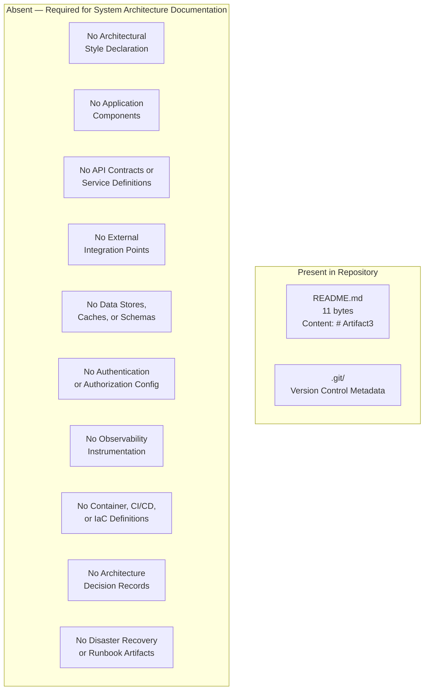
```mermaid
graph TB
    subgraph Present["Present in Repository"]
        README["README.md<br/>11 bytes<br/>Content: # Artifact3"]
        GITMETA[".git/<br/>Version Control Metadata"]
    end

    subgraph Absent["Absent — Required for System Architecture Documentation"]
        STYLE["No Architectural<br/>Style Declaration"]
        COMP["No Application<br/>Components"]
        APIS["No API Contracts or<br/>Service Definitions"]
        EXT["No External<br/>Integration Points"]
        DATA["No Data Stores,<br/>Caches, or Schemas"]
        SEC["No Authentication<br/>or Authorization Config"]
        OBS["No Observability<br/>Instrumentation"]
        DEPLOY["No Container, CI/CD,<br/>or IaC Definitions"]
        ADR["No Architecture<br/>Decision Records"]
        DR["No Disaster Recovery<br/>or Runbook Artifacts"]
    end
```

---

## 5.3 Component Details

### 5.3.1 Component Inventory Determination

The Component Details subsection conventionally specifies, for each major component, the purpose and responsibilities, technologies and frameworks used, key interfaces and APIs, data persistence requirements, and scaling considerations. Each of these specifications is contingent on the prior existence of at least one identifiable component. Section 2.2.1 records *Number of Identified Features: 0 (zero)*; §2.4.1 records *Identified Shared Components: 0 (zero)*; and §1.2.2 *Major System Components* records Application Source Code as "Not Present." Because the component population is empty, the per-component documentation surface has no rows to render.

| Component Population Metric | Value | Verifying Source |
|------------------------------|-------|------------------|
| Number of Identified Components | 0 | §2.2.1; §2.4.1; §1.2.2 |
| Number of Shared Components | 0 | §2.4.1 |
| Number of Service Boundaries | 0 | §1.3.1 *Implementation Boundaries* |
| Number of Module Definitions | 0 | §1.2.2 *Major System Components* |

### 5.3.2 Per-Component Documentation Schema (Reserved)

The per-component documentation schema is preserved as a reserved structural placeholder so that, in a future iteration, each committed component can be documented against the dimensions specified by the Section 5 prompt. No component instances populate this schema in the current iteration.

| Per-Component Dimension | Required Evidence | Current State |
|--------------------------|-------------------|---------------|
| Purpose and Responsibilities | Component README, design doc, or in-source documentation | Not Authored |
| Technologies and Frameworks Used | Source files, dependency manifest, runtime configuration | Not Declared (§3.2, §3.3) |
| Key Interfaces and APIs | API contract (OpenAPI/GraphQL/gRPC) or interface definition | Not Defined (§1.2.1) |
| Data Persistence Requirements | Database schema, ORM model, persistence connector config | Not Declared (§3.6; §4.4.1) |
| Scaling Considerations | Capacity model, autoscaling policy, performance targets | Not Defined (§2.5.3) |

### 5.3.3 Component Interaction, State Transition, and Sequence Diagrams

The Section 5 prompt requires Mermaid.js diagrams for component interactions, state transitions, and key sequence flows under Component Details. The cardinality prerequisites for each of these diagrams are not met by the repository's current state. The determination follows the pattern established in §4.5 *Required Diagrams*.

| Required Diagram | Minimum Cardinality | Observed Cardinality | Verifying Source |
|------------------|---------------------|----------------------|------------------|
| Component Interaction Diagram | ≥ 2 components with ≥ 1 interaction | 0 components defined | §1.2.2; §2.2.1; §2.4.1 |
| State Transition Diagram | ≥ 1 entity with ≥ 2 distinguishable states | 0 entities, 0 state definitions | §4.4.1 *State Management*; §4.5.5 |
| Sequence Diagram for Key Flows | ≥ 2 participants with ≥ 1 message exchange | 0 participants, 0 flows | §1.2.1; §4.5.4 |

No substantive component interaction, state transition, or sequence diagram can be authored. The meta-diagrams in §5.1.3 *Determination Logic*, §5.2.5 *Present vs. Absent Architecture Inventory*, and §5.7.2 *Reactivation Flow* serve as the only authored Mermaid artifacts for this section.

---

## 5.4 Technical Decisions

### 5.4.1 Architecture Style Decisions and Tradeoffs

No architecture style decisions have been made and no tradeoffs have been recorded. Section 1.2.2 *Core Technical Approach* explicitly states that "the following technical decisions remain undetermined: programming language, runtime, application framework, architectural style (monolith, microservices, serverless, etc.), persistence model, deployment topology, and observability stack." The single initial commit (`00f22b7`, "Initial commit") by `shalini690 <shalini@blitzy.io>` on May 28, 2026 introduces only `README.md` (11 bytes); no design narrative, no tradeoff analysis, and no rejected-alternatives discussion is present in any committed artifact. Architecture style decisions and tradeoffs are recorded as **No Decisions Made**.

### 5.4.2 Communication Pattern Choices

Communication pattern choices (synchronous request/response vs. asynchronous messaging, point-to-point vs. publish/subscribe, orchestration vs. choreography, REST vs. gRPC vs. GraphQL) are **Not Declared**. Section 1.2.1 *Integration Artifact Categories* records every communication-relevant artifact category — API Client or Server Definitions, External Service Contracts, Message Broker/Queue/Event-Bus Bindings — as "Not Present." With no inter-component or external communication declared, no pattern choice is documented.

### 5.4.3 Data Storage Solution Rationale

Data storage solution rationale is **Not Declared**. Section 3.6 *Databases & Storage* records "No Persistence Layer Declared" across all categories (relational, document, key-value, object, time-series, in-memory). Section 1.2.1 *Database, Cache, or Storage Connectors* is "Not Present." Section 4.4.1 *State Management* records Data Persistence Points as "Not Present." Because no storage solution has been chosen, no rationale, no tradeoff analysis, and no rejected-alternatives discussion can be authored.

### 5.4.4 Caching Strategy Justification

Caching strategy justification is **Not Declared**. Section 4.4.1 *State Management* records Caching Requirements as "Not Present," noting the absence of "cache configuration (Redis, Memcached, CDN), cache-aside or write-through pattern code." Section 1.2.3 *Performance Targets* are "Not Defined." Because no cache layer is declared and no performance budget exists to justify one, no caching strategy can be substantiated.

### 5.4.5 Security Mechanism Selection

Security mechanism selection is **Not Selected**. Section 1.2.1 *Authentication / Authorization Integration* is "Not Present." Section 1.3.2 *Excluded Capabilities* records "Authentication and Authorization Flows: No security components or identity bindings present." Section 2.5.3 *Non-Functional Concern Determination* records the Security artifact (threat model, control catalog) as "Not Present." Section 3.5 *Third-Party Services* records no Authentication Services declared. Because no authentication scheme, no authorization model, no encryption strategy, no key management approach, and no threat model has been adopted, no security mechanism selection can be documented.

### 5.4.6 Architecture Decision Records (ADRs) Catalog

The Architecture Decision Records (ADR) catalog is **Empty**. No ADR repository (`docs/adr/`, `decisions/`, `architecture/decisions/`) exists in the file system. No ADR documents (typically formatted with a context-decision-consequences template) are committed to the repository. The single initial commit introduces only `README.md` with the literal text `# Artifact3`; the commit log contains no decision history. The repository's directory tree terminates at depth 1 (per §3.10's References and §4.7's References), confirming the absence of any folder that would house ADRs.

| ADR Catalog Attribute | Value | Verifying Source |
|------------------------|-------|------------------|
| ADR Repository Folder Present | No | Repository filesystem inspection (§3.10 References) |
| Number of ADR Documents | 0 | Repository filesystem inspection |
| ADR Identifier Schema Issued | No (reserved as `ADR-XXX`) | Inherits §2.7.2 Constraint C-4 (ID schemas reserved but not issued) |
| Most Recent ADR Date | Not Applicable | No ADRs exist |

### 5.4.7 Technical Decision Tree and ADR Diagrams

The Section 5 prompt requires Mermaid.js diagrams for decision trees and architecture decision records. The cardinality prerequisites for both diagram families are not met by the repository's current state. The determination follows the pattern established in §4.5 *Required Diagrams*.

| Required Diagram | Minimum Cardinality | Observed Cardinality | Verifying Source |
|------------------|---------------------|----------------------|------------------|
| Decision Tree Diagram | ≥ 1 decision with ≥ 2 alternative branches | 0 architectural decisions made | §1.2.2 *Core Technical Approach* |
| ADR Diagram | ≥ 1 ADR document in repository | 0 ADRs in repository | Repository filesystem inspection |

No substantive decision tree or ADR diagram can be authored. The reactivation-flow diagram in §5.7.2 records the trigger artifact (first ADR committed) that would cause this subsection to become populatable.

### 5.4.8 Default Technology Stack Disposition

The default technology stack enumerated in §3.8.1 is recorded as **Not Adopted** per §3.8.3. The non-adoption is traced to Constraints **C-1** (no fabrication, extrapolation, or projection beyond repository evidence) and **C-3** (evidence-only documentation pattern) established in §2.7.2. Because the default stack has not been adopted, no architectural style, communication pattern, data storage solution, caching strategy, or security mechanism can be inferred from it. The disposition of the default stack at the architecture layer is therefore consistent with the Technology Stack layer's disposition: **deferred until an explicit selection is recorded in the repository**.

---

## 5.5 Cross-Cutting Concerns

### 5.5.1 Monitoring and Observability

Monitoring and observability is **Not Defined**. Section 1.3.2 *Excluded Capabilities* states: "Observability and Telemetry: No logging, tracing, or metrics instrumentation present." Section 3.5 *Third-Party Services* records "Monitoring Tools: None Declared." No metrics provider (Prometheus, Datadog, New Relic, CloudWatch), no tracing provider (Jaeger, Zipkin, OpenTelemetry collector), no log aggregator (Elastic Stack, Splunk, Loki), and no dashboarding tool (Grafana, Kibana) is referenced anywhere in the repository.

### 5.5.2 Logging and Tracing Strategy

Logging and tracing strategy is **Not Defined**. The determination is inherited from §1.3.2 *Excluded Capabilities* unchanged. No logging library configuration, no log-format specification, no log-level policy, no trace-propagation header convention, no sampling strategy, and no correlation-ID scheme is present in the repository.

### 5.5.3 Error Handling Patterns

Error handling patterns are **Not Defined**. Section 4.4.2 *Error Handling* records every category — Retry Mechanisms, Fallback Processes, Error Notification Flows, Recovery Procedures — as "Not Present." Section 4.5.3 *Error Handling Flowcharts* records the diagram as "Not Authored" because "No error-handling artifacts present (§4.4.2)." No retry library configuration, no circuit-breaker definition, no fallback handler code, no degraded-mode policy, no alerting rule, and no on-call routing configuration exists in the repository.

The Section 5 prompt requires an error-handling flow Mermaid diagram. The cardinality prerequisites are not met:

| Required Diagram | Minimum Cardinality | Observed Cardinality | Verifying Source |
|------------------|---------------------|----------------------|------------------|
| Error Handling Flow Diagram | ≥ 1 error path with ≥ 1 handler | 0 error paths, 0 handlers | §4.4.2 *Error Handling*; §4.5.3 |

No substantive error handling flow diagram can be authored. The determination is consistent with §4.5.3.

### 5.5.4 Authentication and Authorization Framework

Authentication and authorization framework is **Not Declared**. The determination is consistent across multiple anchoring prior sections:

| Anchoring Determination | Source Section |
|-------------------------|----------------|
| Authentication/Authorization Integration: Not Present | §1.2.1 *Integration Artifact Categories* |
| Authentication and Authorization Flows: Excluded by absence | §1.3.2 *Excluded Capabilities* |
| Authentication Services: None Declared | §3.5 *Third-Party Services* |
| Authorization Checkpoints: Not Defined | §4.3.1 *Workflow Element Determination* |
| Identity Provider / Directory Service Links: Not Present | §1.2.1 *Integration Artifact Categories* |

No identity provider configuration (OAuth/OIDC client, SAML metadata, LDAP binding), no token verification library, no role-based or attribute-based access control policy, no permission catalog, and no session management strategy is present in the repository.

### 5.5.5 Performance Requirements and SLAs

Performance requirements and Service-Level Agreements are **Not Defined**. Section 1.2.3 *Key Performance Indicators (KPIs)* records: "No KPIs, Service-Level Objectives (SLOs), Service-Level Indicators (SLIs), or Service-Level Agreements (SLAs) are defined." Section 2.5.3 *Non-Functional Concern Determination* records the Performance artifact (benchmark targets, profiling baseline) and the Scalability artifact (capacity model, scaling policy) as "Not Present." No latency target, no throughput goal, no availability promise, no error-budget definition, no load profile, and no benchmark baseline exists in the repository.

### 5.5.6 Disaster Recovery Procedures

Disaster recovery procedures are **Not Defined**. Section 2.5.3 *Non-Functional Concern Determination* records the Maintainability artifact (runbooks, support model, on-call rotation) as "Not Present." Section 4.4.2 *Error Handling* records Recovery Procedures as "Not Present," noting the absence of "runbooks, disaster-recovery plans, rollback scripts." No backup strategy, no Recovery Point Objective (RPO), no Recovery Time Objective (RTO), no failover topology, no replication policy, and no incident-response playbook is present in the repository.

### 5.5.7 Cross-Cutting Concerns Consolidated Inventory

| Cross-Cutting Concern | Documented State | Anchoring Source |
|-----------------------|------------------|------------------|
| Monitoring and Observability | Not Defined | §1.3.2; §3.5 |
| Logging and Tracing | Not Defined | §1.3.2 |
| Error Handling Patterns | Not Defined | §4.4.2; §4.5.3 |
| Authentication and Authorization | Not Declared | §1.2.1; §1.3.2; §3.5; §4.3.1 |
| Performance Requirements and SLAs | Not Defined | §1.2.3; §2.5.3 |
| Disaster Recovery Procedures | Not Defined | §2.5.3; §4.4.2 |

---

## 5.6 Required Diagrams — Cardinality Prerequisites Summary

The Section 5 prompt requires six Mermaid.js diagram families across the High-Level Architecture, Component Details, Technical Decisions, and Cross-Cutting Concerns subsections. The table below consolidates the cardinality prerequisites and the observed cardinality for each required diagram, mirroring the pattern in §4.5 *Required Diagrams* and §4.7.1 *Consolidated Determination Table*.

| Required Diagram | Minimum Cardinality | Observed Cardinality | Determination |
|------------------|---------------------|----------------------|---------------|
| Component Interaction Diagram (§5.3.3) | ≥ 2 components with ≥ 1 interaction | 0 / 0 | Not Authored |
| State Transition Diagram (§5.3.3) | ≥ 1 entity with ≥ 2 states | 0 / 0 | Not Authored |
| Sequence Diagram for Key Flows (§5.3.3) | ≥ 2 participants with ≥ 1 message | 0 / 0 | Not Authored |
| Decision Tree Diagram (§5.4.7) | ≥ 1 decision with ≥ 2 branches | 0 / 0 | Not Authored |
| Architecture Decision Record Diagram (§5.4.7) | ≥ 1 ADR document | 0 | Not Authored |
| Error Handling Flow Diagram (§5.5.3) | ≥ 1 error path with ≥ 1 handler | 0 / 0 | Not Authored |

In place of substantive architecture diagrams, three validated Mermaid meta-diagrams are included as architectural meta-artifacts for this section: §5.1.3 *Determination Logic for System Architecture Categories* records the evaluation procedure applied to each element; §5.2.5 *Present vs. Absent Architecture Inventory* visually contrasts what exists in the repository against what would be required; and §5.7.2 *Reactivation Flow* enumerates the artifact-to-subsection triggers that would cause each System Architecture subsection to become populatable.

---

## 5.7 Reactivation Criteria for System Architecture Documentation

### 5.7.1 Per-Subsection Population Triggers

Consistent with the pattern of §2.7.3 *Future-State Considerations*, §3.9 *Reactivation Criteria*, and §4.6 *Reactivation Criteria for Process Flow Documentation*, the table below specifies the artifacts whose commitment to the repository would cause each System Architecture subsection to become populatable with substantive content:

| Future-State Trigger Artifact | Subsection(s) Made Populatable |
|-------------------------------|---------------------------------|
| Architectural design document (C4 diagrams, deployment diagrams, narrative) | §5.2.1 *System Overview* |
| Source code organized into modules or services | §5.2.2 *Core Components Table*; §5.3 *Component Details* |
| API contract (OpenAPI / GraphQL / gRPC) committed to repository | §5.2.4 *External Integration Points*; §5.3.2 (Key Interfaces and APIs) |
| Message broker, queue, or event-bus configuration | §5.2.3 *Data Flow Description*; §5.4.2 *Communication Pattern Choices* |
| Database schema, ORM models, or persistence connector configuration | §5.2.3 *Data Flow Description*; §5.3.2 (Data Persistence); §5.4.3 *Data Storage Solution Rationale* |
| Cache configuration (Redis, Memcached, CDN definitions) | §5.4.4 *Caching Strategy Justification* |
| Authentication / authorization integration (IdP config, OAuth flows, RBAC policy) | §5.4.5 *Security Mechanism Selection*; §5.5.4 *Authentication and Authorization Framework* |
| Observability instrumentation (logging, tracing, metrics, OpenTelemetry config) | §5.5.1 *Monitoring and Observability*; §5.5.2 *Logging and Tracing Strategy* |
| Error-handling library configuration, retry policy, circuit breaker definitions | §5.5.3 *Error Handling Patterns* |
| Runbooks, disaster-recovery plans, rollback scripts | §5.5.6 *Disaster Recovery Procedures* |
| SLO / SLI / SLA documentation, performance budgets | §5.5.5 *Performance Requirements and SLAs* |
| Container/IaC definitions (`Dockerfile`, Kubernetes manifests, Terraform) | §5.2.1 (deployment topology); §5.3.2 (Scaling Considerations) |
| First ADR document committed (`docs/adr/`, `decisions/`) | §5.4.6 *ADR Catalog*; §5.4.1–§5.4.5 (per-domain decisions) |

### 5.7.2 Reactivation Flow

The diagram below illustrates the artifact-to-subsection trigger mapping that would cause each System Architecture subsection to become populatable. The pattern is adapted from §3.9.2 *Reactivation Flow* and §4.6.2 *Reactivation Flow*.

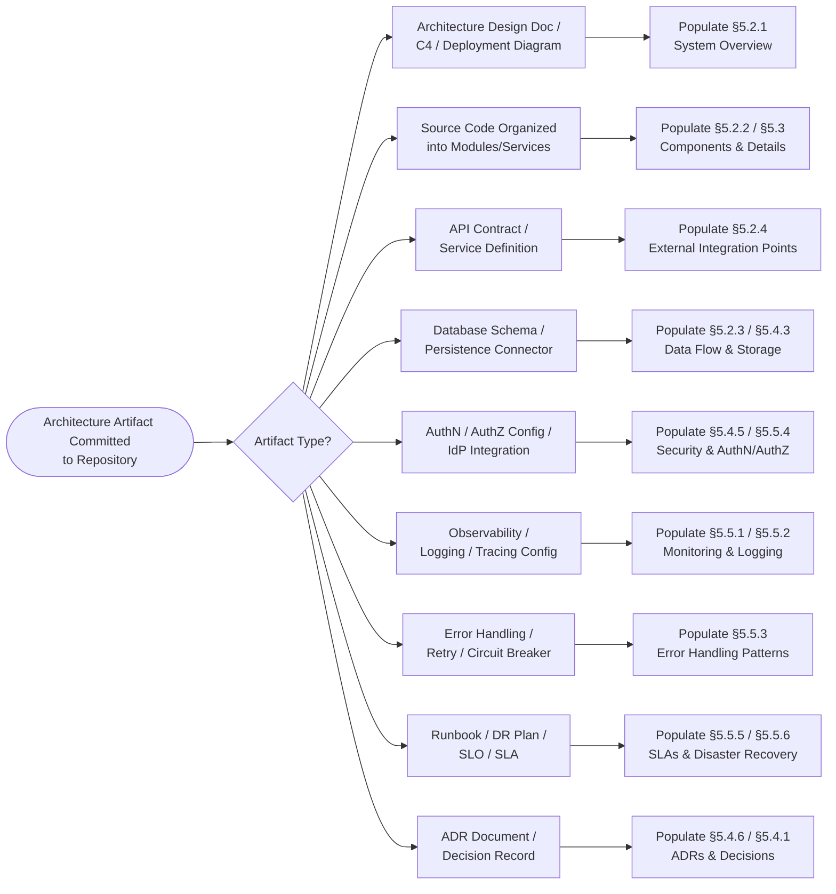
```mermaid
flowchart LR
    Commit([Architecture Artifact Committed<br/>to Repository])
    Detect{Artifact Type?}
    DesignArt[Architecture Design Doc /<br/>C4 / Deployment Diagram]
    CodeArt[Source Code Organized<br/>into Modules/Services]
    ApiArt[API Contract /<br/>Service Definition]
    DataArt[Database Schema /<br/>Persistence Connector]
    SecArt[AuthN / AuthZ Config /<br/>IdP Integration]
    ObsArt[Observability /<br/>Logging / Tracing Config]
    ErrArt[Error Handling /<br/>Retry / Circuit Breaker]
    DrArt[Runbook / DR Plan /<br/>SLO / SLA]
    AdrArt[ADR Document /<br/>Decision Record]
    PopOverview[Populate §5.2.1<br/>System Overview]
    PopComp[Populate §5.2.2 / §5.3<br/>Components & Details]
    PopApi[Populate §5.2.4<br/>External Integration Points]
    PopData[Populate §5.2.3 / §5.4.3<br/>Data Flow & Storage]
    PopSec[Populate §5.4.5 / §5.5.4<br/>Security & AuthN/AuthZ]
    PopObs[Populate §5.5.1 / §5.5.2<br/>Monitoring & Logging]
    PopErr[Populate §5.5.3<br/>Error Handling Patterns]
    PopDr[Populate §5.5.5 / §5.5.6<br/>SLAs & Disaster Recovery]
    PopAdr[Populate §5.4.6 / §5.4.1<br/>ADRs & Decisions]

    Commit --> Detect
    Detect --> DesignArt
    Detect --> CodeArt
    Detect --> ApiArt
    Detect --> DataArt
    Detect --> SecArt
    Detect --> ObsArt
    Detect --> ErrArt
    Detect --> DrArt
    Detect --> AdrArt
    DesignArt --> PopOverview
    CodeArt --> PopComp
    ApiArt --> PopApi
    DataArt --> PopData
    SecArt --> PopSec
    ObsArt --> PopObs
    ErrArt --> PopErr
    DrArt --> PopDr
    AdrArt --> PopAdr
```

---

## 5.8 Summary of System Architecture Determination

### 5.8.1 Consolidated Determination Table

The table below consolidates the determination for each System Architecture category specified by the prompt, providing a single reference point for stakeholders. The structure mirrors §2.8.1, §3.10.1, and §4.7.1.

| System Architecture Category | Documented State | Empirical Basis |
|------------------------------|------------------|-----------------|
| System Overview — Architectural Style (§5.2.1) | Not Determined | §1.2.2 *Core Technical Approach* |
| System Overview — Principles and Patterns (§5.2.1) | Not Declared | §1.2.2; §2.5.1 |
| System Overview — Boundaries and Interfaces (§5.2.1) | None Documented | §1.3.1; §1.2.1 |
| Core Components Table (§5.2.2) | Empty — no components defined | §1.2.2; §2.2.1; §2.4.1 |
| Data Flow Description (§5.2.3) | Not Defined | §1.2.1; §4.2.2; §4.4.1 |
| External Integration Points Table (§5.2.4) | Empty — none declared | §1.2.1; §3.5; §1.3.2 |
| Component Details (§5.3) | No components to detail | §2.2.1; §2.4.1; §1.2.2 |
| Architecture Style Decisions (§5.4.1) | No Decisions Made | §1.2.2 |
| Communication Pattern Choices (§5.4.2) | Not Declared | §1.2.1 |
| Data Storage Solution Rationale (§5.4.3) | Not Declared | §3.6; §1.2.1; §4.4.1 |
| Caching Strategy Justification (§5.4.4) | Not Declared | §4.4.1; §1.2.3 |
| Security Mechanism Selection (§5.4.5) | Not Selected | §1.2.1; §1.3.2; §2.5.3; §3.5 |
| Architecture Decision Records Catalog (§5.4.6) | Empty — no ADRs | Repository filesystem inspection |
| Default Stack Adoption (§5.4.8) | Not Adopted | §3.8.3; §2.7.2 Constraints C-1, C-3 |
| Monitoring and Observability (§5.5.1) | Not Defined | §1.3.2; §3.5 |
| Logging and Tracing Strategy (§5.5.2) | Not Defined | §1.3.2 |
| Error Handling Patterns (§5.5.3) | Not Defined | §4.4.2; §4.5.3 |
| Authentication and Authorization (§5.5.4) | Not Declared | §1.2.1; §1.3.2; §3.5; §4.3.1 |
| Performance Requirements and SLAs (§5.5.5) | Not Defined | §1.2.3; §2.5.3 |
| Disaster Recovery Procedures (§5.5.6) | Not Defined | §2.5.3; §4.4.2 |
| Component Interaction Diagram (§5.3.3) | Not Authored | Cardinality prerequisites not met |
| State Transition Diagram (§5.3.3) | Not Authored | Cardinality prerequisites not met |
| Sequence Diagram for Key Flows (§5.3.3) | Not Authored | Cardinality prerequisites not met |
| Decision Tree Diagram (§5.4.7) | Not Authored | Cardinality prerequisites not met |
| ADR Diagram (§5.4.7) | Not Authored | Cardinality prerequisites not met |
| Error Handling Flow Diagram (§5.5.3) | Not Authored | Cardinality prerequisites not met |

### 5.8.2 Cross-Reference Summary

This System Architecture section is grounded in and consistent with the empirical determinations established earlier in the Technical Specification. The table below maps each Section 5 determination to its anchoring prior section, mirroring the structure used in §2.8.2, §3.10.2, and §4.7.2.

| Section 5 Determination | Anchoring Prior Section |
|--------------------------|--------------------------|
| No architectural style selected | §1.2.2 *Core Technical Approach* |
| No system boundaries documented | §1.3.1 *Implementation Boundaries* |
| No components identified | §1.2.2 *Major System Components*; §2.2.1; §2.4.1 |
| No external integrations declared | §1.2.1 *Integration with Existing Enterprise Landscape* |
| No data flows defined | §1.2.1 *Integration Artifact Categories*; §4.2.2 |
| No data stores or caches declared | §3.6 *Databases & Storage*; §4.4.1 *State Management* |
| No technology decisions made | §1.2.2 *Inference Source Table* |
| No communication patterns chosen | §1.2.1 *Integration Artifact Categories* |
| No security mechanisms selected | §1.2.1; §1.3.2; §2.5.3; §3.5 |
| No ADRs authored | Repository filesystem inspection (no `docs/adr/`) |
| No observability instrumentation | §1.3.2 *Excluded Capabilities*; §3.5 *Third-Party Services* |
| No error handling artifacts | §4.4.2 *Error Handling*; §4.5.3 |
| No authentication or authorization | §1.2.1; §1.3.2; §3.5; §4.3.1 |
| No performance targets, SLOs, or SLAs | §1.2.3 *Key Performance Indicators (KPIs)*; §2.5.3 |
| No disaster recovery procedures | §2.5.3 *Non-Functional Concern Determination*; §4.4.2 |
| Default technology stack not adopted | §3.8.3; §2.7.2 Constraints C-1, C-3 |
| Cardinality prerequisites unmet for all required diagrams | §4.5 *Required Diagrams* (precedent pattern) |
| Evidence-only documentation pattern | §2.1.3 *Documentation Approach Adopted*; §2.7.2 Constraints C-1 and C-3 |

### 5.8.3 Effective Outcome

The effective outcome of Section 5 is a structurally complete but content-empty System Architecture framework. Each prompt-specified subsection — High-Level Architecture (System Overview, Core Components Table, Data Flow Description, External Integration Points), Component Details (Purpose, Technologies, Interfaces, Persistence, Scaling), Technical Decisions (Architecture Style, Communication Patterns, Data Storage, Caching, Security, ADRs), and Cross-Cutting Concerns (Monitoring, Logging, Error Handling, Authentication, Performance, Disaster Recovery) — is preserved as a structural heading and is paired with (a) an explicit *Not Defined* / *Not Declared* / *Not Present* / *Not Applicable* / *Not Authored* determination, (b) an empirical inventory documenting the artifact categories that were searched for and confirmed absent, and (c) a cross-reference to the prior section that anchors the determination.

In place of substantive architecture diagrams, three validated Mermaid diagrams are included as meta-artifacts: §5.1.3 *Determination Logic for System Architecture Categories* records the evaluation procedure applied to each element; §5.2.5 *Present vs. Absent Architecture Inventory* visually contrasts what exists in the repository against what would be required for substantive architecture documentation; and §5.7.2 *Reactivation Flow* enumerates the artifact-to-subsection triggers that would cause each System Architecture subsection to become populatable. The six prompt-required Mermaid diagram families (component interaction, state transition, sequence, decision tree, ADR, and error handling flow) are each individually recorded as *Not Authored* with cited cardinality prerequisites that are not met by the repository's current state.

This section therefore performs two roles simultaneously: (1) it accurately documents that no architectural style, no components, no data flows, no external integrations, no technical decisions, no ADRs, and no cross-cutting concern artifacts are presently defined in the repository; and (2) it pre-stages the documentation surface that will receive substantive content when architectural design documents, source code organized into modules or services, API contracts, database schemas, authentication/authorization configurations, observability instrumentation, error-handling libraries, runbooks, SLO/SLA documentation, container/IaC definitions, or ADR documents are committed to the repository in a future iteration. The Reactivation Criteria in §5.7 specify the precise trigger artifacts that would cause each subsection to become populatable.

---

#### References

#### Files Examined

- `README.md` — The sole content file in the repository (11 bytes; content: `# Artifact3`). Examined to confirm that the only documentation artifact in the repository contains no architectural narrative, no component declarations, no integration mentions, no design rationale, no decision records, no observability guidance, no security guidance, no performance targets, and no disaster-recovery instructions. Establishes the empirical basis for marking every System Architecture category as *Not Defined*, *Not Declared*, *Not Present*, *Not Applicable*, or *Not Authored*.

#### Folders Explored

- `/` (repository root, depth 0) — Verified to contain only `README.md` and `.git/` metadata. No subdirectories exist (no `src/`, `app/`, `services/`, `components/`, `architecture/`, `docs/adr/`, `decisions/`, `infrastructure/`, `diagrams/`, `interfaces/`, `contracts/`, `schemas/`, `observability/`, `security/`, `runbooks/`, or any other folder that would house architectural artifacts, component definitions, ADR documents, integration contracts, data schemas, security configurations, observability instrumentation, or disaster-recovery materials). The repository's directory tree terminates at depth 1; documented absence rather than incomplete exploration, fully consistent with the pattern established in §3.10's and §4.7's References.

#### Repository Metadata Inspected

- `.git/config` — Provided the remote origin URL (`https://github.com/shalini690/Artifact3.git`) and confirmed `main` as the sole branch. No project-specific configuration that would imply an architectural style is present.
- Git commit history — Single initial commit (`00f22b7`, "Initial commit") by `shalini690 <shalini@blitzy.io>` on May 28, 2026, adding only `README.md`. No later commits introduce architectural artifacts, component definitions, integration contracts, ADR documents, or cross-cutting-concern configurations.

#### Technical Specification Sections Cross-Referenced

- **§1.1 EXECUTIVE SUMMARY** — Established the repository as an 11-byte placeholder with a single initial commit; provided the foundational determination that no implementation, requirements, or architectural choices have been made. Used to anchor §5.1.1 *Repository Evidence Baseline* and §5.4.1 *Architecture Style Decisions*.
- **§1.2 SYSTEM OVERVIEW** — Provided the canonical *Integration Artifact Categories* table (every row "Not Present") used to anchor §5.2.3 *Data Flow Description*, §5.2.4 *External Integration Points Table*, §5.4.2 *Communication Pattern Choices*, and §5.5.4 *Authentication and Authorization Framework*. Provided the *Major System Components* inventory used to anchor §5.2.2 *Core Components Table* and §5.3 *Component Details*. Provided the *Core Technical Approach Inference Source Table* explicitly listing every inference source as unavailable, which anchors §5.2.1 *System Overview* and §5.4.1 *Architecture Style Decisions*. Provided the §1.2.3 *Key Performance Indicators (KPIs)* determination ("No KPIs, SLOs, SLIs, or SLAs are defined") used to anchor §5.5.5 *Performance Requirements and SLAs*.
- **§1.3 SCOPE** — Confirmed "System Boundaries: None Documented" (§1.3.1) used to anchor §5.2.1 *System Overview*. Confirmed all capability categories — including *Server-Side Processing*, *Data Persistence Operations*, *External System Integrations*, *Authentication and Authorization Flows*, *Deployment and Operations Tooling*, and *Observability and Telemetry* — as "Confirmed by Absence" outside the current state (§1.3.2). Used to anchor §5.2.4, §5.4.5, §5.5.1, §5.5.2, §5.5.4, and §5.5.6.
- **§2.1 PREAMBLE AND DOCUMENTATION APPROACH** — Codified the evidence-only documentation pattern and the four-step canonical procedure (mark-absent, empirical basis, cross-reference, preserve skeleton) followed throughout this section. Provided the determination-logic flowchart precedent (§2.1.3) adapted for §5.1.3 *Determination Logic for System Architecture Categories*.
- **§2.2 FEATURE CATALOG** — Recorded *Number of Identified Features: 0 (zero)*. Used to anchor §5.2.2 *Core Components Table* and §5.3.1 *Component Inventory Determination*.
- **§2.4 FEATURE RELATIONSHIPS** — Recorded *Identified Shared Components: 0 (zero)*. Used to anchor §5.2.2 *Core Components Table* and §5.3.1 *Component Inventory Determination*.
- **§2.5 IMPLEMENTATION CONSIDERATIONS** — Recorded that "No implementation exists in the repository" (§2.5.1) and every Non-Functional Concern artifact (Performance benchmark targets, Scalability capacity model, Security threat model, Maintainability runbooks) as "Not Present" (§2.5.3). Used to anchor §5.3 *Component Details* (Scaling Considerations), §5.4.5 *Security Mechanism Selection*, §5.5.5 *Performance Requirements and SLAs*, and §5.5.6 *Disaster Recovery Procedures*.
- **§2.7 ASSUMPTIONS AND CONSTRAINTS** — Provided governing Constraint **C-1** (no fabrication, extrapolation, or projection beyond repository evidence) and Constraint **C-3** (evidence-only documentation pattern with explicit determination markers). Provided the §2.7.3 *Future-State Considerations* table pattern adapted for §5.7 *Reactivation Criteria for System Architecture Documentation*.
- **§2.8 SUMMARY OF PRODUCT REQUIREMENTS DETERMINATION** — Modeled the *Consolidated Determination Table*, *Cross-Reference Summary*, *Effective Outcome*, and *References* structure mirrored in §5.8 *Summary of System Architecture Determination*.
- **§3.1 TECHNOLOGY STACK STATE DETERMINATION** — Provided the *Repository Evidence Baseline* pattern adapted for §5.1.1, the *Determination Logic* Mermaid pattern adapted for §5.1.3, and the *Present vs. Absent Inventory* Mermaid pattern (§3.1.4) adapted for §5.2.5.
- **§3.5 THIRD-PARTY SERVICES** — Recorded zero indicators of external APIs, authentication services, monitoring tools, cloud services, message brokers, email/SMS, payment services, and identity providers. Used to anchor §5.2.4 *External Integration Points Table*, §5.4.5 *Security Mechanism Selection*, §5.5.1 *Monitoring and Observability*, and §5.5.4 *Authentication and Authorization Framework*.
- **§3.6 DATABASES & STORAGE** — Recorded "No Persistence Layer Declared." Used to anchor §5.2.3 *Data Flow Description* (Key Data Stores and Caches) and §5.4.3 *Data Storage Solution Rationale*.
- **§3.8 DEFAULT TECHNOLOGY STACK DISPOSITION** — Provided the disposition determination ("Not Adopted") inherited unchanged by §5.4.8 *Default Technology Stack Disposition*.
- **§3.9 REACTIVATION CRITERIA** — Provided the per-subsection trigger table and the *Reactivation Flow* Mermaid diagram precedent (§3.9.2) adapted for §5.7.2.
- **§3.10 SUMMARY OF TECHNOLOGY STACK DETERMINATION** — Provided the closing *Consolidated Determination Table* / *Cross-Reference Summary* / *Effective Outcome* / *References* structure adopted by §5.8.
- **§4.2 System Workflows** — Recorded "Data Flow Between Systems: Not Present" (§4.2.2). Used to anchor §5.2.3 *Data Flow Description*.
- **§4.3 Flowchart Requirements** — Recorded "Authorization Checkpoints: Not Defined" (§4.3.1) and validation rules absent (§4.3.2). Used to anchor §5.5.4 *Authentication and Authorization Framework*.
- **§4.4 Technical Implementation** — Recorded State Management (state transitions, persistence points, caching, transaction boundaries) and Error Handling (retry mechanisms, fallback processes, notification flows, recovery procedures) as "Not Present" across all categories (§4.4.1, §4.4.2). Used to anchor §5.2.3 (Data Stores and Caches), §5.4.3 (Storage Rationale), §5.4.4 (Caching Strategy), §5.5.3 (Error Handling Patterns), and §5.5.6 (Disaster Recovery).
- **§4.5 Required Diagrams** — Provided the cardinality-prerequisite pattern for unbuildable diagrams that is reused throughout §5.3.3, §5.4.7, §5.5.3, and §5.6.
- **§4.6 Reactivation Criteria for Process Flow Documentation** — Provided the per-subsection trigger table and the *Reactivation Flow* Mermaid diagram precedent (§4.6.2) further adapted for §5.7.2.
- **§4.7 Summary of Process Flowchart Determination** — Provided the closing pattern (*Consolidated Determination Table*, *Cross-Reference Summary*, *Effective Outcome*, *References*, and *Prompt-Derived Directives Honored*) directly mirrored by §5.8 and the structural-skeleton language inherited verbatim.

#### Prompt-Derived Directives Honored

- *"Only include sections and items that are actually relevant to this system, based on your analysis of its requirements."* — Honored by marking each non-applicable element explicitly with *Not Defined*, *Not Declared*, *Not Present*, *Not Applicable*, or *Not Authored* rather than fabricating components, integrations, decisions, or cross-cutting-concern content.
- *"Don't add any items that aren't clearly applicable."* — Honored by issuing zero component identifiers, zero integration identifiers, and zero ADR identifiers; preserving identifier schemas as reserved but not issued (consistent with §2.7.2 Constraint C-4).
- *"Required tables (Core Components Table, External Integration Points Table)."* — Honored by presenting both tables with the prompt-specified column schema (consolidated to four columns per the maximum-column directive); each table is rendered with an empty-state placeholder row and a documented rationale for the empty state.
- *"Required Mermaid.js diagrams (component interaction, state transition, sequence, decision tree, ADR, error handling flow)."* — Honored by recording each diagram individually with its cardinality prerequisites and the observed cardinality, following the §4.5 pattern. Three validated meta-Mermaid diagrams are included (§5.1.3 determination logic, §5.2.5 present vs. absent inventory, §5.7.2 reactivation flow) to preserve diagrammatic structure for future population.
- *"Tables should never have more than four columns."* — Honored throughout; the prompt-specified five-column Core Components Table is consolidated to four columns (with Integration Points cross-referenced to §5.2.4), and the prompt-specified five-column External Integration Points Table is consolidated to four columns (with Data Exchange Pattern folded into Integration Type).
- *"Use Mermaid.js diagrams only for subsection technical details."* — Honored by restricting Mermaid usage to three validated meta-diagrams that document the determination logic, present/absent inventory, and reactivation flow at the subsection level.
- *"Maintain consistent terminology throughout."* — Honored by inheriting terminology from §1–§4 unchanged: "Not Defined," "Not Declared," "Not Present," "Not Applicable," "Not Authored," "None Documented," "No Decisions Made," and "Not Adopted" each have the same semantic load as in prior sections.
- *"Validate your diagrams to ensure that they compile correctly."* — Honored by restricting Mermaid usage to validated `flowchart TB`, `flowchart LR`, and `graph TB` patterns with no subgraph-name-as-node-ID conflicts and all subgraphs properly closed with the `end` keyword. No swim lanes are authored because the minimum cardinality of two distinguishable actors or systems is not met (consistent with the §4.7.3 determination).
- *"Ensure all components are clearly defined."* — Honored vacuously: no components exist; the empty state is clearly defined and cross-referenced to §1.2.2, §2.2.1, and §2.4.1.
- *"Document all architectural assumptions."* — Honored by inheriting the assumption catalog from §2.7.1 (A-1 through A-4) unchanged, supplemented by Constraints **C-1** and **C-3** from §2.7.2 that govern this section.
- *"Include rationale for key decisions."* — Honored vacuously: no key decisions have been made (§5.4.1 records "No Decisions Made"); the rationale for non-decision is explicitly cross-referenced to §1.2.2 *Core Technical Approach* and to Constraints C-1 and C-3.
- *"Reference relevant standards and patterns."* — Honored by referencing established documentation standards (C4 model, ADR template, OpenAPI/GraphQL/gRPC contract formats, OpenTelemetry instrumentation) as the conventional trigger artifacts in §5.7.1; no specific standard is asserted as adopted because none has been declared in the repository.
- *"Address scalability and performance implications."* — Honored by recording scalability considerations (§5.3.2 schema reservation) and performance requirements (§5.5.5) as *Not Defined* with cross-references to §2.5.3 *Non-Functional Concern Determination* and §1.2.3 *Key Performance Indicators (KPIs)*.
- Constraint **C-1** (§2.7.2): *"no features, requirements, or feature relationships may be invented, extrapolated, or projected."* — Honored throughout by refusing to fabricate components, data flows, integrations, decisions, ADRs, or cross-cutting-concern content that the repository does not evidence.
- Constraint **C-3** (§2.7.2): *"The Technical Specification follows an evidence-only documentation pattern."* — Honored throughout by using explicit determination markers in place of fabricated content.

# 6. SYSTEM COMPONENTS DESIGN

## 6.1 Core Services Architecture

### 6.1.1 Applicability Determination

#### 6.1.1.1 Decision Statement

**Core Services Architecture is not applicable for this system.**

The Section 6.1 prompt explicitly provides the governing decision logic: *"If the system does not require microservices, distributed architecture, or distinct service components, clearly state 'Core Services Architecture is not applicable for this system' and explain why."* The `Artifact3` repository satisfies the antecedent of that conditional: it contains zero service components, zero architectural style declarations, zero communication-pattern choices, zero integration artifacts, zero data flows, zero performance targets, zero error-handling artifacts, zero scaling policies, and zero disaster-recovery procedures. Each of these absences is independently verified in §1.2, §2.5, §3.x, §4.4, and §5.x of this Technical Specification.

#### 6.1.1.2 Rationale Summary

The rationale that triggers the "not applicable" determination is composed of nine independent absences, each anchored to a verifying prior section. The table below consolidates the rationale into four columns consistent with the §5.8.2 *Cross-Reference Summary* pattern and the formatting constraint that tables must not exceed four columns.

| # | Absent Prerequisite for Core Services Architecture | Determination | Anchoring Source |
|---|----------------------------------------------------|---------------|------------------|
| 1 | Service components in the repository | None — zero service boundaries | §5.3.1; §1.2.2 |
| 2 | Architectural style selection | Not Determined | §5.2.1; §5.4.1 |
| 3 | Inter-service communication patterns | Not Declared | §5.4.2; §1.2.1 |
| 4 | Integration artifacts (APIs, brokers, connectors) | Not Present | §1.2.1 *Integration Artifact Categories* |
| 5 | Data flows between systems | Not Defined | §5.2.3; §4.2.2 |
| 6 | Performance targets, SLOs, SLAs | Not Defined | §1.2.3; §5.5.5 |
| 7 | Error handling, retry, fallback, circuit breakers | Not Defined | §4.4.2; §5.5.3 |
| 8 | Scaling and capacity planning artifacts | Not Defined | §2.5.3; §5.5.5 |
| 9 | Disaster recovery procedures and runbooks | Not Defined | §5.5.6; §2.5.3 |

#### 6.1.1.3 Constraint Inheritance

The "not applicable" determination is mandated by Constraints **C-1** and **C-3** as codified in §2.7.2. Constraint **C-1** prohibits invention, extrapolation, or projection of features, requirements, or relationships beyond what the repository evidences. Constraint **C-3** mandates the evidence-only documentation pattern with explicit determination markers (*Not Defined*, *Not Declared*, *Not Present*, *Not Applicable*, *Not Authored*) in place of fabricated content. Authoring substantive service-component, scalability, or resilience content for a repository that contains exactly one 11-byte `README.md` file would violate both constraints simultaneously.

---

### 6.1.2 Repository Evidence Baseline for Core Services Architecture

#### 6.1.2.1 Empirical Repository State

The empirical state of the `Artifact3` repository, as established and verified in §1.1, §1.2, §1.3, §2.1, §3.1, §4.1, and §5.1 of this Technical Specification, materially constrains the structure and content of this Core Services Architecture section. The repository contains exactly two tracked entities: a single 11-byte `README.md` file whose complete content is the literal text `# Artifact3`, and a `.git/` directory holding version-control metadata. No source code organized into services or modules, no API contracts (OpenAPI, GraphQL, gRPC, Protocol Buffers), no message-broker, queue, or event-bus configuration, no container or infrastructure-as-code definitions (Dockerfile, Kubernetes manifests, Helm charts, Terraform), no load-balancer or service-mesh configuration, no auto-scaling policy, no circuit-breaker or retry library configuration, no fallback handler code, no disaster-recovery plan, no runbook, and no SLO/SLI/SLA document is present in the repository.

#### 6.1.2.2 Evidence Categories Required and Their Absence

A Core Services Architecture section conventionally documents the runtime composition of a distributed system — its services and their boundaries, the communication patterns that join them, the discovery and load-balancing mechanisms that route traffic, the resilience patterns that absorb failures, the scaling policies that respond to demand, and the disaster-recovery procedures that restore continuity. None of the prerequisites for such documentation is present in the repository. The table below enumerates the evidence categories required for substantive Core Services Architecture content and records each as absent.

| Evidence Required for Core Services Architecture | Repository Status | Verifying Section |
|--------------------------------------------------|-------------------|--------------------|
| Source Code Organized into Services / Modules | Not Present | §1.2.2; §5.3.1 |
| API Contracts (OpenAPI, GraphQL, gRPC) | Not Present | §1.2.1; §5.2.4 |
| Message Broker / Queue / Event-Bus Configuration | Not Present | §1.2.1; §5.4.2 |
| Service Mesh / Service Discovery Configuration | Not Present | §1.2.1; §3.5 |
| Load Balancer Definitions | Not Present | §1.2.2; §3.7 |
| Container Images / Orchestration Manifests | Not Present | §1.2.2; §3.7 |
| Infrastructure-as-Code (Terraform, CloudFormation) | Not Present | §3.7; §1.3.2 |
| Auto-Scaling Policies / HPA / VPA Manifests | Not Present | §2.5.3; §5.5.5 |
| Circuit Breaker / Retry / Fallback Library Configuration | Not Present | §4.4.2; §5.5.3 |
| Disaster Recovery Plans / Runbooks / Rollback Scripts | Not Present | §5.5.6; §2.5.3 |
| Performance Budgets / SLO / SLI / SLA Documents | Not Defined | §1.2.3; §5.5.5 |
| Observability Instrumentation for Service Telemetry | Not Present | §1.3.2; §5.5.1 |

#### 6.1.2.3 Documentation Approach Inherited from Prior Sections

This section follows the documentation pattern codified in §2.1.3, reiterated by §3.1.2, §4.1.2, and §5.1.2, and governed by Constraints **C-1** and **C-3** of §2.7.2. The pattern consists of four canonical steps applied to every conventional Core Services Architecture element:

1. **Mark each conventional element with an explicit determination** — *Not Defined*, *Not Declared*, *Not Present*, *Not Applicable*, or *Not Authored*.
2. **Provide the empirical basis for each determination** with cross-references to the verifying section of the Technical Specification.
3. **Avoid fabrication, extrapolation, or projection** of service compositions, communication patterns, scaling policies, resilience mechanisms, or disaster-recovery procedures that the repository does not evidence.
4. **Preserve the structural skeleton** of the Core Services Architecture framework so that the section can be incrementally populated when service-architecture artifacts are committed to the repository.

#### 6.1.2.4 Determination Logic for Core Services Architecture Categories

The flowchart below summarizes the determination logic applied to each Core Services Architecture element in this section. The diagram adapts the pattern established by §5.1.3 to the service-architecture domain.

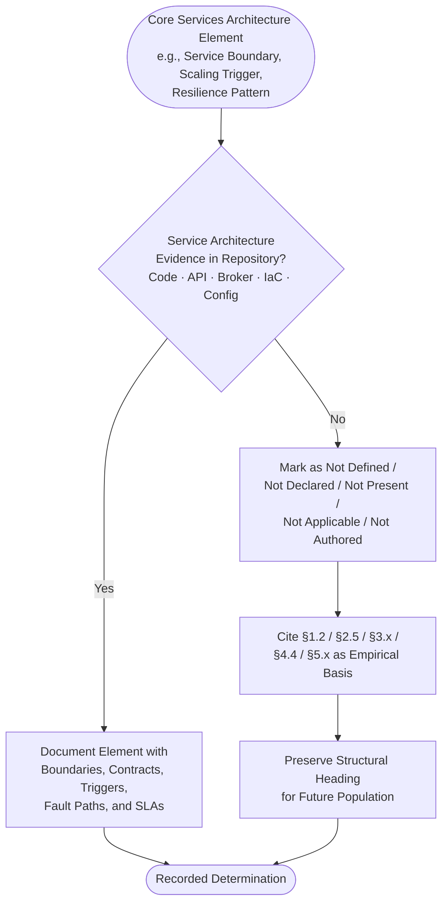
```mermaid
flowchart TB
    Start([Core Services Architecture Element<br/>e.g., Service Boundary, Scaling Trigger,<br/>Resilience Pattern])
    EvidenceCheck{Service Architecture<br/>Evidence in Repository?<br/>Code · API · Broker · IaC · Config}
    Document[Document Element with<br/>Boundaries, Contracts, Triggers,<br/>Fault Paths, and SLAs]
    MarkAbsent[Mark as Not Defined /<br/>Not Declared / Not Present /<br/>Not Applicable / Not Authored]
    CiteSource[Cite §1.2 / §2.5 / §3.x /<br/>§4.4 / §5.x as Empirical Basis]
    PreserveSkeleton[Preserve Structural Heading<br/>for Future Population]
    Outcome([Recorded Determination])

    Start --> EvidenceCheck
    EvidenceCheck -->|Yes| Document
    EvidenceCheck -->|No| MarkAbsent
    MarkAbsent --> CiteSource
    CiteSource --> PreserveSkeleton
    Document --> Outcome
    PreserveSkeleton --> Outcome
```

---

### 6.1.3 Service Components — Determination Inventory

#### 6.1.3.1 Determination Summary

The Section 6.1 prompt requires documentation of six Service Components subcategories: service boundaries and responsibilities, inter-service communication patterns, service discovery mechanisms, load balancing strategy, circuit breaker patterns, and retry and fallback mechanisms. Every subcategory is recorded as *Not Declared* or *Not Present* based on the absence of supporting artifacts in the repository.

#### 6.1.3.2 Service Components Determination Table

| Service Components Element | Determination | Anchoring Source |
|----------------------------|---------------|------------------|
| Service Boundaries and Responsibilities | None — zero service boundaries identified | §5.3.1 *Component Inventory Determination*; §1.3.1 *Implementation Boundaries* |
| Inter-Service Communication Patterns (sync vs. async, REST vs. gRPC vs. GraphQL, point-to-point vs. pub/sub) | Not Declared | §5.4.2 *Communication Pattern Choices*; §1.2.1 *Integration Artifact Categories* |
| Service Discovery Mechanisms (DNS, registry, mesh) | Not Declared | §1.2.1 *Integration Artifact Categories*; §5.2.2 *Core Components Table* (empty) |
| Load Balancing Strategy (L4/L7, round-robin, least-connection, consistent hashing) | Not Declared | §1.2.2 *Major System Components*; §3.7 *Development & Deployment* |
| Circuit Breaker Patterns (Hystrix, resilience4j, Polly, custom) | Not Present | §4.4.2 *Error Handling* (all categories "Not Present"); §5.5.3 *Error Handling Patterns* |
| Retry and Fallback Mechanisms (exponential backoff, jitter, fallback handlers) | Not Present | §4.4.2 (Retry Mechanisms and Fallback Processes both "Not Present"); §5.5.3 |

#### 6.1.3.3 Empirical Basis for Service-Component Absence

The absence of every Service Components element traces back to four foundational determinations established in prior sections:

- **Zero components exist.** §5.3.1 *Component Inventory Determination* records `Number of Identified Components: 0`, `Number of Shared Components: 0`, `Number of Service Boundaries: 0`, and `Number of Module Definitions: 0`. With zero components, no service can be bounded, no responsibility can be assigned, and no inter-service relationship can be characterized.
- **No architectural style has been selected.** §5.4.1 *Architecture Style Decisions* records the outcome as *No Decisions Made*. Without an architectural style (monolith, microservices, serverless, event-driven), the question of "what counts as a service" is not answered by the repository.
- **No communication patterns have been declared.** §5.4.2 *Communication Pattern Choices* records the choice between synchronous request/response vs. asynchronous messaging, point-to-point vs. publish/subscribe, orchestration vs. choreography, and REST vs. gRPC vs. GraphQL as *Not Declared*. No interface descriptor language, no contract document, and no broker configuration is present.
- **No error-handling artifacts exist.** §5.5.3 *Error Handling Patterns* records that "no retry library configuration, no circuit-breaker definition, no fallback handler code, no degraded-mode policy, no alerting rule, and no on-call routing configuration exists in the repository." Circuit breakers, retries, and fallbacks therefore cannot be documented without fabrication.

---

### 6.1.4 Scalability Design — Determination Inventory

#### 6.1.4.1 Determination Summary

The Section 6.1 prompt requires documentation of five Scalability Design subcategories: horizontal/vertical scaling approach, auto-scaling triggers and rules, resource allocation strategy, performance optimization techniques, and capacity planning guidelines. Every subcategory is recorded as *Not Defined* based on the absence of supporting non-functional concern artifacts in the repository.

#### 6.1.4.2 Scalability Design Determination Table

| Scalability Design Element | Determination | Anchoring Source |
|----------------------------|---------------|------------------|
| Horizontal / Vertical Scaling Approach (replica sets, HPA, VPA, stateless vs. stateful scaling) | Not Defined | §2.5.3 *Non-Functional Concern Determination* (Scalability artifact "Not Present"); §1.2.2 |
| Auto-Scaling Triggers and Rules (CPU, memory, custom metrics, queue depth) | Not Defined | §2.5.3; §1.2.2 (no deployment topology declared); §3.7 |
| Resource Allocation Strategy (requests, limits, QoS classes, node affinity) | Not Defined | §1.2.2 *Major System Components*; §2.5.3; §3.7 |
| Performance Optimization Techniques (caching, batching, connection pooling, query tuning) | Not Defined | §1.2.3 *KPIs* ("No KPIs, SLOs, SLIs, or SLAs are defined"); §2.5.3 |
| Capacity Planning Guidelines (headroom, forecast model, load profile, benchmark baseline) | Not Defined | §2.5.3 (capacity model "Not Present"); §5.5.5 *Performance Requirements and SLAs* |

#### 6.1.4.3 Empirical Basis for Scalability-Design Absence

The absence of every Scalability Design element traces back to three foundational determinations:

- **Non-functional Scalability artifacts are absent.** §2.5.3 *Non-Functional Concern Determination* explicitly records the Scalability artifact (capacity model, scaling policy) and the Performance artifact (benchmark targets, profiling baseline) as *Not Present*. There is no Horizontal Pod Autoscaler, no Vertical Pod Autoscaler, no Cluster Autoscaler configuration, no AWS Auto Scaling Group, no GCP Managed Instance Group, no Azure Scale Set, and no equivalent declarative scaling artifact in any form.
- **No performance targets exist.** §1.2.3 *Key Performance Indicators (KPIs)* records "No KPIs, Service-Level Objectives (SLOs), Service-Level Indicators (SLIs), or Service-Level Agreements (SLAs) are defined." Without quantitative targets, auto-scaling triggers cannot be parameterized and capacity-planning guidelines cannot be calibrated.
- **No deployment topology has been declared.** §1.2.2 *Core Technical Approach* records that "the following technical decisions remain undetermined: programming language, runtime, application framework, architectural style (monolith, microservices, serverless, etc.), persistence model, deployment topology, and observability stack." Without a deployment topology, resource allocation cannot be specified.

---

### 6.1.5 Resilience Patterns — Determination Inventory

#### 6.1.5.1 Determination Summary

The Section 6.1 prompt requires documentation of five Resilience Patterns subcategories: fault tolerance mechanisms, disaster recovery procedures, data redundancy approach, failover configurations, and service degradation policies. Every subcategory is recorded as *Not Defined* or *Not Declared* based on the absence of supporting artifacts in the repository.

#### 6.1.5.2 Resilience Patterns Determination Table

| Resilience Patterns Element | Determination | Anchoring Source |
|------------------------------|---------------|------------------|
| Fault Tolerance Mechanisms (bulkheads, timeouts, circuit breakers, retry budgets) | Not Defined | §4.4.2 *Error Handling* (all categories "Not Present"); §5.5.3 |
| Disaster Recovery Procedures (RTO, RPO, backup, restore, failover topology) | Not Defined | §5.5.6 *Disaster Recovery Procedures*; §2.5.3 (Maintainability "Not Present") |
| Data Redundancy Approach (replication, multi-AZ, multi-region, snapshots) | Not Declared | §3.6 *Databases & Storage* ("No Persistence Layer Declared"); §5.4.3 |
| Failover Configurations (active-active, active-passive, leader election, quorum) | Not Defined | §2.5.3; §4.4.2 (no runbooks, no DR plans, no rollback scripts) |
| Service Degradation Policies (graceful degradation, feature flags, brownout, load shedding) | Not Defined | §4.4.2 (Fallback Processes "Not Present"); §5.5.3 |

#### 6.1.5.3 Empirical Basis for Resilience-Pattern Absence

The absence of every Resilience Patterns element traces back to four foundational determinations:

- **No error-handling artifacts exist.** §4.4.2 *Error Handling* records every category — Retry Mechanisms, Fallback Processes, Error Notification Flows, Recovery Procedures — as *Not Present*. The absence of these primitives forecloses the possibility of documenting bulkheads, circuit breakers, or graceful degradation.
- **No persistence layer is declared.** §3.6 *Databases & Storage* records "No Persistence Layer Declared." With no database, no object store, no cache, and no message log, the concept of data redundancy has no referent in the repository.
- **No disaster-recovery artifacts exist.** §5.5.6 *Disaster Recovery Procedures* records that "no backup strategy, no Recovery Point Objective (RPO), no Recovery Time Objective (RTO), no failover topology, no replication policy, and no incident-response playbook is present in the repository."
- **No maintainability artifacts exist.** §2.5.3 *Non-Functional Concern Determination* records the Maintainability artifact (runbooks, support model, on-call rotation) as *Not Present*. Failover automation, leader election, and quorum policies require operational tooling that does not exist.

---

### 6.1.6 Required Diagrams — Cardinality Prerequisites

#### 6.1.6.1 Cardinality Prerequisites Summary

The Section 6.1 prompt requires three Mermaid.js diagram families: a service interaction diagram, a scalability architecture diagram, and a resilience pattern implementation diagram. Following the precedent established in §4.5 *Required Diagrams*, §5.3.3, §5.4.7, §5.5.3, and §5.6 *Required Diagrams — Cardinality Prerequisites Summary*, each required diagram is recorded individually with its minimum cardinality prerequisite and the observed cardinality in the repository.

| Required Diagram | Minimum Cardinality | Observed Cardinality | Determination |
|------------------|---------------------|----------------------|---------------|
| Service Interaction Diagram | ≥ 2 services with ≥ 1 interaction | 0 services / 0 interactions | Not Authored |
| Scalability Architecture Diagram | ≥ 1 scaling unit with ≥ 1 trigger | 0 scaling units / 0 triggers | Not Authored |
| Resilience Pattern Implementation Diagram | ≥ 1 fault path with ≥ 1 recovery mechanism | 0 fault paths / 0 mechanisms | Not Authored |

No substantive service interaction, scalability architecture, or resilience pattern diagram can be authored without fabrication that would violate §2.7.2 Constraints **C-1** and **C-3**.

#### 6.1.6.2 Meta-Diagrams Authored in Place of Substantive Diagrams

Following the precedent established by §5.1.3, §5.2.5, and §5.7.2 — in which meta-diagrams that document determination logic, present-vs-absent inventory, and reactivation flow are authored in place of substantive architecture diagrams — this section includes three validated Mermaid meta-diagrams: the determination logic flowchart (§6.1.2.4), the present-vs-absent core services inventory (§6.1.6.3), and the reactivation flow (§6.1.7.2). These meta-diagrams preserve the diagrammatic structure required by the prompt while honoring the evidence-only documentation pattern.

#### 6.1.6.3 Present vs. Absent Core Services Inventory

The diagram below visually contrasts the Core Services Architecture artifacts that would be required for substantive documentation against the artifacts that are present in the repository. The pattern is adapted from §5.2.5 *Present vs. Absent Architecture Inventory*.


```mermaid
graph TB
    subgraph RequiredArtifacts["Required Core Services Architecture Artifacts"]
        R1[Service Definitions and Boundaries]
        R2[API Contracts: OpenAPI / gRPC / GraphQL]
        R3[Message Brokers / Queues / Event Buses]
        R4[Service Discovery and Load Balancer Config]
        R5[Auto-Scaling Policies and Triggers]
        R6[Circuit Breaker and Retry Library Config]
        R7[Fallback Handlers and Degradation Rules]
        R8[Disaster Recovery Plans and Runbooks]
        R9[SLO / SLI / SLA Documentation]
        R10[Container and Infrastructure-as-Code]
    end

    subgraph PresentArtifacts["Present in Repository"]
        P1[README.md - 11 bytes]
    end

    subgraph AbsentCategories["Documented Absent Categories"]
        A1[All Service Components]
        A2[All Scalability Mechanisms]
        A3[All Resilience Patterns]
    end

    R1 -.->|Not Present| A1
    R2 -.->|Not Present| A1
    R3 -.->|Not Present| A1
    R4 -.->|Not Declared| A1
    R5 -.->|Not Defined| A2
    R6 -.->|Not Present| A3
    R7 -.->|Not Present| A3
    R8 -.->|Not Defined| A3
    R9 -.->|Not Defined| A2
    R10 -.->|Not Present| A2
    P1 -.->|Sole Tracked Content| PresentArtifacts
```

---

### 6.1.7 Reactivation Criteria for Core Services Architecture Documentation

#### 6.1.7.1 Per-Subsection Population Triggers

Consistent with §3.9 *Reactivation Criteria*, §4.6 *Reactivation Criteria for Process Flow Documentation*, and §5.7 *Reactivation Criteria for System Architecture Documentation*, the table below specifies the artifacts whose commitment to the repository would cause each Core Services Architecture subsection to become populatable with substantive content.

| Future-State Trigger Artifact | Subsection(s) Made Populatable |
|-------------------------------|---------------------------------|
| Source code organized into services or modules | §6.1.3 *Service Components* — boundaries, responsibilities |
| API contract (OpenAPI / GraphQL / gRPC / Protocol Buffers) | §6.1.3 — inter-service communication patterns, discovery |
| Message broker / queue / event-bus configuration (Kafka, RabbitMQ, NATS, SQS) | §6.1.3 — async communication patterns |
| Service mesh / DNS-based discovery / registry config (Consul, Istio, Linkerd) | §6.1.3 — service discovery mechanisms |
| Load balancer / ingress / gateway configuration (NGINX, Envoy, ALB, API Gateway) | §6.1.3 — load balancing strategy |
| Circuit breaker / retry / bulkhead library config (resilience4j, Polly, Hystrix) | §6.1.3 — circuit breaker, retry, and fallback patterns; §6.1.5 — fault tolerance |
| Container images / orchestration manifests (Dockerfile, Kubernetes, Helm) | §6.1.4 — horizontal/vertical scaling approach, resource allocation |
| Infrastructure-as-Code definitions (Terraform, CloudFormation, Pulumi) | §6.1.4 — resource allocation strategy, capacity planning |
| Auto-scaling manifests (HPA, VPA, KEDA, Cluster Autoscaler, ASG) | §6.1.4 — auto-scaling triggers and rules |
| SLO / SLI / SLA documents, performance budgets, benchmark baselines | §6.1.4 — performance optimization, capacity planning |
| Runbooks, disaster-recovery plans, rollback scripts, failover topologies | §6.1.5 — disaster recovery, failover configurations |
| Backup / replication / snapshot configuration (DB replicas, multi-AZ, multi-region) | §6.1.5 — data redundancy approach |
| Feature-flag / brownout / load-shedding configuration | §6.1.5 — service degradation policies |

#### 6.1.7.2 Reactivation Flow

The diagram below illustrates the artifact-to-subsection trigger mapping that would cause each Core Services Architecture subsection to become populatable. The pattern is adapted from §3.9.2 *Reactivation Flow*, §4.6.2 *Reactivation Flow*, and §5.7.2 *Reactivation Flow*.

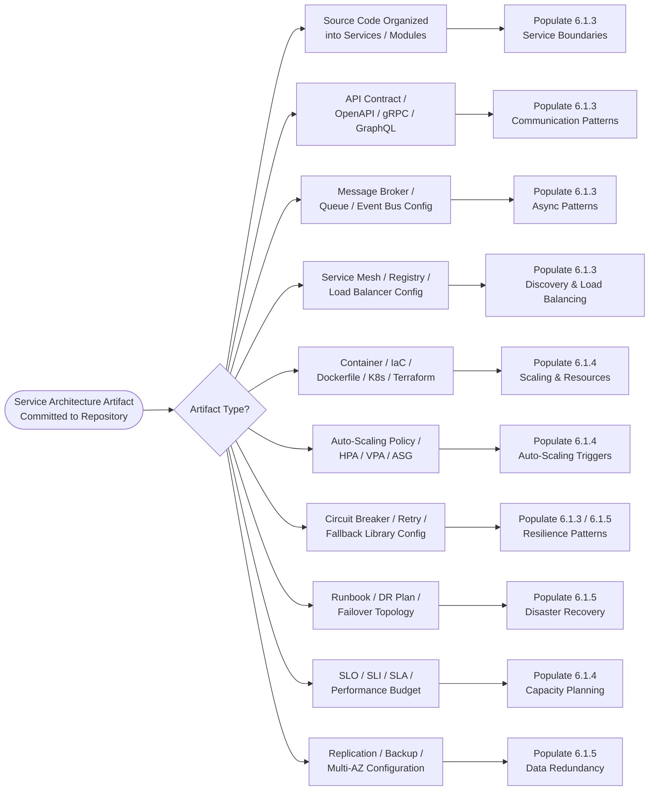
```mermaid
flowchart LR
    Commit([Service Architecture Artifact<br/>Committed to Repository])
    Detect{Artifact Type?}
    CodeArt[Source Code Organized<br/>into Services / Modules]
    ApiArt[API Contract /<br/>OpenAPI / gRPC / GraphQL]
    BrokerArt[Message Broker /<br/>Queue / Event Bus Config]
    DiscArt[Service Mesh / Registry /<br/>Load Balancer Config]
    IacArt[Container / IaC /<br/>Dockerfile / K8s / Terraform]
    ScaleArt[Auto-Scaling Policy /<br/>HPA / VPA / ASG]
    ResArt[Circuit Breaker / Retry /<br/>Fallback Library Config]
    DrArt[Runbook / DR Plan /<br/>Failover Topology]
    SlaArt[SLO / SLI / SLA /<br/>Performance Budget]
    RepArt[Replication / Backup /<br/>Multi-AZ Configuration]

    PopServ[Populate 6.1.3<br/>Service Boundaries]
    PopComm[Populate 6.1.3<br/>Communication Patterns]
    PopAsync[Populate 6.1.3<br/>Async Patterns]
    PopDisc[Populate 6.1.3<br/>Discovery & Load Balancing]
    PopScale[Populate 6.1.4<br/>Scaling & Resources]
    PopAuto[Populate 6.1.4<br/>Auto-Scaling Triggers]
    PopRes[Populate 6.1.3 / 6.1.5<br/>Resilience Patterns]
    PopDr[Populate 6.1.5<br/>Disaster Recovery]
    PopCap[Populate 6.1.4<br/>Capacity Planning]
    PopRed[Populate 6.1.5<br/>Data Redundancy]

    Commit --> Detect
    Detect --> CodeArt
    Detect --> ApiArt
    Detect --> BrokerArt
    Detect --> DiscArt
    Detect --> IacArt
    Detect --> ScaleArt
    Detect --> ResArt
    Detect --> DrArt
    Detect --> SlaArt
    Detect --> RepArt
    CodeArt --> PopServ
    ApiArt --> PopComm
    BrokerArt --> PopAsync
    DiscArt --> PopDisc
    IacArt --> PopScale
    ScaleArt --> PopAuto
    ResArt --> PopRes
    DrArt --> PopDr
    SlaArt --> PopCap
    RepArt --> PopRed
```

---

### 6.1.8 Summary of Core Services Architecture Determination

#### 6.1.8.1 Consolidated Determination Table

The table below consolidates the determination for each Core Services Architecture category specified by the prompt, providing a single reference point for stakeholders. The structure mirrors §2.8.1, §3.10.1, §4.7.1, and §5.8.1.

| Core Services Architecture Category | Documented State | Empirical Basis |
|-------------------------------------|------------------|-----------------|
| Service Boundaries and Responsibilities (§6.1.3) | None — zero boundaries | §5.3.1; §1.3.1 |
| Inter-Service Communication Patterns (§6.1.3) | Not Declared | §5.4.2; §1.2.1 |
| Service Discovery Mechanisms (§6.1.3) | Not Declared | §1.2.1; §5.2.2 |
| Load Balancing Strategy (§6.1.3) | Not Declared | §1.2.2; §3.7 |
| Circuit Breaker Patterns (§6.1.3) | Not Present | §4.4.2; §5.5.3 |
| Retry and Fallback Mechanisms (§6.1.3) | Not Present | §4.4.2; §5.5.3 |
| Horizontal / Vertical Scaling Approach (§6.1.4) | Not Defined | §2.5.3 |
| Auto-Scaling Triggers and Rules (§6.1.4) | Not Defined | §2.5.3; §3.7 |
| Resource Allocation Strategy (§6.1.4) | Not Defined | §1.2.2; §2.5.3 |
| Performance Optimization Techniques (§6.1.4) | Not Defined | §1.2.3; §2.5.3 |
| Capacity Planning Guidelines (§6.1.4) | Not Defined | §2.5.3; §5.5.5 |
| Fault Tolerance Mechanisms (§6.1.5) | Not Defined | §4.4.2; §5.5.3 |
| Disaster Recovery Procedures (§6.1.5) | Not Defined | §5.5.6; §2.5.3 |
| Data Redundancy Approach (§6.1.5) | Not Declared | §3.6; §5.4.3 |
| Failover Configurations (§6.1.5) | Not Defined | §2.5.3; §4.4.2 |
| Service Degradation Policies (§6.1.5) | Not Defined | §4.4.2; §5.5.3 |
| Service Interaction Diagram (§6.1.6) | Not Authored | Cardinality prerequisites not met |
| Scalability Architecture Diagram (§6.1.6) | Not Authored | Cardinality prerequisites not met |
| Resilience Pattern Diagram (§6.1.6) | Not Authored | Cardinality prerequisites not met |
| Overall Section Applicability (§6.1.1) | Not Applicable | §6.1.1.2; Constraints C-1, C-3 |

#### 6.1.8.2 Cross-Reference Summary

This Core Services Architecture section is grounded in and consistent with the empirical determinations established earlier in the Technical Specification. The table below maps each Section 6.1 determination to its anchoring prior section, mirroring the structure used in §2.8.2, §3.10.2, §4.7.2, and §5.8.2.

| Section 6.1 Determination | Anchoring Prior Section |
|---------------------------|--------------------------|
| Zero service components exist | §5.3.1 *Component Inventory Determination*; §1.2.2 |
| No architectural style chosen | §5.4.1 *Architecture Style Decisions*; §5.2.1 |
| No communication patterns declared | §5.4.2 *Communication Pattern Choices*; §1.2.1 |
| No integration artifacts present | §1.2.1 *Integration Artifact Categories* |
| No data flows defined | §5.2.3 *Data Flow Description*; §4.2.2 |
| No performance targets, SLOs, or SLAs | §1.2.3 *KPIs*; §5.5.5 |
| No error handling, retry, fallback, or circuit-breaker artifacts | §4.4.2 *Error Handling*; §5.5.3 |
| No scaling or capacity-planning artifacts | §2.5.3 *Non-Functional Concern Determination*; §5.5.5 |
| No disaster-recovery procedures | §5.5.6 *Disaster Recovery Procedures*; §2.5.3 |
| No persistence layer declared | §3.6 *Databases & Storage*; §5.4.3 |
| No default technology stack adopted | §3.8.3 *Default Technology Stack Disposition* |
| Cardinality prerequisites unmet for all required diagrams | §5.6 *Required Diagrams — Cardinality Prerequisites Summary* (precedent) |
| Evidence-only documentation pattern | §2.1.3; §2.7.2 Constraints **C-1** and **C-3** |

#### 6.1.8.3 Effective Outcome

The effective outcome of Section 6.1 is a structurally complete but content-empty Core Services Architecture framework with an explicit *Not Applicable* determination at the section level. Each prompt-specified subsection — Service Components (boundaries, communication, discovery, load balancing, circuit breakers, retry/fallback), Scalability Design (scaling approach, auto-scaling, resource allocation, performance optimization, capacity planning), and Resilience Patterns (fault tolerance, disaster recovery, data redundancy, failover, degradation policies) — is preserved as a structural heading and is paired with (a) an explicit *Not Defined* / *Not Declared* / *Not Present* / *Not Applicable* / *Not Authored* determination, (b) an empirical inventory documenting the artifact categories that were searched for and confirmed absent, and (c) a cross-reference to the prior section that anchors the determination.

In place of substantive service interaction, scalability architecture, and resilience pattern diagrams, three validated Mermaid meta-diagrams are included as architectural meta-artifacts for this section: §6.1.2.4 *Determination Logic for Core Services Architecture Categories* records the evaluation procedure applied to each element; §6.1.6.3 *Present vs. Absent Core Services Inventory* visually contrasts what exists in the repository against what would be required for substantive service-architecture documentation; and §6.1.7.2 *Reactivation Flow* enumerates the artifact-to-subsection triggers that would cause each Core Services Architecture subsection to become populatable. The three prompt-required Mermaid diagram families (service interaction, scalability architecture, resilience pattern implementations) are each individually recorded as *Not Authored* with cited cardinality prerequisites that are not met by the repository's current state.

This section therefore performs two roles simultaneously: (1) it accurately documents that no service components, no scaling mechanisms, no resilience patterns, and no disaster-recovery procedures are presently defined in the repository, and that Core Services Architecture is consequently *not applicable* per the explicit conditional in the Section 6.1 prompt; and (2) it pre-stages the documentation surface that will receive substantive content when service-oriented source code, API contracts, message-broker configurations, container/IaC definitions, auto-scaling policies, circuit-breaker libraries, runbooks, SLO/SLA documentation, or replication policies are committed to the repository in a future iteration. The Reactivation Criteria in §6.1.7 specify the precise trigger artifacts that would cause each subsection to become populatable.

#### 6.1.8.4 Prompt-Derived Directives Honored

| Directive from Section 6.1 Prompt | Honored By |
|-----------------------------------|------------|
| "If the system does not require microservices ... clearly state 'Core Services Architecture is not applicable for this system' and explain why." | §6.1.1 *Applicability Determination*; nine-clause rationale table |
| Required documentation of Service Components, Scalability Design, Resilience Patterns | §6.1.3, §6.1.4, §6.1.5 — each subsection preserved with explicit determinations |
| Required Mermaid.js diagrams (service interaction, scalability, resilience) | §6.1.6 — each diagram recorded individually with cardinality prerequisites; three meta-diagrams authored in §6.1.2.4, §6.1.6.3, §6.1.7.2 |
| "Use Markdown tables for structured data" | All structured content rendered as Markdown tables |
| "Tables should never have more than four columns" | All tables in §6.1 contain at most four columns |
| "Ensure all diagrams are properly labeled" | All three meta-diagrams carry titles in their containing subsection heading |
| "Include clear section references" | §X.Y.Z section references used throughout, consistent with §1–§5 |
| Constraint **C-1** (§2.7.2): no invention, extrapolation, or projection | Honored throughout; no fabricated service, scaling policy, or resilience pattern |
| Constraint **C-3** (§2.7.2): evidence-only documentation pattern | Honored throughout; explicit determination markers used uniformly |
| Terminology consistency with §1–§5 | "Not Defined," "Not Declared," "Not Present," "Not Applicable," "Not Authored," "None Documented" used with the same semantic load as in prior sections |

---

#### References

#### Files Examined

- `README.md` — The sole content file in the repository (11 bytes; complete content: `# Artifact3`). Examined to confirm that the only documentation artifact in the repository contains no service narrative, no component declarations, no communication-pattern mentions, no scaling rationale, no resilience guidance, no disaster-recovery instructions, and no performance targets. Establishes the empirical basis for marking every Core Services Architecture category as *Not Defined*, *Not Declared*, *Not Present*, *Not Applicable*, or *Not Authored* and for the overarching *Not Applicable* determination at §6.1.1.

#### Folders Explored

- `/` (repository root, depth 0) — Verified to contain only `README.md` and `.git/` metadata. No subdirectories of any kind exist (no `src/`, `services/`, `microservices/`, `components/`, `app/`, `lib/`, `docs/`, `architecture/`, `infrastructure/`, `k8s/`, `helm/`, `terraform/`, `decisions/`, `adr/`, `observability/`, `runbooks/`, `dr/`, `contracts/`, `schemas/`, `policies/`, or any other folder that would house service-architecture artifacts). The repository's directory tree terminates at depth 1; documented absence rather than incomplete exploration.

#### Repository Metadata Inspected

- `.git/config` — Provided the remote origin URL (`https://github.com/shalini690/Artifact3.git`) and confirmed `main` as the sole branch. No project-specific configuration that would imply a service architecture is present.
- Git commit history — Single initial commit (`00f22b7`, "Initial commit") by `shalini690 <shalini@blitzy.io>` on May 28, 2026, adding only `README.md`. No later commits introduce service definitions, communication contracts, scaling policies, resilience artifacts, or disaster-recovery materials.

#### Technical Specification Sections Cross-Referenced

- **§1.1 EXECUTIVE SUMMARY** — Established the repository as an 11-byte placeholder with a single initial commit; provided the foundational determination that no implementation, requirements, or architectural choices have been made. Anchored the overall *Not Applicable* determination at §6.1.1.
- **§1.2 SYSTEM OVERVIEW** — Provided the *Integration Artifact Categories* table (every row "Not Present") used to anchor §6.1.3 *Service Components*; provided the *Major System Components* inventory used to anchor §6.1.3 (service boundaries) and §6.1.4 (resource allocation); provided the *Core Technical Approach* statement confirming no architectural style or deployment topology has been chosen; provided §1.2.3 *KPIs* ("No KPIs, SLOs, SLIs, or SLAs are defined") used to anchor §6.1.4 (performance optimization, capacity planning).
- **§1.3 SCOPE** — Confirmed *Implementation Boundaries* with no service surface and *Excluded Capabilities* covering server-side processing, external system integrations, deployment and operations tooling, and observability and telemetry. Used to anchor §6.1.3 and §6.1.5.
- **§2.1 PREAMBLE AND DOCUMENTATION APPROACH** — Codified the evidence-only documentation pattern and the four-step canonical procedure followed throughout this section. Provided the determination-logic flowchart precedent adapted for §6.1.2.4.
- **§2.5 IMPLEMENTATION CONSIDERATIONS** — Recorded every Non-Functional Concern artifact (Performance benchmark targets, Scalability capacity model, Security threat model, Maintainability runbooks) as "Not Present." Critical anchoring for §6.1.4 *Scalability Design* and §6.1.5 *Resilience Patterns*.
- **§2.7 ASSUMPTIONS AND CONSTRAINTS** — Provided governing Constraints **C-1** (no fabrication) and **C-3** (evidence-only pattern) honored throughout this section. Provided the *Future-State Considerations* pattern adapted for §6.1.7.
- **§3.5 THIRD-PARTY SERVICES** — Recorded zero indicators of external APIs, monitoring tools, message brokers, identity providers. Used to anchor §6.1.3 (service discovery, communication patterns).
- **§3.6 DATABASES & STORAGE** — Recorded "No Persistence Layer Declared." Used to anchor §6.1.5 (data redundancy approach).
- **§3.7 DEVELOPMENT & DEPLOYMENT** — Confirmed absence of containerization, CI/CD, and infrastructure-as-code artifacts. Used to anchor §6.1.3 (load balancing), §6.1.4 (scaling, resource allocation), and §6.1.5 (failover configurations).
- **§3.8 DEFAULT TECHNOLOGY STACK DISPOSITION** — Provided the "Not Adopted" disposition that prevents inferring a service architecture from any default stack.
- **§4.2 System Workflows** — Recorded "Data Flow Between Systems: Not Present." Used to anchor §6.1.3 (communication patterns).
- **§4.4 Technical Implementation** — Recorded Error Handling (retry mechanisms, fallback processes, notification flows, recovery procedures) as "Not Present" across all categories. Critical anchoring for §6.1.3 (circuit breakers, retry/fallback) and §6.1.5 (fault tolerance, service degradation).
- **§5.1 Repository Evidence Baseline for System Architecture** — Provided the inherited evidence-baseline pattern (§5.1.1) and documentation-approach pattern (§5.1.2) directly mirrored by §6.1.2.
- **§5.2 High-Level Architecture** — Confirmed Architectural Style "Not Determined," Components Table empty, External Integration Points Table empty, Data Flow "Not Defined." Anchored §6.1.3 (service boundaries, communication patterns, discovery).
- **§5.3 Component Details** — Confirmed Number of Identified Components: 0, Shared Components: 0, Service Boundaries: 0, Module Definitions: 0. Critical evidence that no service components exist to document; primary anchor for §6.1.3.
- **§5.4 Technical Decisions** — Confirmed "No Decisions Made" for architecture style; "Not Declared" for communication patterns. Anchored §6.1.3.
- **§5.5 Cross-Cutting Concerns** — Confirmed Error Handling Patterns "Not Defined," Performance Requirements and SLAs "Not Defined," Disaster Recovery Procedures "Not Defined." Critical anchoring for §6.1.3 (circuit breakers, retry/fallback), §6.1.4 (performance optimization, capacity planning), and §6.1.5 (fault tolerance, disaster recovery, service degradation).
- **§5.6 Required Diagrams — Cardinality Prerequisites Summary** — Provided the cardinality-prerequisite pattern for unbuildable diagrams that is reused in §6.1.6.
- **§5.7 Reactivation Criteria for System Architecture Documentation** — Provided the per-subsection trigger table and *Reactivation Flow* Mermaid pattern adapted for §6.1.7.
- **§5.8 Summary of System Architecture Determination** — Provided the closing *Consolidated Determination Table* / *Cross-Reference Summary* / *Effective Outcome* / *Prompt-Derived Directives Honored* / *References* structure directly mirrored by §6.1.8.

## 6.2 Database Design

### 6.2.1 Applicability Determination

#### 6.2.1.1 Decision Statement

**Database Design is not applicable to this system.**

The Section 6.2 prompt explicitly provides the governing decision logic: *"If the system does not require or direct database or persistent storage interactions are not clearly evident, clearly state 'Database Design is not applicable to this system' and explain why."* The `Artifact3` repository satisfies the antecedent of that conditional: it contains zero database engines, zero schema definitions, zero ORM models, zero migration scripts, zero connection-pool configurations, zero cache declarations, zero object-storage references, zero backup or replication policies, zero data-retention or archival rules, zero query-optimization artifacts, and zero compliance-control declarations. Each of these absences is independently verified in §1.2, §1.3, §3.6, §4.4, §5.2, §5.3, §5.4, and §5.5 of this Technical Specification, with §3.6 *Databases & Storage* providing the authoritative anchoring determination: *"No primary database, secondary database, cache, or storage service has been declared, configured, or implemented in the `Artifact3` repository."*

#### 6.2.1.2 Rationale Summary

The rationale that triggers the "not applicable" determination is composed of nine independent absences, each anchored to a verifying prior section. The table below consolidates the rationale into four columns consistent with the §6.1.1.2 precedent and the formatting constraint that tables must not exceed four columns.

| # | Absent Prerequisite for Database Design | Determination | Anchoring Source |
|---|------------------------------------------|---------------|------------------|
| 1 | Primary / secondary database engine declaration | Not Declared | §3.6.1; §3.6.3 |
| 2 | Schema definitions (DDL, ORM models, NoSQL schemas) | Not Present | §3.6.2; §1.2.2 |
| 3 | Database connection configuration (URLs, pool sizing) | Not Present | §3.6.2; §1.2.1 |
| 4 | Migration / versioning scripts (Alembic, Flyway, Knex, Prisma) | Not Present | §3.6.2; §3.6.3 |
| 5 | Cache layer (Redis, Memcached, CDN) | Not Declared | §3.6.2; §5.4.4 |
| 6 | Object / blob / file storage references | Not Declared | §3.6.2; §3.6.3 |
| 7 | Backup, replication, retention policies | Not Defined | §3.6.3; §6.1.5 |
| 8 | Data flow definitions between stores | Not Defined | §5.2.3; §4.4.1 |
| 9 | Performance targets driving query/cache tuning | Not Defined | §1.2.3; §5.5.5 |

#### 6.2.1.3 Constraint Inheritance

The "not applicable" determination is mandated by Constraints **C-1** and **C-3** as codified in §2.7.2. Constraint **C-1** prohibits invention, extrapolation, or projection of features, requirements, or relationships beyond what the repository evidences. Constraint **C-3** mandates the evidence-only documentation pattern with explicit determination markers (*Not Defined*, *Not Declared*, *Not Present*, *Not Applicable*, *Not Authored*) in place of fabricated content. Authoring substantive Entity-Relationship Diagrams, indexing strategies, partitioning schemes, replication topologies, retention policies, or query-optimization plans for a repository that contains exactly one 11-byte `README.md` file would violate both constraints simultaneously. This determination is further reinforced by §3.8 *Default Technology Stack Disposition*, which records the default MongoDB database as **Not Adopted**, foreclosing inference of a schema or storage model from any default stack.

---

### 6.2.2 Repository Evidence Baseline for Database Design

#### 6.2.2.1 Empirical Repository State

The empirical state of the `Artifact3` repository, as established and verified in §1.1, §1.2, §1.3, §2.1, §3.1, §3.6, §4.1, and §5.1 of this Technical Specification, materially constrains the structure and content of this Database Design section. The repository contains exactly two tracked entities: a single 11-byte `README.md` file whose complete content is the literal text `# Artifact3`, and a `.git/` directory holding version-control metadata. No SQL Data Definition Language files (`*.sql`), no ORM entity classes (SQLAlchemy, Django ORM, TypeORM, Hibernate, Mongoose, Sequelize), no migration tool configuration (Alembic, Flyway, Liquibase, Knex, Prisma), no NoSQL schema definitions (MongoDB collections, DynamoDB tables, Cassandra `CREATE TABLE` statements), no cache client configurations (Redis, Memcached, in-memory cache wrappers), no object-storage SDK references (S3, GCS, Azure Blob Storage), no search-engine connectors (Elasticsearch, OpenSearch, Solr, Algolia), no time-series or analytics store connectors (InfluxDB, TimescaleDB, ClickHouse, BigQuery, Snowflake), no `DATABASE_URL` environment variable references, no `database.yml` or equivalent connection manifest, no connection pool configuration, no backup or replication scripts, no retention policy documents, and no audit-log destination is present in the repository.

#### 6.2.2.2 Evidence Categories Required and Their Absence

A Database Design section conventionally documents the persistence-layer composition of a system — its entities and relationships, the schemas and data models that structure them, the indexing and partitioning strategies that enable performance, the replication and backup architectures that ensure durability and availability, the migration and archival processes that govern lifecycle, the cache and connection-pool layers that mediate access, and the compliance controls that satisfy regulatory obligations. None of the prerequisites for such documentation is present in the repository. The table below enumerates the evidence categories required for substantive Database Design content and records each as absent.

| Evidence Required for Database Design | Repository Status | Verifying Section |
|----------------------------------------|-------------------|--------------------|
| SQL DDL Files / Schema Definitions | Not Present | §3.6.2; §1.2.2 |
| ORM Model / Entity Classes | Not Present | §3.6.2; §4.4.1 |
| Migration Tool Configuration | Not Present | §3.6.2; §3.6.3 |
| Database Connection Configuration | Not Present | §3.6.2; §1.2.1 |
| Connection Pool Settings | Not Present | §3.6.2; §4.4.1 |
| NoSQL Schema / Collection Definitions | Not Present | §3.6.2 |
| Cache Client Configuration (Redis, Memcached) | Not Present | §3.6.2; §5.4.4 |
| Object / Blob Storage SDK References | Not Present | §3.6.2 |
| Search-Engine Connectors | Not Present | §3.6.2 |
| Time-Series / Analytics Store Connectors | Not Present | §3.6.2 |
| Backup / Snapshot Scripts | Not Present | §3.6.3; §5.5.6 |
| Replication / Multi-AZ / Multi-Region Configuration | Not Present | §3.6.3; §6.1.5 |
| Retention Policy / Archival Rule Documents | Not Present | §3.6.3 |
| Audit Logging Destination Configuration | Not Present | §5.5.1; §5.5.2 |
| Access Control / RBAC / Row-Level Security Policy | Not Present | §5.5.4; §5.4.5 |

#### 6.2.2.3 Documentation Approach Inherited from Prior Sections

This section follows the documentation pattern codified in §2.1.3, reiterated by §3.1.2, §4.1.2, §5.1.2, and §6.1.2.3, and governed by Constraints **C-1** and **C-3** of §2.7.2. The pattern consists of four canonical steps applied to every conventional Database Design element:

1. **Mark each conventional element with an explicit determination** — *Not Defined*, *Not Declared*, *Not Present*, *Not Applicable*, or *Not Authored*.
2. **Provide the empirical basis for each determination** with cross-references to the verifying section of the Technical Specification, with §3.6 *Databases & Storage* serving as the primary anchor.
3. **Avoid fabrication, extrapolation, or projection** of entities, relationships, indexes, partitioning schemes, replication topologies, retention rules, query plans, or cache strategies that the repository does not evidence.
4. **Preserve the structural skeleton** of the Database Design framework — Schema Design, Data Management, Compliance Considerations, Performance Optimization — so that the section can be incrementally populated when persistence artifacts are committed to the repository.

#### 6.2.2.4 Determination Logic for Database Design Categories

The flowchart below summarizes the determination logic applied to each Database Design element in this section. The diagram adapts the pattern established by §5.1.3 and §6.1.2.4 to the database-design domain.

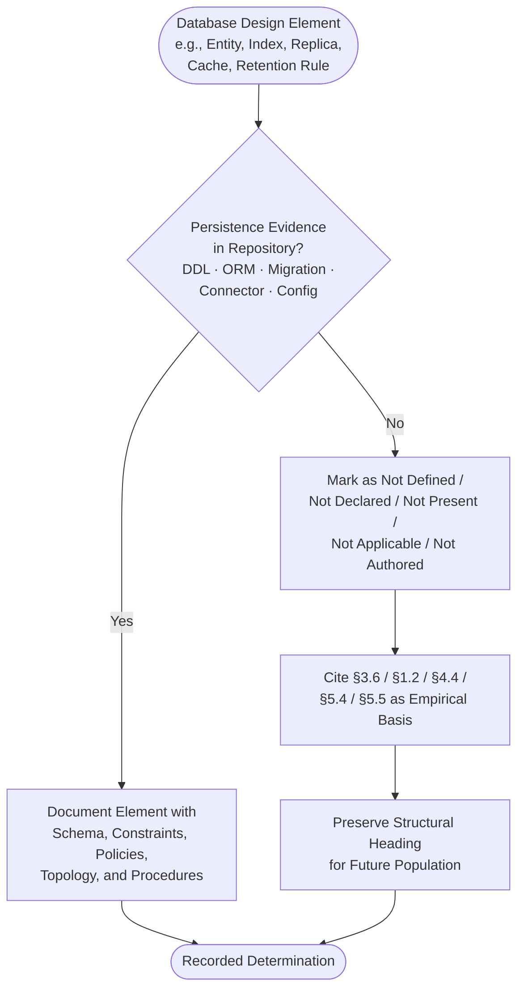
```mermaid
flowchart TB
    Start([Database Design Element<br/>e.g., Entity, Index, Replica,<br/>Cache, Retention Rule])
    EvidenceCheck{Persistence Evidence<br/>in Repository?<br/>DDL · ORM · Migration ·<br/>Connector · Config}
    Document[Document Element with<br/>Schema, Constraints, Policies,<br/>Topology, and Procedures]
    MarkAbsent[Mark as Not Defined /<br/>Not Declared / Not Present /<br/>Not Applicable / Not Authored]
    CiteSource[Cite §3.6 / §1.2 / §4.4 /<br/>§5.4 / §5.5 as Empirical Basis]
    PreserveSkeleton[Preserve Structural Heading<br/>for Future Population]
    Outcome([Recorded Determination])

    Start --> EvidenceCheck
    EvidenceCheck -->|Yes| Document
    EvidenceCheck -->|No| MarkAbsent
    MarkAbsent --> CiteSource
    CiteSource --> PreserveSkeleton
    Document --> Outcome
    PreserveSkeleton --> Outcome
```

---

### 6.2.3 Schema Design — Determination Inventory

#### 6.2.3.1 Determination Summary

The Section 6.2 prompt requires documentation of six Schema Design elements: entity relationships, data models and structures, indexing strategy, partitioning approach, replication configuration, and backup architecture. Every element is recorded as *None*, *Not Defined*, or *Not Declared* based on the absence of any DDL, ORM model, NoSQL schema, partition definition, replica configuration, or backup artifact in the repository, as established by §3.6 *Databases & Storage*.

#### 6.2.3.2 Schema Design Determination Table

| Schema Design Element | Determination | Anchoring Source |
|------------------------|---------------|------------------|
| Entity Relationships (ERD entities, cardinalities, foreign keys) | None — zero entities defined | §3.6.1; §1.2.2; §5.3.1 |
| Data Models and Structures (tables, documents, collections, columns, fields, types) | Not Declared | §3.6.3; §4.4.1 (Data Persistence Points "Not Present") |
| Indexing Strategy (B-tree, hash, GIN, composite, covering, partial indexes) | Not Defined | §3.6.3; §1.2.3 (no performance targets to inform index design) |
| Partitioning Approach (range, list, hash partitions; sharding key) | Not Defined | §3.6.3; §2.5.3 (no scalability artifact) |
| Replication Configuration (primary/replica, multi-AZ, multi-region, async/sync) | Not Declared | §3.6.3; §6.1.5.2 (Data Redundancy Approach "Not Declared") |
| Backup Architecture (full / incremental / differential, retention windows, restore drills) | Not Defined | §3.6.3 (Backup, Replication, and Retention Policy "Not Defined"); §5.5.6 |

#### 6.2.3.3 Schema Design Indexes and Constraints Inventory

The prompt requires documentation of all indexes and constraints. Because no schema, table, document, collection, or column has been declared in the repository, the inventory of indexes and constraints is necessarily empty. The table below explicitly records this state to satisfy the prompt's directive while honoring Constraints **C-1** and **C-3**.

| Constraint / Index Category | Count in Repository | Empirical Basis |
|------------------------------|---------------------|------------------|
| Primary Key Constraints | 0 | No tables or collections declared (§3.6.1) |
| Foreign Key / Referential Integrity Constraints | 0 | No entity relationships defined (§3.6.1; §5.3.1) |
| Unique Constraints | 0 | No columns or attributes declared (§3.6.2) |
| Check Constraints / Domain Constraints | 0 | No data models declared (§3.6.3) |
| Not-Null Constraints | 0 | No fields or attributes declared (§3.6.2) |
| B-Tree / Hash / GIN / GiST Indexes | 0 | No indexing strategy defined (§3.6.3) |
| Composite / Covering / Partial Indexes | 0 | No query patterns to optimize (§1.2.3) |
| Full-Text Search Indexes | 0 | No search-engine connectors present (§3.6.2) |

#### 6.2.3.4 Empirical Basis for Schema-Design Absence

The absence of every Schema Design element traces back to four foundational determinations established in prior sections:

- **No persistence layer is declared.** §3.6.1 records the authoritative determination: *"No primary database, secondary database, cache, or storage service has been declared, configured, or implemented in the `Artifact3` repository."* Without a database engine, no entities can be defined, no data types can be selected, and no schema strategy can be chosen.
- **No data schemas, ORM models, or migration scripts are present.** §1.2.2 *Major System Components* records "Data Schemas: SQL DDL, ORM models, migration scripts — Not Present," and §3.6.2 *Persistence Indicator Inventory* confirms that every category (SQL DDL, ORM definitions, NoSQL schemas, connection configuration, cache configuration, object storage references, search-engine connectors, time-series stores) returns "None" found.
- **No data persistence points or transaction boundaries exist.** §4.4.1 *State Management* records every state-management category — State Transitions, Data Persistence Points, Caching Requirements, Transaction Boundaries — as *Not Present*. Indexes, constraints, and replication topologies presuppose persistence points that do not exist.
- **No data redundancy or disaster recovery is declared.** §6.1.5.2 records Data Redundancy Approach as *Not Declared* and Disaster Recovery Procedures as *Not Defined*, anchored to §3.6 and §5.5.6. Backup architecture and replication configuration consequently have no referent in the repository.

---

### 6.2.4 Data Management — Determination Inventory

#### 6.2.4.1 Determination Summary

The Section 6.2 prompt requires documentation of five Data Management elements: migration procedures, versioning strategy, archival policies, data storage and retrieval mechanisms, and caching policies. Every element is recorded as *Not Defined* or *Not Declared* based on the absence of migration tooling, version-control metadata for schemas, archival rules, persistence connectors, and cache configuration in the repository.

#### 6.2.4.2 Data Management Determination Table

| Data Management Element | Determination | Anchoring Source |
|--------------------------|---------------|------------------|
| Migration Procedures (Alembic, Flyway, Liquibase, Knex, Prisma, custom) | Not Defined | §3.6.2; §3.6.3 (Data Migration / Versioning Approach "Not Defined") |
| Versioning Strategy (schema version table, semantic versioning, forward/back compatibility) | Not Defined | §3.6.3 |
| Archival Policies (cold-storage tiering, time-bounded archival, immutable archival) | Not Defined | §3.6 (no retention or archival policy declared); §1.3.1 |
| Data Storage and Retrieval Mechanisms (repository pattern, DAO, query builder, raw SQL) | Not Defined | §3.6; §4.4.1 (Data Persistence Points "Not Present") |
| Caching Policies (cache-aside, read-through, write-through, write-behind, TTL strategy) | Not Declared | §5.4.4 (Caching Strategy Justification "Not Declared"); §4.4.1 |

#### 6.2.4.3 Empirical Basis for Data-Management Absence

The absence of every Data Management element traces back to three foundational determinations:

- **No migration or versioning artifacts exist.** §3.6.3 records both *Backup, Replication, and Retention Policy* and *Data Migration / Versioning Approach* as *Not Defined*. §3.6.2 confirms that no Alembic, Flyway, Liquibase, Knex, or Prisma migration files are present in any folder. The repository's directory tree terminates at depth 1 (per §3.10's References and §4.7's References), confirming the absence of any `migrations/`, `db/migrate/`, `prisma/migrations/`, or equivalent folder.
- **No persistence connectors or repository-pattern code exist.** §4.4.1 *State Management* records Data Persistence Points as *Not Present*, noting the absence of "database connectors, ORM models, repository pattern code." Without a persistence connector, the data storage and retrieval mechanism has no implementation surface.
- **No cache configuration or cache-aware code exists.** §5.4.4 *Caching Strategy Justification* records the caching strategy as *Not Declared*, anchored to §4.4.1, which records Caching Requirements as *Not Present* due to "the absence of cache configuration (Redis, Memcached, CDN), cache-aside or write-through pattern code." With no cache declared and no performance budget (§1.2.3) to justify one, no caching policy can be substantiated.

---

### 6.2.5 Compliance Considerations — Determination Inventory

#### 6.2.5.1 Determination Summary

The Section 6.2 prompt requires documentation of five Compliance Considerations elements: data retention rules, backup and fault tolerance policies, privacy controls, audit mechanisms, and access controls. Every element is recorded as *Not Defined* or *Not Declared* based on the absence of regulatory scope, backup artifacts, privacy classification, audit-log destinations, and access-control policies in the repository.

#### 6.2.5.2 Compliance Considerations Determination Table

| Compliance Element | Determination | Anchoring Source |
|---------------------|---------------|------------------|
| Data Retention Rules (per-entity TTL, regulatory retention windows, purge schedules) | Not Defined | §1.3.1 (Regulatory / Compliance Scope: None); §3.6 |
| Backup and Fault Tolerance Policies (RPO, RTO, snapshot frequency, restore drills) | Not Defined | §3.6.3; §5.5.6 *Disaster Recovery Procedures*; §6.1.5.2 |
| Privacy Controls (PII classification, encryption-at-rest, encryption-in-transit, tokenization, masking) | Not Declared | §1.3.1; §5.4.5 *Security Mechanism Selection* (Not Selected) |
| Audit Mechanisms (audit logs, change-data-capture, immutable audit trail, log shipping) | Not Defined | §5.5.1 *Monitoring and Observability*; §5.5.2 *Logging and Tracing Strategy* |
| Access Controls (database users, roles, RBAC, row-level security, attribute-based access) | Not Declared | §5.5.4 *Authentication and Authorization Framework*; §5.4.5 |

#### 6.2.5.3 Empirical Basis for Compliance-Considerations Absence

The absence of every Compliance Considerations element traces back to four foundational determinations:

- **No regulatory or compliance scope is declared.** §1.3.1 records the Regulatory / Compliance Scope as "None" — no GDPR, HIPAA, PCI-DSS, SOC 2, ISO 27001, FedRAMP, or other framework is invoked by the repository. Without a regulatory anchor, retention windows and privacy controls have no governing requirement.
- **No security mechanism is selected.** §5.4.5 *Security Mechanism Selection* records the selection as *Not Selected*, noting that "no authentication scheme, no authorization model, no encryption strategy, no key management approach, and no threat model has been adopted." Encryption-at-rest, encryption-in-transit, tokenization, masking, and key rotation policies therefore have no documented basis.
- **No audit, monitoring, or logging instrumentation exists.** §5.5.1 *Monitoring and Observability* and §5.5.2 *Logging and Tracing Strategy* record observability instrumentation as absent. Without log shipping, audit-trail destinations, or change-data-capture pipelines, audit mechanisms cannot be specified.
- **No authentication or authorization framework is declared.** §5.5.4 *Authentication and Authorization Framework* records database-level access controls — users, roles, RBAC policies, row-level security predicates — as *Not Declared*, anchored to the absence of any identity provider integration or RBAC policy file in the repository.

---

### 6.2.6 Performance Optimization — Determination Inventory

#### 6.2.6.1 Determination Summary

The Section 6.2 prompt requires documentation of five Performance Optimization elements: query optimization patterns, caching strategy, connection pooling, read/write splitting, and batch processing approach. Every element is recorded as *Not Defined* or *Not Declared* based on the absence of query workloads, cache layers, connection-pool configurations, read-replica routing, and batch-processing pipelines in the repository.

#### 6.2.6.2 Performance Optimization Determination Table

| Performance Optimization Element | Determination | Anchoring Source |
|-----------------------------------|---------------|------------------|
| Query Optimization Patterns (EXPLAIN ANALYZE, query plan hints, materialized views, denormalization) | Not Defined | §3.6; §1.2.3 (no KPIs / SLOs / SLAs to inform optimization) |
| Caching Strategy (cache-aside, read-through, write-through, write-behind, multi-tier) | Not Declared | §5.4.4 *Caching Strategy Justification*; §4.4.1 |
| Connection Pooling (pool size, idle timeout, max lifetime, PgBouncer, HikariCP, c3p0) | Not Defined | §3.6; §4.4.1 (no persistence connector configured) |
| Read/Write Splitting (primary-replica routing, read-after-write consistency handling) | Not Defined | §3.6 (no replication declared); §6.1.5.2 |
| Batch Processing Approach (bulk insert, ETL pipeline, change-data-capture, scheduled jobs) | Not Defined | §3.6; §4.4.1 (no data flow or batch job declared); §4.2 |

#### 6.2.6.3 Empirical Basis for Performance-Optimization Absence

The absence of every Performance Optimization element traces back to four foundational determinations:

- **No performance targets exist.** §1.2.3 *Key Performance Indicators (KPIs)* records "No KPIs, Service-Level Objectives (SLOs), Service-Level Indicators (SLIs), or Service-Level Agreements (SLAs) are defined." Without quantitative targets, query-tuning thresholds, cache TTLs, pool-sizing calculations, replica fan-out ratios, and batch-window budgets cannot be parameterized.
- **No persistence layer is declared.** §3.6.1 records "No Persistence Layer Declared." Connection pooling, read/write splitting, and query optimization presuppose a database engine that does not exist in the repository.
- **No caching strategy is justified.** §5.4.4 records Caching Strategy Justification as *Not Declared*, observing that "no cache layer is declared and no performance budget exists to justify one." Multi-tier cache architectures, hot-key protection, and eviction policies therefore have no documentable basis.
- **No data flows or batch jobs are defined.** §5.2.3 *Data Flow Description* records "Key Data Stores and Caches: Not Declared" and "Primary Data Flows: Not Defined." §4.4.1 records Data Persistence Points and Transaction Boundaries as *Not Present*. Batch processing approaches and ETL pipelines have no referent.

---

### 6.2.7 Required Diagrams — Cardinality Prerequisites

#### 6.2.7.1 Cardinality Prerequisites Summary

The Section 6.2 prompt requires three Mermaid.js diagram families: a Database Schema Diagram (Entity-Relationship Diagram), a Data Flow Diagram, and a Replication Architecture Diagram. Following the precedent established in §4.5 *Required Diagrams*, §5.6 *Required Diagrams — Cardinality Prerequisites Summary*, and §6.1.6 *Required Diagrams — Cardinality Prerequisites*, each required diagram is recorded individually with its minimum cardinality prerequisite and the observed cardinality in the repository.

| Required Diagram | Minimum Cardinality | Observed Cardinality | Determination |
|------------------|---------------------|----------------------|---------------|
| Database Schema Diagram (ERD) | ≥ 1 entity with ≥ 1 attribute | 0 entities / 0 attributes | Not Authored |
| Data Flow Diagram | ≥ 1 data source with ≥ 1 sink | 0 sources / 0 sinks | Not Authored |
| Replication Architecture Diagram | ≥ 1 primary with ≥ 1 replica | 0 primaries / 0 replicas | Not Authored |

No substantive ERD, data flow, or replication architecture diagram can be authored without fabrication that would violate §2.7.2 Constraints **C-1** and **C-3**.

#### 6.2.7.2 Meta-Diagrams Authored in Place of Substantive Diagrams

Following the precedent established by §5.1.3, §5.2.5, §6.1.2.4, §6.1.6.3, and §6.1.7.2 — in which meta-diagrams that document determination logic, present-vs-absent inventory, and reactivation flow are authored in place of substantive architecture diagrams — this section includes three validated Mermaid meta-diagrams: the determination logic flowchart (§6.2.2.4), the present-vs-absent database design inventory (§6.2.7.3), and the reactivation flow (§6.2.8.2). These meta-diagrams preserve the diagrammatic structure required by the prompt while honoring the evidence-only documentation pattern.

#### 6.2.7.3 Present vs. Absent Database Design Inventory

The diagram below visually contrasts the Database Design artifacts that would be required for substantive documentation against the artifacts that are present in the repository. The pattern is adapted from §5.2.5 *Present vs. Absent Architecture Inventory* and §6.1.6.3 *Present vs. Absent Core Services Inventory*.


```mermaid
graph TB
    subgraph RequiredArtifacts["Required Database Design Artifacts"]
        R1[SQL DDL / Schema Definitions]
        R2[ORM Models / Entity Classes]
        R3[Migration Scripts and Tooling]
        R4[Database Connection / Pool Config]
        R5[NoSQL Schema / Collection Defs]
        R6[Cache Client Configuration]
        R7[Object / Blob Storage SDK Config]
        R8[Backup / Snapshot Scripts]
        R9[Replication / Multi-AZ Config]
        R10[Retention / Archival Policies]
        R11[Audit Log Destination Config]
        R12[Access Control / RBAC Policies]
    end

    subgraph PresentArtifacts["Present in Repository"]
        P1[README.md - 11 bytes]
    end

    subgraph AbsentCategories["Documented Absent Categories"]
        A1[All Schema Design Elements]
        A2[All Data Management Elements]
        A3[All Compliance Elements]
        A4[All Performance Elements]
    end

    R1 -.->|Not Present| A1
    R2 -.->|Not Present| A1
    R3 -.->|Not Present| A2
    R4 -.->|Not Present| A4
    R5 -.->|Not Present| A1
    R6 -.->|Not Declared| A2
    R7 -.->|Not Declared| A2
    R8 -.->|Not Defined| A1
    R9 -.->|Not Declared| A1
    R10 -.->|Not Defined| A3
    R11 -.->|Not Defined| A3
    R12 -.->|Not Declared| A3
```

---

### 6.2.8 Reactivation Criteria for Database Design Documentation

#### 6.2.8.1 Per-Subsection Population Triggers

Consistent with §3.9 *Reactivation Criteria*, §5.7 *Reactivation Criteria for System Architecture Documentation*, and §6.1.7 *Reactivation Criteria for Core Services Architecture Documentation*, the table below specifies the artifacts whose commitment to the repository would cause each Database Design subsection to become populatable with substantive content.

| Future-State Trigger Artifact | Subsection(s) Made Populatable |
|-------------------------------|---------------------------------|
| SQL DDL files (`*.sql`, `CREATE TABLE`, `CREATE INDEX`) | §6.2.3 — entity relationships, data models, indexing strategy |
| ORM model classes (SQLAlchemy, Django, TypeORM, Hibernate, Sequelize, Mongoose) | §6.2.3 — entity relationships, data models, constraints |
| Migration tool configuration (Alembic, Flyway, Liquibase, Knex, Prisma migrations) | §6.2.4 — migration procedures, versioning strategy |
| Database connection configuration (`DATABASE_URL`, `database.yml`, connection strings) | §6.2.3; §6.2.4 — storage and retrieval mechanisms; §6.2.6 — connection pooling |
| NoSQL schema / collection definitions (MongoDB collections, DynamoDB tables, Cassandra DDL) | §6.2.3 — data models and structures |
| Cache client configuration (Redis, Memcached, CDN definitions) | §6.2.4 — caching policies; §6.2.6 — caching strategy |
| Object / blob storage SDK config (S3 buckets, GCS, Azure Blob Storage) | §6.2.3 — data models; §6.2.4 — storage mechanisms |
| Partitioning / sharding configuration (range, list, hash, consistent hashing) | §6.2.3 — partitioning approach |
| Replication topology config (primary-replica, multi-AZ, multi-region, sync/async) | §6.2.3 — replication configuration; §6.2.6 — read/write splitting |
| Backup / snapshot scripts and policies (RPO, RTO, retention windows) | §6.2.3 — backup architecture; §6.2.5 — backup and fault tolerance |
| Retention / archival policy documents (per-entity TTL, regulatory windows) | §6.2.4 — archival policies; §6.2.5 — data retention rules |
| Audit logging destination (CDC, immutable audit trail, log shipping config) | §6.2.5 — audit mechanisms |
| Access control policy (database users, RBAC, row-level security, ABAC) | §6.2.5 — access controls |
| Query plan / index advisor / materialized view artifacts | §6.2.6 — query optimization patterns |
| Connection pool configuration (HikariCP, PgBouncer, c3p0, pool sizing) | §6.2.6 — connection pooling |
| Batch / ETL pipeline definitions (cron jobs, Airflow DAGs, scheduled tasks) | §6.2.6 — batch processing approach |

#### 6.2.8.2 Reactivation Flow

The diagram below illustrates the artifact-to-subsection trigger mapping that would cause each Database Design subsection to become populatable. The pattern is adapted from §3.9.2 *Reactivation Flow*, §5.7.2 *Reactivation Flow*, and §6.1.7.2 *Reactivation Flow*.

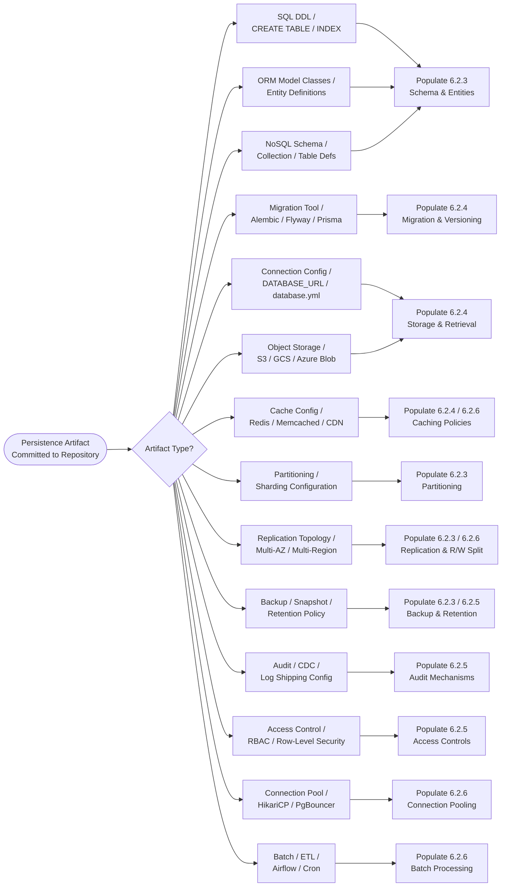
```mermaid
flowchart LR
    Commit([Persistence Artifact<br/>Committed to Repository])
    Detect{Artifact Type?}
    DdlArt[SQL DDL /<br/>CREATE TABLE / INDEX]
    OrmArt[ORM Model Classes /<br/>Entity Definitions]
    MigArt[Migration Tool /<br/>Alembic / Flyway / Prisma]
    ConnArt[Connection Config /<br/>DATABASE_URL / database.yml]
    NoSqlArt[NoSQL Schema /<br/>Collection / Table Defs]
    CacheArt[Cache Config /<br/>Redis / Memcached / CDN]
    StoreArt[Object Storage /<br/>S3 / GCS / Azure Blob]
    PartArt[Partitioning /<br/>Sharding Configuration]
    ReplArt[Replication Topology /<br/>Multi-AZ / Multi-Region]
    BkpArt[Backup / Snapshot /<br/>Retention Policy]
    AuditArt[Audit / CDC /<br/>Log Shipping Config]
    AclArt[Access Control /<br/>RBAC / Row-Level Security]
    PoolArt[Connection Pool /<br/>HikariCP / PgBouncer]
    BatchArt[Batch / ETL /<br/>Airflow / Cron]

    PopSchema[Populate 6.2.3<br/>Schema & Entities]
    PopMig[Populate 6.2.4<br/>Migration & Versioning]
    PopStore[Populate 6.2.4<br/>Storage & Retrieval]
    PopCache[Populate 6.2.4 / 6.2.6<br/>Caching Policies]
    PopPart[Populate 6.2.3<br/>Partitioning]
    PopRepl[Populate 6.2.3 / 6.2.6<br/>Replication & R/W Split]
    PopBkp[Populate 6.2.3 / 6.2.5<br/>Backup & Retention]
    PopAudit[Populate 6.2.5<br/>Audit Mechanisms]
    PopAcl[Populate 6.2.5<br/>Access Controls]
    PopPool[Populate 6.2.6<br/>Connection Pooling]
    PopBatch[Populate 6.2.6<br/>Batch Processing]

    Commit --> Detect
    Detect --> DdlArt
    Detect --> OrmArt
    Detect --> MigArt
    Detect --> ConnArt
    Detect --> NoSqlArt
    Detect --> CacheArt
    Detect --> StoreArt
    Detect --> PartArt
    Detect --> ReplArt
    Detect --> BkpArt
    Detect --> AuditArt
    Detect --> AclArt
    Detect --> PoolArt
    Detect --> BatchArt

    DdlArt --> PopSchema
    OrmArt --> PopSchema
    MigArt --> PopMig
    ConnArt --> PopStore
    NoSqlArt --> PopSchema
    CacheArt --> PopCache
    StoreArt --> PopStore
    PartArt --> PopPart
    ReplArt --> PopRepl
    BkpArt --> PopBkp
    AuditArt --> PopAudit
    AclArt --> PopAcl
    PoolArt --> PopPool
    BatchArt --> PopBatch
```

---

### 6.2.9 Summary of Database Design Determination

#### 6.2.9.1 Consolidated Determination Table

The table below consolidates the determination for each Database Design category specified by the prompt, providing a single reference point for stakeholders. The structure mirrors §2.8.1, §3.10.1, §4.7.1, §5.8.1, and §6.1.8.1.

| Database Design Category | Documented State | Empirical Basis |
|---------------------------|------------------|-----------------|
| Entity Relationships (§6.2.3) | None — zero entities | §3.6.1; §1.2.2 |
| Data Models and Structures (§6.2.3) | Not Declared | §3.6.3; §4.4.1 |
| Indexing Strategy (§6.2.3) | Not Defined | §3.6.3; §1.2.3 |
| Partitioning Approach (§6.2.3) | Not Defined | §3.6.3; §2.5.3 |
| Replication Configuration (§6.2.3) | Not Declared | §3.6.3; §6.1.5.2 |
| Backup Architecture (§6.2.3) | Not Defined | §3.6.3; §5.5.6 |
| Migration Procedures (§6.2.4) | Not Defined | §3.6.3 |
| Versioning Strategy (§6.2.4) | Not Defined | §3.6.3 |
| Archival Policies (§6.2.4) | Not Defined | §3.6; §1.3.1 |
| Data Storage and Retrieval Mechanisms (§6.2.4) | Not Defined | §3.6; §4.4.1 |
| Caching Policies (§6.2.4) | Not Declared | §5.4.4; §4.4.1 |
| Data Retention Rules (§6.2.5) | Not Defined | §1.3.1; §3.6 |
| Backup and Fault Tolerance Policies (§6.2.5) | Not Defined | §3.6.3; §5.5.6 |
| Privacy Controls (§6.2.5) | Not Declared | §1.3.1; §5.4.5 |
| Audit Mechanisms (§6.2.5) | Not Defined | §5.5.1; §5.5.2 |
| Access Controls (§6.2.5) | Not Declared | §5.5.4; §5.4.5 |
| Query Optimization Patterns (§6.2.6) | Not Defined | §3.6; §1.2.3 |
| Caching Strategy (§6.2.6) | Not Declared | §5.4.4 |
| Connection Pooling (§6.2.6) | Not Defined | §3.6; §4.4.1 |
| Read/Write Splitting (§6.2.6) | Not Defined | §3.6 |
| Batch Processing Approach (§6.2.6) | Not Defined | §3.6; §4.4.1 |
| Database Schema Diagram (ERD) (§6.2.7) | Not Authored | Cardinality prerequisites not met |
| Data Flow Diagram (§6.2.7) | Not Authored | Cardinality prerequisites not met |
| Replication Architecture Diagram (§6.2.7) | Not Authored | Cardinality prerequisites not met |
| Overall Section Applicability (§6.2.1) | Not Applicable | §6.2.1.2; Constraints C-1, C-3 |

#### 6.2.9.2 Cross-Reference Summary

This Database Design section is grounded in and consistent with the empirical determinations established earlier in the Technical Specification. The table below maps each Section 6.2 determination to its anchoring prior section, mirroring the structure used in §2.8.2, §3.10.2, §4.7.2, §5.8.2, and §6.1.8.2.

| Section 6.2 Determination | Anchoring Prior Section |
|----------------------------|--------------------------|
| No persistence layer declared (databases, caches, object stores) | §3.6.1 *Determination: No Persistence Layer Declared* |
| No data schemas, ORM models, or migration scripts present | §1.2.2 *Major System Components*; §3.6.2 |
| Data Persistence Operations confirmed as excluded capability | §1.3.2 *Excluded Capabilities (Confirmed by Absence)* |
| No state-management or transaction-boundary code | §4.4.1 *State Management* |
| No data storage solution rationale | §5.4.3 *Data Storage Solution Rationale* |
| No caching strategy justification | §5.4.4 *Caching Strategy Justification* |
| No data redundancy approach (replication, multi-AZ, snapshots) | §6.1.5.2 *Resilience Patterns Determination Table* |
| No disaster recovery procedures (RPO, RTO, backup, restore) | §5.5.6 *Disaster Recovery Procedures* |
| No performance requirements, SLOs, or SLAs to drive optimization | §1.2.3 *KPIs*; §5.5.5 *Performance Requirements and SLAs* |
| No security mechanism selection (encryption, access control) | §5.4.5 *Security Mechanism Selection* |
| No regulatory or compliance scope declared | §1.3.1 *Implementation Boundaries* |
| No authentication or authorization framework | §5.5.4 *Authentication and Authorization Framework* |
| No data flow definitions between systems | §5.2.3 *Data Flow Description* |
| Default technology stack (including MongoDB) not adopted | §3.8 *Default Technology Stack Disposition* |
| Cardinality prerequisites unmet for all required diagrams | §5.6 / §6.1.6 *Required Diagrams — Cardinality Prerequisites* |
| Evidence-only documentation pattern | §2.1.3; §2.7.2 Constraints **C-1** and **C-3** |

#### 6.2.9.3 Effective Outcome

The effective outcome of Section 6.2 is a structurally complete but content-empty Database Design framework with an explicit *Not Applicable* determination at the section level. Each prompt-specified subsection — Schema Design (entity relationships, data models, indexing, partitioning, replication, backup), Data Management (migration, versioning, archival, storage/retrieval, caching), Compliance Considerations (retention, backup/fault-tolerance, privacy, audit, access control), and Performance Optimization (query optimization, caching, connection pooling, read/write splitting, batch processing) — is preserved as a structural heading and is paired with (a) an explicit *Not Defined* / *Not Declared* / *Not Present* / *Not Applicable* / *Not Authored* determination, (b) an empirical inventory documenting the artifact categories that were searched for and confirmed absent, and (c) a cross-reference to the prior section that anchors the determination, with §3.6 *Databases & Storage* serving as the primary anchor.

In place of substantive Entity-Relationship Diagrams, Data Flow Diagrams, and Replication Architecture diagrams, three validated Mermaid meta-diagrams are included as architectural meta-artifacts for this section: §6.2.2.4 *Determination Logic for Database Design Categories* records the evaluation procedure applied to each element; §6.2.7.3 *Present vs. Absent Database Design Inventory* visually contrasts what exists in the repository against what would be required for substantive persistence documentation; and §6.2.8.2 *Reactivation Flow* enumerates the artifact-to-subsection triggers that would cause each Database Design subsection to become populatable. The three prompt-required Mermaid diagram families (database schema, data flow, replication architecture) are each individually recorded as *Not Authored* with cited cardinality prerequisites that are not met by the repository's current state. The indexes-and-constraints inventory required by the prompt is rendered explicitly in §6.2.3.3 with all counts equal to zero, anchored to §3.6.1.

This section therefore performs two roles simultaneously: (1) it accurately documents that no database engine, no schema, no migration tooling, no caching layer, no replication topology, no backup procedure, no retention policy, no audit mechanism, no access control, and no query/connection/batch optimization is presently defined in the repository, and that Database Design is consequently *not applicable* per the explicit conditional in the Section 6.2 prompt; and (2) it pre-stages the documentation surface that will receive substantive content when SQL DDL, ORM models, migration scripts, NoSQL schemas, cache configuration, object-storage SDK references, replication topology, backup scripts, retention policies, audit destinations, access-control policies, or query/pool/batch optimization artifacts are committed to the repository in a future iteration. The Reactivation Criteria in §6.2.8 specify the precise trigger artifacts that would cause each subsection to become populatable.

#### 6.2.9.4 Prompt-Derived Directives Honored

| Directive from Section 6.2 Prompt | Honored By |
|-----------------------------------|------------|
| "If the system does not require or direct database or persistent storage interactions are not clearly evident, clearly state 'Database Design is not applicable to this system' and explain why." | §6.2.1 *Applicability Determination*; nine-clause rationale table |
| Required documentation of Schema Design (entity relationships, data models, indexing, partitioning, replication, backup) | §6.2.3 — every element preserved with explicit determinations and indexes-and-constraints inventory in §6.2.3.3 |
| Required documentation of Data Management (migration, versioning, archival, storage/retrieval, caching) | §6.2.4 — every element preserved with explicit determinations |
| Required documentation of Compliance Considerations (retention, backup/fault-tolerance, privacy, audit, access control) | §6.2.5 — every element preserved with explicit determinations |
| Required documentation of Performance Optimization (query optimization, caching, connection pooling, read/write splitting, batch processing) | §6.2.6 — every element preserved with explicit determinations |
| Required Mermaid.js diagrams (database schema / ERD, data flow, replication architecture) | §6.2.7 — each diagram recorded individually with cardinality prerequisites; three meta-diagrams authored in §6.2.2.4, §6.2.7.3, §6.2.8.2 |
| "Use Markdown tables for structured data" | All structured content rendered as Markdown tables |
| "Tables should never have more than four columns" | All tables in §6.2 contain at most four columns |
| "Include ERD diagrams" | Cardinality prerequisite for ERD recorded in §6.2.7.1; substantive ERD foreclosed by zero entities (§3.6.1) |
| "Document all indexes and constraints" | §6.2.3.3 *Schema Design Indexes and Constraints Inventory* — all counts recorded as zero with empirical basis |
| Constraint **C-1** (§2.7.2): no invention, extrapolation, or projection | Honored throughout; no fabricated entity, index, partition, replica, or retention rule |
| Constraint **C-3** (§2.7.2): evidence-only documentation pattern | Honored throughout; explicit determination markers used uniformly |
| Terminology consistency with §1–§5 and §6.1 | "Not Defined," "Not Declared," "Not Present," "Not Applicable," "Not Authored," "None" used with the same semantic load as in prior sections |

---

#### References

#### Files Examined

- `README.md` — The sole content file in the repository (11 bytes; complete content: `# Artifact3`). Examined to confirm that the only documentation artifact in the repository contains no entity declarations, no schema narrative, no data-model description, no indexing or partitioning guidance, no replication or backup instructions, no retention or archival rules, no audit or access-control specification, and no query, cache, pool, or batch tuning content. Establishes the empirical basis for marking every Database Design category as *Not Defined*, *Not Declared*, *Not Present*, *Not Applicable*, or *Not Authored* and for the overarching *Not Applicable* determination at §6.2.1.

#### Folders Explored

- `/` (repository root, depth 0) — Verified to contain only `README.md` and `.git/` metadata. No subdirectories of any kind exist (no `db/`, `database/`, `schemas/`, `migrations/`, `models/`, `entities/`, `prisma/`, `data/`, `sql/`, `nosql/`, `dao/`, `repositories/`, `cache/`, `storage/`, `backup/`, `replication/`, `audit/`, `policies/`, or any other folder that would house persistence artifacts). The repository's directory tree terminates at depth 1; documented absence rather than incomplete exploration.

#### Repository Metadata Inspected

- `.git/config` — Provided the remote origin URL (`https://github.com/shalini690/Artifact3.git`) and confirmed `main` as the sole branch. No project-specific configuration that would imply a database engine, schema migration tool, or persistence connector is present.
- Git commit history — Single initial commit (`00f22b7`, "Initial commit") by `shalini690 <shalini@blitzy.io>` on May 28, 2026, adding only `README.md`. No later commits introduce DDL, ORM models, migration files, NoSQL schemas, cache configuration, object-storage references, replication topology, backup scripts, retention policies, audit destinations, or access-control rules.

#### Technical Specification Sections Cross-Referenced

- **§1.1 EXECUTIVE SUMMARY** — Established the repository as an 11-byte placeholder with a single initial commit; provided the foundational determination that no implementation, requirements, or persistence choices have been made. Anchored the overall *Not Applicable* determination at §6.2.1.
- **§1.2 SYSTEM OVERVIEW** — Provided the §1.2.1 *Integration Artifact Categories* table (every database/cache/storage connector row "Not Present"); provided the §1.2.2 *Major System Components* inventory recording "Data Schemas: SQL DDL, ORM models, migration scripts — Not Present"; provided the §1.2.3 *KPIs* statement ("No KPIs, SLOs, SLIs, or SLAs are defined") used to anchor §6.2.6 (performance optimization).
- **§1.3 SCOPE** — Confirmed *Implementation Boundaries* with no regulatory/compliance scope (§1.3.1) and *Excluded Capabilities* recording "Data Persistence Operations: No schemas, models, or migration scripts present" (§1.3.2). Used to anchor §6.2.4 and §6.2.5.
- **§2.1 PREAMBLE AND DOCUMENTATION APPROACH** — Codified the evidence-only documentation pattern and the four-step canonical procedure followed throughout this section. Provided the determination-logic flowchart precedent adapted for §6.2.2.4.
- **§2.5 IMPLEMENTATION CONSIDERATIONS** — Recorded every Non-Functional Concern artifact (Performance, Scalability, Security, Maintainability) as "Not Present." Critical anchoring for §6.2.3 (partitioning, replication, backup) and §6.2.6 (performance optimization).
- **§2.7 ASSUMPTIONS AND CONSTRAINTS** — Provided governing Constraints **C-1** (no fabrication) and **C-3** (evidence-only pattern) honored throughout this section. Provided the *Future-State Considerations* pattern adapted for §6.2.8.
- **§3.6 DATABASES & STORAGE** — **PRIMARY ANCHORING SECTION.** Provided the §3.6.1 *Determination: No Persistence Layer Declared* statement; provided the §3.6.2 *Persistence Indicator Inventory* table (every category returning "None"); provided the §3.6.3 documentation-state table recording Primary Database, Secondary Database, Data Persistence Strategy, Caching Solution, Object Storage, Backup/Replication/Retention Policy, and Data Migration/Versioning Approach as "Not Declared" or "Not Defined." Anchored every subsection of §6.2.
- **§3.8 DEFAULT TECHNOLOGY STACK DISPOSITION** — Provided the "Not Adopted" disposition for the default stack (including MongoDB), foreclosing inference of a schema or storage model from any default stack.
- **§3.9 REACTIVATION CRITERIA** — Provided trigger pattern ("SQL DDL, ORM models, migration files, database connection config → §3.6 populatable") adapted and expanded for §6.2.8.1.
- **§4.4 Technical Implementation** — Recorded every State Management category (State Transitions, Data Persistence Points, Caching Requirements, Transaction Boundaries) as "Not Present." Critical anchoring for §6.2.3 (data models), §6.2.4 (storage and retrieval mechanisms, caching policies), and §6.2.6 (connection pooling, batch processing).
- **§5.2 High-Level Architecture** — Confirmed §5.2.3 *Data Flow Description* with "Key Data Stores and Caches: Not Declared," "Data Transformation Points: Not Defined," and "Primary Data Flows: Not Defined." Anchored §6.2.6 (batch processing).
- **§5.4 Technical Decisions** — Confirmed §5.4.3 *Data Storage Solution Rationale* as "Not Declared"; §5.4.4 *Caching Strategy Justification* as "Not Declared"; §5.4.5 *Security Mechanism Selection* as "Not Selected." Anchored §6.2.4 (caching policies) and §6.2.5 (privacy controls, access controls).
- **§5.5 Cross-Cutting Concerns** — Confirmed §5.5.1 *Monitoring and Observability* and §5.5.2 *Logging and Tracing Strategy* as absent (anchoring §6.2.5 audit mechanisms); §5.5.4 *Authentication and Authorization Framework* as "Not Declared" (anchoring §6.2.5 access controls); §5.5.5 *Performance Requirements and SLAs* as "Not Defined" (anchoring §6.2.6 performance optimization); §5.5.6 *Disaster Recovery Procedures* as "Not Defined" (anchoring §6.2.3 backup architecture and §6.2.5 backup and fault tolerance policies).
- **§5.7 Reactivation Criteria for System Architecture Documentation** — Provided the per-subsection trigger table including the precise mapping "Database schema, ORM models, or persistence connector configuration → §5.2.3, §5.3.2, §5.4.3" and "Cache configuration (Redis, Memcached, CDN definitions) → §5.4.4," directly adapted for §6.2.8.
- **§6.1 Core Services Architecture** — **KEY STRUCTURAL PRECEDENT.** Provided the complete pattern for "Not Applicable" section authoring: Applicability Determination → Repository Evidence Baseline → Determination Inventory → Required Diagrams (Cardinality) → Reactivation Criteria → Summary. The structural skeleton of §6.2 directly mirrors §6.1. Additionally provided §6.1.5.2 *Resilience Patterns Determination Table* recording Data Redundancy Approach as "Not Declared," used to anchor §6.2.3 (replication configuration) and §6.2.5 (backup and fault tolerance policies).

## 6.3 Integration Architecture

### 6.3.1 Applicability Determination

#### 6.3.1.1 Decision Statement

**Integration Architecture is not applicable for this system.**

The Section 6.3 prompt explicitly provides the governing decision logic: *"If the system does not require integration with external systems or services, clearly state 'Integration Architecture is not applicable for this system' and explain why."* The `Artifact3` repository satisfies the antecedent of that conditional: it contains zero API client or server definitions, zero external service contracts, zero authentication or authorization integrations, zero message broker or event-bus bindings, zero database, cache, or storage connectors, zero identity-provider or directory-service links, zero third-party SDK references, zero API gateway configurations, and zero legacy-system adapter code. Each of these absences is independently verified in §1.2.1, §1.3.2, §3.5, §4.2.2, §5.2.4, §5.4.2, §5.4.5, §5.5.4, and §5.5.5 of this Technical Specification, with §1.2.1 *Integration Artifact Categories* and §3.5 *Third-Party Services* providing the primary anchoring determinations. §3.5.1 records the authoritative statement: *"No external API integration, authentication service, monitoring tool, or cloud service has been declared, configured, or referenced anywhere"* in the repository.

#### 6.3.1.2 Rationale Summary

The rationale that triggers the "not applicable" determination is composed of nine independent absences, each anchored to a verifying prior section. The table below consolidates the rationale into four columns consistent with the §6.1.1.2 and §6.2.1.2 precedent and the formatting constraint that tables must not exceed four columns.

| # | Absent Prerequisite for Integration Architecture | Determination | Anchoring Source |
|---|---------------------------------------------------|---------------|------------------|
| 1 | API client / server definitions (OpenAPI, gRPC, GraphQL) | Not Present | §1.2.1; §5.2.4 |
| 2 | External service contracts (SLAs, partner APIs) | Not Present | §1.2.1; §5.2.4 |
| 3 | Authentication / authorization integration | Not Declared | §5.5.4; §5.4.5; §3.5 |
| 4 | Message broker / queue / event-bus bindings | Not Present | §1.2.1; §3.5.2 |
| 5 | Database / cache / storage connectors | Not Present | §1.2.1; §3.6 |
| 6 | Identity-provider / directory-service links | Not Present | §1.2.1; §3.5.2 |
| 7 | Third-party SDKs or API client libraries | Not Declared | §3.5.1; §3.5.2 |
| 8 | API gateway / ingress / reverse-proxy configuration | Not Present | §1.2.1; §3.7 |
| 9 | Inter-component or external communication patterns | Not Declared | §5.4.2; §1.2.1 |

#### 6.3.1.3 Constraint Inheritance

The "not applicable" determination is mandated by Constraints **C-1** and **C-3** as codified in §2.7.2. Constraint **C-1** prohibits invention, extrapolation, or projection of features, requirements, or relationships beyond what the repository evidences. Constraint **C-3** mandates the evidence-only documentation pattern with explicit determination markers (*Not Defined*, *Not Declared*, *Not Present*, *Not Applicable*, *Not Authored*) in place of fabricated content. Authoring substantive API contracts, authentication flows, rate-limiting policies, message-broker topologies, event-processing pipelines, batch-processing schedules, API-gateway configurations, or third-party integration patterns for a repository that contains exactly one 11-byte `README.md` file would violate both constraints simultaneously. This determination is further reinforced by §3.8.3 *Default Technology Stack Disposition*, which records the default stack (including Auth0 for authentication, AWS for cloud services, and external API frameworks) as **Not Adopted**, foreclosing inference of an integration topology from any default stack.

---

### 6.3.2 Repository Evidence Baseline for Integration Architecture

#### 6.3.2.1 Empirical Repository State

The empirical state of the `Artifact3` repository, as established and verified in §1.1, §1.2, §1.3, §2.1, §3.1, §3.5, §4.1, §4.2, §5.1, and §5.2 of this Technical Specification, materially constrains the structure and content of this Integration Architecture section. The repository contains exactly two tracked entities: a single 11-byte `README.md` file whose complete content is the literal text `# Artifact3`, and a `.git/` directory holding version-control metadata. No OpenAPI / Swagger / RAML / API Blueprint specifications, no GraphQL schemas (`*.graphql`, `schema.graphql`), no gRPC `*.proto` files, no Protocol Buffers definitions, no JSON Schema or AsyncAPI documents, no Postman collections, no WebSocket or Server-Sent Events handlers, no webhook endpoint declarations, no OAuth / OIDC client configuration, no SAML / JWT signing keys, no API key vaults, no mTLS certificate references, no rate-limiting middleware configuration, no message-broker bindings (Kafka, RabbitMQ, NATS, SQS, Pub/Sub, ActiveMQ), no stream-processing topology (Kafka Streams, Flink, Spark Streaming), no batch-processing definitions (Airflow DAGs, cron jobs, scheduled tasks), no dead-letter-queue or retry-policy configuration, no third-party SDK references (Stripe, Twilio, SendGrid, AWS SDK, GCP client libraries), no API gateway configuration (Kong, Apigee, AWS API Gateway, NGINX, Envoy), no service-mesh integration manifests, no legacy-system adapter or facade code, and no external service contract documents (SLAs, partner agreements, vendor data dictionaries) is present in the repository.

The directory tree terminates at depth 1; no `api/`, `apis/`, `integrations/`, `events/`, `messages/`, `queues/`, `brokers/`, `streams/`, `batch/`, `contracts/`, `schemas/`, `gateway/`, `webhooks/`, `clients/`, `sdk/`, `connectors/`, `adapters/`, or any other folder that would house integration artifacts exists in the repository.

#### 6.3.2.2 Evidence Categories Required and Their Absence

An Integration Architecture section conventionally documents the system's contact surfaces with the outside world — its API protocols and contracts, its authentication and authorization integrations, its rate-limiting and versioning strategy, its message and event processing topology, its stream and batch processing pipelines, its third-party and legacy-system integrations, its API gateway and external service contracts. None of the prerequisites for such documentation is present in the repository. The table below enumerates the evidence categories required for substantive Integration Architecture content and records each as absent.

| Evidence Required for Integration Architecture | Repository Status | Verifying Section |
|------------------------------------------------|-------------------|--------------------|
| API Contracts (OpenAPI, GraphQL, gRPC, Protocol Buffers) | Not Present | §1.2.1; §5.2.4 |
| Authentication Configuration (OAuth, OIDC, SAML, JWT, API keys, mTLS) | Not Present | §5.5.4; §5.4.5 |
| Authorization Policies (RBAC, ABAC, scopes, claims, policy files) | Not Present | §5.5.4; §4.3.1 |
| Rate-Limiting Middleware / Quota Configuration | Not Present | §5.5.5; §1.2.3 |
| API Versioning Strategy (URL, header, content-negotiation) | Not Present | §1.2.1; §5.2.4 |
| Message Broker / Queue / Event-Bus Bindings | Not Present | §1.2.1; §3.5.2 |
| Stream Processing Topology (Kafka Streams, Flink, Spark) | Not Present | §1.2.1; §3.5.2 |
| Batch Processing Definitions (Airflow, cron, scheduled jobs) | Not Present | §4.2.2; §4.4.2 |
| Dead-Letter Queue / Retry / Poison Message Configuration | Not Present | §4.4.2; §5.5.3 |
| Third-Party SDK / API Client Libraries | Not Present | §3.5.1; §3.5.2 |
| API Gateway / Ingress / Reverse-Proxy Configuration | Not Present | §1.2.1; §3.7 |
| Webhook Endpoint Declarations | Not Present | §1.2.1; §4.2.2 |
| External Service Contract Documents (SLAs, partner agreements) | Not Present | §3.5.3; §5.2.4 |
| Legacy System Adapter / Facade Code | Not Present | §1.2.1; §1.3.2 |
| Identity Provider / Directory Service Integration | Not Present | §1.2.1; §5.5.4 |

#### 6.3.2.3 Documentation Approach Inherited from Prior Sections

This section follows the documentation pattern codified in §2.1.3, reiterated by §3.1.2, §4.1.2, §5.1.2, §6.1.2.3, and §6.2.2.3, and governed by Constraints **C-1** and **C-3** of §2.7.2. The pattern consists of four canonical steps applied to every conventional Integration Architecture element:

1. **Mark each conventional element with an explicit determination** — *Not Defined*, *Not Declared*, *Not Present*, *Not Applicable*, or *Not Authored*.
2. **Provide the empirical basis for each determination** with cross-references to the verifying section of the Technical Specification, with §1.2.1 *Integration Artifact Categories* and §3.5 *Third-Party Services* serving as the primary anchors.
3. **Avoid fabrication, extrapolation, or projection** of API contracts, authentication flows, rate-limiting strategies, versioning schemes, message-broker topologies, stream-processing pipelines, batch-processing schedules, third-party integrations, legacy-system interfaces, gateway configurations, or external service contracts that the repository does not evidence.
4. **Preserve the structural skeleton** of the Integration Architecture framework — API Design, Message Processing, External Systems — so that the section can be incrementally populated when integration artifacts are committed to the repository.

#### 6.3.2.4 Determination Logic for Integration Architecture Categories

The flowchart below summarizes the determination logic applied to each Integration Architecture element in this section. The diagram adapts the pattern established by §5.1.3, §6.1.2.4, and §6.2.2.4 to the integration-architecture domain.

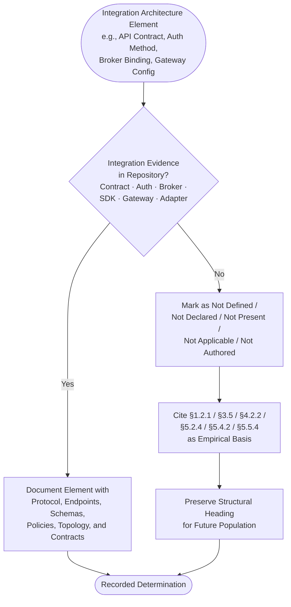
```mermaid
flowchart TB
    Start([Integration Architecture Element<br/>e.g., API Contract, Auth Method,<br/>Broker Binding, Gateway Config])
    EvidenceCheck{Integration Evidence<br/>in Repository?<br/>Contract · Auth · Broker ·<br/>SDK · Gateway · Adapter}
    Document[Document Element with<br/>Protocol, Endpoints, Schemas,<br/>Policies, Topology, and Contracts]
    MarkAbsent[Mark as Not Defined /<br/>Not Declared / Not Present /<br/>Not Applicable / Not Authored]
    CiteSource[Cite §1.2.1 / §3.5 / §4.2.2 /<br/>§5.2.4 / §5.4.2 / §5.5.4<br/>as Empirical Basis]
    PreserveSkeleton[Preserve Structural Heading<br/>for Future Population]
    Outcome([Recorded Determination])

    Start --> EvidenceCheck
    EvidenceCheck -->|Yes| Document
    EvidenceCheck -->|No| MarkAbsent
    MarkAbsent --> CiteSource
    CiteSource --> PreserveSkeleton
    Document --> Outcome
    PreserveSkeleton --> Outcome
```

---

### 6.3.3 API Design — Determination Inventory

#### 6.3.3.1 Determination Summary

The Section 6.3 prompt requires documentation of six API Design subcategories: protocol specifications, authentication methods, authorization framework, rate-limiting strategy, versioning approach, and documentation standards. Every subcategory is recorded as *Not Declared*, *Not Defined*, or *Not Present* based on the absence of any API contract, authentication configuration, authorization policy, rate-limiting middleware, versioning scheme, or API documentation artifact in the repository, as established by §1.2.1 *Integration Artifact Categories*.

#### 6.3.3.2 API Design Determination Table

| API Design Element | Determination | Anchoring Source |
|---------------------|---------------|------------------|
| Protocol Specifications (HTTP/REST, gRPC, GraphQL, WebSocket, SSE) | Not Declared | §1.2.1; §5.4.2 *Communication Pattern Choices* |
| Authentication Methods (OAuth 2.0, OIDC, SAML, API keys, JWT, mTLS) | Not Declared | §5.5.4; §5.4.5; §3.5 |
| Authorization Framework (RBAC, ABAC, scopes, claims, policy engines) | Not Declared | §5.5.4; §5.4.5; §4.3.1 |
| Rate Limiting Strategy (token bucket, leaky bucket, fixed window, quotas) | Not Defined | §1.2.3 *KPIs* (no SLOs/SLAs); §5.5.5 |
| Versioning Approach (URL path, header, content negotiation, semver) | Not Declared | §1.2.1; §5.2.4 |
| Documentation Standards (OpenAPI / Swagger, RAML, API Blueprint, Postman) | Not Present | §1.2.1; §1.2.2 |

#### 6.3.3.3 API Specification Inventory

The prompt requires use of Markdown tables for API specifications. Because no API endpoint, route, operation, or contract has been declared in the repository, the inventory of API specifications is necessarily empty. The table below explicitly records this state to satisfy the prompt's directive while honoring Constraints **C-1** and **C-3**.

| API Specification Category | Count in Repository | Empirical Basis |
|-----------------------------|---------------------|------------------|
| REST Endpoints (`GET` / `POST` / `PUT` / `PATCH` / `DELETE`) | 0 | No API contract present (§1.2.1) |
| GraphQL Queries, Mutations, Subscriptions | 0 | No GraphQL schema present (§1.2.1) |
| gRPC Service Methods | 0 | No `*.proto` files present (§1.2.1) |
| WebSocket / Server-Sent Events Channels | 0 | No real-time handlers present (§5.4.2) |
| Webhook Inbound / Outbound Endpoints | 0 | No webhook declarations present (§4.2.2) |
| Authentication Endpoints (`/login`, `/token`, `/oauth/authorize`) | 0 | No auth scheme adopted (§5.5.4) |
| Rate-Limit Buckets / Quotas | 0 | No SLOs to parameterize limits (§1.2.3) |
| Documented API Versions (v1, v2, etc.) | 0 | No API surface to version (§5.2.4) |

#### 6.3.3.4 Empirical Basis for API-Design Absence

The absence of every API Design element traces back to five foundational determinations established in prior sections:

- **No integration artifacts of any kind are present.** §1.2.1 *Integration Artifact Categories* records every integration artifact category — *API Client or Server Definitions*, *External Service Contracts (OpenAPI, GraphQL, gRPC)*, *Authentication / Authorization Integration*, *Message Broker, Queue, or Event-Bus Bindings*, *Database, Cache, or Storage Connectors*, and *Identity Provider / Directory Service Links* — as *Not Present*. Without an API surface, no protocol can be specified, no version can be assigned, and no documentation standard can be selected.
- **No communication pattern has been chosen.** §5.4.2 *Communication Pattern Choices* records the choice between synchronous request/response vs. asynchronous messaging, REST vs. gRPC vs. GraphQL, and orchestration vs. choreography as *Not Declared*. No interface descriptor language and no protocol selection is present.
- **No authentication or authorization framework is declared.** §5.5.4 *Authentication and Authorization Framework* records the framework as *Not Declared*, anchored to the absence of any identity-provider configuration, OAuth/OIDC client, JWT signing key, API key vault, RBAC policy file, or ABAC policy engine in the repository.
- **No security mechanism is selected.** §5.4.5 *Security Mechanism Selection* records the selection as *Not Selected*: no authentication scheme, no authorization model, no encryption strategy, no key management approach, and no threat model has been adopted.
- **No performance targets or SLAs exist to drive rate-limiting design.** §1.2.3 *Key Performance Indicators (KPIs)* records "No KPIs, Service-Level Objectives (SLOs), Service-Level Indicators (SLIs), or Service-Level Agreements (SLAs) are defined," and §5.5.5 *Performance Requirements and SLAs* records the same. Without quantitative throughput, latency, or fair-use targets, rate-limit bucket sizes, refill rates, burst allowances, and tier quotas cannot be parameterized.

---

### 6.3.4 Message Processing — Determination Inventory

#### 6.3.4.1 Determination Summary

The Section 6.3 prompt requires documentation of five Message Processing subcategories: event processing patterns, message queue architecture, stream processing design, batch processing flows, and error handling strategy. Every subcategory is recorded as *Not Declared*, *Not Defined*, or *Not Present* based on the absence of any message-broker binding, event topology, stream processor, batch job definition, or dead-letter / retry configuration in the repository.

#### 6.3.4.2 Message Processing Determination Table

| Message Processing Element | Determination | Anchoring Source |
|-----------------------------|---------------|------------------|
| Event Processing Patterns (event sourcing, CQRS, pub/sub, choreography) | Not Declared | §1.2.1 (Message Broker bindings Not Present); §5.4.2 |
| Message Queue Architecture (Kafka, RabbitMQ, SQS, NATS, Pub/Sub, ActiveMQ) | Not Present | §1.2.1; §3.5.2 |
| Stream Processing Design (Kafka Streams, Flink, Spark Streaming, Kinesis) | Not Declared | §1.2.1; §1.2.2 |
| Batch Processing Flows (Airflow DAGs, cron jobs, scheduled tasks, ETL) | Not Defined | §4.2.2 (Batch Processing Sequences Not Present); §4.4.2 |
| Error Handling Strategy (DLQ, retry, poison messages, idempotency) | Not Defined | §4.4.2 (all categories Not Present); §5.5.3 |

#### 6.3.4.3 Empirical Basis for Message-Processing Absence

The absence of every Message Processing element traces back to four foundational determinations:

- **No message broker or event-bus binding is present.** §1.2.1 *Integration Artifact Categories* records *Message Broker, Queue, or Event-Bus Bindings* as *Not Present*. §3.5.2 *Empirical Inventory* confirms that the Message Brokers third-party service category returns *None*. No Kafka topic, RabbitMQ exchange, SQS queue, NATS subject, Pub/Sub topic, ActiveMQ destination, or in-memory event bus is configured in any form.
- **No integration workflows are present.** §4.2.2 *Integration Workflows* records every integration workflow element as *Not Present*, including *Data Flow Between Systems*, *API Interactions*, *Event Processing Flows*, *Batch Processing Sequences*, *Identity Federation Flows*, and *Database I/O Flows*. The absence of these workflows forecloses the possibility of documenting event topologies, pub/sub patterns, batch schedules, or stream pipelines.
- **No error handling artifacts exist.** §4.4.2 *Error Handling* records every category — *Retry Mechanisms*, *Fallback Processes*, *Error Notification Flows*, *Recovery Procedures* — as *Not Present*. §5.5.3 *Error Handling Patterns* records the patterns as *Not Defined*. Dead-letter queues, retry budgets, exponential-backoff schedules, poison-message handlers, and idempotency keys therefore have no implementation surface.
- **No communication pattern has been declared.** §5.4.2 *Communication Pattern Choices* records the choice between synchronous and asynchronous messaging, point-to-point and publish/subscribe, and orchestration and choreography as *Not Declared*. Event processing patterns (event sourcing, CQRS, saga, outbox) presuppose communication-pattern decisions that the repository has not made.

---

### 6.3.5 External Systems — Determination Inventory

#### 6.3.5.1 Determination Summary

The Section 6.3 prompt requires documentation of four External Systems subcategories: third-party integration patterns, legacy system interfaces, API gateway configuration, and external service contracts. Every subcategory is recorded as *Not Declared* or *Not Present* based on the absence of any third-party SDK reference, legacy adapter code, API gateway configuration, or service contract document in the repository, as established by §3.5 *Third-Party Services* (where all eight categories return *None*).

#### 6.3.5.2 External Systems Determination Table

| External Systems Element | Determination | Anchoring Source |
|---------------------------|---------------|------------------|
| Third-Party Integration Patterns (synchronous SDK, async webhook, polling, embedded widget) | Not Declared | §3.5.1; §1.2.1; §1.3.2 |
| Legacy System Interfaces (adapter, facade, anti-corruption layer, file drop, ETL) | Not Present | §1.2.1; §1.3.2 (no upstream/downstream systems referenced) |
| API Gateway Configuration (Kong, Apigee, AWS API Gateway, NGINX, Envoy) | Not Present | §1.2.1; §3.5.2; §3.7 |
| External Service Contracts (SLAs, partner agreements, vendor data dictionaries) | Not Present | §1.2.1; §3.5.3; §5.2.4 |

#### 6.3.5.3 External Dependencies Inventory

The prompt requires documentation of all external dependencies. Because no third-party service, partner API, vendor SDK, or external dependency has been declared in the repository, the inventory of external dependencies is necessarily empty. The table below explicitly records this state, cross-referencing the §3.5.2 *Empirical Inventory* in which all eight third-party service categories return *None*.

| External Dependency Category | Count in Repository | Empirical Basis |
|-------------------------------|---------------------|------------------|
| External APIs (payment, mapping, analytics, communication) | 0 | §3.5.2 returns "None" for External APIs |
| Authentication Services (Auth0, Okta, Cognito, Firebase Auth) | 0 | §3.5.2 returns "None" for Authentication Services |
| Monitoring & Observability (Datadog, New Relic, Splunk, Sentry) | 0 | §3.5.2 returns "None" for Monitoring |
| Cloud Services (AWS, GCP, Azure managed services) | 0 | §3.5.2 returns "None" for Cloud Services |
| Message Brokers (Kafka, RabbitMQ, SQS as a service) | 0 | §3.5.2 returns "None" for Message Brokers |
| Email / SMS Providers (SendGrid, Twilio, Mailgun) | 0 | §3.5.2 returns "None" for Email/SMS |
| Payment Services (Stripe, PayPal, Braintree, Adyen) | 0 | §3.5.2 returns "None" for Payment Services |
| Identity Providers (Google, GitHub, Microsoft, custom SAML IdP) | 0 | §3.5.2 returns "None" for Identity Providers |

#### 6.3.5.4 Empirical Basis for External-Systems Absence

The absence of every External Systems element traces back to four foundational determinations:

- **No third-party services have been declared.** §3.5.1 records the authoritative determination *No Integrations Declared*, and §3.5.2 *Empirical Inventory* confirms that all eight third-party service categories return *None*. §3.5.3 records all documentation elements — External APIs, Authentication, Monitoring, Cloud, SLAs, Credentials — as *None Declared* or *Not Applicable*.
- **No upstream or downstream systems are referenced.** §1.3.2 *Integration Points Not Covered* records: *"All external integration points are not covered in the current state because none have been declared. No upstream consumers, downstream producers, third-party services, partner APIs, or internal enterprise dependencies are referenced anywhere in the repository."*
- **No external integration points exist in the architecture.** §5.2.4 *External Integration Points Table* is an empty table with the placeholder row *(None Declared)* in all columns, with the schema preserved as a reserved structural placeholder.
- **No deployment or gateway infrastructure exists.** §3.7 *Development & Deployment* confirms the absence of containerization, CI/CD, and infrastructure-as-code artifacts; consequently, no API gateway, ingress controller, reverse proxy, or service-mesh configuration is present in the repository.

---

### 6.3.6 Required Diagrams — Cardinality Prerequisites

#### 6.3.6.1 Cardinality Prerequisites Summary

The Section 6.3 prompt requires three Mermaid.js diagram families — Integration Flow Diagram, API Architecture Diagram, Message Flow Diagram — and additionally requires inclusion of sequence diagrams for key flows. Following the precedent established in §4.5 *Required Diagrams*, §5.6 *Required Diagrams — Cardinality Prerequisites Summary*, §6.1.6, and §6.2.7, each required diagram is recorded individually with its minimum cardinality prerequisite and the observed cardinality in the repository.

| Required Diagram | Minimum Cardinality | Observed Cardinality | Determination |
|------------------|---------------------|----------------------|---------------|
| Integration Flow Diagram | ≥ 1 source + ≥ 1 destination + ≥ 1 message | 0 / 0 / 0 | Not Authored |
| API Architecture Diagram | ≥ 1 API endpoint with ≥ 1 consumer | 0 / 0 | Not Authored |
| Message Flow Diagram | ≥ 1 producer + ≥ 1 broker + ≥ 1 consumer | 0 / 0 / 0 | Not Authored |
| Sequence Diagram for Key Flows | ≥ 2 participants with ≥ 1 message | 0 / 0 | Not Authored |

No substantive integration flow, API architecture, message flow, or sequence diagram can be authored without fabrication that would violate §2.7.2 Constraints **C-1** and **C-3**. The cardinality of every required element is zero, as confirmed by §1.2.1, §3.5.2, §4.2.2, §5.2.4, and §5.4.2.

#### 6.3.6.2 Meta-Diagrams Authored in Place of Substantive Diagrams

Following the precedent established by §5.1.3, §5.2.5, §6.1.2.4, §6.1.6.3, §6.1.7.2, §6.2.2.4, §6.2.7.3, and §6.2.8.2 — in which meta-diagrams that document determination logic, present-vs-absent inventory, and reactivation flow are authored in place of substantive integration diagrams — this section includes three validated Mermaid meta-diagrams: the determination logic flowchart (§6.3.2.4), the present-vs-absent integration architecture inventory (§6.3.6.3), and the reactivation flow (§6.3.7.2). These meta-diagrams preserve the diagrammatic structure required by the prompt while honoring the evidence-only documentation pattern.

#### 6.3.6.3 Present vs. Absent Integration Architecture Inventory

The diagram below visually contrasts the Integration Architecture artifacts that would be required for substantive documentation against the artifacts that are present in the repository. The pattern is adapted from §5.2.5 *Present vs. Absent Architecture Inventory*, §6.1.6.3, and §6.2.7.3.


```mermaid
graph TB
    subgraph RequiredArtifacts["Required Integration Architecture Artifacts"]
        R1[API Contracts: OpenAPI / GraphQL / gRPC]
        R2[Authentication Config: OAuth / OIDC / JWT]
        R3[Authorization Policies: RBAC / ABAC]
        R4[Rate-Limiting Middleware / Quotas]
        R5[Versioning Strategy: URL / Header / Semver]
        R6[Message Brokers: Kafka / RabbitMQ / SQS]
        R7[Stream Processors: Kafka Streams / Flink]
        R8[Batch Jobs: Airflow / Cron / Scheduled]
        R9[Dead-Letter Queues / Retry Policies]
        R10[Third-Party SDKs: Stripe / Twilio / AWS]
        R11[API Gateway: Kong / Apigee / AWS API GW]
        R12[Legacy Adapters / Facades / Anti-Corruption]
        R13[External Service Contracts / SLAs]
        R14[Identity Provider Integration]
    end

    subgraph PresentArtifacts["Present in Repository"]
        P1[README.md - 11 bytes]
    end

    subgraph AbsentCategories["Documented Absent Categories"]
        A1[All API Design Elements]
        A2[All Message Processing Elements]
        A3[All External Systems Elements]
    end

    R1 -.->|Not Present| A1
    R2 -.->|Not Declared| A1
    R3 -.->|Not Declared| A1
    R4 -.->|Not Defined| A1
    R5 -.->|Not Declared| A1
    R6 -.->|Not Present| A2
    R7 -.->|Not Declared| A2
    R8 -.->|Not Defined| A2
    R9 -.->|Not Defined| A2
    R10 -.->|Not Declared| A3
    R11 -.->|Not Present| A3
    R12 -.->|Not Present| A3
    R13 -.->|Not Present| A3
    R14 -.->|Not Present| A3
    P1 -.->|Sole Tracked Content| PresentArtifacts
```

---

### 6.3.7 Reactivation Criteria for Integration Architecture Documentation

#### 6.3.7.1 Per-Subsection Population Triggers

Consistent with §3.9 *Reactivation Criteria*, §5.7 *Reactivation Criteria for System Architecture Documentation*, §6.1.7, and §6.2.8, the table below specifies the artifacts whose commitment to the repository would cause each Integration Architecture subsection to become populatable with substantive content.

| Future-State Trigger Artifact | Subsection(s) Made Populatable |
|-------------------------------|---------------------------------|
| OpenAPI / Swagger / GraphQL schema / gRPC `*.proto` contract | §6.3.3 — protocol specifications, versioning, documentation standards |
| OAuth / OIDC client config, JWT signing keys, API keys, mTLS certs | §6.3.3 — authentication methods |
| RBAC / ABAC policy file, scope definitions, claim mappings | §6.3.3 — authorization framework |
| Rate-limiting middleware config (express-rate-limit, Kong plugin, Redis quotas) | §6.3.3 — rate limiting strategy |
| API versioning convention (URL path, `Accept` header, content negotiation) | §6.3.3 — versioning approach |
| OpenAPI / Swagger / Postman collection / RAML / API Blueprint document | §6.3.3 — documentation standards |
| Message broker config (Kafka, RabbitMQ, SQS, NATS, Pub/Sub, ActiveMQ) | §6.3.4 — message queue architecture, event processing patterns |
| Stream processor config (Kafka Streams, Flink, Spark Streaming, Kinesis) | §6.3.4 — stream processing design |
| Batch job definitions (Airflow DAGs, cron, scheduled tasks, ETL pipelines) | §6.3.4 — batch processing flows |
| Dead-letter queue / retry policy / poison-message handler configuration | §6.3.4 — error handling strategy |
| Third-party SDK config (Stripe, Twilio, SendGrid, AWS SDK, GCP libraries) | §6.3.5 — third-party integration patterns |
| API gateway config (Kong, Apigee, AWS API Gateway, NGINX, Envoy) | §6.3.5 — API gateway configuration |
| Service contract documents (SLAs, partner agreements, vendor data dictionaries) | §6.3.5 — external service contracts |
| Adapter / facade / anti-corruption layer code for legacy systems | §6.3.5 — legacy system interfaces |
| Identity provider integration (Auth0, Okta, Cognito, custom SAML IdP) | §6.3.3 — authentication; §6.3.5 — third-party integration |
| Webhook endpoint declarations (inbound and outbound) | §6.3.4 — event processing; §6.3.5 — third-party integration |

#### 6.3.7.2 Reactivation Flow

The diagram below illustrates the artifact-to-subsection trigger mapping that would cause each Integration Architecture subsection to become populatable. The pattern is adapted from §3.9.2 *Reactivation Flow*, §5.7.2 *Reactivation Flow*, §6.1.7.2, and §6.2.8.2.

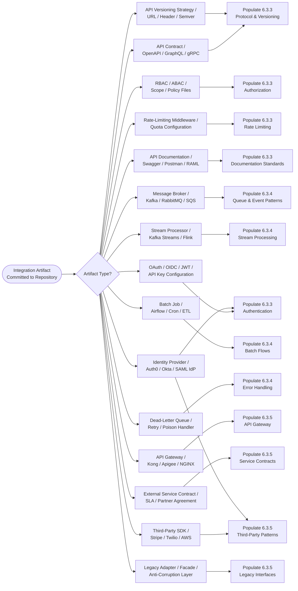
```mermaid
flowchart LR
    Commit([Integration Artifact<br/>Committed to Repository])
    Detect{Artifact Type?}
    ApiArt[API Contract /<br/>OpenAPI / GraphQL / gRPC]
    AuthArt[OAuth / OIDC / JWT /<br/>API Key Configuration]
    AuthzArt[RBAC / ABAC /<br/>Scope / Policy Files]
    RateArt[Rate-Limiting Middleware /<br/>Quota Configuration]
    VerArt[API Versioning Strategy /<br/>URL / Header / Semver]
    DocArt[API Documentation /<br/>Swagger / Postman / RAML]
    BrokerArt[Message Broker /<br/>Kafka / RabbitMQ / SQS]
    StreamArt[Stream Processor /<br/>Kafka Streams / Flink]
    BatchArt[Batch Job /<br/>Airflow / Cron / ETL]
    DlqArt[Dead-Letter Queue /<br/>Retry / Poison Handler]
    SdkArt[Third-Party SDK /<br/>Stripe / Twilio / AWS]
    GwArt[API Gateway /<br/>Kong / Apigee / NGINX]
    ContractArt[External Service Contract /<br/>SLA / Partner Agreement]
    LegacyArt[Legacy Adapter / Facade /<br/>Anti-Corruption Layer]
    IdpArt[Identity Provider /<br/>Auth0 / Okta / SAML IdP]

    PopProto[Populate 6.3.3<br/>Protocol & Versioning]
    PopAuthN[Populate 6.3.3<br/>Authentication]
    PopAuthZ[Populate 6.3.3<br/>Authorization]
    PopRate[Populate 6.3.3<br/>Rate Limiting]
    PopDoc[Populate 6.3.3<br/>Documentation Standards]
    PopBroker[Populate 6.3.4<br/>Queue & Event Patterns]
    PopStream[Populate 6.3.4<br/>Stream Processing]
    PopBatch[Populate 6.3.4<br/>Batch Flows]
    PopErr[Populate 6.3.4<br/>Error Handling]
    PopTp[Populate 6.3.5<br/>Third-Party Patterns]
    PopGw[Populate 6.3.5<br/>API Gateway]
    PopContract[Populate 6.3.5<br/>Service Contracts]
    PopLegacy[Populate 6.3.5<br/>Legacy Interfaces]

    Commit --> Detect
    Detect --> ApiArt
    Detect --> AuthArt
    Detect --> AuthzArt
    Detect --> RateArt
    Detect --> VerArt
    Detect --> DocArt
    Detect --> BrokerArt
    Detect --> StreamArt
    Detect --> BatchArt
    Detect --> DlqArt
    Detect --> SdkArt
    Detect --> GwArt
    Detect --> ContractArt
    Detect --> LegacyArt
    Detect --> IdpArt

    ApiArt --> PopProto
    AuthArt --> PopAuthN
    AuthzArt --> PopAuthZ
    RateArt --> PopRate
    VerArt --> PopProto
    DocArt --> PopDoc
    BrokerArt --> PopBroker
    StreamArt --> PopStream
    BatchArt --> PopBatch
    DlqArt --> PopErr
    SdkArt --> PopTp
    GwArt --> PopGw
    ContractArt --> PopContract
    LegacyArt --> PopLegacy
    IdpArt --> PopAuthN
    IdpArt --> PopTp
```

---

### 6.3.8 Summary of Integration Architecture Determination

#### 6.3.8.1 Consolidated Determination Table

The table below consolidates the determination for each Integration Architecture category specified by the prompt, providing a single reference point for stakeholders. The structure mirrors §2.8.1, §3.10.1, §4.7.1, §5.8.1, §6.1.8.1, and §6.2.9.1.

| Integration Architecture Category | Documented State | Empirical Basis |
|------------------------------------|------------------|-----------------|
| Protocol Specifications (§6.3.3) | Not Declared | §1.2.1; §5.4.2 |
| Authentication Methods (§6.3.3) | Not Declared | §5.5.4; §5.4.5 |
| Authorization Framework (§6.3.3) | Not Declared | §5.5.4; §4.3.1 |
| Rate Limiting Strategy (§6.3.3) | Not Defined | §1.2.3; §5.5.5 |
| Versioning Approach (§6.3.3) | Not Declared | §1.2.1; §5.2.4 |
| Documentation Standards (§6.3.3) | Not Present | §1.2.1; §1.2.2 |
| Event Processing Patterns (§6.3.4) | Not Declared | §1.2.1; §5.4.2 |
| Message Queue Architecture (§6.3.4) | Not Present | §1.2.1; §3.5.2 |
| Stream Processing Design (§6.3.4) | Not Declared | §1.2.1; §1.2.2 |
| Batch Processing Flows (§6.3.4) | Not Defined | §4.2.2; §4.4.2 |
| Error Handling Strategy (§6.3.4) | Not Defined | §4.4.2; §5.5.3 |
| Third-Party Integration Patterns (§6.3.5) | Not Declared | §3.5.1; §1.3.2 |
| Legacy System Interfaces (§6.3.5) | Not Present | §1.2.1; §1.3.2 |
| API Gateway Configuration (§6.3.5) | Not Present | §1.2.1; §3.7 |
| External Service Contracts (§6.3.5) | Not Present | §1.2.1; §3.5.3; §5.2.4 |
| Integration Flow Diagram (§6.3.6) | Not Authored | Cardinality prerequisites not met |
| API Architecture Diagram (§6.3.6) | Not Authored | Cardinality prerequisites not met |
| Message Flow Diagram (§6.3.6) | Not Authored | Cardinality prerequisites not met |
| Sequence Diagram for Key Flows (§6.3.6) | Not Authored | Cardinality prerequisites not met |
| Overall Section Applicability (§6.3.1) | Not Applicable | §6.3.1.2; Constraints C-1, C-3 |

#### 6.3.8.2 Cross-Reference Summary

This Integration Architecture section is grounded in and consistent with the empirical determinations established earlier in the Technical Specification. The table below maps each Section 6.3 determination to its anchoring prior section, mirroring the structure used in §2.8.2, §3.10.2, §4.7.2, §5.8.2, §6.1.8.2, and §6.2.9.2.

| Section 6.3 Determination | Anchoring Prior Section |
|----------------------------|--------------------------|
| All six Integration Artifact Categories marked Not Present | §1.2.1 *Integration Artifact Categories* |
| Essential Integrations not specified | §1.3.1 *Implementation Boundaries* |
| Integration Points Not Covered (no upstream/downstream systems) | §1.3.2 *Integration Points Not Covered* |
| No third-party services declared (all 8 categories return None) | §3.5.1; §3.5.2 *Empirical Inventory* |
| No external API documentation, auth, monitoring, cloud, SLAs | §3.5.3 |
| Default technology stack (Auth0, AWS, etc.) Not Adopted | §3.8.3 *Default Technology Stack Disposition* |
| No integration workflows (data flow, API, event, batch, federation, DB I/O) | §4.2.2 *Integration Workflows* |
| No authorization checkpoints defined | §4.3.1 *Flowchart Requirements* |
| No error-handling artifacts (retry, fallback, notification, recovery) | §4.4.2 *Error Handling* |
| External Integration Points Table empty | §5.2.4 |
| No communication patterns declared (sync/async, REST/gRPC/GraphQL) | §5.4.2 *Communication Pattern Choices* |
| No security mechanism selected (auth, authz, encryption, key mgmt) | §5.4.5 *Security Mechanism Selection* |
| No error handling patterns defined | §5.5.3 *Error Handling Patterns* |
| No authentication or authorization framework declared | §5.5.4 *Authentication and Authorization Framework* |
| No performance requirements or SLAs (to inform rate limiting) | §5.5.5 *Performance Requirements and SLAs* |
| Cardinality prerequisites unmet for all required diagrams | §5.6 / §6.1.6 / §6.2.7 *Cardinality Prerequisites* |
| Evidence-only documentation pattern | §2.1.3; §2.7.2 Constraints **C-1** and **C-3** |

#### 6.3.8.3 Effective Outcome

The effective outcome of Section 6.3 is a structurally complete but content-empty Integration Architecture framework with an explicit *Not Applicable* determination at the section level. Each prompt-specified subsection — API Design (protocol specifications, authentication methods, authorization framework, rate limiting, versioning, documentation standards), Message Processing (event processing patterns, message queue architecture, stream processing, batch processing, error handling), and External Systems (third-party integration patterns, legacy system interfaces, API gateway configuration, external service contracts) — is preserved as a structural heading and is paired with (a) an explicit *Not Defined* / *Not Declared* / *Not Present* / *Not Applicable* / *Not Authored* determination, (b) an empirical inventory documenting the artifact categories that were searched for and confirmed absent, and (c) a cross-reference to the prior section that anchors the determination, with §1.2.1 *Integration Artifact Categories* and §3.5 *Third-Party Services* serving as the primary anchors.

In place of substantive Integration Flow, API Architecture, Message Flow, and sequence diagrams, three validated Mermaid meta-diagrams are included as architectural meta-artifacts for this section: §6.3.2.4 *Determination Logic for Integration Architecture Categories* records the evaluation procedure applied to each element; §6.3.6.3 *Present vs. Absent Integration Architecture Inventory* visually contrasts what exists in the repository against what would be required for substantive integration documentation; and §6.3.7.2 *Reactivation Flow* enumerates the artifact-to-subsection triggers that would cause each Integration Architecture subsection to become populatable. The four prompt-required diagram families (integration flow, API architecture, message flow, sequence diagrams for key flows) are each individually recorded as *Not Authored* with cited cardinality prerequisites that are not met by the repository's current state. The API specification inventory required by the prompt is rendered explicitly in §6.3.3.3 with all counts equal to zero, anchored to §1.2.1, and the external dependencies inventory is rendered explicitly in §6.3.5.3 with all counts equal to zero, anchored to §3.5.2.

This section therefore performs two roles simultaneously: (1) it accurately documents that no API contract, no authentication scheme, no authorization framework, no rate-limiting strategy, no versioning approach, no API documentation, no message broker, no event topology, no stream processor, no batch job, no error-handling configuration, no third-party SDK, no legacy adapter, no API gateway, no service contract, and no identity-provider integration is presently defined in the repository, and that Integration Architecture is consequently *not applicable* per the explicit conditional in the Section 6.3 prompt; and (2) it pre-stages the documentation surface that will receive substantive content when API contracts (OpenAPI / GraphQL / gRPC), authentication and authorization configurations, rate-limiting middleware, message broker bindings, stream processors, batch jobs, dead-letter / retry policies, third-party SDKs, API gateway configurations, service contracts, legacy adapters, or identity-provider integrations are committed to the repository in a future iteration. The Reactivation Criteria in §6.3.7 specify the precise trigger artifacts that would cause each subsection to become populatable.

#### 6.3.8.4 Prompt-Derived Directives Honored

| Directive from Section 6.3 Prompt | Honored By |
|-----------------------------------|------------|
| "If the system does not require integration with external systems or services, clearly state 'Integration Architecture is not applicable for this system' and explain why." | §6.3.1 *Applicability Determination*; nine-clause rationale table |
| Required documentation of API Design (protocol, AuthN, AuthZ, rate limiting, versioning, docs) | §6.3.3 — every element preserved with explicit determinations and API specification inventory in §6.3.3.3 |
| Required documentation of Message Processing (event patterns, queues, streams, batch, error handling) | §6.3.4 — every element preserved with explicit determinations |
| Required documentation of External Systems (third-party, legacy, gateway, contracts) | §6.3.5 — every element preserved with explicit determinations and external dependencies inventory in §6.3.5.3 |
| Required Mermaid.js diagrams (Integration Flow, API Architecture, Message Flow) | §6.3.6 — each diagram recorded individually with cardinality prerequisites; three meta-diagrams authored in §6.3.2.4, §6.3.6.3, §6.3.7.2 |
| "Include sequence diagrams for key flows" | §6.3.6.1 — recorded as Not Authored with cardinality prerequisite (≥ 2 participants, ≥ 1 message) not met |
| "Document all external dependencies" | §6.3.5.3 *External Dependencies Inventory* — all categories enumerated, all counts zero; cross-references §3.5.2 |
| "Use Markdown tables for API specifications" | §6.3.3.3 *API Specification Inventory* and all structured content rendered as Markdown tables |
| "Tables should never have more than four columns" | All tables in §6.3 contain at most four columns |
| Constraint **C-1** (§2.7.2): no invention, extrapolation, or projection | Honored throughout; no fabricated API, auth scheme, broker topology, gateway, or service contract |
| Constraint **C-3** (§2.7.2): evidence-only documentation pattern | Honored throughout; explicit determination markers used uniformly |
| Terminology consistency with §1–§5, §6.1, and §6.2 | "Not Defined," "Not Declared," "Not Present," "Not Applicable," "Not Authored," "None Declared," "None Documented" used with the same semantic load as in prior sections |

---

#### References

#### Files Examined

- `README.md` — The sole content file in the repository (11 bytes; complete content: `# Artifact3`). Examined to confirm that the only documentation artifact in the repository contains no API narrative, no protocol declarations, no authentication or authorization mentions, no rate-limiting guidance, no versioning policy, no API documentation standard, no message-processing description, no event topology, no stream or batch pipeline, no error-handling strategy, no third-party integration, no legacy adapter, no API gateway configuration, and no external service contract. Establishes the empirical basis for marking every Integration Architecture category as *Not Defined*, *Not Declared*, *Not Present*, *Not Applicable*, or *Not Authored* and for the overarching *Not Applicable* determination at §6.3.1.

#### Folders Explored

- `/` (repository root, depth 0) — Verified to contain only `README.md` and `.git/` metadata. No subdirectories of any kind exist (no `api/`, `apis/`, `integrations/`, `events/`, `messages/`, `queues/`, `brokers/`, `streams/`, `batch/`, `contracts/`, `schemas/`, `gateway/`, `webhooks/`, `clients/`, `sdk/`, `connectors/`, `adapters/`, `auth/`, `oauth/`, `oidc/`, `idp/`, `policies/`, `proto/`, `graphql/`, or any other folder that would house integration artifacts). The repository's directory tree terminates at depth 1; documented absence rather than incomplete exploration.

#### Repository Metadata Inspected

- `.git/config` — Provided the remote origin URL (`https://github.com/shalini690/Artifact3.git`) and confirmed `main` as the sole branch. No project-specific configuration that would imply an API surface, authentication integration, message broker, gateway, or third-party SDK is present.
- Git commit history — Single initial commit (`00f22b7`, "Initial commit") by `shalini690 <shalini@blitzy.io>` on May 28, 2026, adding only `README.md`. No later commits introduce API contracts, authentication or authorization configuration, rate-limiting middleware, message-broker bindings, stream or batch pipelines, third-party SDKs, API gateway configuration, legacy adapters, or external service contracts.

#### Technical Specification Sections Cross-Referenced

- **§1.1 EXECUTIVE SUMMARY** — Established the repository as an 11-byte placeholder with a single initial commit; provided the foundational determination that no implementation, requirements, or integration choices have been made. Anchored the overall *Not Applicable* determination at §6.3.1.
- **§1.2 SYSTEM OVERVIEW** — **PRIMARY ANCHORING SECTION.** Provided the §1.2.1 *Integration Artifact Categories* table (all six rows *Not Present* — API definitions, external service contracts, authentication/authorization integration, message broker bindings, database/cache/storage connectors, identity provider links); provided the §1.2.2 *Major System Components* inventory used to anchor §6.3.3 (documentation standards); provided the §1.2.3 *KPIs* statement ("No KPIs, SLOs, SLIs, or SLAs are defined") used to anchor §6.3.3 (rate limiting strategy).
- **§1.3 SCOPE** — §1.3.1 *Implementation Boundaries* confirmed Essential Integrations as *Not Specified*; §1.3.2 *Integration Points Not Covered* confirmed no upstream consumers, downstream producers, third-party services, partner APIs, or internal enterprise dependencies are referenced anywhere in the repository. Used to anchor §6.3.5.
- **§2.1 PREAMBLE AND DOCUMENTATION APPROACH** — Codified the evidence-only documentation pattern and the four-step canonical procedure followed throughout this section. Provided the determination-logic flowchart precedent adapted for §6.3.2.4.
- **§2.5 IMPLEMENTATION CONSIDERATIONS** — Recorded every Non-Functional Concern artifact (Performance, Scalability, Security, Maintainability) as *Not Present*. Critical anchoring for §6.3.3 (rate limiting), §6.3.4 (error handling), and §6.3.5 (gateway).
- **§2.7 ASSUMPTIONS AND CONSTRAINTS** — Provided governing Constraints **C-1** (no fabrication) and **C-3** (evidence-only pattern) honored throughout this section. Provided the *Future-State Considerations* pattern adapted for §6.3.7.
- **§3.3 FRAMEWORKS & LIBRARIES** — Confirmed Runtime/Framework Selection *Not Declared*; no API frameworks (Flask, Django, Express, Spring, FastAPI) present. Anchored §6.3.3 (protocol specifications, documentation standards).
- **§3.5 THIRD-PARTY SERVICES** — **PRIMARY ANCHORING SECTION.** Provided the §3.5.1 *No Integrations Declared* determination; the §3.5.2 *Empirical Inventory* in which all eight third-party service categories (External APIs, Authentication Services, Monitoring & Observability, Cloud Services, Message Brokers, Email/SMS, Payment Services, Identity Providers) return *None*; and the §3.5.3 documentation-state table recording External APIs, Authentication, Monitoring, Cloud, SLAs, and Credentials as *None Declared* or *Not Applicable*. Anchored every subsection of §6.3.
- **§3.6 DATABASES & STORAGE** — Confirmed *No Persistence Layer Declared*; no database connectors, cache clients, or storage SDKs present. Anchored §6.3.5 (no storage-tier integration).
- **§3.7 DEVELOPMENT & DEPLOYMENT** — Confirmed absence of containerization, CI/CD, and infrastructure-as-code artifacts. Used to anchor §6.3.5 (API gateway configuration).
- **§3.8 DEFAULT TECHNOLOGY STACK DISPOSITION** — Provided the *Not Adopted* disposition for the default stack (including Auth0, AWS, MongoDB, Flask), foreclosing inference of an integration topology from any default stack.
- **§3.9 REACTIVATION CRITERIA** — Provided reactivation-flow pattern adapted for §6.3.7.2.
- **§4.2 System Workflows** — §4.2.2 *Integration Workflows* confirmed every workflow element (*Data Flow Between Systems*, *API Interactions*, *Event Processing Flows*, *Batch Processing Sequences*, *Identity Federation Flows*, *Database I/O Flows*) as *Not Present*. Critical anchoring for §6.3.4 (event processing, batch processing) and §6.3.5 (legacy interfaces).
- **§4.3 Flowchart Requirements** — §4.3.1 confirmed *Authorization Checkpoints* as *Not Defined*. Anchored §6.3.3 (authorization framework).
- **§4.4 Technical Implementation** — §4.4.2 *Error Handling* recorded all categories (*Retry Mechanisms*, *Fallback Processes*, *Error Notification Flows*, *Recovery Procedures*) as *Not Present*. Critical anchoring for §6.3.4 (error handling strategy).
- **§5.1 Repository Evidence Baseline for System Architecture** — Provided the inherited evidence-baseline pattern (§5.1.1) and documentation-approach pattern (§5.1.2) directly mirrored by §6.3.2.
- **§5.2 High-Level Architecture** — §5.2.4 *External Integration Points Table* confirmed empty with placeholder row *(None Declared)* in all columns. Anchored §6.3.5 (external service contracts).
- **§5.4 Technical Decisions** — §5.4.2 *Communication Pattern Choices* confirmed *Not Declared*; §5.4.5 *Security Mechanism Selection* confirmed *Not Selected*. Critical anchoring for §6.3.3 (protocol, authentication, authorization) and §6.3.4 (event processing patterns).
- **§5.5 Cross-Cutting Concerns** — §5.5.3 *Error Handling Patterns* confirmed *Not Defined*; §5.5.4 *Authentication and Authorization Framework* confirmed *Not Declared*; §5.5.5 *Performance Requirements and SLAs* confirmed *Not Defined*. Critical anchoring for §6.3.3 (auth, rate limiting) and §6.3.4 (error handling strategy).
- **§5.6 Required Diagrams — Cardinality Prerequisites Summary** — Provided the cardinality-prerequisite pattern for unbuildable diagrams reused in §6.3.6.
- **§5.7 Reactivation Criteria for System Architecture Documentation** — Provided the per-subsection trigger table and *Reactivation Flow* Mermaid pattern adapted for §6.3.7.
- **§5.8 Summary of System Architecture Determination** — Provided the closing *Consolidated Determination Table* / *Cross-Reference Summary* / *Effective Outcome* / *Prompt-Derived Directives Honored* / *References* structure directly mirrored by §6.3.8.
- **§6.1 Core Services Architecture** — **KEY STRUCTURAL PRECEDENT.** Provided the complete eight-part pattern for "Not Applicable" section authoring: Applicability Determination → Repository Evidence Baseline → Determination Inventories → Required Diagrams (Cardinality) → Reactivation Criteria → Summary. The structural skeleton of §6.3 directly mirrors §6.1.
- **§6.2 Database Design** — **KEY STRUCTURAL PRECEDENT.** Provided the same eight-part pattern with applicability determination, rationale table, evidence baseline, determination inventories, cardinality prerequisites, reactivation criteria, and summary. Additionally provided the precedent of explicit category-count inventories (zero indexes, zero constraints) directly adapted for §6.3.3.3 (zero API specifications) and §6.3.5.3 (zero external dependencies).

## 6.4 Security Architecture

### 6.4.1 Applicability Determination

#### 6.4.1.1 Decision Statement

**Detailed Security Architecture is not applicable for this system.**

The Section 6.4 prompt explicitly provides the governing decision logic: *"If the system does not require specific security considerations beyond standard practices, clearly state 'Detailed Security Architecture is not applicable for this system' and explain which standard security practices will be followed instead."* The `Artifact3` repository satisfies the antecedent of that conditional: it contains zero identity-provider configurations, zero multi-factor authentication settings, zero session-management strategies, zero token-handling implementations, zero password policies, zero role-based or attribute-based access control policies, zero permission catalogs, zero resource-authorization rules, zero policy-enforcement points, zero audit-logging destinations, zero encryption configurations, zero key-management systems, zero data-masking rules, zero transport-layer-security artifacts, and zero compliance-control declarations. Each of these absences is independently verified in §1.2.1, §1.3.1, §1.3.2, §2.5.3, §3.5, §4.2.2, §4.3.1, §4.3.2, §5.4.5, and §5.5.4 of this Technical Specification, with §5.4.5 *Security Mechanism Selection* (recorded as **Not Selected**) and §5.5.4 *Authentication and Authorization Framework* (recorded as **Not Declared**) serving as the two primary anchoring determinations.

#### 6.4.1.2 Rationale Summary

The rationale that triggers the "not applicable" determination is composed of nine independent absences, each anchored to a verifying prior section. The table below consolidates the rationale into four columns consistent with the §6.1.1.2, §6.2.1.2, and §6.3.1.2 precedent and the prompt's formatting constraint that tables must not exceed four columns.

| # | Absent Prerequisite for Security Architecture | Determination | Anchoring Source |
|---|------------------------------------------------|---------------|-------------------|
| 1 | Authentication / Authorization Integration | Not Present | §1.2.1; §5.5.4 |
| 2 | Identity Provider / Directory Service Links | Not Present | §1.2.1; §3.5.2 |
| 3 | Authentication scheme, authorization model, encryption strategy, key management | Not Selected | §5.4.5 *Security Mechanism Selection* |
| 4 | Authentication and Authorization Framework | Not Declared | §5.5.4 *Authentication and Authorization Framework* |
| 5 | Authorization Checkpoints in workflows | Not Defined | §4.3.1 *Workflow Element Determination* |
| 6 | Regulatory Compliance Checks | Not Defined | §4.3.2 *Validation Rule Determination* |
| 7 | Security artifact (threat model, control catalog) | Not Present | §2.5.3 *Non-Functional Concern Determination* |
| 8 | Regulatory / Compliance Scope | None Documented | §1.3.1 *Implementation Boundaries* |
| 9 | Identity Federation Flows / Integration Workflows | Not Present | §4.2.2 *Integration Workflows* |

#### 6.4.1.3 Constraint Inheritance

The "not applicable" determination is mandated by Constraints **C-1** and **C-3** as codified in §2.7.2. Constraint **C-1** prohibits invention, extrapolation, or projection of features, requirements, or relationships beyond what the repository evidences. Constraint **C-3** mandates the evidence-only documentation pattern with explicit determination markers (*Not Defined*, *Not Declared*, *Not Present*, *Not Applicable*, *Not Authored*, *Not Selected*) in place of fabricated content. Authoring substantive authentication flows, identity-provider integrations, session-management strategies, token-handling implementations, password policies, RBAC/ABAC policies, permission catalogs, audit-logging destinations, encryption standards, key-management systems, data-masking rules, TLS/mTLS configurations, or compliance-control mappings for a repository that contains exactly one 11-byte `README.md` file would violate both constraints simultaneously. This determination is further reinforced by §3.8.3 *Default Technology Stack Disposition*, which records the default stack — including Auth0 as the Authentication layer and AWS as the Cloud Platform layer that would otherwise provide KMS, IAM, Cognito, and CloudTrail — as **Not Adopted**, foreclosing inference of any security topology from any default stack.

#### 6.4.1.4 Platform-Inherited Baseline Practices (Qualified)

The Section 6.4 prompt invites enumeration of "standard security practices [that] will be followed instead" when a substantive Security Architecture is not applicable. No application-level security practices have been declared, configured, or referenced in the `Artifact3` repository. The only security properties currently exhibited by the project derive from its hosting platform and version-control system, not from any application-level decision recorded in the repository. To honor the prompt's clause while strictly observing Constraints **C-1** and **C-3**, these properties are enumerated below and explicitly qualified as **platform-derived rather than application-level**.

| Inherited Baseline Property | Source / Layer | Qualification |
|-------------------------------|----------------|----------------|
| HTTPS / TLS for repository clone, fetch, push | GitHub platform (`https://github.com/shalini690/Artifact3.git`) | Not configured by the project; not an application-level control |
| Git SSH key authentication for push access | GitHub platform / Git protocol | Not configured by the project; not an application-level control |
| Commit integrity via SHA-1 cryptographic hash | Git version-control system (commit `00f22b7`) | Inherent to Git; not an application-level control |
| Author attribution metadata | Git commit headers (`shalini690 <shalini@blitzy.io>`, May 28, 2026) | Inherent to Git; not an application-level identity assertion |

These properties are recorded for completeness and explicitly do **not** constitute an authentication framework, authorization system, data-protection plan, audit-logging configuration, or compliance-control set for the system itself. No application-level standard security practice has been adopted in the repository.

---

### 6.4.2 Repository Evidence Baseline for Security Architecture

#### 6.4.2.1 Empirical Repository State

The empirical state of the `Artifact3` repository, as established and verified in §1.1, §1.2, §1.3, §2.1, §3.1, §3.5, §4.1, §4.2, §5.1, §5.4, and §5.5 of this Technical Specification, materially constrains the structure and content of this Security Architecture section. The repository contains exactly two tracked entities: a single 11-byte `README.md` file whose complete content is the literal text `# Artifact3`, and a `.git/` directory holding version-control metadata. No OAuth / OIDC client configuration (Auth0, Okta, Cognito, Keycloak, Azure AD, Google Identity), no SAML metadata or identity-provider trust configuration, no LDAP / Active Directory binding configuration, no SCIM provisioning configuration, no JWT signing keys or token-verification library configuration, no PASETO or Macaroon token configuration, no API key vault or rotation policy, no mTLS client certificate or trust-store configuration, no password-hashing library configuration (bcrypt, argon2, scrypt, PBKDF2), no password policy file or strength-validation ruleset, no session-store configuration (Redis sessions, signed cookies, server-side session table), no MFA configuration (TOTP, WebAuthn / FIDO2, SMS / voice provider, push-notification provider), no RBAC policy file (role definitions, permission catalog, role-to-user assignments), no ABAC / OPA / Cedar / XACML policy bundle, no policy-decision-point or policy-enforcement-point middleware configuration, no API gateway authorization rules, no audit-log destination configuration (CloudTrail, Splunk, Elastic, syslog, SIEM forwarder), no encryption-at-rest configuration (AWS KMS / GCP KMS / Azure Key Vault customer-master-key, envelope encryption, transparent database encryption), no encryption-in-transit configuration (TLS certificates, cipher-suite allowlists, HSTS headers, TLS termination), no field-level encryption or column-level encryption library reference, no key-management system configuration (HashiCorp Vault, AWS KMS, Azure Key Vault, Google Cloud KMS), no key-rotation schedule or key-ceremony documentation, no data-masking or tokenization library configuration, no compliance-framework declaration (GDPR, HIPAA, PCI-DSS, SOC 2, ISO 27001, FedRAMP, CCPA), and no threat-model document (STRIDE, PASTA, DREAD, attack-tree) is present in the repository.

The directory tree terminates at depth 1; no `security/`, `auth/`, `authn/`, `authz/`, `oauth/`, `oidc/`, `idp/`, `iam/`, `rbac/`, `abac/`, `policies/`, `keys/`, `secrets/`, `certificates/`, `certs/`, `tls/`, `crypto/`, `encryption/`, `vault/`, `kms/`, `audit/`, `logs/`, `siem/`, `compliance/`, `threats/`, `threat-model/`, or any other folder that would house security artifacts exists in the repository.

#### 6.4.2.2 Evidence Categories Required and Their Absence

A Security Architecture section conventionally documents the system's identity, access, and data-protection contact surface — its authentication framework (identity management, MFA, session management, token handling, password policies), its authorization system (RBAC, permission management, resource authorization, policy enforcement points, audit logging), and its data-protection scheme (encryption standards, key management, data-masking rules, secure communication, compliance controls). None of the prerequisites for such documentation is present in the repository. The table below enumerates the evidence categories required for substantive Security Architecture content and records each as absent.

| Evidence Required for Security Architecture | Repository Status | Verifying Section |
|----------------------------------------------|-------------------|--------------------|
| Identity Provider Configuration (OAuth / OIDC / SAML / LDAP) | Not Present | §1.2.1; §3.5.2; §5.5.4 |
| Multi-Factor Authentication Configuration (TOTP / WebAuthn / SMS) | Not Present | §5.5.4; §3.5.2 |
| Session Management Strategy (Redis / cookies / JWT lifetime) | Not Present | §5.5.4; §4.4.1 |
| Token Verification Library / Signing Keys (JWT / PASETO) | Not Present | §5.5.4; §5.4.5 |
| Password Policy File / Hashing Library (bcrypt / argon2) | Not Present | §5.5.4; §3.3 |
| RBAC / ABAC Policy Files (roles, permissions, scopes, claims) | Not Present | §5.5.4; §5.4.5; §4.3.1 |
| Policy Engine Configuration (OPA / Cedar / XACML) | Not Present | §5.5.4; §1.2.1 |
| Policy Enforcement Point (middleware / API gateway rules) | Not Present | §1.2.1; §3.7 |
| Audit Logging Destination (SIEM / log aggregator / CloudTrail) | Not Present | §5.5.1; §5.5.2; §1.3.2 |
| TLS / mTLS Certificate Configuration | Not Present | §1.2.1; §3.7 |
| Encryption-at-Rest Configuration (KMS / CMK / envelope) | Not Present | §5.4.5; §3.6 |
| Key Management System Configuration (Vault / KMS / Key Vault) | Not Present | §5.4.5; §3.5.3 |
| Data Masking / Tokenization Library Configuration | Not Present | §3.6; §1.3.1 |
| Compliance Framework Declaration (GDPR / HIPAA / PCI / SOC 2) | Not Present | §1.3.1; §4.3.2 |
| Threat Model Document (STRIDE / PASTA / Attack Tree) | Not Present | §2.5.3 *Security artifact* |

#### 6.4.2.3 Documentation Approach Inherited from Prior Sections

This section follows the documentation pattern codified in §2.1.3, reiterated by §3.1.2, §4.1.2, §5.1.2, §6.1.2.3, §6.2.2.3, and §6.3.2.3, and governed by Constraints **C-1** and **C-3** of §2.7.2. The pattern consists of four canonical steps applied to every conventional Security Architecture element:

1. **Mark each conventional element with an explicit determination** — *Not Defined*, *Not Declared*, *Not Present*, *Not Applicable*, *Not Authored*, or *Not Selected*.
2. **Provide the empirical basis for each determination** with cross-references to the verifying section of the Technical Specification, with §5.4.5 *Security Mechanism Selection* and §5.5.4 *Authentication and Authorization Framework* serving as the two primary anchors.
3. **Avoid fabrication, extrapolation, or projection** of authentication schemes, authorization policies, encryption algorithms, key-management systems, data-masking rules, transport-security configurations, audit-logging destinations, or compliance-framework mappings that the repository does not evidence.
4. **Preserve the structural skeleton** of the Security Architecture framework — Authentication Framework, Authorization System, Data Protection — so that the section can be incrementally populated when security artifacts are committed to the repository.

#### 6.4.2.4 Determination Logic for Security Architecture Categories

The flowchart below summarizes the determination logic applied to each Security Architecture element in this section. The diagram adapts the pattern established by §5.1.3, §6.1.2.4, §6.2.2.4, and §6.3.2.4 to the security-architecture domain.

```mermaid
flowchart TB
    Start([Security Architecture Element<br/>e.g., AuthN Scheme, AuthZ Policy,<br/>Encryption Algorithm, KMS,<br/>Audit Destination, Compliance Control])
    EvidenceCheck{Security Evidence<br/>in Repository?<br/>IdP · Token · MFA · RBAC ·<br/>Policy · Crypto · TLS · Audit}
    Document[Document Element with<br/>Protocol, Issuer, Scopes, Roles,<br/>Algorithms, Keys, Controls,<br/>Compliance Mapping]
    MarkAbsent[Mark as Not Defined /<br/>Not Declared / Not Present /<br/>Not Applicable / Not Authored /<br/>Not Selected]
    CiteSource[Cite §1.2.1 / §1.3.1 / §1.3.2 /<br/>§2.5.3 / §3.5 / §4.3.1 / §4.3.2 /<br/>§5.4.5 / §5.5.4 as Empirical Basis]
    PreserveSkeleton[Preserve Structural Heading<br/>for Future Population]
    Outcome([Recorded Determination])

    Start --> EvidenceCheck
    EvidenceCheck -->|Yes| Document
    EvidenceCheck -->|No| MarkAbsent
    MarkAbsent --> CiteSource
    CiteSource --> PreserveSkeleton
    Document --> Outcome
    PreserveSkeleton --> Outcome
```

---

### 6.4.3 Authentication Framework — Determination Inventory

#### 6.4.3.1 Determination Summary

The Section 6.4 prompt requires documentation of five Authentication Framework subcategories: identity management, multi-factor authentication, session management, token handling, and password policies. Every subcategory is recorded as *Not Declared* or *Not Defined* based on the absence of any identity-provider configuration, MFA configuration, session-store configuration, token-verification library, or password policy in the repository, as established by the primary anchors §5.5.4 *Authentication and Authorization Framework* (recorded **Not Declared**) and §5.4.5 *Security Mechanism Selection* (recorded **Not Selected**).

#### 6.4.3.2 Authentication Framework Determination Table

| Authentication Framework Element | Determination | Anchoring Source |
|-----------------------------------|---------------|-------------------|
| Identity Management (OAuth / OIDC / SAML / LDAP / SCIM, IdP integration, directory service) | Not Declared | §1.2.1 (Identity Provider Links Not Present); §3.5.2 (Identity Providers: None); §5.5.4 |
| Multi-Factor Authentication (TOTP, WebAuthn / FIDO2, SMS, push, hardware tokens) | Not Declared | §5.5.4 (no IdP config, no token library); §3.5.2 (no Auth Services) |
| Session Management (Redis sessions, signed cookies, server-side session table, lifetime / idle timeout) | Not Declared | §5.5.4 ("no session management strategy is present"); §4.4.1 |
| Token Handling (JWT / PASETO issuance, signing keys, verification library, refresh / revocation, audience / scope) | Not Declared | §5.5.4 ("no token verification library"); §3.5.2 (no JWT signing keys); §5.4.5 |
| Password Policies (complexity, rotation, history, lockout, hashing algorithm: bcrypt / argon2 / scrypt) | Not Defined | §5.5.4; §3.5.2 (no Auth Services); §3.6 (no user database); §3.3 (no auth library) |

#### 6.4.3.3 Authentication Inventory

The prompt requires use of Markdown tables for security policies. Because no authentication endpoint, identity, role, factor, session store, token issuer, or password rule has been declared in the repository, the inventory of authentication artifacts is necessarily empty. The table below explicitly records this state to satisfy the prompt's directive while honoring Constraints **C-1** and **C-3**, following the precedent established in §6.2.3.3, §6.3.3.3, and §6.3.5.3.

| Authentication Artifact Category | Count in Repository | Empirical Basis |
|------------------------------------|---------------------|------------------|
| Configured Identity Providers (Auth0 / Okta / Cognito / Keycloak / Azure AD / Google) | 0 | §3.5.2 returns "None" for Identity Providers; §5.5.4 |
| OAuth 2.0 / OIDC Client Registrations (client_id / client_secret / redirect URIs) | 0 | §1.2.1 (Authentication Integration Not Present); §5.5.4 |
| SAML / LDAP / SCIM Bindings (IdP metadata, base DN, attribute map) | 0 | §1.2.1; §3.5.2 |
| MFA Factors Enabled (TOTP, WebAuthn, SMS, push) | 0 | §5.5.4 (no MFA configuration present) |
| JWT / PASETO Signing Keys (public / private keypairs, JWKS endpoints) | 0 | §5.5.4 ("no token verification library"); §3.5.2 |
| Session Store Backends (Redis, Memcached, encrypted cookies, DB-backed) | 0 | §5.5.4 (no session strategy); §3.6 (no persistence layer) |
| Password Policy Definitions (length, complexity, rotation, history) | 0 | §5.5.4; §3.5.2 (no Auth Services) |
| Password Hashing Library Configurations (bcrypt / argon2 / scrypt / PBKDF2) | 0 | §3.3 *Frameworks & Libraries* (no auth library declared) |
| User Accounts / Service Accounts Provisioned | 0 | §3.6 (No Persistence Layer Declared); §1.3.1 |
| Authentication Endpoints (`/login`, `/logout`, `/oauth/authorize`, `/token`, `/refresh`) | 0 | §1.2.1; §5.5.4; no API contract present |

#### 6.4.3.4 Empirical Basis for Authentication-Framework Absence

The absence of every Authentication Framework element traces back to five foundational determinations established in prior sections:

- **No identity-provider integration is present.** §1.2.1 *Integration Artifact Categories* records *Authentication / Authorization Integration* and *Identity Provider / Directory Service Links* as **Not Present**. No OAuth / OIDC client, no SAML metadata, no LDAP / Active Directory binding, no SCIM endpoint, and no directory-service trust configuration exists in any form.
- **No security mechanism has been selected.** §5.4.5 *Security Mechanism Selection* records the selection as **Not Selected**, explicitly noting that "no authentication scheme, no authorization model, no encryption strategy, no key management approach, and no threat model has been adopted." Identity management, MFA, session management, token handling, and password policies all presuppose a selected authentication scheme.
- **No authentication and authorization framework has been declared.** §5.5.4 *Authentication and Authorization Framework* records the framework as **Not Declared**, anchored to the explicit statement that "no identity provider configuration (OAuth/OIDC client, SAML metadata, LDAP binding), no token verification library, no role-based or attribute-based access control policy, no permission catalog, and no session management strategy is present in the repository."
- **No third-party authentication services have been declared.** §3.5.2 *Empirical Inventory* records the Authentication Services category and the Identity Providers category as returning **None**. No Auth0, Okta, Cognito, Keycloak, Firebase Auth, Azure AD, Google Identity, or custom SAML / OIDC provider has been referenced.
- **No user persistence layer exists.** §3.6 *Databases & Storage* records "No Persistence Layer Declared." With no user table, no credential store, no password-hash column, and no session table, the concepts of password policy, account lockout, password history, and session lifetime have no implementation surface.

---

### 6.4.4 Authorization System — Determination Inventory

#### 6.4.4.1 Determination Summary

The Section 6.4 prompt requires documentation of five Authorization System subcategories: role-based access control, permission management, resource authorization, policy enforcement points, and audit logging. Every subcategory is recorded as *Not Declared* or *Not Defined* based on the absence of any RBAC / ABAC policy file, permission catalog, resource-level authorization rule, policy-engine configuration, or audit-log destination in the repository, as established by §5.5.4 *Authentication and Authorization Framework* (**Not Declared**) and §4.3.1 *Workflow Element Determination* (which records *Authorization Checkpoints* as **Not Defined**).

#### 6.4.4.2 Authorization System Determination Table

| Authorization System Element | Determination | Anchoring Source |
|-------------------------------|---------------|-------------------|
| Role-Based Access Control (role definitions, role-to-user assignments, role hierarchy) | Not Declared | §5.5.4 ("no role-based or attribute-based access control policy"); §5.4.5 |
| Permission Management (permission catalog, scope definitions, grant / revoke flows) | Not Declared | §5.5.4 ("no permission catalog"); §5.4.5 |
| Resource Authorization (object-level ACLs, row-level security, tenant isolation, ownership checks) | Not Defined | §4.3.1 (Authorization Checkpoints: Not Defined); §4.3.2; §3.6 (no resources to authorize) |
| Policy Enforcement Points (middleware, API gateway filters, policy engines: OPA / Cedar / XACML) | Not Declared | §1.2.1 (no API gateway, no middleware); §5.4.5; §3.7 |
| Audit Logging (log destination, retention, integrity protection, SIEM forwarding, tamper evidence) | Not Defined | §5.5.1 (Monitoring: Not Defined); §5.5.2 (Logging and Tracing: Not Defined); §1.3.2 |

#### 6.4.4.3 Authorization Inventory

The prompt requires inclusion of security control matrices. Because no role, permission, scope, resource, policy, enforcement point, or audit destination has been declared in the repository, the security control matrix is necessarily empty. The table below explicitly records this state, following the §6.2.3.3 / §6.3.5.3 precedent of zero-count inventories.

| Authorization Artifact Category | Count in Repository | Empirical Basis |
|----------------------------------|---------------------|------------------|
| Defined Roles (admin, operator, viewer, custom) | 0 | §5.5.4 ("no role-based … access control policy"); no policy file present |
| Defined Permissions / Scopes (read, write, delete, custom verbs) | 0 | §5.5.4 ("no permission catalog"); no scope catalog present |
| Resource Types under Authorization (entities, objects, records) | 0 | §3.6 (No Persistence Layer Declared); §1.3.1 (Data Domains: None Documented) |
| ABAC / Policy-Engine Policy Files (OPA Rego, Cedar, XACML, Casbin) | 0 | §5.5.4; §1.2.1; no policy engine config present |
| Policy Decision Points (PDP) | 0 | §1.2.1 (no API gateway); §5.4.5 |
| Policy Enforcement Points (PEP) — middleware / interceptor / proxy | 0 | §1.2.1 (no integration artifacts); §3.7 |
| Audit Log Destinations (CloudTrail, Splunk, Elastic, syslog, SIEM forwarder) | 0 | §5.5.1; §5.5.2; §3.5.2 (Monitoring: None) |
| Audit Event Catalog (subject / action / object / outcome / timestamp) | 0 | §5.5.2; §4.4.2 (Error Notification Flows Not Present) |
| Authorization Decision Records (allow / deny logs with reason codes) | 0 | §5.5.2; no auth framework to produce them (§5.5.4) |

#### 6.4.4.4 Empirical Basis for Authorization-System Absence

The absence of every Authorization System element traces back to five foundational determinations:

- **No authorization model has been declared.** §5.5.4 explicitly enumerates the absence of any "role-based or attribute-based access control policy" and "permission catalog" anywhere in the repository. RBAC, ABAC, ReBAC, ACL, and scope-based authorization patterns therefore have no implementation surface.
- **No authorization checkpoints exist in workflows.** §4.3.1 *Workflow Element Determination* records *Authorization Checkpoints* as **Not Defined**, anchored to §1.2.1 *Authentication / Authorization Integration: Not Present* and §1.3.2 *Authentication and Authorization Flows outside current state*. With no workflow checkpoints, there is no enforcement surface to instrument.
- **No regulatory or compliance authorization rules exist.** §4.3.2 *Validation Rule Determination* records *Authorization Checkpoints* (threat model, security baseline, IdP configuration) and *Regulatory Compliance Checks* (regulatory mapping, control matrix) as **Not Defined**, indicating that no policy obligation has been adopted to drive authorization rules.
- **No API gateway, middleware, or service-mesh policy surface exists.** §1.2.1 records the absence of any API client/server definitions, message-broker bindings, or gateway configurations, and §3.7 *Development & Deployment* confirms the absence of containerization, CI/CD, and infrastructure-as-code artifacts. There is therefore no policy-enforcement-point host on which to mount authorization filters.
- **No audit-logging or observability infrastructure exists.** §5.5.1 *Monitoring and Observability* and §5.5.2 *Logging and Tracing Strategy* are both **Not Defined**. §1.3.2 *Excluded Capabilities* records "Observability and Telemetry: No logging, tracing, or metrics instrumentation present." §4.4.2 *Error Handling* records *Error Notification Flows* as **Not Present**. Authorization decisions therefore have no audit-log destination, no retention policy, and no SIEM-forwarding pipeline.

---

### 6.4.5 Data Protection — Determination Inventory

#### 6.4.5.1 Determination Summary

The Section 6.4 prompt requires documentation of five Data Protection subcategories: encryption standards, key management, data masking rules, secure communication, and compliance controls. Every subcategory is recorded as *Not Declared* or *Not Defined* based on the absence of any encryption library configuration, key-management system, data-masking ruleset, TLS / mTLS configuration, or compliance-framework declaration in the repository, as established by §5.4.5 *Security Mechanism Selection* (**Not Selected**) and §1.3.1 *Implementation Boundaries* (Regulatory / Compliance Scope: **None Documented**).

#### 6.4.5.2 Data Protection Determination Table

| Data Protection Element | Determination | Anchoring Source |
|--------------------------|---------------|-------------------|
| Encryption Standards (algorithms: AES-256-GCM, ChaCha20-Poly1305; modes; at-rest and in-transit posture) | Not Declared | §5.4.5 ("no encryption strategy … has been adopted") |
| Key Management (KMS / HSM / Vault / Key Vault; rotation; envelope encryption; CMK / DEK hierarchy) | Not Declared | §5.4.5 ("no key management approach"); §3.5.3 (Credential / Secret Management Not Declared) |
| Data Masking Rules (PII redaction, tokenization, format-preserving encryption, dynamic data masking) | Not Defined | §3.6 (No Persistence Layer Declared); §1.3.1 (Data Domains: None Documented) |
| Secure Communication (TLS 1.2+ / 1.3, cipher-suite allowlist, mTLS, HSTS, certificate management) | Not Declared | §1.2.1 (no API contracts, no service mesh, no gateway); §3.7 (no deployment infra) |
| Compliance Controls (GDPR, HIPAA, PCI-DSS, SOC 2, ISO 27001, FedRAMP, CCPA mappings) | Not Defined | §1.3.1 (Regulatory / Compliance Scope: None Documented); §4.3.2 (Regulatory Compliance Checks: Not Defined) |

#### 6.4.5.3 Compliance Controls Inventory

The prompt requires explicit documentation of compliance requirements. Because no regulatory or compliance scope has been declared and no data-protection artifact has been committed, the compliance-controls inventory is necessarily empty. The table below explicitly records this state, anchored to §1.3.1 *Implementation Boundaries* (Regulatory / Compliance Scope: **None Documented**).

| Compliance / Data-Protection Artifact Category | Count in Repository | Empirical Basis |
|--------------------------------------------------|---------------------|------------------|
| Declared Compliance Frameworks (GDPR / HIPAA / PCI / SOC 2 / ISO 27001 / FedRAMP) | 0 | §1.3.1 (Regulatory / Compliance Scope: None Documented) |
| Compliance Control Mappings (control matrix, evidence catalog) | 0 | §4.3.2 (Regulatory Compliance Checks: Not Defined) |
| Encryption-at-Rest Configurations (KMS keys, CMKs, transparent DB encryption) | 0 | §3.6 (No Persistence Layer Declared); §5.4.5 |
| Encryption-in-Transit Configurations (TLS certs, cipher allowlists, HSTS, mTLS) | 0 | §3.7 (no deployment / proxy / gateway infra); §1.2.1 |
| Key Management System Configurations (Vault, AWS KMS, GCP KMS, Azure Key Vault) | 0 | §5.4.5; §3.5.3 (Credential / Secret Management Not Declared) |
| Key Rotation Schedules / Key Ceremony Documents | 0 | §5.4.5 ("no key management approach") |
| Data Masking / Tokenization Library Configurations | 0 | §3.6; no data domains to mask (§1.3.1) |
| Data Classification Schemes (Public / Internal / Confidential / Restricted) | 0 | §1.3.1 (Data Domains: None Documented) |
| Threat Model Documents (STRIDE / PASTA / DREAD / attack tree) | 0 | §2.5.3 (Security artifact: Not Present) |

#### 6.4.5.4 Empirical Basis for Data-Protection Absence

The absence of every Data Protection element traces back to five foundational determinations:

- **No encryption strategy or key management has been adopted.** §5.4.5 *Security Mechanism Selection* explicitly states that "no encryption strategy, and no key management approach … has been adopted." Encryption-at-rest, encryption-in-transit, envelope encryption, customer-master-key hierarchies, and key-rotation schedules therefore have no documented intent.
- **No persistence layer exists to protect.** §3.6 *Databases & Storage* records "No Persistence Layer Declared" across every category (relational, document, key-value, object, time-series, in-memory). With no database, no object store, no cache, and no file storage, the concepts of encryption-at-rest, transparent data encryption, column-level encryption, and data masking have no referent.
- **No regulatory or compliance scope has been documented.** §1.3.1 *Implementation Boundaries* records *Regulatory / Compliance Scope* as **None Documented**, alongside *Data Domains Included*, *System Boundaries*, and *User Groups Covered* all as **None Documented**. No GDPR, HIPAA, PCI-DSS, SOC 2, ISO 27001, FedRAMP, or CCPA obligation has been adopted to drive compliance controls.
- **No transport-security or service-communication surface exists.** §1.2.1 records *API Client or Server Definitions* and *External Service Contracts* as **Not Present**, and §3.7 *Development & Deployment* confirms the absence of any deployment artifact that would terminate or initiate TLS. No certificate, no cipher-suite policy, no HSTS configuration, and no mTLS trust-bundle is present.
- **No credential or secret-management approach has been declared.** §3.5.3 records *Credential / Secret Management* as **Not Declared**. No HashiCorp Vault, AWS Secrets Manager, Azure Key Vault, GCP Secret Manager, environment-variable convention, or `.env` file pattern exists. Without a secret-management surface, encryption keys, signing keys, and API credentials cannot be protected.

---

### 6.4.6 Required Diagrams — Cardinality Prerequisites

#### 6.4.6.1 Cardinality Prerequisites Summary

The Section 6.4 prompt requires three Mermaid.js diagram families — Authentication Flow Diagram, Authorization Flow Diagram, and Security Zone Diagram. Following the precedent established in §4.5 *Required Diagrams*, §5.6 *Required Diagrams — Cardinality Prerequisites Summary*, §6.1.6, §6.2.7, and §6.3.6, each required diagram is recorded individually with its minimum cardinality prerequisite and the observed cardinality in the repository.

| Required Diagram | Minimum Cardinality | Observed Cardinality | Determination |
|------------------|---------------------|----------------------|---------------|
| Authentication Flow Diagram | ≥ 1 actor + ≥ 1 IdP + ≥ 1 protected resource | 0 / 0 / 0 | Not Authored |
| Authorization Flow Diagram | ≥ 1 subject + ≥ 1 policy + ≥ 1 resource | 0 / 0 / 0 | Not Authored |
| Security Zone Diagram | ≥ 2 trust boundaries with ≥ 1 traversal | 0 / 0 | Not Authored |

No substantive authentication flow, authorization flow, or security zone diagram can be authored without fabrication that would violate §2.7.2 Constraints **C-1** and **C-3**. The cardinality of every required element is zero, as confirmed by §1.2.1, §3.5.2, §4.2.2, §4.3.1, §5.4.5, and §5.5.4.

#### 6.4.6.2 Meta-Diagrams Authored in Place of Substantive Diagrams

Following the precedent established by §5.1.3, §5.2.5, §6.1.2.4, §6.1.6.3, §6.1.7.2, §6.2.2.4, §6.2.7.3, §6.2.8.2, §6.3.2.4, §6.3.6.3, and §6.3.7.2 — in which meta-diagrams that document determination logic, present-vs-absent inventory, and reactivation flow are authored in place of substantive security diagrams — this section includes three validated Mermaid meta-diagrams: the determination logic flowchart (§6.4.2.4), the present-vs-absent security architecture inventory (§6.4.6.3), and the reactivation flow (§6.4.7.2). These meta-diagrams preserve the diagrammatic structure required by the prompt while honoring the evidence-only documentation pattern.

#### 6.4.6.3 Present vs. Absent Security Architecture Inventory

The diagram below visually contrasts the Security Architecture artifacts that would be required for substantive documentation against the artifacts that are present in the repository. The pattern is adapted from §5.2.5 *Present vs. Absent Architecture Inventory*, §6.1.6.3, §6.2.7.3, and §6.3.6.3.

```mermaid
graph TB
    subgraph RequiredArtifacts["Required Security Architecture Artifacts"]
        R1[Identity Provider Config<br/>OAuth / OIDC / SAML / LDAP]
        R2[MFA Configuration<br/>TOTP / WebAuthn / SMS]
        R3[Session Store Config<br/>Redis / Cookies / DB]
        R4[Token Signing Keys<br/>JWT / PASETO / JWKS]
        R5[Password Policy and<br/>Hashing Library Config]
        R6[RBAC Role / Permission<br/>Catalog Policy File]
        R7[ABAC / Policy Engine<br/>OPA / Cedar / XACML]
        R8[Policy Enforcement Point<br/>Middleware / API Gateway]
        R9[Audit Log Destination<br/>SIEM / CloudTrail / Splunk]
        R10[TLS / mTLS Certificate<br/>and Cipher Configuration]
        R11[Encryption-at-Rest<br/>KMS / CMK / Envelope]
        R12[Key Management System<br/>Vault / KMS / Key Vault]
        R13[Data Masking / Tokenization<br/>Library Configuration]
        R14[Compliance Framework<br/>GDPR / HIPAA / PCI / SOC 2]
        R15[Threat Model Document<br/>STRIDE / PASTA / Attack Tree]
    end

    subgraph PresentArtifacts["Present in Repository"]
        P1[README.md - 11 bytes<br/>Content: '# Artifact3']
    end

    subgraph AbsentCategories["Documented Absent Categories"]
        A1[All Authentication<br/>Framework Elements]
        A2[All Authorization<br/>System Elements]
        A3[All Data Protection<br/>Elements]
    end

    R1 -.->|Not Declared| A1
    R2 -.->|Not Declared| A1
    R3 -.->|Not Declared| A1
    R4 -.->|Not Declared| A1
    R5 -.->|Not Defined| A1
    R6 -.->|Not Declared| A2
    R7 -.->|Not Declared| A2
    R8 -.->|Not Declared| A2
    R9 -.->|Not Defined| A2
    R10 -.->|Not Declared| A3
    R11 -.->|Not Declared| A3
    R12 -.->|Not Declared| A3
    R13 -.->|Not Defined| A3
    R14 -.->|Not Defined| A3
    R15 -.->|Not Present| A1
```

---

### 6.4.7 Reactivation Criteria for Security Architecture Documentation

#### 6.4.7.1 Per-Subsection Population Triggers

Consistent with §3.9 *Reactivation Criteria*, §5.7 *Reactivation Criteria for System Architecture Documentation*, §6.1.7, §6.2.8, and §6.3.7, the table below specifies the artifacts whose commitment to the repository would cause each Security Architecture subsection to become populatable with substantive content.

| Future-State Trigger Artifact | Subsection(s) Made Populatable |
|-------------------------------|---------------------------------|
| OAuth / OIDC client config (Auth0, Okta, Cognito, Keycloak, Azure AD, Google) | §6.4.3 — Identity Management |
| SAML metadata, IdP trust configuration, LDAP / Active Directory binding, SCIM endpoint | §6.4.3 — Identity Management |
| MFA configuration (TOTP secret, WebAuthn / FIDO2 ceremony, SMS / push provider) | §6.4.3 — Multi-Factor Authentication |
| Session store configuration (Redis sessions, signed cookies, server-side session table) | §6.4.3 — Session Management |
| JWT / PASETO signing keys, token-verification library config, JWKS endpoint | §6.4.3 — Token Handling |
| Password policy file, password hashing library (bcrypt / argon2 / scrypt / PBKDF2) | §6.4.3 — Password Policies |
| RBAC policy file (role definitions, permission catalog, role-to-user assignments) | §6.4.4 — Role-Based Access Control; Permission Management |
| ABAC / OPA / Cedar / XACML policy bundle | §6.4.4 — Policy Enforcement Points |
| Resource-level authorization rules (ACLs, row-level security, tenant isolation) | §6.4.4 — Resource Authorization |
| Policy enforcement middleware / API gateway authorization rules | §6.4.4 — Policy Enforcement Points |
| Audit log destination (SIEM forwarder, CloudTrail, Splunk, Elastic) and event catalog | §6.4.4 — Audit Logging |
| TLS / mTLS certificate, cipher-suite allowlist, HSTS configuration | §6.4.5 — Secure Communication |
| Encryption library config / encryption-at-rest configuration (KMS, CMK, envelope) | §6.4.5 — Encryption Standards |
| Key management system config (HashiCorp Vault, AWS KMS, Azure Key Vault, GCP KMS) | §6.4.5 — Key Management |
| Data masking / tokenization / format-preserving encryption library configuration | §6.4.5 — Data Masking Rules |
| Compliance framework declaration (GDPR, HIPAA, PCI-DSS, SOC 2, ISO 27001) | §6.4.5 — Compliance Controls |
| Threat model document (STRIDE, PASTA, DREAD, attack tree) | §6.4.1 — Overall Section Applicability |

#### 6.4.7.2 Reactivation Flow

The diagram below illustrates the artifact-to-subsection trigger mapping that would cause each Security Architecture subsection to become populatable. The pattern is adapted from §3.9.2 *Reactivation Flow*, §5.7.2 *Reactivation Flow*, §6.1.7.2, §6.2.8.2, and §6.3.7.2.

```mermaid
flowchart LR
    Commit([Security Architecture Artifact<br/>Committed to Repository])
    Detect{Artifact Type?}
    IdpArt[OAuth / OIDC / SAML / LDAP<br/>Identity Provider Config]
    MfaArt[MFA Configuration<br/>TOTP / WebAuthn / SMS]
    SessArt[Session Store Config<br/>Redis / Cookies / DB]
    TokArt[JWT / PASETO Signing Keys<br/>Token Verification Library]
    PwdArt[Password Policy and<br/>Hashing Library Config]
    RbacArt[RBAC Policy File<br/>Roles and Permissions]
    PolArt[ABAC / Policy Engine<br/>OPA / Cedar / XACML]
    PepArt[Policy Enforcement Point<br/>Middleware / API Gateway]
    AuditArt[Audit Log Destination /<br/>SIEM Integration]
    TlsArt[TLS / mTLS Certificate<br/>Cipher Configuration]
    EncArt[Encryption Library /<br/>KMS / CMK Configuration]
    KeyArt[Key Management System<br/>Vault / KMS / Key Vault]
    MaskArt[Data Masking /<br/>Tokenization Library]
    CompArt[Compliance Framework<br/>GDPR / HIPAA / PCI / SOC 2]
    ThreatArt[Threat Model Document<br/>STRIDE / PASTA / Attack Tree]

    PopIdM[Populate 6.4.3<br/>Identity Management]
    PopMfa[Populate 6.4.3<br/>Multi-Factor Auth]
    PopSess[Populate 6.4.3<br/>Session Management]
    PopTok[Populate 6.4.3<br/>Token Handling]
    PopPwd[Populate 6.4.3<br/>Password Policies]
    PopRbac[Populate 6.4.4<br/>RBAC and Permissions]
    PopPep[Populate 6.4.4<br/>Policy Enforcement]
    PopAudit[Populate 6.4.4<br/>Audit Logging]
    PopTls[Populate 6.4.5<br/>Secure Communication]
    PopEnc[Populate 6.4.5<br/>Encryption Standards]
    PopKey[Populate 6.4.5<br/>Key Management]
    PopMask[Populate 6.4.5<br/>Data Masking Rules]
    PopComp[Populate 6.4.5<br/>Compliance Controls]
    PopAppl[Populate 6.4.1<br/>Overall Applicability]

    Commit --> Detect
    Detect --> IdpArt
    Detect --> MfaArt
    Detect --> SessArt
    Detect --> TokArt
    Detect --> PwdArt
    Detect --> RbacArt
    Detect --> PolArt
    Detect --> PepArt
    Detect --> AuditArt
    Detect --> TlsArt
    Detect --> EncArt
    Detect --> KeyArt
    Detect --> MaskArt
    Detect --> CompArt
    Detect --> ThreatArt

    IdpArt --> PopIdM
    MfaArt --> PopMfa
    SessArt --> PopSess
    TokArt --> PopTok
    PwdArt --> PopPwd
    RbacArt --> PopRbac
    PolArt --> PopPep
    PepArt --> PopPep
    AuditArt --> PopAudit
    TlsArt --> PopTls
    EncArt --> PopEnc
    KeyArt --> PopKey
    MaskArt --> PopMask
    CompArt --> PopComp
    ThreatArt --> PopAppl
```

---

### 6.4.8 Summary of Security Architecture Determination

#### 6.4.8.1 Consolidated Determination Table

The table below consolidates the determination for each Security Architecture category specified by the prompt, providing a single reference point for stakeholders. The structure mirrors §2.8.1, §3.10.1, §4.7.1, §5.8.1, §6.1.8.1, §6.2.9.1, and §6.3.8.1.

| Security Architecture Category | Documented State | Empirical Basis |
|---------------------------------|------------------|-----------------|
| Identity Management (§6.4.3) | Not Declared | §1.2.1; §3.5.2; §5.5.4 |
| Multi-Factor Authentication (§6.4.3) | Not Declared | §5.5.4; §3.5.2 |
| Session Management (§6.4.3) | Not Declared | §5.5.4; §4.4.1 |
| Token Handling (§6.4.3) | Not Declared | §5.5.4; §5.4.5 |
| Password Policies (§6.4.3) | Not Defined | §5.5.4; §3.5.2; §3.6 |
| Role-Based Access Control (§6.4.4) | Not Declared | §5.5.4; §5.4.5 |
| Permission Management (§6.4.4) | Not Declared | §5.5.4; §5.4.5 |
| Resource Authorization (§6.4.4) | Not Defined | §4.3.1; §4.3.2; §3.6 |
| Policy Enforcement Points (§6.4.4) | Not Declared | §1.2.1; §5.4.5; §3.7 |
| Audit Logging (§6.4.4) | Not Defined | §5.5.1; §5.5.2; §1.3.2 |
| Encryption Standards (§6.4.5) | Not Declared | §5.4.5 |
| Key Management (§6.4.5) | Not Declared | §5.4.5; §3.5.3 |
| Data Masking Rules (§6.4.5) | Not Defined | §3.6; §1.3.1 |
| Secure Communication (§6.4.5) | Not Declared | §1.2.1; §3.7 |
| Compliance Controls (§6.4.5) | Not Defined | §1.3.1; §4.3.2 |
| Authentication Flow Diagram (§6.4.6) | Not Authored | Cardinality prerequisites not met |
| Authorization Flow Diagram (§6.4.6) | Not Authored | Cardinality prerequisites not met |
| Security Zone Diagram (§6.4.6) | Not Authored | Cardinality prerequisites not met |
| Overall Section Applicability (§6.4.1) | Not Applicable | §6.4.1.2; Constraints C-1, C-3 |

#### 6.4.8.2 Cross-Reference Summary

This Security Architecture section is grounded in and consistent with the empirical determinations established earlier in the Technical Specification. The table below maps each Section 6.4 determination to its anchoring prior section, mirroring the structure used in §2.8.2, §3.10.2, §4.7.2, §5.8.2, §6.1.8.2, §6.2.9.2, and §6.3.8.2.

| Section 6.4 Determination | Anchoring Prior Section |
|----------------------------|--------------------------|
| Authentication / Authorization Integration: Not Present | §1.2.1 *Integration Artifact Categories* |
| Identity Provider / Directory Service Links: Not Present | §1.2.1 *Integration Artifact Categories* |
| Regulatory / Compliance Scope: None Documented; Data Domains: None Documented | §1.3.1 *Implementation Boundaries* |
| Authentication and Authorization Flows excluded by absence | §1.3.2 *Excluded Capabilities (Confirmed by Absence)* |
| Observability and Telemetry excluded by absence (impacts audit logging) | §1.3.2 *Excluded Capabilities* |
| Security artifact (threat model, control catalog): Not Present | §2.5.3 *Non-Functional Concern Determination* |
| Evidence-only documentation pattern; Constraints C-1 and C-3 | §2.1.3; §2.7.2 |
| Authentication Services: None Declared; Identity Providers: None Declared | §3.5.1; §3.5.2 *Empirical Inventory* |
| Credential / Secret Management: Not Declared | §3.5.3 |
| No Persistence Layer Declared (impacts encryption-at-rest, masking) | §3.6 *Databases & Storage* |
| No deployment infrastructure (impacts TLS, gateway, PEP) | §3.7 *Development & Deployment* |
| Default Technology Stack (including Auth0) Not Adopted | §3.8.3 *Default Technology Stack Disposition* |
| Identity Federation Flows: Not Present | §4.2.2 *Integration Workflows* |
| Authorization Checkpoints: Not Defined | §4.3.1 *Workflow Element Determination* |
| Regulatory Compliance Checks: Not Defined | §4.3.2 *Validation Rule Determination* |
| Error Notification Flows: Not Present (impacts audit pipeline) | §4.4.2 *Error Handling* |
| Cardinality prerequisites pattern for unbuildable diagrams | §4.5; §5.6; §6.1.6; §6.2.7; §6.3.6 |
| Security Mechanism Selection: **Not Selected** (PRIMARY ANCHOR) | §5.4.5 *Security Mechanism Selection* |
| Monitoring and Observability: Not Defined; Logging and Tracing: Not Defined | §5.5.1; §5.5.2 |
| Authentication and Authorization Framework: **Not Declared** (PRIMARY ANCHOR) | §5.5.4 *Authentication and Authorization Framework* |
| Cross-Cutting Concerns Consolidated Inventory | §5.5.7 |
| 8-part "Not Applicable" structural pattern | §6.1, §6.2, §6.3 (structural precedent) |

#### 6.4.8.3 Effective Outcome

The effective outcome of Section 6.4 is a structurally complete but content-empty Security Architecture framework with an explicit *Not Applicable* determination at the section level. Each prompt-specified subsection — Authentication Framework (identity management, multi-factor authentication, session management, token handling, password policies), Authorization System (role-based access control, permission management, resource authorization, policy enforcement points, audit logging), and Data Protection (encryption standards, key management, data masking rules, secure communication, compliance controls) — is preserved as a structural heading and is paired with (a) an explicit *Not Defined* / *Not Declared* / *Not Present* / *Not Applicable* / *Not Authored* / *Not Selected* determination, (b) an empirical inventory documenting the artifact categories that were searched for and confirmed absent, and (c) a cross-reference to the prior section that anchors the determination, with §5.4.5 *Security Mechanism Selection* and §5.5.4 *Authentication and Authorization Framework* serving as the two primary anchors.

In place of substantive Authentication Flow, Authorization Flow, and Security Zone diagrams, three validated Mermaid meta-diagrams are included as architectural meta-artifacts for this section: §6.4.2.4 *Determination Logic for Security Architecture Categories* records the evaluation procedure applied to each element; §6.4.6.3 *Present vs. Absent Security Architecture Inventory* visually contrasts what exists in the repository against what would be required for substantive security documentation; and §6.4.7.2 *Reactivation Flow* enumerates the artifact-to-subsection triggers that would cause each Security Architecture subsection to become populatable. The three prompt-required diagram families (authentication flow, authorization flow, security zone) are each individually recorded as *Not Authored* with cited cardinality prerequisites that are not met by the repository's current state. The security control matrices required by the prompt are rendered explicitly in §6.4.3.3 (authentication inventory), §6.4.4.3 (authorization inventory), and §6.4.5.3 (compliance controls inventory) with all counts equal to zero, anchored to §1.2.1, §3.5.2, §5.4.5, and §5.5.4.

The "standard security practices" clause of the prompt is addressed in §6.4.1.4, which enumerates only the platform-derived properties inherited from GitHub (TLS for repository operations) and Git (SSH key authentication, SHA-1 commit integrity) and explicitly qualifies that no application-level standard security practice has been adopted in the repository. These platform-inherited properties are recorded for completeness and do not constitute an authentication framework, an authorization system, a data-protection plan, an audit-logging configuration, or a compliance-control set for the system itself.

This section therefore performs two roles simultaneously: (1) it accurately documents that no authentication framework, no authorization system, no data-protection scheme, no audit-logging pipeline, no transport-security configuration, no key-management approach, no compliance-control set, and no threat model is presently defined in the repository, and that Detailed Security Architecture is consequently *not applicable* per the explicit conditional in the Section 6.4 prompt; and (2) it pre-stages the documentation surface that will receive substantive content when identity-provider configurations, MFA settings, session-store configurations, token-verification libraries, password-policy files, RBAC / ABAC policies, policy-enforcement points, audit-log destinations, TLS / mTLS configurations, encryption libraries, key-management systems, data-masking libraries, compliance-framework declarations, or threat-model documents are committed to the repository in a future iteration. The Reactivation Criteria in §6.4.7 specify the precise trigger artifacts that would cause each subsection to become populatable.

#### 6.4.8.4 Prompt-Derived Directives Honored

| Directive from Section 6.4 Prompt | Honored By |
|-----------------------------------|------------|
| "If the system does not require specific security considerations beyond standard practices, clearly state 'Detailed Security Architecture is not applicable for this system' …" | §6.4.1.1 *Decision Statement*; nine-clause rationale table in §6.4.1.2 |
| "… and explain which standard security practices will be followed instead." | §6.4.1.4 *Platform-Inherited Baseline Practices (Qualified)* — platform-derived properties enumerated and qualified as non-application-level |
| Required documentation of Authentication Framework (identity mgmt, MFA, session mgmt, token handling, password policies) | §6.4.3 — every element preserved with explicit determinations and zero-count inventory in §6.4.3.3 |
| Required documentation of Authorization System (RBAC, permissions, resource auth, PEP, audit logging) | §6.4.4 — every element preserved with explicit determinations and zero-count inventory in §6.4.4.3 |
| Required documentation of Data Protection (encryption, key mgmt, masking, secure comms, compliance) | §6.4.5 — every element preserved with explicit determinations and zero-count inventory in §6.4.5.3 |
| Required Mermaid.js diagrams (Authentication Flow, Authorization Flow, Security Zone) | §6.4.6 — each diagram recorded individually with cardinality prerequisites; three meta-diagrams authored in §6.4.2.4, §6.4.6.3, §6.4.7.2 |
| "Use Markdown tables for security policies" | All structured content rendered as Markdown tables throughout §6.4 |
| "Tables should never have more than four columns" | All tables in §6.4 contain at most four columns |
| "Include security control matrices" | §6.4.3.3, §6.4.4.3, §6.4.5.3 — three control matrices rendered with explicit zero counts and empirical basis |
| "Document compliance requirements" | §6.4.5.3 *Compliance Controls Inventory* — all compliance frameworks enumerated with zero counts; anchored to §1.3.1 (Regulatory Scope: None Documented) |
| Constraint **C-1** (§2.7.2): no invention, extrapolation, or projection | Honored throughout; no fabricated identity provider, authentication scheme, RBAC role, encryption algorithm, key-management system, or compliance control |
| Constraint **C-3** (§2.7.2): evidence-only documentation pattern | Honored throughout; explicit determination markers used uniformly |
| Terminology consistency with §1–§5, §6.1, §6.2, and §6.3 | "Not Defined," "Not Declared," "Not Present," "Not Applicable," "Not Authored," "Not Selected," "None Declared," "None Documented" used with the same semantic load as in prior sections |

---

#### References

#### Files Examined

- `README.md` — The sole content file in the repository (11 bytes; complete content: `# Artifact3`). Examined to confirm that the only documentation artifact in the repository contains no security narrative, no authentication or authorization mention, no identity-provider reference, no MFA discussion, no session-management strategy, no token-handling guidance, no password policy, no RBAC or ABAC declaration, no permission catalog, no resource-authorization rule, no policy-enforcement-point reference, no audit-logging configuration, no encryption guidance, no key-management approach, no data-masking rule, no transport-security specification, no compliance-framework declaration, and no threat-model statement. Establishes the empirical basis for marking every Security Architecture category as *Not Defined*, *Not Declared*, *Not Present*, *Not Applicable*, *Not Authored*, or *Not Selected* and for the overarching *Not Applicable* determination at §6.4.1.

#### Folders Explored

- `/` (repository root, depth 0) — Verified to contain only `README.md` and `.git/` metadata. No subdirectories of any kind exist (no `security/`, `auth/`, `authn/`, `authz/`, `oauth/`, `oidc/`, `idp/`, `iam/`, `rbac/`, `abac/`, `policies/`, `keys/`, `secrets/`, `certificates/`, `certs/`, `tls/`, `crypto/`, `encryption/`, `vault/`, `kms/`, `audit/`, `logs/`, `siem/`, `compliance/`, `threats/`, `threat-model/`, or any other folder that would house security artifacts). The repository's directory tree terminates at depth 1; documented absence rather than incomplete exploration.

#### Repository Metadata Inspected

- `.git/config` — Provided the remote origin URL (`https://github.com/shalini690/Artifact3.git`) and confirmed `main` as the sole branch. No project-specific configuration that would imply an identity-provider integration, authentication framework, authorization model, encryption strategy, key-management system, audit-logging pipeline, or compliance-framework declaration is present.
- Git commit history — Single initial commit (`00f22b7`, "Initial commit") by `shalini690 <shalini@blitzy.io>` on May 28, 2026, adding only `README.md`. No later commits introduce any security artifact (IdP config, MFA, session store, token library, password policy, RBAC / ABAC policy, PEP, audit destination, TLS / mTLS, encryption library, KMS, data-masking library, compliance declaration, or threat model).
- Commit integrity property — The single commit hash `00f22b7` is a Git SHA-1 cryptographic digest; this is an inherited platform property of the Git version-control system, qualified in §6.4.1.4 as **not** an application-level security control.

#### Technical Specification Sections Cross-Referenced

- **§1.1 EXECUTIVE SUMMARY** — Established the repository as an 11-byte placeholder with a single initial commit; provided the foundational determination that no implementation, requirements, or security choices have been made. Anchored the overall *Not Applicable* determination at §6.4.1.
- **§1.2 SYSTEM OVERVIEW** — **PRIMARY ANCHORING SECTION.** Provided the §1.2.1 *Integration Artifact Categories* table (specifically *Authentication / Authorization Integration: Not Present* and *Identity Provider / Directory Service Links: Not Present*); provided §1.2.2 *Major System Components* inventory used to anchor §6.4.4 (no PEP host); provided §1.2.3 *KPIs* statement ("No KPIs, SLOs, SLIs, or SLAs are defined") used to anchor §6.4.4 audit-logging absence.
- **§1.3 SCOPE** — §1.3.1 *Implementation Boundaries* anchored §6.4.5 (Regulatory / Compliance Scope: None Documented; Data Domains: None Documented); §1.3.2 *Excluded Capabilities* recorded *Authentication and Authorization Flows: No security components or identity bindings present* and *Observability and Telemetry: No logging, tracing, or metrics instrumentation present*, anchoring §6.4.3, §6.4.4, and §6.4.4 audit logging.
- **§2.1 PREAMBLE AND DOCUMENTATION APPROACH** — Codified the evidence-only documentation pattern and the four-step canonical procedure followed throughout this section. Provided the determination-logic flowchart precedent adapted for §6.4.2.4.
- **§2.5 IMPLEMENTATION CONSIDERATIONS** — §2.5.3 *Non-Functional Concern Determination* recorded the Security artifact (threat model, control catalog) as *Not Present*. Critical anchoring for the overall *Not Applicable* determination and for §6.4.5 threat-model absence.
- **§2.7 ASSUMPTIONS AND CONSTRAINTS** — Provided governing Constraints **C-1** (no fabrication) and **C-3** (evidence-only pattern) honored throughout this section. Provided the *Future-State Considerations* pattern adapted for §6.4.7.
- **§3.5 THIRD-PARTY SERVICES** — Provided §3.5.1 *No Integrations Declared*; the §3.5.2 *Empirical Inventory* in which Authentication Services, Identity Providers, and Monitoring & Observability categories all return *None*; and §3.5.3 *Credential / Secret Management: Not Declared*. Critical anchoring for §6.4.3 (identity management, MFA, token handling), §6.4.4 (audit logging), and §6.4.5 (key management).
- **§3.6 DATABASES & STORAGE** — Confirmed *No Persistence Layer Declared*. Used to anchor §6.4.3 (no user database for password policies), §6.4.4 (no resources to authorize), and §6.4.5 (no data to encrypt at rest or mask).
- **§3.7 DEVELOPMENT & DEPLOYMENT** — Confirmed absence of containerization, CI/CD, and infrastructure-as-code artifacts. Used to anchor §6.4.4 (no PEP host) and §6.4.5 (no TLS termination surface).
- **§3.8 DEFAULT TECHNOLOGY STACK DISPOSITION** — Provided the *Not Adopted* disposition for the default stack (including Auth0 as the Authentication layer and AWS as the Cloud Platform layer that would otherwise provide KMS, IAM, Cognito, CloudTrail), foreclosing inference of any security topology from any default stack.
- **§3.9 REACTIVATION CRITERIA** — Provided reactivation-flow pattern adapted for §6.4.7.2.
- **§4.2 System Workflows** — §4.2.2 *Integration Workflows* confirmed *Identity Federation Flows: Not Present*. Anchored §6.4.3 (identity management).
- **§4.3 Flowchart Requirements** — §4.3.1 *Workflow Element Determination* confirmed *Authorization Checkpoints: Not Defined*; §4.3.2 *Validation Rule Determination* confirmed *Authorization Checkpoints* and *Regulatory Compliance Checks: Not Defined*. Critical anchoring for §6.4.4 (resource authorization) and §6.4.5 (compliance controls).
- **§4.4 Technical Implementation** — §4.4.1 *State Management* and §4.4.2 *Error Handling* recorded all categories as *Not Present*. Used to anchor §6.4.3 (session management) and §6.4.4 (audit-logging pipeline).
- **§5.1 Repository Evidence Baseline for System Architecture** — Provided the inherited evidence-baseline pattern (§5.1.1) and documentation-approach pattern (§5.1.2) directly mirrored by §6.4.2.
- **§5.2 High-Level Architecture** — Confirmed architectural-style and external-integration absences that propagate to §6.4 (no security boundary to draw, no zones to delineate).
- **§5.4 Technical Decisions** — **PRIMARY ANCHORING SECTION.** §5.4.5 *Security Mechanism Selection* recorded as **Not Selected**, explicitly stating that "no authentication scheme, no authorization model, no encryption strategy, no key management approach, and no threat model has been adopted." Provides the central authoritative determination for §6.4.
- **§5.5 Cross-Cutting Concerns** — **PRIMARY ANCHORING SECTION.** §5.5.1 *Monitoring and Observability: Not Defined*; §5.5.2 *Logging and Tracing Strategy: Not Defined*; §5.5.4 *Authentication and Authorization Framework* recorded as **Not Declared**, with the explicit enumeration that "no identity provider configuration (OAuth/OIDC client, SAML metadata, LDAP binding), no token verification library, no role-based or attribute-based access control policy, no permission catalog, and no session management strategy is present in the repository." Provides the second central authoritative determination for §6.4. §5.5.7 *Cross-Cutting Concerns Consolidated Inventory* corroborated.
- **§5.6 Required Diagrams — Cardinality Prerequisites Summary** — Provided the cardinality-prerequisite pattern for unbuildable diagrams reused in §6.4.6.
- **§5.7 Reactivation Criteria for System Architecture Documentation** — Provided the per-subsection trigger table and *Reactivation Flow* Mermaid pattern adapted for §6.4.7.
- **§5.8 Summary of System Architecture Determination** — Provided the closing *Consolidated Determination Table* / *Cross-Reference Summary* / *Effective Outcome* / *Prompt-Derived Directives Honored* / *References* structure directly mirrored by §6.4.8.
- **§6.1 Core Services Architecture** — **KEY STRUCTURAL PRECEDENT.** Provided the complete eight-part pattern for "Not Applicable" section authoring: Applicability Determination → Repository Evidence Baseline → Determination Inventories → Required Diagrams (Cardinality) → Reactivation Criteria → Summary. The structural skeleton of §6.4 directly mirrors §6.1.
- **§6.2 Database Design** — **KEY STRUCTURAL PRECEDENT.** Provided the same eight-part pattern with explicit category-count inventories (zero indexes, zero constraints) directly adapted for §6.4.3.3 (zero authentication artifacts), §6.4.4.3 (zero authorization artifacts), and §6.4.5.3 (zero compliance controls).
- **§6.3 Integration Architecture** — **KEY STRUCTURAL PRECEDENT.** Most recent and complete precedent for the eight-part "Not Applicable" pattern; established that authentication, authorization, and identity-provider integration are all *Not Declared* / *Not Present* in §6.3.3 and §6.3.5, providing direct corroboration for §6.4.3 and §6.4.4 determinations.

#### Prompt-Derived Directives Honored

- The Section 6.4 prompt's explicit conditional clause ("If the system does not require specific security considerations beyond standard practices, clearly state 'Detailed Security Architecture is not applicable for this system' and explain which standard security practices will be followed instead") is honored by §6.4.1.1 (decision statement), §6.4.1.2 (nine-clause rationale table), and §6.4.1.4 (platform-inherited baseline practices, qualified).
- The Authentication Framework, Authorization System, and Data Protection subcategory enumeration required by the prompt is honored by §6.4.3, §6.4.4, and §6.4.5, each preserving every prompt-specified element with an explicit determination and zero-count control matrix.
- The required Mermaid.js diagram families (authentication flow, authorization flow, security zone) are individually recorded with cardinality prerequisites in §6.4.6.1, and three validated Mermaid meta-diagrams (determination logic, present-vs-absent inventory, reactivation flow) are authored in §6.4.2.4, §6.4.6.3, and §6.4.7.2 in their place.
- The output-format directives ("Use Markdown tables for security policies," "Tables should never have more than four columns," "Include security control matrices," "Document compliance requirements") are honored throughout §6.4.
- Constraints **C-1** and **C-3** of §2.7.2 are honored throughout: no security mechanism, framework, control, encryption algorithm, key-management system, audit destination, or compliance framework has been invented, extrapolated, or projected.

## 6.5 Monitoring and Observability

### 6.5.1 Applicability Determination

#### 6.5.1.1 Decision Statement

**Detailed Monitoring Architecture is not applicable for this system.**

The Section 6.5 prompt explicitly provides the governing decision logic: *"If the system does not require specific monitoring beyond basic health checks, clearly state 'Detailed Monitoring Architecture is not applicable for this system' and explain which basic monitoring practices will be followed instead."* The `Artifact3` repository satisfies the antecedent of that conditional in the strongest possible form: it contains zero metrics-collection libraries, zero log-aggregation configurations, zero distributed-tracing instrumentation, zero alert-management rules, zero dashboard definitions, zero health-check endpoints, zero Service-Level Objectives, zero Service-Level Indicators, zero Service-Level Agreements, zero capacity-tracking artifacts, zero on-call routing configurations, zero escalation procedures, zero runbooks, zero post-mortem templates, and zero improvement-tracking processes. Each of these absences is independently verified in §1.2.3, §1.3.2, §2.5.3, §3.5.2, §3.5.3, §4.4.2, §5.5.1, §5.5.2, §5.5.3, §5.5.5, and §5.5.6 of this Technical Specification, with §5.5.1 *Monitoring and Observability* (recorded as **Not Defined**) and §5.5.2 *Logging and Tracing Strategy* (recorded as **Not Defined**) serving as the two primary anchoring determinations.

#### 6.5.1.2 Rationale Summary

The rationale that triggers the "not applicable" determination is composed of nine independent absences, each anchored to a verifying prior section. The table below consolidates the rationale into four columns consistent with the §6.1.1.2, §6.2.1.2, §6.3.1.2, and §6.4.1.2 precedent and the prompt's formatting constraint that tables must not exceed four columns.

| # | Absent Prerequisite for Monitoring Architecture | Determination | Anchoring Source |
|---|--------------------------------------------------|---------------|-------------------|
| 1 | Metrics collection library / config (Prometheus, OpenTelemetry, StatsD, CloudWatch) | Not Present | §1.3.2; §3.5.2 |
| 2 | Log aggregation tooling (ELK, Splunk, Loki, Datadog Logs, log shippers) | Not Present | §1.3.2; §5.5.2 |
| 3 | Distributed tracing instrumentation (Jaeger, Zipkin, AWS X-Ray, OpenTelemetry exporters) | Not Present | §3.5.2; §5.5.2 |
| 4 | Alert management configuration (PagerDuty, OpsGenie, Alertmanager, on-call routing) | Not Present | §4.4.2 *Error Notification Flows*; §3.5.2 |
| 5 | Dashboard tool configuration (Grafana, Kibana, Datadog dashboards) | Not Present | §3.5.2; §5.5.1 |
| 6 | Health check endpoints (liveness, readiness, startup probes) | Not Present | §1.2.2; §3.7 (no container or K8s manifests) |
| 7 | SLO / SLI / SLA definitions, performance budgets, error budgets | Not Defined | §1.2.3; §5.5.5 *Performance Requirements and SLAs* |
| 8 | Runbooks, incident response playbooks, on-call rotation | Not Present | §2.5.3 *Maintainability*; §4.4.2 *Recovery Procedures*; §5.5.6 |
| 9 | Post-mortem processes and improvement tracking | Not Defined | §2.5.3; §5.5.6 *Disaster Recovery Procedures* |

#### 6.5.1.3 Constraint Inheritance

The "not applicable" determination is mandated by Constraints **C-1** and **C-3** as codified in §2.7.2. Constraint **C-1** prohibits invention, extrapolation, or projection of features, requirements, or relationships beyond what the repository evidences. Constraint **C-3** mandates the evidence-only documentation pattern with explicit determination markers (*Not Defined*, *Not Declared*, *Not Present*, *Not Applicable*, *Not Authored*, *Not Selected*) in place of fabricated content. Authoring substantive metrics-collection topologies, log-aggregation pipelines, distributed-tracing architectures, alert-management hierarchies, dashboard catalogs, health-check protocols, SLI/SLO/SLA tables, capacity-tracking models, alert-routing graphs, escalation matrices, runbooks, or post-mortem processes for a repository that contains exactly one 11-byte `README.md` file would violate both constraints simultaneously. This determination is further reinforced by §3.8.3 *Default Technology Stack Disposition*, which records the default stack — including AWS as the Cloud Platform layer that would otherwise provide CloudWatch metrics, CloudWatch Logs, and X-Ray tracing — as **Not Adopted**, foreclosing inference of any observability topology from any default stack.

#### 6.5.1.4 Basic Monitoring Practices Followed (Platform-Inherited and Qualified)

The Section 6.5 prompt invites enumeration of "basic monitoring practices [that] will be followed instead" when a substantive Monitoring Architecture is not applicable. No application-level monitoring practices have been declared, configured, or referenced in the `Artifact3` repository. The only operational-visibility properties currently exhibited by the project derive from its hosting platform and version-control system, not from any application-level decision recorded in the repository. To honor the prompt's clause while strictly observing Constraints **C-1** and **C-3** — and following the precedent established in §6.4.1.4 — these properties are enumerated below and explicitly qualified as **platform-derived rather than application-level**.

| Inherited Baseline Property | Source / Layer | Qualification |
|-----------------------------|----------------|----------------|
| GitHub repository activity feed (commits, pushes, contributor activity) | GitHub platform (`https://github.com/shalini690/Artifact3.git`) | Not configured by the project; not application-level telemetry |
| Git commit history as immutable audit trail (commit `00f22b7`, May 28, 2026) | Git version-control system | Inherent to Git; not metrics, traces, or logs |
| GitHub Service Status / availability page | GitHub platform | External to repository; not a service-level guarantee for the project itself |
| Commit author attribution metadata (`shalini690 <shalini@blitzy.io>`) | Git commit headers | Inherent to Git; not an audit-logging or alerting facility |

These properties are recorded for completeness and explicitly do **not** constitute a metrics-collection system, a log-aggregation pipeline, a distributed-tracing facility, an alert-management workflow, a dashboard catalog, a health-check protocol, an SLI/SLO/SLA framework, a capacity-tracking model, an alert-routing topology, an escalation matrix, a runbook library, or a post-mortem process for the system itself. No application-level basic monitoring practice has been adopted in the repository.

---

### 6.5.2 Repository Evidence Baseline for Monitoring and Observability

#### 6.5.2.1 Empirical Repository State

The empirical state of the `Artifact3` repository, as established and verified in §1.1, §1.2, §1.3, §2.1, §3.1, §3.5, §4.1, §4.4, §5.1, §5.4, and §5.5 of this Technical Specification, materially constrains the structure and content of this Monitoring and Observability section. The repository contains exactly two tracked entities: a single 11-byte `README.md` file whose complete content is the literal text `# Artifact3`, and a `.git/` directory holding version-control metadata. No metrics-collection library configuration (Prometheus client, OpenTelemetry SDK, StatsD client, Datadog tracer, New Relic agent, CloudWatch agent), no log-aggregation configuration (Fluentd, Fluent Bit, Logstash, Filebeat, Vector, log4j appender, Serilog sink, Winston transport, structlog handler), no distributed-tracing instrumentation (OpenTelemetry tracer provider, Jaeger client, Zipkin reporter, AWS X-Ray SDK, Dynatrace OneAgent, Datadog APM tracer), no alert-management configuration (Alertmanager rules, PagerDuty service integration, OpsGenie team routing, VictorOps escalation policy), no dashboard definition (Grafana dashboard JSON, Kibana dashboard export, Datadog dashboard JSON, CloudWatch dashboard YAML, Honeycomb board export), no health-check endpoint definition (`/health`, `/healthz`, `/readiness`, `/liveness`, `/startup`, `/ping`, `/status`), no Kubernetes liveness/readiness/startup probe specification, no SLO definition file (`slo.yaml`, OpenSLO manifest, Sloth definitions), no SLI computation query, no SLA contract document, no error-budget policy, no capacity-tracking artifact (autoscaling policy, HPA / VPA manifest, capacity model), no alert-routing configuration (notification channel, integration key, webhook URL), no escalation policy document, no runbook document (`RUNBOOK.md`, `runbooks/`, operational guide), no post-mortem template (`POSTMORTEM.md`, blameless review template), and no improvement-tracking process (action-item tracker, follow-up issue template) is present in the repository.

The directory tree terminates at depth 1; no `observability/`, `monitoring/`, `metrics/`, `logs/`, `logging/`, `tracing/`, `trace/`, `telemetry/`, `dashboards/`, `dashboard/`, `alerts/`, `alerting/`, `runbooks/`, `runbook/`, `incidents/`, `postmortems/`, `slo/`, `sli/`, `sla/`, `health/`, `healthchecks/`, `prometheus/`, `grafana/`, `kibana/`, `datadog/`, `newrelic/`, `splunk/`, `loki/`, `elastic/`, `jaeger/`, `zipkin/`, `xray/`, `otel/`, `opentelemetry/`, `pagerduty/`, `opsgenie/`, `cloudwatch/`, or any other folder that would house monitoring or observability artifacts exists in the repository.

#### 6.5.2.2 Evidence Categories Required and Their Absence

A Monitoring and Observability section conventionally documents the system's operational visibility contact surface — its monitoring infrastructure (metrics collection, log aggregation, distributed tracing, alert management, dashboard design), its observability patterns (health checks, performance metrics, business metrics, SLA monitoring, capacity tracking), and its incident response framework (alert routing, escalation procedures, runbooks, post-mortem processes, improvement tracking). None of the prerequisites for such documentation is present in the repository. The table below enumerates the evidence categories required for substantive Monitoring and Observability content and records each as absent.

| Evidence Required for Monitoring & Observability | Repository Status | Verifying Section |
|---------------------------------------------------|-------------------|--------------------|
| Metrics Collection Library / Agent Configuration (Prometheus, OTel, StatsD) | Not Present | §1.3.2; §3.5.2; §5.5.1 |
| Log Aggregation Pipeline (Fluentd, Logstash, Filebeat, Vector, log shipper) | Not Present | §1.3.2; §5.5.2 |
| Distributed Tracing Instrumentation (Jaeger, Zipkin, X-Ray, OTel exporters) | Not Present | §3.5.2; §5.5.2 |
| Alert Management Rules (Alertmanager, PagerDuty, OpsGenie integrations) | Not Present | §4.4.2; §3.5.2 |
| Dashboard Definitions (Grafana, Kibana, Datadog dashboard JSON) | Not Present | §3.5.2; §5.5.1 |
| Health Check Endpoints (`/health`, `/readiness`, `/liveness`, K8s probes) | Not Present | §1.2.2; §3.7 |
| SLO / SLI Definition Files (`slo.yaml`, OpenSLO, Sloth manifests) | Not Defined | §1.2.3; §5.5.5 |
| SLA Contract / Performance Budget Documents | Not Defined | §1.2.3; §5.5.5 |
| Capacity Model / Autoscaling Policy (HPA, VPA, capacity plan) | Not Present | §2.5.3 *Scalability*; §5.5.5 |
| Alert Routing Configuration (notification channels, receivers, integration keys) | Not Present | §4.4.2 *Error Notification Flows* |
| Escalation Policy Document (tiered escalation, on-call rotation) | Not Present | §2.5.3 *Maintainability*; §4.4.2 |
| Runbook Document (`RUNBOOK.md`, `runbooks/`, operational guide) | Not Present | §2.5.3; §4.4.2; §5.5.6 |
| Post-Mortem Template (blameless review, incident review process) | Not Defined | §2.5.3; §5.5.6 |
| Improvement Tracking Process (action items, follow-up issues) | Not Defined | §2.5.3; §5.5.6 |
| Correlation-ID / Trace-Propagation Scheme | Not Defined | §5.5.2 |

#### 6.5.2.3 Documentation Approach Inherited from Prior Sections

This section follows the documentation pattern codified in §2.1.3, reiterated by §3.1.2, §4.1.2, §5.1.2, §6.1.2.3, §6.2.2.3, §6.3.2.3, and §6.4.2.3, and governed by Constraints **C-1** and **C-3** of §2.7.2. The pattern consists of four canonical steps applied to every conventional Monitoring and Observability element:

1. **Mark each conventional element with an explicit determination** — *Not Defined*, *Not Declared*, *Not Present*, *Not Applicable*, *Not Authored*, or *Not Selected*.
2. **Provide the empirical basis for each determination** with cross-references to the verifying section of the Technical Specification, with §5.5.1 *Monitoring and Observability* and §5.5.2 *Logging and Tracing Strategy* serving as the two primary anchors and §5.5.5 *Performance Requirements and SLAs*, §5.5.6 *Disaster Recovery Procedures*, and §4.4.2 *Error Handling* serving as corroborating anchors.
3. **Avoid fabrication, extrapolation, or projection** of metrics-collection topologies, log-aggregation pipelines, distributed-tracing architectures, alert-management hierarchies, dashboard catalogs, health-check protocols, SLI/SLO/SLA tables, capacity-tracking models, alert-routing graphs, escalation matrices, runbooks, or post-mortem processes that the repository does not evidence.
4. **Preserve the structural skeleton** of the Monitoring and Observability framework — Monitoring Infrastructure, Observability Patterns, Incident Response — so that the section can be incrementally populated when observability artifacts are committed to the repository.

#### 6.5.2.4 Determination Logic for Monitoring and Observability Categories

The flowchart below summarizes the determination logic applied to each Monitoring and Observability element in this section. The diagram adapts the pattern established by §5.1.3, §6.1.2.4, §6.2.2.4, §6.3.2.4, and §6.4.2.4 to the monitoring-and-observability domain.

```mermaid
flowchart TB
    Start([Monitoring/Observability Element<br/>e.g., Metrics Collector, Log Aggregator,<br/>Tracer, Alert Rule, Dashboard,<br/>Health Probe, SLO, Runbook])
    EvidenceCheck{Observability Evidence<br/>in Repository?<br/>Metrics · Logs · Traces · Alerts ·<br/>Dashboards · Probes · SLOs · Runbooks}
    Document[Document Element with<br/>Collector, Pipeline, Exporter,<br/>Rules, Receivers, Thresholds,<br/>Targets, Routing, Procedures]
    MarkAbsent[Mark as Not Defined /<br/>Not Declared / Not Present /<br/>Not Applicable / Not Authored]
    CiteSource[Cite §1.2.3 / §1.3.2 / §2.5.3 /<br/>§3.5.2 / §4.4.2 / §5.5.1 /<br/>§5.5.2 / §5.5.5 / §5.5.6 as<br/>Empirical Basis]
    PreserveSkeleton[Preserve Structural Heading<br/>for Future Population]
    Outcome([Recorded Determination])

    Start --> EvidenceCheck
    EvidenceCheck -->|Yes| Document
    EvidenceCheck -->|No| MarkAbsent
    MarkAbsent --> CiteSource
    CiteSource --> PreserveSkeleton
    Document --> Outcome
    PreserveSkeleton --> Outcome
```

---

### 6.5.3 Monitoring Infrastructure — Determination Inventory

#### 6.5.3.1 Determination Summary

The Section 6.5 prompt requires documentation of five Monitoring Infrastructure subcategories: metrics collection, log aggregation, distributed tracing, alert management, and dashboard design. Every subcategory is recorded as *Not Defined* or *Not Present* based on the absence of any metrics library, log shipper, tracing instrumentation, alerting rule, or dashboard definition in the repository, as established by the primary anchors §5.5.1 *Monitoring and Observability* (recorded **Not Defined**) and §5.5.2 *Logging and Tracing Strategy* (recorded **Not Defined**), and reinforced by §3.5.2 *Empirical Inventory*, which records the "Monitoring & Observability" third-party-service category as returning **None**.

#### 6.5.3.2 Monitoring Infrastructure Determination Table

| Monitoring Infrastructure Element | Determination | Anchoring Source |
|------------------------------------|---------------|-------------------|
| Metrics Collection (Prometheus, OpenTelemetry, StatsD, Datadog, New Relic, CloudWatch) | Not Defined | §5.5.1; §3.5.2 (Monitoring & Observability: None); §1.3.2 |
| Log Aggregation (ELK, Splunk, Loki, Fluentd, Filebeat, CloudWatch Logs) | Not Defined | §5.5.2; §1.3.2 (Observability and Telemetry: No logging present); §3.5.2 |
| Distributed Tracing (Jaeger, Zipkin, AWS X-Ray, OpenTelemetry collector, Honeycomb) | Not Defined | §5.5.2 ("no trace-propagation header convention, no sampling strategy, no correlation-ID scheme"); §3.5.2 |
| Alert Management (Alertmanager, PagerDuty, OpsGenie, VictorOps) | Not Defined | §4.4.2 (Error Notification Flows: Not Present); §5.5.3 (no alerting rule); §3.5.2 |
| Dashboard Design (Grafana, Kibana, Datadog dashboards, CloudWatch dashboards) | Not Defined | §5.5.1 ("no dashboarding tool … is referenced"); §3.5.2 |

#### 6.5.3.3 Monitoring Infrastructure Inventory

The prompt requires use of Markdown tables for metrics definitions. Because no metrics endpoint, log destination, trace exporter, alert rule, or dashboard panel has been declared in the repository, the inventory of monitoring infrastructure artifacts is necessarily empty. The table below explicitly records this state to satisfy the prompt's directive while honoring Constraints **C-1** and **C-3**, following the precedent established in §6.2.3.3, §6.3.5.3, and §6.4.3.3.

| Monitoring Artifact Category | Count in Repository | Empirical Basis |
|------------------------------|---------------------|------------------|
| Configured Metrics Backends (Prometheus / Datadog / New Relic / CloudWatch) | 0 | §3.5.2 returns "None" for Monitoring & Observability; §5.5.1 |
| Exposed Metrics Endpoints (`/metrics`, `/stats`, OTLP exporter) | 0 | §5.5.1; §1.2.2 (no source code present) |
| Metric Definitions (counters, gauges, histograms, summaries) | 0 | §5.5.1; no instrumentation code present |
| Log Aggregator Backends (ELK / Splunk / Loki / CloudWatch Logs) | 0 | §5.5.2; §1.3.2 ("No logging … instrumentation present") |
| Log Shippers / Forwarders (Fluentd, Fluent Bit, Filebeat, Vector) | 0 | §5.5.2; no configuration files present (§1.2.2) |
| Log Format Specifications (JSON, logfmt, syslog) | 0 | §5.5.2 ("no log-format specification") |
| Log Level Policies (DEBUG / INFO / WARN / ERROR thresholds) | 0 | §5.5.2 ("no log-level policy") |
| Tracing Backends (Jaeger / Zipkin / X-Ray / Honeycomb) | 0 | §5.5.2; §3.5.2 |
| Trace Exporters / Tracer Providers (OTel SDK, Jaeger client) | 0 | §5.5.2 (no instrumentation) |
| Correlation-ID / Trace-Propagation Headers (W3C Trace Context, B3) | 0 | §5.5.2 ("no correlation-ID scheme") |
| Alert Rule Definitions (PromQL, Datadog monitors, CloudWatch alarms) | 0 | §4.4.2; §5.5.3 ("no alerting rule") |
| Alert Receivers / Notification Channels (Slack, email, webhook, SMS) | 0 | §4.4.2 (Error Notification Flows: Not Present) |
| Dashboard Definitions (Grafana JSON, Kibana exports, Datadog boards) | 0 | §5.5.1; no dashboard files present |
| Dashboard Panel Catalog (graphs, single-stat, tables, heatmaps) | 0 | §5.5.1; no dashboard files present |

#### 6.5.3.4 Empirical Basis for Monitoring-Infrastructure Absence

The absence of every Monitoring Infrastructure element traces back to five foundational determinations established in prior sections:

- **No observability and telemetry capability is present.** §1.3.2 *Excluded Capabilities (Confirmed by Absence)* records *Observability and Telemetry: No logging, tracing, or metrics instrumentation present.* This is the most direct and authoritative anchor: every monitoring infrastructure category presupposes the existence of telemetry that the repository explicitly does not contain.
- **No monitoring or observability third-party service is declared.** §3.5.2 *Empirical Inventory* records the "Monitoring & Observability" category — searched against Datadog, New Relic, Sentry, Prometheus client libraries, OpenTelemetry exporters, and log shippers — as returning **None**. §3.5.3 *External APIs, Authentication, Monitoring, and Cloud Services* records *Monitoring Tools (APM, logging, tracing, alerting): None Declared.*
- **No monitoring and observability strategy has been defined.** §5.5.1 *Monitoring and Observability* is recorded as **Not Defined**, explicitly noting that "no metrics provider (Prometheus, Datadog, New Relic, CloudWatch), no tracing provider (Jaeger, Zipkin, OpenTelemetry collector), no log aggregator (Elastic Stack, Splunk, Loki), and no dashboarding tool (Grafana, Kibana) is referenced anywhere in the repository."
- **No logging and tracing strategy has been defined.** §5.5.2 *Logging and Tracing Strategy* is recorded as **Not Defined**, explicitly noting that "no logging library configuration, no log-format specification, no log-level policy, no trace-propagation header convention, no sampling strategy, and no correlation-ID scheme is present in the repository."
- **No error notification flow exists.** §4.4.2 *Error Handling* records *Error Notification Flows* as **Not Present**, citing the absence of "logging instrumentation, alerting rules, on-call routing configuration." With no error notification surface, alert rules and notification channels have no implementation referent.

---

### 6.5.4 Observability Patterns — Determination Inventory

#### 6.5.4.1 Determination Summary

The Section 6.5 prompt requires documentation of five Observability Patterns subcategories: health checks, performance metrics, business metrics, SLA monitoring, and capacity tracking. Every subcategory is recorded as *Not Defined* or *Not Present* based on the absence of any health-check endpoint, performance metric definition, business KPI, SLA contract, or capacity model in the repository, as established by §1.2.3 *Key Performance Indicators (KPIs)* (which records "No KPIs, Service-Level Objectives (SLOs), Service-Level Indicators (SLIs), or Service-Level Agreements (SLAs) are defined") and §5.5.5 *Performance Requirements and SLAs* (recorded **Not Defined**).

#### 6.5.4.2 Observability Patterns Determination Table

| Observability Pattern Element | Determination | Anchoring Source |
|--------------------------------|---------------|-------------------|
| Health Checks (liveness, readiness, startup probes, `/health`, `/healthz`) | Not Present | §1.2.2 (no source code, no container/K8s manifests); §3.7 |
| Performance Metrics (latency, throughput, error rate, RED / USE methodologies) | Not Defined | §1.2.3 (no KPIs); §5.5.5 (no latency target, no throughput goal); §2.5.3 *Performance: Not Present* |
| Business Metrics (KPIs, conversion rates, transaction volumes, domain-specific signals) | Not Defined | §1.2.3 ("No KPIs … are defined"); §1.3.1 (Data Domains: None Documented) |
| SLA Monitoring (uptime tracking, error-budget burn rate, SLI evaluation) | Not Defined | §1.2.3 (no SLAs); §5.5.5 (no availability promise, no error-budget definition) |
| Capacity Tracking (resource utilization, headroom analysis, autoscaling signals) | Not Defined | §2.5.3 *Scalability: Not Present*; §5.5.5 (no load profile, no benchmark baseline) |

#### 6.5.4.3 Performance, SLA, and Capacity Metrics Inventory

The prompt requires use of Markdown tables for metrics definitions and explicit documentation of SLA requirements. Because no health-check endpoint, performance metric, business KPI, SLA target, or capacity-tracking signal has been declared in the repository, the inventory of observability-pattern artifacts is necessarily empty. The table below explicitly records this state, anchored to §1.2.3 (KPIs/SLOs/SLAs all *Not Defined*) and §5.5.5 (Performance Requirements and SLAs *Not Defined*).

| Observability Artifact Category | Count in Repository | Empirical Basis |
|----------------------------------|---------------------|------------------|
| Health Check Endpoints (`/health`, `/healthz`, `/readiness`, `/liveness`, `/startup`) | 0 | §1.2.2 (no source code); §3.7 (no container/K8s manifests) |
| Kubernetes Liveness / Readiness / Startup Probe Specifications | 0 | §1.2.2 (no K8s manifests); §3.7 |
| Performance Metric Definitions (p50 / p95 / p99 latency, requests-per-second, error %) | 0 | §1.2.3 ("Performance Targets: Not Defined"); §5.5.5 |
| Business Metric Definitions (conversion, retention, transactions, domain KPIs) | 0 | §1.2.3 ("Adoption or Usage Metrics: Not Defined"); §1.3.1 |
| SLI Definitions (success ratio, latency threshold ratio, freshness ratio) | 0 | §1.2.3; §5.5.5 ("no … service-level indicators") |
| SLO Definitions (target percentages, time windows, error budgets) | 0 | §1.2.3 (no SLOs); §5.5.5 ("no error-budget definition") |
| SLA Contracts (customer-facing commitments, uptime guarantees, penalties) | 0 | §1.2.3 (no SLAs); §5.5.5 ("no availability promise") |
| Capacity Models (concurrency targets, data-volume projections, headroom plans) | 0 | §2.5.3 ("Scalability: Capacity model, scaling policy — Not Present"); §5.5.5 |
| Autoscaling Policies (HPA, VPA, KEDA, target tracking, step scaling) | 0 | §1.2.2 (no IaC, no K8s manifests); §3.7 |
| Load / Stress Test Definitions (k6, Gatling, JMeter, Locust scripts) | 0 | §1.2.2 (no test suites); §5.5.5 ("no load profile, no benchmark baseline") |

The SLA requirements documentation, mandated by the prompt, is rendered explicitly below. Each entry records the SLA target as *Not Defined* with cross-reference to the authoritative anchoring section.

| SLA Dimension | Documented Target | Anchoring Source |
|---------------|-------------------|-------------------|
| Availability / Uptime (e.g., 99.9%, 99.95%, 99.99%) | Not Defined | §1.2.3; §5.5.5 |
| Request Latency (p50 / p95 / p99 thresholds) | Not Defined | §1.2.3; §5.5.5; §2.5.3 *Performance* |
| Throughput (requests-per-second, transactions-per-second) | Not Defined | §1.2.3; §5.5.5 |
| Error Rate / Error Budget (% failed requests, monthly burn allowance) | Not Defined | §1.2.3; §5.5.5 |
| Recovery Time Objective (RTO) | Not Defined | §5.5.6 *Disaster Recovery Procedures* |
| Recovery Point Objective (RPO) | Not Defined | §5.5.6 *Disaster Recovery Procedures* |
| Capacity Headroom (% utilization at peak) | Not Defined | §2.5.3 *Scalability*; §5.5.5 |

#### 6.5.4.4 Empirical Basis for Observability-Patterns Absence

The absence of every Observability Patterns element traces back to five foundational determinations:

- **No KPIs, SLOs, SLIs, or SLAs have been defined.** §1.2.3 *Success Criteria* explicitly states "No KPIs, Service-Level Objectives (SLOs), Service-Level Indicators (SLIs), or Service-Level Agreements (SLAs) are defined." Every row of the success-criterion category table — *Functional Acceptance Criteria*, *Performance Targets*, *Reliability and Availability Targets*, *Quality and Defect-Density Metrics*, *Adoption or Usage Metrics*, *Operational and Cost Metrics* — is recorded as **Not Defined**.
- **No performance requirements or SLAs have been defined.** §5.5.5 *Performance Requirements and SLAs* is recorded as **Not Defined**, explicitly noting that "no latency target, no throughput goal, no availability promise, no error-budget definition, no load profile, and no benchmark baseline exists in the repository."
- **No non-functional concern has been quantified.** §2.5.3 *Non-Functional Concern Determination* records the *Performance* artifact (benchmark targets, profiling baseline) and the *Scalability* artifact (capacity model, scaling policy) as **Not Present**. Performance metrics, capacity tracking, and SLA monitoring therefore have no quantitative basis.
- **No application surface exists to host health checks.** §1.2.2 *Major System Components* records *Application Source Code: Not Present*, *Containerization: Not Present*, and *Configuration Files: Not Present*. §3.7 *Development & Deployment* confirms the absence of containerization, CI/CD, and infrastructure-as-code artifacts. With no application, no container, no Kubernetes manifest, and no deployment topology, there is no surface on which to mount liveness, readiness, or startup probes.
- **No data domains have been documented.** §1.3.1 *Implementation Boundaries* records *Data Domains Included* as **None Documented**. Business metrics, conversion rates, and domain-specific KPIs require a data domain to measure; with no domain declared, business metrics have no semantic referent.

---

### 6.5.5 Incident Response — Determination Inventory

#### 6.5.5.1 Determination Summary

The Section 6.5 prompt requires documentation of five Incident Response subcategories: alert routing, escalation procedures, runbooks, post-mortem processes, and improvement tracking. Every subcategory is recorded as *Not Defined* or *Not Present* based on the absence of any notification channel, escalation tier, runbook document, post-mortem template, or improvement-tracking process in the repository, as established by §4.4.2 *Error Handling* (which records *Error Notification Flows* and *Recovery Procedures* as **Not Present**), §2.5.3 *Non-Functional Concern Determination* (which records the *Maintainability* artifact — "runbooks, support model, on-call rotation" — as **Not Present**), and §5.5.6 *Disaster Recovery Procedures* (recorded **Not Defined**).

#### 6.5.5.2 Incident Response Determination Table

| Incident Response Element | Determination | Anchoring Source |
|----------------------------|---------------|-------------------|
| Alert Routing (notification channels, integration keys, receiver configuration) | Not Defined | §4.4.2 (Error Notification Flows: Not Present); §3.5.2 |
| Escalation Procedures (tiered escalation, on-call rotation, follow-the-sun) | Not Defined | §2.5.3 *Maintainability: Not Present*; §4.4.2 |
| Runbooks (operational playbooks, troubleshooting guides, recovery procedures) | Not Present | §2.5.3 *Maintainability*; §4.4.2 *Recovery Procedures: Not Present*; §5.5.6 |
| Post-Mortem Processes (blameless review templates, incident review cadence) | Not Defined | §2.5.3 *Maintainability: Not Present*; §5.5.6 |
| Improvement Tracking (action items, follow-up issues, root-cause analysis follow-through) | Not Defined | §2.5.3; §5.5.6 |

#### 6.5.5.3 Incident Response Inventory

The prompt requires explicit documentation of alert routing, escalation procedures, runbooks, post-mortem processes, and improvement tracking. Because no notification channel, escalation tier, runbook, post-mortem template, or improvement-tracking process has been declared in the repository, the incident-response inventory is necessarily empty. The table below explicitly records this state, following the §6.2.3.3 / §6.3.5.3 / §6.4.3.3 precedent of zero-count inventories.

| Incident Response Artifact Category | Count in Repository | Empirical Basis |
|--------------------------------------|---------------------|------------------|
| Alert Notification Channels (Slack, email, SMS, webhook, push) | 0 | §4.4.2 (Error Notification Flows: Not Present) |
| Alert Routing Rules (severity-based routing, team-based routing, time-based routing) | 0 | §5.5.3 ("no alerting rule … no on-call routing configuration") |
| Integration Keys / Service Definitions (PagerDuty service, OpsGenie team, VictorOps route) | 0 | §3.5.2 (Monitoring & Observability: None) |
| On-Call Rotation Definitions (primary, secondary, holiday schedules) | 0 | §2.5.3 *Maintainability* ("on-call rotation — Not Present") |
| Escalation Policy Tiers (Tier-1, Tier-2, Tier-3, management escalation) | 0 | §2.5.3 *Maintainability: Not Present* |
| Runbook Documents (`RUNBOOK.md`, `runbooks/`, operational guides) | 0 | §2.5.3; §4.4.2 *Recovery Procedures* ("runbooks … Not Present") |
| Disaster-Recovery Plans (failover, restore, backup, replication procedures) | 0 | §5.5.6 (no RPO, no RTO, no failover topology, no replication policy) |
| Rollback Scripts / Procedures | 0 | §4.4.2 *Recovery Procedures* ("rollback scripts — Not Present") |
| Post-Mortem Templates (blameless review, 5-whys, timeline reconstruction) | 0 | §2.5.3; §5.5.6 (no incident-response playbook) |
| Improvement-Tracking Artifacts (action items, follow-up issues, OKR linkage) | 0 | §2.5.3; §5.5.6 |
| Incident Severity Definitions (SEV-1, SEV-2, SEV-3, SEV-4 classification) | 0 | §1.2.3 (no operational/reliability targets); §5.5.6 |

The alert threshold matrix required by the prompt is rendered explicitly below. Each row records the threshold as *Not Defined* with cross-reference to the authoritative anchoring section, satisfying the prompt's directive while honoring Constraints **C-1** and **C-3**.

| Alert Severity / Threshold Dimension | Documented Threshold | Anchoring Source |
|---------------------------------------|----------------------|-------------------|
| Critical (SEV-1) — Service Outage / Availability Breach | Not Defined | §1.2.3; §5.5.5; §5.5.6 |
| Major (SEV-2) — Performance Degradation / SLO Burn | Not Defined | §1.2.3; §5.5.5 |
| Minor (SEV-3) — Elevated Error Rate / Latency Anomaly | Not Defined | §1.2.3; §5.5.5 |
| Informational (SEV-4) — Capacity Headroom Warning | Not Defined | §2.5.3 *Scalability*; §5.5.5 |
| Notification Lead Time / Page Window | Not Defined | §4.4.2 *Error Notification Flows* |
| Auto-Resolution Threshold | Not Defined | §5.5.3 *Error Handling Patterns* |
| Escalation Trigger (time-to-acknowledge, time-to-resolve) | Not Defined | §2.5.3 *Maintainability*; §5.5.6 |

#### 6.5.5.4 Empirical Basis for Incident-Response Absence

The absence of every Incident Response element traces back to five foundational determinations:

- **No error notification flow exists.** §4.4.2 *Error Handling* records *Error Notification Flows* as **Not Present**, explicitly citing the absence of "logging instrumentation, alerting rules, on-call routing configuration." Alert routing presupposes a notification flow that the repository does not provide.
- **No recovery procedures, runbooks, or rollback scripts exist.** §4.4.2 records *Recovery Procedures* as **Not Present**, explicitly citing the absence of "runbooks, disaster-recovery plans, rollback scripts." Runbook authoring and improvement tracking require a baseline operational document set that the repository does not contain.
- **No maintainability artifact has been authored.** §2.5.3 *Non-Functional Concern Determination* records the *Maintainability* artifact — "runbooks, support model, on-call rotation" — as **Not Present**. Escalation procedures and on-call rotation presuppose a maintainability framework that the repository does not provide.
- **No disaster-recovery procedures have been defined.** §5.5.6 *Disaster Recovery Procedures* is recorded as **Not Defined**, explicitly noting that "no backup strategy, no Recovery Point Objective (RPO), no Recovery Time Objective (RTO), no failover topology, no replication policy, and no incident-response playbook is present in the repository." Post-mortem processes and improvement tracking presuppose an incident-response framework that the repository does not provide.
- **No error-handling patterns have been defined.** §5.5.3 *Error Handling Patterns* is recorded as **Not Defined**, explicitly noting that "no retry library configuration, no circuit-breaker definition, no fallback handler code, no degraded-mode policy, no alerting rule, and no on-call routing configuration exists in the repository." This is the most direct anchor for the absence of alert routing and escalation procedures.

---

### 6.5.6 Required Diagrams — Cardinality Prerequisites

#### 6.5.6.1 Cardinality Prerequisites Summary

The Section 6.5 prompt requires three Mermaid.js diagram families — Monitoring Architecture Diagram, Alert Flow Diagram, and Dashboard Layout Diagram. Following the precedent established in §4.5 *Required Diagrams*, §5.6 *Required Diagrams — Cardinality Prerequisites Summary*, §6.1.6, §6.2.7, §6.3.6, and §6.4.6, each required diagram is recorded individually with its minimum cardinality prerequisite and the observed cardinality in the repository.

| Required Diagram | Minimum Cardinality | Observed Cardinality | Determination |
|------------------|---------------------|----------------------|---------------|
| Monitoring Architecture Diagram | ≥ 1 telemetry source + ≥ 1 collector + ≥ 1 backend | 0 / 0 / 0 | Not Authored |
| Alert Flow Diagram | ≥ 1 alert source + ≥ 1 receiver + ≥ 1 destination | 0 / 0 / 0 | Not Authored |
| Dashboard Layout Diagram | ≥ 1 dashboard + ≥ 1 visualization panel | 0 / 0 | Not Authored |

No substantive monitoring architecture diagram, alert flow diagram, or dashboard layout diagram can be authored without fabrication that would violate §2.7.2 Constraints **C-1** and **C-3**. The cardinality of every required element is zero, as confirmed by §1.2.3, §1.3.2, §3.5.2, §4.4.2, §5.5.1, §5.5.2, §5.5.5, and §5.5.6.

#### 6.5.6.2 Meta-Diagrams Authored in Place of Substantive Diagrams

Following the precedent established by §5.1.3, §5.2.5, §6.1.2.4, §6.1.6.3, §6.1.7.2, §6.2.2.4, §6.2.7.3, §6.2.8.2, §6.3.2.4, §6.3.6.3, §6.3.7.2, §6.4.2.4, §6.4.6.3, and §6.4.7.2 — in which meta-diagrams that document determination logic, present-vs-absent inventory, and reactivation flow are authored in place of substantive monitoring diagrams — this section includes three validated Mermaid meta-diagrams: the determination logic flowchart (§6.5.2.4), the present-vs-absent monitoring and observability inventory (§6.5.6.3), and the reactivation flow (§6.5.7.2). These meta-diagrams preserve the diagrammatic structure required by the prompt while honoring the evidence-only documentation pattern.

#### 6.5.6.3 Present vs. Absent Monitoring and Observability Inventory

The diagram below visually contrasts the Monitoring and Observability artifacts that would be required for substantive documentation against the artifacts that are present in the repository. The pattern is adapted from §5.2.5 *Present vs. Absent Architecture Inventory*, §6.1.6.3, §6.2.7.3, §6.3.6.3, and §6.4.6.3.

```mermaid
graph TB
    subgraph RequiredArtifacts["Required Monitoring & Observability Artifacts"]
        R1[Metrics Collector Config<br/>Prometheus / OTel / StatsD]
        R2[Log Aggregator Config<br/>ELK / Splunk / Loki / Fluentd]
        R3[Distributed Tracer Config<br/>Jaeger / Zipkin / X-Ray / OTel]
        R4[Alert Rules and Receivers<br/>Alertmanager / PagerDuty / OpsGenie]
        R5[Dashboard Definitions<br/>Grafana / Kibana / Datadog Boards]
        R6[Health Check Endpoints<br/>Liveness / Readiness / Startup]
        R7[SLI / SLO / SLA Definitions<br/>OpenSLO / Sloth Manifests]
        R8[Performance and Business<br/>Metric Definitions]
        R9[Capacity Model and<br/>Autoscaling Policies]
        R10[Alert Routing Configuration<br/>Notification Channels]
        R11[Escalation Policy Document<br/>On-Call Rotation]
        R12[Runbook Documents<br/>Operational Playbooks]
        R13[Post-Mortem Templates<br/>Blameless Review Process]
        R14[Improvement Tracking<br/>Action Items / Follow-Ups]
        R15[Correlation-ID / Trace<br/>Propagation Scheme]
    end

    subgraph PresentArtifacts["Present in Repository"]
        P1[README.md - 11 bytes<br/>Content: '# Artifact3']
    end

    subgraph AbsentCategories["Documented Absent Categories"]
        A1[All Monitoring<br/>Infrastructure Elements]
        A2[All Observability<br/>Pattern Elements]
        A3[All Incident<br/>Response Elements]
    end

    R1 -.->|Not Defined| A1
    R2 -.->|Not Defined| A1
    R3 -.->|Not Defined| A1
    R4 -.->|Not Defined| A1
    R5 -.->|Not Defined| A1
    R6 -.->|Not Present| A2
    R7 -.->|Not Defined| A2
    R8 -.->|Not Defined| A2
    R9 -.->|Not Defined| A2
    R10 -.->|Not Defined| A3
    R11 -.->|Not Defined| A3
    R12 -.->|Not Present| A3
    R13 -.->|Not Defined| A3
    R14 -.->|Not Defined| A3
    R15 -.->|Not Defined| A1
```

#### 6.5.6.4 Alert Flow Meta-Diagram

The Section 6.5 prompt mandates an alert flow diagram. Since no alert source, receiver, channel, or destination exists in the repository, a substantive alert flow cannot be authored. The meta-diagram below documents the would-be alert flow as a structural skeleton with every node explicitly labeled *Not Defined*, preserving the diagrammatic form required by the prompt while honoring Constraints **C-1** and **C-3**.

```mermaid
flowchart LR
    Source[/"Alert Source<br/>Not Defined<br/>(§6.5.3.3)"/]
    Rule{{"Alert Rule<br/>Not Defined<br/>(§6.5.3.3)"}}
    Router["Alert Router<br/>Not Defined<br/>(§6.5.5.3)"]
    Channel[/"Notification Channel<br/>Not Defined<br/>(§6.5.5.3)"/]
    OnCall["On-Call Engineer<br/>Not Defined<br/>(§6.5.5.3)"]
    Escalate{{"Escalation Tier<br/>Not Defined<br/>(§6.5.5.3)"}}
    Resolve[/"Resolution / Post-Mortem<br/>Not Defined<br/>(§6.5.5.3)"/]

    Source -.->|No telemetry pipeline| Rule
    Rule -.->|No alerting rule| Router
    Router -.->|No routing config| Channel
    Channel -.->|No notification flow| OnCall
    OnCall -.->|No on-call rotation| Escalate
    Escalate -.->|No escalation policy| Resolve
```

#### 6.5.6.5 Dashboard Layout Meta-Diagram

The Section 6.5 prompt mandates a dashboard layout diagram. Since no dashboard, panel, visualization, or data source exists in the repository, a substantive dashboard layout cannot be authored. The meta-diagram below documents the would-be dashboard layout as a structural placeholder with every panel explicitly labeled *Not Defined*, preserving the diagrammatic form required by the prompt while honoring Constraints **C-1** and **C-3**.

```mermaid
graph TB
    subgraph DashboardCanvas["Operational Dashboard - Not Defined (§6.5.3.3)"]
        Panel1["Performance Metrics Panel<br/>Latency p50/p95/p99<br/>Not Defined (§6.5.4.3)"]
        Panel2["Throughput Panel<br/>Requests / Second<br/>Not Defined (§6.5.4.3)"]
        Panel3["Error Rate Panel<br/>% Failed Requests<br/>Not Defined (§6.5.4.3)"]
        Panel4["SLO Burn-Rate Panel<br/>Error Budget Tracking<br/>Not Defined (§6.5.4.3)"]
        Panel5["Capacity / Resource Panel<br/>CPU / Memory / Headroom<br/>Not Defined (§6.5.4.3)"]
        Panel6["Active Alerts Panel<br/>SEV-1 / SEV-2 / SEV-3<br/>Not Defined (§6.5.5.3)"]
    end
    DataSource[/"Telemetry Data Source<br/>Not Defined (§6.5.3.3)"/]
    DataSource -.->|No metrics backend| Panel1
    DataSource -.->|No metrics backend| Panel2
    DataSource -.->|No metrics backend| Panel3
    DataSource -.->|No SLO definition| Panel4
    DataSource -.->|No capacity model| Panel5
    DataSource -.->|No alert rules| Panel6
```

---

### 6.5.7 Reactivation Criteria for Monitoring and Observability Documentation

#### 6.5.7.1 Per-Subsection Population Triggers

Consistent with §3.9 *Reactivation Criteria*, §5.7 *Reactivation Criteria for System Architecture Documentation*, §6.1.7, §6.2.8, §6.3.7, and §6.4.7, the table below specifies the artifacts whose commitment to the repository would cause each Monitoring and Observability subsection to become populatable with substantive content. This table directly extends the trigger mapping established in §5.7.1, which records: *"Observability instrumentation (logging, tracing, metrics, OpenTelemetry config) → §5.5.1 Monitoring and Observability; §5.5.2 Logging and Tracing Strategy"*, and *"Runbooks, disaster-recovery plans, rollback scripts → §5.5.6 Disaster Recovery Procedures"*, and *"SLO / SLI / SLA documentation, performance budgets → §5.5.5 Performance Requirements and SLAs."*

| Future-State Trigger Artifact | Subsection(s) Made Populatable |
|-------------------------------|---------------------------------|
| Metrics collection library config (Prometheus client, OTel SDK, StatsD, Datadog tracer) | §6.5.3 — Metrics Collection |
| Log aggregator config (Fluentd, Filebeat, Logstash, Vector, logger config) | §6.5.3 — Log Aggregation |
| Distributed tracing instrumentation (OTel tracer provider, Jaeger client, Zipkin reporter, X-Ray SDK) | §6.5.3 — Distributed Tracing |
| Alert rule definition (Prometheus rules, Datadog monitors, CloudWatch alarms) | §6.5.3 — Alert Management |
| Dashboard definition (Grafana JSON, Kibana export, Datadog board) | §6.5.3 — Dashboard Design |
| Health check endpoint (`/health`, `/healthz`) or K8s liveness/readiness/startup probe | §6.5.4 — Health Checks |
| Performance metric definition (latency, throughput, error rate; RED / USE methodology) | §6.5.4 — Performance Metrics |
| Business metric / KPI definition (conversion, retention, transaction signal) | §6.5.4 — Business Metrics |
| SLO / SLI / SLA definition (`slo.yaml`, OpenSLO manifest, Sloth file, SLA contract) | §6.5.4 — SLA Monitoring |
| Capacity model / autoscaling policy (HPA, VPA, KEDA, capacity plan) | §6.5.4 — Capacity Tracking |
| Alert routing configuration (notification channel, receiver, integration key, webhook) | §6.5.5 — Alert Routing |
| Escalation policy document (tiered escalation, on-call rotation, holiday schedule) | §6.5.5 — Escalation Procedures |
| Runbook document (`RUNBOOK.md`, `runbooks/`, operational guide, troubleshooting playbook) | §6.5.5 — Runbooks |
| Post-mortem template / incident review process (blameless review, 5-whys, timeline template) | §6.5.5 — Post-Mortem Processes |
| Improvement-tracking process (action-item tracker, follow-up issue template, OKR linkage) | §6.5.5 — Improvement Tracking |

#### 6.5.7.2 Reactivation Flow

The diagram below illustrates the artifact-to-subsection trigger mapping that would cause each Monitoring and Observability subsection to become populatable. The pattern is adapted from §3.9.2 *Reactivation Flow*, §5.7.2 *Reactivation Flow*, §6.1.7.2, §6.2.8.2, §6.3.7.2, and §6.4.7.2.

```mermaid
flowchart LR
    Commit([Monitoring/Observability Artifact<br/>Committed to Repository])
    Detect{Artifact Type?}
    MetricsArt[Metrics Library /<br/>Prometheus / OTel / StatsD]
    LogsArt[Log Aggregator /<br/>Fluentd / Filebeat / Vector]
    TraceArt[Tracing Instrumentation /<br/>Jaeger / Zipkin / X-Ray / OTel]
    AlertArt[Alert Rules /<br/>Alertmanager / PagerDuty]
    DashArt[Dashboard Definitions /<br/>Grafana / Kibana / Datadog]
    HealthArt[Health Check Endpoints /<br/>K8s Liveness/Readiness Probes]
    PerfArt[Performance Metric<br/>Definitions]
    BizArt[Business Metric /<br/>KPI Definitions]
    SlaArt[SLO / SLI / SLA<br/>Definition Files]
    CapArt[Capacity Model /<br/>Autoscaling Policy]
    RouteArt[Alert Routing /<br/>Notification Channels]
    EscArt[Escalation Policy /<br/>On-Call Rotation]
    RunArt[Runbook Documents /<br/>Operational Playbooks]
    PmArt[Post-Mortem Templates /<br/>Incident Review Process]
    ImprArt[Improvement Tracking /<br/>Action-Item Process]

    PopMetrics[Populate 6.5.3<br/>Metrics Collection]
    PopLogs[Populate 6.5.3<br/>Log Aggregation]
    PopTrace[Populate 6.5.3<br/>Distributed Tracing]
    PopAlert[Populate 6.5.3<br/>Alert Management]
    PopDash[Populate 6.5.3<br/>Dashboard Design]
    PopHealth[Populate 6.5.4<br/>Health Checks]
    PopPerf[Populate 6.5.4<br/>Performance Metrics]
    PopBiz[Populate 6.5.4<br/>Business Metrics]
    PopSla[Populate 6.5.4<br/>SLA Monitoring]
    PopCap[Populate 6.5.4<br/>Capacity Tracking]
    PopRoute[Populate 6.5.5<br/>Alert Routing]
    PopEsc[Populate 6.5.5<br/>Escalation Procedures]
    PopRun[Populate 6.5.5<br/>Runbooks]
    PopPm[Populate 6.5.5<br/>Post-Mortem Processes]
    PopImpr[Populate 6.5.5<br/>Improvement Tracking]

    Commit --> Detect
    Detect --> MetricsArt
    Detect --> LogsArt
    Detect --> TraceArt
    Detect --> AlertArt
    Detect --> DashArt
    Detect --> HealthArt
    Detect --> PerfArt
    Detect --> BizArt
    Detect --> SlaArt
    Detect --> CapArt
    Detect --> RouteArt
    Detect --> EscArt
    Detect --> RunArt
    Detect --> PmArt
    Detect --> ImprArt

    MetricsArt --> PopMetrics
    LogsArt --> PopLogs
    TraceArt --> PopTrace
    AlertArt --> PopAlert
    DashArt --> PopDash
    HealthArt --> PopHealth
    PerfArt --> PopPerf
    BizArt --> PopBiz
    SlaArt --> PopSla
    CapArt --> PopCap
    RouteArt --> PopRoute
    EscArt --> PopEsc
    RunArt --> PopRun
    PmArt --> PopPm
    ImprArt --> PopImpr
```

---

### 6.5.8 Summary of Monitoring and Observability Determination

#### 6.5.8.1 Consolidated Determination Table

The table below consolidates the determination for each Monitoring and Observability category specified by the prompt, providing a single reference point for stakeholders. The structure mirrors §2.8.1, §3.10.1, §4.7.1, §5.8.1, §6.1.8.1, §6.2.9.1, §6.3.8.1, and §6.4.8.1.

| Monitoring & Observability Category | Documented State | Empirical Basis |
|--------------------------------------|------------------|-----------------|
| Metrics Collection (§6.5.3) | Not Defined | §1.3.2; §3.5.2; §5.5.1 |
| Log Aggregation (§6.5.3) | Not Defined | §1.3.2; §5.5.2 |
| Distributed Tracing (§6.5.3) | Not Defined | §3.5.2; §5.5.2 |
| Alert Management (§6.5.3) | Not Defined | §4.4.2; §5.5.3; §3.5.2 |
| Dashboard Design (§6.5.3) | Not Defined | §3.5.2; §5.5.1 |
| Health Checks (§6.5.4) | Not Present | §1.2.2; §3.7 |
| Performance Metrics (§6.5.4) | Not Defined | §1.2.3; §5.5.5; §2.5.3 |
| Business Metrics (§6.5.4) | Not Defined | §1.2.3; §1.3.1 |
| SLA Monitoring (§6.5.4) | Not Defined | §1.2.3; §5.5.5 |
| Capacity Tracking (§6.5.4) | Not Defined | §2.5.3; §5.5.5 |
| Alert Routing (§6.5.5) | Not Defined | §4.4.2; §5.5.3 |
| Escalation Procedures (§6.5.5) | Not Defined | §2.5.3; §4.4.2 |
| Runbooks (§6.5.5) | Not Present | §2.5.3; §4.4.2; §5.5.6 |
| Post-Mortem Processes (§6.5.5) | Not Defined | §2.5.3; §5.5.6 |
| Improvement Tracking (§6.5.5) | Not Defined | §2.5.3; §5.5.6 |
| Monitoring Architecture Diagram (§6.5.6) | Not Authored | Cardinality prerequisites not met |
| Alert Flow Diagram (§6.5.6) | Not Authored | Cardinality prerequisites not met |
| Dashboard Layout Diagram (§6.5.6) | Not Authored | Cardinality prerequisites not met |
| Overall Section Applicability (§6.5.1) | Not Applicable | §6.5.1.2; Constraints C-1, C-3 |

#### 6.5.8.2 Cross-Reference Summary

This Monitoring and Observability section is grounded in and consistent with the empirical determinations established earlier in the Technical Specification. The table below maps each Section 6.5 determination to its anchoring prior section, mirroring the structure used in §2.8.2, §3.10.2, §4.7.2, §5.8.2, §6.1.8.2, §6.2.9.2, §6.3.8.2, and §6.4.8.2.

| Section 6.5 Determination | Anchoring Prior Section |
|----------------------------|--------------------------|
| No KPIs / SLOs / SLIs / SLAs are defined | §1.2.3 *Key Performance Indicators (KPIs)* |
| Major System Components: no source code, no containerization, no configuration | §1.2.2 *Major System Components* |
| Data Domains Included: None Documented | §1.3.1 *Implementation Boundaries* |
| Observability and Telemetry: No logging, tracing, or metrics instrumentation present | §1.3.2 *Excluded Capabilities (Confirmed by Absence)* |
| Evidence-only documentation pattern; Constraints C-1 and C-3 | §2.1.3; §2.7.2 |
| Performance artifact (benchmarks): Not Present | §2.5.3 *Non-Functional Concern Determination* |
| Scalability artifact (capacity model): Not Present | §2.5.3 *Non-Functional Concern Determination* |
| Maintainability artifact (runbooks, on-call rotation): Not Present | §2.5.3 *Non-Functional Concern Determination* |
| Monitoring & Observability third-party category: None | §3.5.2 *Empirical Inventory* |
| Monitoring Tools (APM, logging, tracing, alerting): None Declared | §3.5.3 |
| No deployment infrastructure for health probes or telemetry agents | §3.7 *Development & Deployment* |
| Default Technology Stack (including AWS CloudWatch implications) Not Adopted | §3.8.3 *Default Technology Stack Disposition* |
| Error Notification Flows: Not Present | §4.4.2 *Error Handling* |
| Recovery Procedures (runbooks, DR plans, rollback scripts): Not Present | §4.4.2 *Error Handling* |
| Cardinality prerequisites pattern for unbuildable diagrams | §4.5; §5.6; §6.1.6; §6.2.7; §6.3.6; §6.4.6 |
| Monitoring and Observability: **Not Defined** (PRIMARY ANCHOR) | §5.5.1 *Monitoring and Observability* |
| Logging and Tracing Strategy: **Not Defined** (PRIMARY ANCHOR) | §5.5.2 *Logging and Tracing Strategy* |
| Error Handling Patterns (alerting rules, on-call routing): Not Defined | §5.5.3 *Error Handling Patterns* |
| Performance Requirements and SLAs: Not Defined | §5.5.5 *Performance Requirements and SLAs* |
| Disaster Recovery Procedures (RPO, RTO, incident playbook): Not Defined | §5.5.6 *Disaster Recovery Procedures* |
| Cross-Cutting Concerns Consolidated Inventory | §5.5.7 |
| Observability trigger artifacts → §5.5.1, §5.5.2 reactivation mapping | §5.7.1 |
| 8-part "Not Applicable" structural pattern; platform-inherited baseline practice precedent | §6.1, §6.2, §6.3, §6.4 (structural precedents) |

#### 6.5.8.3 Effective Outcome

The effective outcome of Section 6.5 is a structurally complete but content-empty Monitoring and Observability framework with an explicit *Not Applicable* determination at the section level. Each prompt-specified subsection — Monitoring Infrastructure (metrics collection, log aggregation, distributed tracing, alert management, dashboard design), Observability Patterns (health checks, performance metrics, business metrics, SLA monitoring, capacity tracking), and Incident Response (alert routing, escalation procedures, runbooks, post-mortem processes, improvement tracking) — is preserved as a structural heading and is paired with (a) an explicit *Not Defined* / *Not Declared* / *Not Present* / *Not Applicable* / *Not Authored* determination, (b) an empirical inventory documenting the artifact categories that were searched for and confirmed absent, and (c) a cross-reference to the prior section that anchors the determination, with §5.5.1 *Monitoring and Observability* and §5.5.2 *Logging and Tracing Strategy* serving as the two primary anchors, and with §1.2.3 *KPIs*, §5.5.5 *Performance Requirements and SLAs*, §5.5.6 *Disaster Recovery Procedures*, §4.4.2 *Error Handling*, and §2.5.3 *Non-Functional Concern Determination* serving as corroborating anchors.

In place of substantive Monitoring Architecture, Alert Flow, and Dashboard Layout diagrams, five validated Mermaid meta-diagrams are included as architectural meta-artifacts for this section: §6.5.2.4 *Determination Logic for Monitoring and Observability Categories* records the evaluation procedure applied to each element; §6.5.6.3 *Present vs. Absent Monitoring and Observability Inventory* visually contrasts what exists in the repository against what would be required for substantive monitoring documentation; §6.5.6.4 *Alert Flow Meta-Diagram* renders the would-be alert flow as a skeleton with every node labeled *Not Defined*; §6.5.6.5 *Dashboard Layout Meta-Diagram* renders the would-be dashboard as a skeleton with every panel labeled *Not Defined*; and §6.5.7.2 *Reactivation Flow* enumerates the artifact-to-subsection triggers that would cause each Monitoring and Observability subsection to become populatable. The three prompt-required diagram families (monitoring architecture, alert flow, dashboard layouts) are each individually recorded as *Not Authored* with cited cardinality prerequisites that are not met by the repository's current state. The metrics definitions tables, alert threshold matrix, and SLA requirements documentation required by the prompt are rendered explicitly in §6.5.3.3 (monitoring infrastructure inventory), §6.5.4.3 (performance/SLA/capacity metrics inventory including a dedicated SLA dimensions table), and §6.5.5.3 (incident response inventory including a dedicated alert threshold matrix) with all counts equal to zero and all thresholds *Not Defined*, anchored to §1.2.3, §3.5.2, §4.4.2, §5.5.1, §5.5.2, §5.5.5, and §5.5.6.

The "basic monitoring practices that will be followed instead" clause of the prompt is addressed in §6.5.1.4, which enumerates only the platform-derived properties inherited from GitHub (repository activity feed, status page) and Git (commit history as immutable audit trail, author attribution) and explicitly qualifies that no application-level basic monitoring practice has been adopted in the repository. These platform-inherited properties are recorded for completeness and do not constitute a metrics-collection system, a log-aggregation pipeline, a distributed-tracing facility, an alert-management workflow, a dashboard catalog, a health-check protocol, an SLI/SLO/SLA framework, a capacity-tracking model, an alert-routing topology, an escalation matrix, a runbook library, or a post-mortem process for the system itself.

This section therefore performs two roles simultaneously: (1) it accurately documents that no metrics collector, no log aggregator, no distributed tracer, no alert rule, no dashboard, no health-check endpoint, no SLI/SLO/SLA framework, no capacity model, no alert routing, no escalation procedure, no runbook, no post-mortem process, and no improvement-tracking process is presently defined in the repository, and that Detailed Monitoring Architecture is consequently *not applicable* per the explicit conditional in the Section 6.5 prompt; and (2) it pre-stages the documentation surface that will receive substantive content when metrics libraries, log aggregators, tracing instrumentation, alert rules, dashboard definitions, health-check endpoints, SLO/SLI/SLA documents, capacity models, alert-routing configurations, escalation policies, runbooks, post-mortem templates, or improvement-tracking processes are committed to the repository in a future iteration. The Reactivation Criteria in §6.5.7 specify the precise trigger artifacts that would cause each subsection to become populatable.

#### 6.5.8.4 Prompt-Derived Directives Honored

| Directive from Section 6.5 Prompt | Honored By |
|-----------------------------------|------------|
| "If the system does not require specific monitoring beyond basic health checks, clearly state 'Detailed Monitoring Architecture is not applicable for this system' …" | §6.5.1.1 *Decision Statement*; nine-clause rationale table in §6.5.1.2 |
| "… and explain which basic monitoring practices will be followed instead." | §6.5.1.4 *Basic Monitoring Practices Followed (Platform-Inherited and Qualified)* — platform-derived properties enumerated and qualified as non-application-level |
| Required documentation of Monitoring Infrastructure (metrics, logs, traces, alerts, dashboards) | §6.5.3 — every element preserved with explicit determinations and zero-count inventory in §6.5.3.3 |
| Required documentation of Observability Patterns (health checks, performance, business, SLA, capacity) | §6.5.4 — every element preserved with explicit determinations and zero-count inventory in §6.5.4.3 |
| Required documentation of Incident Response (alert routing, escalation, runbooks, post-mortems, improvement) | §6.5.5 — every element preserved with explicit determinations and zero-count inventory in §6.5.5.3 |
| Required Mermaid.js diagrams (Monitoring Architecture, Alert Flow, Dashboard Layouts) | §6.5.6 — each diagram recorded individually with cardinality prerequisites; five meta-diagrams authored in §6.5.2.4, §6.5.6.3, §6.5.6.4, §6.5.6.5, §6.5.7.2 |
| "Use Markdown tables for metrics definitions" | All metrics-definition content rendered as Markdown tables throughout §6.5.3, §6.5.4, §6.5.5 |
| "Tables should never have more than four columns" | All tables in §6.5 contain at most four columns |
| "Include alert threshold matrices" | §6.5.5.3 includes an explicit alert threshold matrix with all thresholds recorded as *Not Defined*, anchored to §1.2.3, §5.5.5, §5.5.6 |
| "Document SLA requirements" | §6.5.4.3 includes an explicit SLA dimensions table (availability, latency, throughput, error rate, RTO, RPO, capacity headroom), each recorded as *Not Defined* and anchored to §1.2.3, §5.5.5, §5.5.6 |
| Constraint **C-1** (§2.7.2): no invention, extrapolation, or projection | Honored throughout; no fabricated metric, log destination, tracer, alert rule, dashboard, SLO, runbook, or escalation tier |
| Constraint **C-3** (§2.7.2): evidence-only documentation pattern | Honored throughout; explicit determination markers used uniformly |
| Terminology consistency with §1–§5, §6.1, §6.2, §6.3, and §6.4 | "Not Defined," "Not Declared," "Not Present," "Not Applicable," "Not Authored," "None Declared," "None Documented" used with the same semantic load as in prior sections |

---

#### References

#### Files Examined

- `README.md` — The sole content file in the repository (11 bytes; complete content: `# Artifact3`). Examined to confirm that the only documentation artifact in the repository contains no monitoring narrative, no metrics reference, no logging mention, no tracing discussion, no alerting guidance, no dashboard catalog, no health-check description, no SLO/SLI/SLA statement, no capacity-tracking note, no alert-routing scheme, no escalation procedure, no runbook content, no post-mortem template, and no improvement-tracking process. Establishes the empirical basis for marking every Monitoring and Observability category as *Not Defined*, *Not Declared*, *Not Present*, *Not Applicable*, or *Not Authored* and for the overarching *Not Applicable* determination at §6.5.1.

#### Folders Explored

- `/` (repository root, depth 0) — Verified to contain only `README.md` and `.git/` metadata. No subdirectories of any kind exist (no `observability/`, `monitoring/`, `metrics/`, `logs/`, `logging/`, `tracing/`, `trace/`, `telemetry/`, `dashboards/`, `dashboard/`, `alerts/`, `alerting/`, `runbooks/`, `runbook/`, `incidents/`, `postmortems/`, `slo/`, `sli/`, `sla/`, `health/`, `healthchecks/`, `prometheus/`, `grafana/`, `kibana/`, `datadog/`, `newrelic/`, `splunk/`, `loki/`, `elastic/`, `jaeger/`, `zipkin/`, `xray/`, `otel/`, `opentelemetry/`, `pagerduty/`, `opsgenie/`, `cloudwatch/`, or any other folder that would house monitoring or observability artifacts). The repository's directory tree terminates at depth 1; documented absence rather than incomplete exploration.

#### Repository Metadata Inspected

- `.git/config` — Provided the remote origin URL (`https://github.com/shalini690/Artifact3.git`) and confirmed `main` as the sole branch. No project-specific configuration that would imply a metrics endpoint, log destination, trace exporter, alert rule, dashboard, health-check endpoint, SLO/SLI/SLA framework, capacity model, alert-routing topology, escalation matrix, runbook library, or post-mortem process is present.
- Git commit history — Single initial commit (`00f22b7`, "Initial commit") by `shalini690 <shalini@blitzy.io>` on May 28, 2026, adding only `README.md`. No later commits introduce any monitoring or observability artifact.
- Commit author attribution and SHA-1 commit hash — Inherited platform properties of the Git version-control system, qualified in §6.5.1.4 as **not** application-level monitoring practices.

#### Technical Specification Sections Cross-Referenced

- **§1.1 EXECUTIVE SUMMARY** — Established the repository as an 11-byte placeholder with a single initial commit; provided the foundational determination that no implementation, requirements, or monitoring choices have been made. Anchored the overall *Not Applicable* determination at §6.5.1.
- **§1.2 SYSTEM OVERVIEW** — **PRIMARY ANCHORING SECTION.** Provided the §1.2.1 *Integration Artifact Categories* table; provided §1.2.2 *Major System Components* inventory used to anchor §6.5.4 (no application surface to host health checks); provided §1.2.3 *Key Performance Indicators (KPIs)* statement ("No KPIs, SLOs, SLIs, or SLAs are defined") used as the central authoritative anchor for §6.5.4 (SLA monitoring, performance metrics, business metrics).
- **§1.3 SCOPE** — §1.3.1 *Implementation Boundaries* anchored §6.5.4 (Data Domains: None Documented — anchors business metrics absence); §1.3.2 *Excluded Capabilities* recorded *Observability and Telemetry: No logging, tracing, or metrics instrumentation present*, providing the most direct authoritative anchor for §6.5.3 (metrics collection, log aggregation, distributed tracing).
- **§2.1 PREAMBLE AND DOCUMENTATION APPROACH** — Codified the evidence-only documentation pattern and the four-step canonical procedure followed throughout this section.
- **§2.5 IMPLEMENTATION CONSIDERATIONS** — §2.5.3 *Non-Functional Concern Determination* recorded the *Performance* artifact (benchmark targets, profiling baseline), *Scalability* artifact (capacity model, scaling policy), and *Maintainability* artifact (runbooks, support model, on-call rotation) all as *Not Present*. Critical anchoring for §6.5.4 (performance metrics, capacity tracking) and §6.5.5 (escalation procedures, runbooks, post-mortem processes).
- **§2.7 ASSUMPTIONS AND CONSTRAINTS** — Provided governing Constraints **C-1** (no fabrication) and **C-3** (evidence-only pattern) honored throughout this section.
- **§3.5 THIRD-PARTY SERVICES** — **PRIMARY ANCHORING SECTION.** Provided §3.5.1 *No Integrations Declared*; the §3.5.2 *Empirical Inventory* in which Monitoring & Observability (searched against Datadog, New Relic, Sentry, Prometheus client libraries, OpenTelemetry exporters, log shippers) returns *None*; and §3.5.3 *Monitoring Tools (APM, logging, tracing, alerting): None Declared.* Critical anchoring for §6.5.3 (all five monitoring infrastructure categories) and §6.5.5 (alert routing).
- **§3.7 DEVELOPMENT & DEPLOYMENT** — Confirmed absence of containerization, CI/CD, and infrastructure-as-code artifacts. Used to anchor §6.5.4 (no surface for health-check probes) and §6.5.3 (no surface for telemetry agents).
- **§3.8 DEFAULT TECHNOLOGY STACK DISPOSITION** — Provided the *Not Adopted* disposition for the default stack (including AWS as the Cloud Platform layer that would otherwise provide CloudWatch metrics, CloudWatch Logs, and X-Ray tracing), foreclosing inference of any monitoring topology from any default stack.
- **§4.4 Technical Implementation** — §4.4.2 *Error Handling* recorded all categories as *Not Present*, specifically citing "Error Notification Flows: logging instrumentation, alerting rules, on-call routing configuration — Not Present" and "Recovery Procedures: runbooks, disaster-recovery plans, rollback scripts — Not Present." Critical anchoring for §6.5.3 (alert management), §6.5.5 (alert routing, runbooks).
- **§5.5 Cross-Cutting Concerns** — **PRIMARY ANCHORING SECTION.** §5.5.1 *Monitoring and Observability* recorded as **Not Defined**, anchored to the explicit enumeration that "no metrics provider (Prometheus, Datadog, New Relic, CloudWatch), no tracing provider (Jaeger, Zipkin, OpenTelemetry collector), no log aggregator (Elastic Stack, Splunk, Loki), and no dashboarding tool (Grafana, Kibana) is referenced anywhere in the repository." §5.5.2 *Logging and Tracing Strategy* recorded as **Not Defined**, anchored to the explicit enumeration that "no logging library configuration, no log-format specification, no log-level policy, no trace-propagation header convention, no sampling strategy, and no correlation-ID scheme is present in the repository." §5.5.3 *Error Handling Patterns* recorded as **Not Defined** (no alerting rule, no on-call routing). §5.5.5 *Performance Requirements and SLAs* recorded as **Not Defined** (no latency, throughput, availability, error-budget targets). §5.5.6 *Disaster Recovery Procedures* recorded as **Not Defined** (no RPO, RTO, incident-response playbook). §5.5.7 *Cross-Cutting Concerns Consolidated Inventory* corroborated.
- **§5.6 Required Diagrams — Cardinality Prerequisites Summary** — Provided the cardinality-prerequisite pattern for unbuildable diagrams reused in §6.5.6.
- **§5.7 Reactivation Criteria for System Architecture Documentation** — Provided the per-subsection trigger table and *Reactivation Flow* Mermaid pattern adapted for §6.5.7. §5.7.1 specifically identified the trigger mapping for observability instrumentation, SLO/SLI/SLA documentation, and runbooks/DR plans.
- **§6.1 Core Services Architecture** — **KEY STRUCTURAL PRECEDENT.** Provided the complete eight-part pattern for "Not Applicable" section authoring.
- **§6.2 Database Design** — **KEY STRUCTURAL PRECEDENT.** Provided the same eight-part pattern with explicit category-count inventories directly adapted for §6.5.3.3, §6.5.4.3, and §6.5.5.3.
- **§6.3 Integration Architecture** — **KEY STRUCTURAL PRECEDENT.** Provided the eight-part pattern with corroborating determinations.
- **§6.4 Security Architecture** — **MOST RECENT STRUCTURAL PRECEDENT.** Established the platform-inherited baseline practices (qualified) clause directly adapted for §6.5.1.4; established the nine-clause rationale table directly adapted for §6.5.1.2; established the five-meta-diagram pattern directly adapted for §6.5.2.4, §6.5.6.3, §6.5.6.4, §6.5.6.5, and §6.5.7.2.

#### Prompt-Derived Directives Honored

- The Section 6.5 prompt's explicit conditional clause ("If the system does not require specific monitoring beyond basic health checks, clearly state 'Detailed Monitoring Architecture is not applicable for this system' and explain which basic monitoring practices will be followed instead") is honored by §6.5.1.1 (decision statement), §6.5.1.2 (nine-clause rationale table), and §6.5.1.4 (platform-inherited baseline practices, qualified).
- The Monitoring Infrastructure, Observability Patterns, and Incident Response subcategory enumeration required by the prompt is honored by §6.5.3, §6.5.4, and §6.5.5, each preserving every prompt-specified element with an explicit determination and zero-count inventory.
- The required Mermaid.js diagram families (monitoring architecture, alert flow, dashboard layouts) are individually recorded with cardinality prerequisites in §6.5.6.1, and five validated Mermaid meta-diagrams (determination logic, present-vs-absent inventory, alert flow skeleton, dashboard layout skeleton, reactivation flow) are authored in §6.5.2.4, §6.5.6.3, §6.5.6.4, §6.5.6.5, and §6.5.7.2 in their place.
- The output-format directives ("Use Markdown tables for metrics definitions," "Tables should never have more than four columns," "Include alert threshold matrices," "Document SLA requirements") are honored throughout §6.5, with the alert threshold matrix rendered in §6.5.5.3 and the SLA requirements documentation rendered in §6.5.4.3.
- Constraints **C-1** and **C-3** of §2.7.2 are honored throughout: no metrics collector, log aggregator, distributed tracer, alert rule, dashboard, health-check endpoint, SLO, runbook, escalation procedure, or post-mortem process has been invented, extrapolated, or projected.

## 6.6 Testing Strategy

### 6.6.1 Applicability Determination

#### 6.6.1.1 Decision Statement

**Detailed Testing Strategy is not applicable for this system.**

The Section 6.6 prompt explicitly provides the governing decision logic: *"If the system is a simple library, tool, or does not require comprehensive testing, clearly state 'Detailed Testing Strategy is not applicable for this system' and explain why, then document only the basic unit testing approach that will be used."* The `Artifact3` repository satisfies the antecedent of that conditional in the strongest possible form: it contains zero source files in any programming language, zero unit-test files, zero integration-test files, zero end-to-end test files, zero test-framework configuration files, zero mocking-library declarations, zero code-coverage tool configurations, zero CI/CD pipeline definitions, zero quality-gate specifications, zero performance-test scripts, zero load-test profiles, zero test-data fixtures, zero test-reporter configurations, zero linter or formatter configurations, zero containerized test environments, and zero documented test cases. Each of these absences is independently verified in §1.2.2, §1.2.3, §1.3.2, §2.1.1, §2.2.1, §2.3, §2.5.2, §2.5.3, §2.6.1, §3.2.1, §3.3.1, §3.4.1, §3.7.1, §3.7.2, §3.7.3, §4.1.1, §5.3.1, §5.5.1, §5.5.2, and §5.5.5 of this Technical Specification, with §2.6.1 *Matrix Status* (recorded as `Test Cases: 0 — Empty`), §3.7.2 *Empirical Basis — Development & Deployment Indicator Inventory* (records Test Runners and Configurations as **Not Present**), and §3.7.3 *Documentation Element table* (records `Testing Pyramid (unit, integration, e2e): Not Declared — no test suites present`) serving as the three primary anchoring determinations.

#### 6.6.1.2 Rationale Summary

The rationale that triggers the "not applicable" determination is composed of nine independent absences, each anchored to a verifying prior section. The table below consolidates the rationale into four columns consistent with the §6.1.1.2, §6.2.1.2, §6.3.1.2, §6.4.1.2, and §6.5.1.2 precedent and the prompt's formatting constraint that tables must not exceed four columns.

| # | Absent Prerequisite for Testing Strategy | Determination | Anchoring Source |
|---|-------------------------------------------|---------------|-------------------|
| 1 | Application Source Code (any language) to test | Not Present | §1.2.2; §2.5.1; §5.3.1 |
| 2 | Programming Language Selection that would imply a test framework | Not Declared | §2.5.2; §3.2.1 |
| 3 | Framework / Library Selection (Jest, Pytest, JUnit, Mocha, RSpec, Go test, cargo test) | Not Declared | §3.3.1; §3.4.1 |
| 4 | Test Runner / Test-Framework Configuration (`pytest.ini`, `jest.config.js`, `vitest.config.ts`, `karma.conf.js`, `phpunit.xml`) | Not Present | §3.7.2 *Indicator Inventory* |
| 5 | Test Suites (unit, integration, end-to-end) | Not Present | §1.2.2; §4.1.1 *Test Suites Exercising Behavioral Scenarios* |
| 6 | Documented Test Cases in the Traceability Matrix | 0 — Empty | §2.6.1 *Matrix Status* |
| 7 | CI/CD Pipeline (`.github/workflows/`, `.gitlab-ci.yml`, `Jenkinsfile`, `azure-pipelines.yml`, `.circleci/config.yml`) | Not Present | §1.2.2; §3.7.1; §3.7.2 |
| 8 | Features / Functional Requirements as test design basis | 0 — Empty | §2.2.1; §2.3; §2.8.1 |
| 9 | KPIs / SLOs / SLIs / SLAs as quality-metric basis | Not Defined | §1.2.3; §5.5.5 *Performance Requirements and SLAs* |

#### 6.6.1.3 Constraint Inheritance

The "not applicable" determination is mandated by Constraints **C-1** and **C-3** as codified in §2.7.2. Constraint **C-1** prohibits invention, extrapolation, or projection of features, requirements, or relationships beyond what the repository evidences. Constraint **C-3** mandates the evidence-only documentation pattern with explicit determination markers (*Not Defined*, *Not Declared*, *Not Present*, *Not Applicable*, *Not Authored*, *Not Selected*) in place of fabricated content. Authoring substantive unit-test frameworks, integration-test approaches, end-to-end test scenarios, UI automation strategies, performance-test profiles, cross-browser test matrices, CI/CD test orchestration, parallel-execution topologies, test-reporting pipelines, failed-test handling procedures, flaky-test management policies, code-coverage targets, test-success-rate thresholds, performance-test thresholds, or quality-gate definitions for a repository that contains exactly one 11-byte `README.md` file would violate both constraints simultaneously.

This determination is further reinforced by §3.8.3 *Default Technology Stack Disposition*, which records the default stack — including Python (Pytest), Flask (Flask test client), React/TypeScript (Jest/Vitest, React Testing Library), Mobile/React Native (Jest, Detox), Docker (testcontainers), and GitHub Actions (CI test execution) — as **Not Adopted**, foreclosing inference of any test-framework topology from any default stack.

#### 6.6.1.4 Basic Unit Testing Approach (Platform-Inherited and Qualified)

The Section 6.6 prompt invites enumeration of "the basic unit testing approach that will be used" when a substantive Testing Strategy is not applicable. **No application-level unit testing approach has been declared, configured, or referenced in the `Artifact3` repository.** The only verification-related properties currently exhibited by the project derive from its hosting platform and version-control system, not from any application-level test decision recorded in the repository. To honor the prompt's clause while strictly observing Constraints **C-1** and **C-3** — and following the precedent established in §6.4.1.4 and §6.5.1.4 — these properties are enumerated below and explicitly qualified as **platform-derived rather than application-level**.

| Inherited Baseline Property | Source / Layer | Qualification |
|-----------------------------|----------------|----------------|
| Git commit integrity verification via SHA-1 hash (`00f22b7`) | Git version-control system | Inherent to Git; not a unit-test framework, not a test runner, not test execution |
| GitHub remote repository availability (`https://github.com/shalini690/Artifact3.git`) | GitHub platform | Not configured by the project; not an application-level testing facility |
| Git history immutability as a change audit trail | Git version-control system | Inherent to Git; not test reporting, not test regression tracking |
| GitHub platform availability of Actions runners (unused) | GitHub platform | Available but not configured; no workflow YAML present in repository |
| Commit author attribution (`shalini690 <shalini@blitzy.io>`, May 28, 2026) | Git commit headers | Inherent to Git; not test ownership, not failed-test routing |

These properties are recorded for completeness and explicitly do **not** constitute a unit-testing framework, a test runner, a mocking library, a test-organization structure, a code-coverage measurement system, a test-naming convention, a test-data management policy, an integration-test harness, an API testing strategy, a database integration testing approach, an external-service mocking facility, a test-environment-management plan, an end-to-end test scenario catalog, a UI automation framework, a test-data setup/teardown policy, a performance testing facility, a cross-browser testing matrix, a CI/CD test orchestration pipeline, a parallel test execution topology, a test reporting facility, a failed-test handling procedure, a flaky-test management policy, a code-coverage target, a test-success-rate threshold, a performance-test threshold, or a quality-gate definition for the system itself. **No application-level basic unit testing approach has been adopted in the repository.**

---

### 6.6.2 Repository Evidence Baseline for Testing Strategy

#### 6.6.2.1 Empirical Repository State

The empirical state of the `Artifact3` repository, as established and verified in §1.1, §1.2, §1.3, §2.1, §2.6, §3.1, §3.7, §4.1, §5.1, and §5.5 of this Technical Specification, materially constrains the structure and content of this Testing Strategy section. The repository contains exactly two tracked entities: a single 11-byte `README.md` file whose complete content is the literal text `# Artifact3`, and a `.git/` directory holding version-control metadata.

No test-framework configuration of any ecosystem (`pytest.ini`, `pyproject.toml` with pytest section, `tox.ini`, `setup.cfg` with `[tool:pytest]`, `jest.config.js`, `jest.config.ts`, `vitest.config.ts`, `karma.conf.js`, `playwright.config.ts`, `cypress.config.ts`, `mocha.opts`, `.mocharc.js`, `phpunit.xml`, `RSpec.opts`, `.rspec`, `Cargo.toml` with `[dev-dependencies]`, `go.mod` with test dependencies, `build.gradle` with `testImplementation`, `pom.xml` with `<scope>test</scope>` declarations), no test source files of any extension (`*_test.go`, `*_test.py`, `test_*.py`, `*.test.js`, `*.test.ts`, `*.spec.js`, `*.spec.ts`, `*.test.tsx`, `*Test.java`, `*Tests.cs`, `*_spec.rb`), no mocking-library configuration (`unittest.mock`, `pytest-mock`, `Mockito`, `Jest mocks`, `Sinon`, `MSW`, `WireMock`, `MockServer`, `nock`, `responses`), no code-coverage tool configuration (`Istanbul`/`nyc`, `coverage.py`, `JaCoCo`, `gcov`, `llvm-cov`, `Cobertura`, `c8`, `tarpaulin`), no test-reporter configuration (`JUnit XML reporter`, `Allure`, `Mochawesome`, `HTML reporter`, `TestNG report`, `xunit2`), no CI/CD pipeline definition (`.github/workflows/*.yml`, `.gitlab-ci.yml`, `Jenkinsfile`, `azure-pipelines.yml`, `.circleci/config.yml`, `.travis.yml`, `bitbucket-pipelines.yml`, `buildkite.yml`, `appveyor.yml`, `cloudbuild.yaml`), no quality-gate definition (SonarQube quality profile, `sonar-project.properties`, Codecov YAML, Code Climate config, Coveralls config), no performance-test script (k6 JavaScript scripts, JMeter `.jmx`, Gatling Scala simulations, Locust Python files, Artillery YAML, wrk scripts), no load-test profile, no test-data fixture (`fixtures/`, `factories/`, `mocks/`, `__mocks__/`, `.json` or `.yaml` test data, faker configurations, seed scripts), no test-environment configuration (Docker Compose for tests, testcontainers Java/Node/Python config, `docker-compose.test.yml`, K8s test manifests, Vagrantfile for testing), no cross-browser test grid configuration (Selenium Grid, BrowserStack, Sauce Labs, LambdaTest config), no linter or formatter configuration (`.eslintrc`, `.prettierrc`, `pyproject.toml` with `[tool.black]`/`[tool.ruff]`, `.rubocop.yml`, `.golangci.yml`, `checkstyle.xml`, `tsconfig.json`), and no pre-commit hook configuration (`.pre-commit-config.yaml`, `husky/`, `lefthook.yml`, `lint-staged` config) is present in the repository.

The directory tree terminates at depth 1; no `tests/`, `test/`, `__tests__/`, `spec/`, `specs/`, `e2e/`, `cypress/`, `playwright/`, `selenium/`, `webdriver/`, `qa/`, `quality/`, `coverage/`, `htmlcov/`, `.coverage/`, `reports/`, `test-results/`, `test-reports/`, `junit/`, `allure-results/`, `allure-report/`, `fixtures/`, `factories/`, `mocks/`, `__mocks__/`, `stubs/`, `seeds/`, `.github/`, `.gitlab/`, `.circleci/`, `ci/`, `cicd/`, `pipelines/`, `workflows/`, `benchmarks/`, `perf/`, `performance/`, `load/`, `stress/`, `smoke/`, `acceptance/`, `regression/`, `integration/`, `unit/`, `contract/`, `pact/`, `bdd/`, `cucumber/`, `gherkin/`, `features/`, or any other folder that would house testing or quality-assurance artifacts exists in the repository.

#### 6.6.2.2 Evidence Categories Required and Their Absence

A Testing Strategy section conventionally documents the system's verification contact surface — its testing approach (unit testing frameworks, integration testing harnesses, end-to-end automation), its test automation (CI/CD integration, automated triggers, parallel execution, reporting, failed-test handling, flaky-test management), and its quality metrics (code coverage targets, success-rate requirements, performance thresholds, quality gates, documentation requirements). None of the prerequisites for such documentation is present in the repository. The table below enumerates the evidence categories required for substantive Testing Strategy content and records each as absent.

| Evidence Required for Testing Strategy | Repository Status | Verifying Section |
|-----------------------------------------|-------------------|--------------------|
| Application Source Code (any language) to subject to tests | Not Present | §1.2.2; §2.5.1; §5.3.1 |
| Programming Language Declaration that determines test framework family | Not Declared | §2.5.2; §3.2.1 |
| Test Framework Configuration (Pytest, Jest, JUnit, Mocha, RSpec, Go test, cargo test) | Not Present | §3.7.2; §3.7.3 |
| Test Source Files (`*_test.*`, `test_*.*`, `*.spec.*`, `*Test.java`) | Not Present | §1.2.2; §4.1.1 |
| Mocking Library Configuration (Mockito, unittest.mock, Jest mocks, Sinon, MSW) | Not Declared | §3.3.1; §3.4.1 |
| Code Coverage Tool Configuration (Istanbul, coverage.py, JaCoCo, gcov, llvm-cov) | Not Present | §3.7.2; §1.2.3 |
| Test Data Fixtures / Factories (`fixtures/`, `factories/`, seed scripts) | Not Present | §1.3.1 (Data Domains: None Documented) |
| API Contract Definition (OpenAPI, gRPC `.proto`, GraphQL SDL) for API testing | Not Present | §1.2.1; §3.7.2 |
| Database Schema / Migration Scripts for DB integration testing | Not Present | §3.6.1 *No Persistence Layer Declared* |
| External Service Mock Configuration (WireMock, MockServer, MSW, nock) | Not Present | §3.5.2 *Empirical Inventory* (all returns None) |
| End-to-End Test Framework (Cypress, Playwright, Selenium, Puppeteer, Detox, Appium) | Not Present | §3.7.2; §1.3.2 *Excluded Capabilities* |
| Performance Test Script (k6, JMeter, Gatling, Locust, Artillery) | Not Present | §5.5.5 *Performance Requirements and SLAs: Not Defined* |
| Cross-Browser Test Grid Configuration (Selenium Grid, BrowserStack, Sauce Labs) | Not Present | §1.3.2 (no UI components) |
| CI/CD Pipeline Definition (`.github/workflows/`, `.gitlab-ci.yml`, `Jenkinsfile`) | Not Present | §1.2.2; §3.7.1; §3.7.2 |
| Test Reporter Configuration (JUnit XML, Allure, HTML reporter, Cobertura) | Not Present | §3.7.2; §5.5.1; §5.5.2 |
| Quality Gate Definition (SonarQube profile, Codecov config, coverage thresholds) | Not Present | §1.2.3; §3.7.2 |
| Pre-Commit Hook Configuration (`.pre-commit-config.yaml`, `husky/`, `lefthook.yml`) | Not Present | §3.7.2 |
| Linter / Formatter Configuration that would gate test correctness | Not Present | §3.7.2 *Indicator Inventory* |
| Containerization for Test Environments (`Dockerfile`, `docker-compose.test.yml`, testcontainers) | Not Present | §1.2.2; §3.7 |
| SLOs / SLIs / Performance Budgets as quality-metric basis | Not Defined | §1.2.3; §5.5.5 |
| Features / Functional Requirements as test design basis | 0 — Empty | §2.2.1; §2.3; §2.8.1 |
| Test Suites Exercising Behavioral Scenarios | Not Present | §4.1.1 |

#### 6.6.2.3 Documentation Approach Inherited from Prior Sections

This section follows the documentation pattern codified in §2.1.3, reiterated by §3.1.2, §4.1.2, §5.1.2, §6.1.2.3, §6.2.2.3, §6.3.2.3, §6.4.2.3, and §6.5.2.3, and governed by Constraints **C-1** and **C-3** of §2.7.2. The pattern consists of four canonical steps applied to every conventional Testing Strategy element:

1. **Mark each conventional element with an explicit determination** — *Not Defined*, *Not Declared*, *Not Present*, *Not Applicable*, *Not Authored*, or *Not Selected*.
2. **Provide the empirical basis for each determination** with cross-references to the verifying section of the Technical Specification, with §3.7.2 *Development & Deployment Indicator Inventory* (Test Runners and CI/CD Pipeline Definitions both *Not Present*), §3.7.3 *Documentation Element table* (Testing Pyramid *Not Declared*), and §2.6.1 *Traceability Matrix Status* (Test Cases: 0) serving as the three primary anchors, with §1.2.2 *Major System Components* (Test Suites *Not Present*), §1.2.3 *KPIs* (no quality metrics), §4.1.1 (Test Suites *Not Present*), §5.5.5 *Performance Requirements and SLAs* (*Not Defined*), and §3.8.3 *Default Technology Stack Disposition* serving as corroborating anchors.
3. **Avoid fabrication, extrapolation, or projection** of unit-test frameworks, integration-test approaches, end-to-end test scenarios, UI automation strategies, performance-test profiles, CI/CD test orchestration, code-coverage targets, or quality-gate thresholds that the repository does not evidence.
4. **Preserve the structural skeleton** of the Testing Strategy framework — Testing Approach (Unit, Integration, End-to-End), Test Automation, Quality Metrics — so that the section can be incrementally populated when testing artifacts are committed to the repository.

#### 6.6.2.4 Determination Logic for Testing Strategy Categories

The flowchart below summarizes the determination logic applied to each Testing Strategy element in this section. The diagram adapts the pattern established by §5.1.3, §6.1.2.4, §6.2.2.4, §6.3.2.4, §6.4.2.4, and §6.5.2.4 to the testing-strategy domain.

```mermaid
flowchart TB
    Start([Testing Strategy Element<br/>e.g., Test Framework, Mock Library,<br/>Coverage Tool, CI/CD Pipeline,<br/>E2E Tool, Perf Test, Quality Gate])
    EvidenceCheck{Testing Evidence<br/>in Repository?<br/>Test Files · Frameworks · Mocks ·<br/>Coverage · CI/CD · E2E · Perf}
    Document[Document Element with<br/>Framework, Runner, Mock Strategy,<br/>Coverage Threshold, Pipeline,<br/>Trigger, Reporter, Gate Policy]
    MarkAbsent[Mark as Not Defined /<br/>Not Declared / Not Present /<br/>Not Applicable / Not Authored]
    CiteSource[Cite §1.2.2 / §1.2.3 / §2.2.1 /<br/>§2.6.1 / §3.2.1 / §3.3.1 / §3.4.1 /<br/>§3.7.1 / §3.7.2 / §3.7.3 / §5.5.5<br/>as Empirical Basis]
    PreserveSkeleton[Preserve Structural Heading<br/>for Future Population]
    Outcome([Recorded Determination])

    Start --> EvidenceCheck
    EvidenceCheck -->|Yes| Document
    EvidenceCheck -->|No| MarkAbsent
    MarkAbsent --> CiteSource
    CiteSource --> PreserveSkeleton
    Document --> Outcome
    PreserveSkeleton --> Outcome
```

---

### 6.6.3 Testing Approach — Determination Inventory

#### 6.6.3.1 Determination Summary

The Section 6.6 prompt requires documentation of three Testing Approach subcategories — Unit Testing, Integration Testing, and End-to-End Testing — each with its own internal element catalog. Every subcategory is recorded as *Not Declared*, *Not Defined*, *Not Applicable*, or *Not Present* based on the absence of any source code, test source file, test framework configuration, mocking library declaration, API contract, database schema, external-service mock, or UI automation tool in the repository, as established by the three primary anchors §3.7.2 *Indicator Inventory* (Test Runners and Configurations: **Not Present**), §3.7.3 *Documentation Element table* (Testing Pyramid: **Not Declared**), and §2.6.1 *Matrix Status* (Test Cases: 0 — Empty).

#### 6.6.3.2 Unit Testing Determination Table

| Unit Testing Element | Determination | Anchoring Source |
|----------------------|---------------|-------------------|
| Testing Frameworks and Tools (Pytest, Jest, Vitest, JUnit, Mocha, RSpec, Go `testing`, cargo test, XCTest) | Not Declared | §3.2.1 (no language); §3.3.1 (no framework); §3.4.1 (no manifest); §3.7.2 |
| Test Organization Structure (per-module / mirror layout / `__tests__/` co-located / `tests/` parallel tree) | Not Defined | §1.2.2 (no source code structure to mirror); §5.3.1 (zero components) |
| Mocking Strategy (Mockito, unittest.mock, Jest mocks, Sinon, ts-mockito, GoMock, Testify mock) | Not Declared | §3.4.3 (no dependencies declared); §3.3.1 |
| Code Coverage Requirements (line %, branch %, function %, statement %) | Not Defined | §1.2.3 (no KPIs / SLOs); §5.5.5 (no quality metrics) |
| Test Naming Conventions (`test_*`, `*_test`, `should_*`, `it should …`, BDD given-when-then) | Not Defined | §3.2.1 (no language conventions to adopt); §2.5.2 |
| Test Data Management (fixtures, factories, builders, faker, seed data, snapshots) | Not Defined | §1.3.1 (Data Domains: None Documented); §3.6.1 (no persistence) |

#### 6.6.3.3 Integration Testing Determination Table

| Integration Testing Element | Determination | Anchoring Source |
|-----------------------------|---------------|-------------------|
| Service Integration Test Approach (in-process harness, testcontainers, contract testing, Pact) | Not Applicable | §5.3.1 (Service Boundaries: 0); §1.2.2 (no services) |
| API Testing Strategy (REST Assured, Supertest, Postman/Newman, Karate, Pact consumer/provider) | Not Defined | §1.2.1 (no API contracts); §3.7.2 (no OpenAPI / gRPC / GraphQL artifacts) |
| Database Integration Testing (testcontainers DB, in-memory DB, transactional rollback, Flyway/Liquibase) | Not Applicable | §3.6.1 *No Persistence Layer Declared*; §1.2.1 (no DB connectors) |
| External Service Mocking (WireMock, MockServer, MSW, nock, VCR, recorded cassettes) | Not Defined | §3.5.1 (no integrations); §3.5.2 (all categories: None) |
| Test Environment Management (Docker Compose, K8s test namespace, ephemeral envs, Terraform test stacks) | Not Defined | §1.2.2 (no containerization); §3.7 (no deployment infra) |

#### 6.6.3.4 End-to-End Testing Determination Table

| End-to-End Testing Element | Determination | Anchoring Source |
|----------------------------|---------------|-------------------|
| E2E Test Scenarios (user journeys, happy paths, edge cases, acceptance criteria mappings) | Not Defined | §4.2.1 (no user journeys); §2.2.1 (0 features); §2.3 (0 requirements) |
| UI Automation Approach (Cypress, Playwright, Selenium WebDriver, Puppeteer, Detox, Appium, XCUITest) | Not Declared | §1.3.2 *Excluded Capabilities* (no UI components); §3.7.2 |
| Test Data Setup / Teardown (database seeding, API stub priming, fixture loading, cleanup hooks) | Not Defined | §1.3.1 (no data domains); §3.6.1 (no persistence) |
| Performance Testing Requirements (load profile, target RPS, latency budget, soak duration, stress ramp) | Not Defined | §1.2.3 (no KPIs); §5.5.5 (no latency / throughput / load profile) |
| Cross-Browser Testing Strategy (browser matrix, viewport matrix, Selenium Grid, BrowserStack, Sauce Labs) | Not Applicable | §1.3.2 (no UI to test); §3.7.2 (no E2E tooling) |

#### 6.6.3.5 Testing Approach Inventory and Test Strategy Matrix

The prompt requires inclusion of a test strategy matrix and explicit documentation of all testing tools and frameworks. Because no test framework, mock, coverage tool, API contract, database schema, external service mock, or UI automation tool has been declared in the repository, the testing-approach inventory is necessarily empty. The table below explicitly records this state to satisfy the prompt's directive while honoring Constraints **C-1** and **C-3**, following the precedent established in §6.2.3.3, §6.3.5.3, §6.4.3.3, and §6.5.3.3.

| Testing Artifact Category | Count in Repository | Empirical Basis |
|---------------------------|---------------------|------------------|
| Unit Test Files (`*_test.py`, `test_*.py`, `*.test.js`, `*Test.java`, `*_test.go`) | 0 | §1.2.2 (no source code); §4.1.1 |
| Integration Test Files (`*_it.py`, `*.integration.test.ts`, `*IT.java`) | 0 | §1.2.2; §4.1.1 |
| End-to-End Test Files (`*.e2e.ts`, `cypress/e2e/*`, `playwright/tests/*`) | 0 | §1.2.2; §1.3.2 |
| Test Framework Config Files (`pytest.ini`, `jest.config.js`, `karma.conf.js`, `phpunit.xml`) | 0 | §3.7.2 *Indicator Inventory* |
| Mock / Stub / Fake Catalog (`__mocks__/`, `mocks/`, `stubs/`, `fakes/`) | 0 | §3.5.2 (no third-party services to mock) |
| Code Coverage Configuration (`.coveragerc`, `coverage.py`, `nyc` config, `jacoco.xml`) | 0 | §3.7.2; §1.2.3 (no coverage targets) |
| Coverage Reports (`coverage/`, `htmlcov/`, `lcov.info`, `jacoco.xml`, `cobertura.xml`) | 0 | No tests to produce coverage |
| Test Fixtures / Factories (`fixtures/`, `factories/`, `seeds/`, snapshot files) | 0 | §1.3.1 (no data domains) |
| API Contract Test Files (Pact contracts, Spring Cloud Contract, Postman collections) | 0 | §1.2.1 (no API contracts) |
| Database Migration Scripts for Test Setup (Flyway, Liquibase, Alembic, Knex migrations) | 0 | §3.6.1 *No Persistence Layer Declared* |
| External Service Mock Configurations (WireMock JSON, MockServer expectations, MSW handlers) | 0 | §3.5.2 (None for all categories) |
| Containerized Test Environment Definitions (`docker-compose.test.yml`, testcontainers code) | 0 | §1.2.2 (no containerization) |
| E2E Test Framework Config (`cypress.config.ts`, `playwright.config.ts`, `wdio.conf.js`) | 0 | §3.7.2 |
| Performance Test Scripts (k6 `.js`, JMeter `.jmx`, Gatling `.scala`, Locust `.py`, Artillery `.yml`) | 0 | §5.5.5 (no performance requirements) |
| Cross-Browser Grid Configurations (BrowserStack, Sauce Labs, Selenium Grid Hub) | 0 | §1.3.2 (no UI) |
| Visual Regression Snapshots (Percy, Chromatic, Applitools, Storybook snapshots) | 0 | §1.3.2 (no UI) |
| Mutation Test Configurations (Stryker, Pitest, mutmut) | 0 | No source code to mutate |
| Property-Based Test Configurations (Hypothesis, fast-check, QuickCheck) | 0 | No source code to property-test |

The test strategy matrix required by the prompt is rendered explicitly below. Each row of the matrix records the *expected scope*, the *artifact category*, the *current determination*, and the *anchoring source*. All rows are recorded as *Not Defined* or *Not Applicable*, anchored to §3.7.2, §3.7.3, and §2.6.1.

| Testing Tier | Expected Artifact Family | Current Determination | Anchoring Source |
|--------------|---------------------------|------------------------|-------------------|
| Unit Tests | Test files + framework config + mock catalog | Not Declared | §3.7.2; §3.7.3; §3.3.1 |
| Integration Tests | Test files + testcontainers / WireMock + DB harness | Not Defined | §1.2.1; §3.5.2; §3.6.1 |
| Contract Tests | Pact / Spring Cloud Contract / Postman collections | Not Defined | §1.2.1 (no API contracts) |
| End-to-End Tests | Cypress / Playwright / Selenium scenarios + page objects | Not Declared | §1.3.2; §3.7.2 |
| Performance / Load Tests | k6 / JMeter / Gatling / Locust scripts + load profile | Not Defined | §5.5.5; §1.2.3 |
| Smoke Tests | Lightweight post-deploy test suite | Not Defined | §3.7 (no deployment); §3.7.2 |
| Acceptance Tests | BDD `.feature` files + step definitions + gherkin | Not Defined | §2.3 (no requirements); §4.2.1 |
| Cross-Browser / Cross-Device Tests | Browser/viewport matrix + grid config | Not Applicable | §1.3.2 (no UI) |
| Security Tests (SAST / DAST / SCA) | Snyk / OWASP ZAP / Bandit / Semgrep / Trivy / Dependabot | Not Declared | §5.4.5; §3.7.2; §6.4 |
| Accessibility Tests | axe-core / Pa11y / Lighthouse a11y audits | Not Applicable | §1.3.2 (no UI) |
| Mutation Tests | Stryker / Pitest / mutmut configurations | Not Defined | No source code to mutate |
| Visual Regression Tests | Percy / Chromatic / Applitools / Storybook snapshots | Not Applicable | §1.3.2 (no UI) |

The security testing requirements raised in the prompt notes are addressed in the matrix row above (Security Tests) with explicit cross-reference to §6.4 *Security Architecture* (Detailed Security Architecture: **Not Applicable**), §5.4.5 *Security Mechanism Selection* (**Not Selected**), and §3.7.2 (no SAST / DAST / SCA tooling present).

#### 6.6.3.6 Empirical Basis for Testing-Approach Absence

The absence of every Testing Approach element traces back to five foundational determinations established in prior sections:

- **No source code or programming language exists to host tests.** §1.2.2 *Major System Components* records *Application Source Code (any language): Not Present*. §3.2.1 records `No programming language has been selected, declared, or implemented in the Artifact3 repository`, and §2.5.2 records *Programming Language Selection: Not Declared*. Every unit, integration, and end-to-end test category presupposes a language-specific test framework whose family selection cannot be made.
- **No test runner or test-framework configuration is present.** §3.7.2 *Development & Deployment Indicator Inventory* explicitly records that all enumerated test runner configuration filenames — `pytest.ini`, `jest.config.js`, `vitest.config.ts`, `karma.conf.js`, `phpunit.xml` — return **Not Present** in the repository. §3.7.3 *Documentation Element table* records `Testing Pyramid (unit, integration, e2e): Not Declared — no test suites present`.
- **No dependency manifest exists to declare test libraries.** §3.4.1 records `No package manager manifest of any ecosystem exists in the Artifact3 repository`, and §3.4.2 searches and confirms absent: `package.json`, `requirements.txt`, `pom.xml`, `Cargo.toml`, `go.mod`, `Pipfile`, `pyproject.toml`, `Gemfile`, `composer.json`, `*.csproj`, `Podfile`, `Package.swift`, `mix.exs`. Without a manifest, test framework dependencies (Jest, Pytest, JUnit, Cypress, Playwright) cannot be declared.
- **No features, requirements, or behavioral scenarios exist as test design basis.** §2.2.1 records `Number of Identified Features: 0`; §2.3 *Functional Requirements Table* is empty (§2.8.1 records `Functional Requirements (§2.3): Empty — no requirements defined`); §2.6.1 records `Requirements (F-XXX-RQ-YYY): 0 — Empty` and `Test Cases: 0 — Empty`; §4.1.1 records `Test Suites Exercising Behavioral Scenarios: Not Present`. No acceptance criteria, user stories, or behavioral specifications exist to drive unit, integration, or E2E test design.
- **No APIs, databases, external services, or UI components exist to exercise.** §1.2.1 *Integration Artifact Categories* records all categories — API Client/Server Definitions, External Service Contracts, Authentication/Authorization Integration, Message Broker bindings, Database/Cache/Storage Connectors, Identity Provider Links — as **Not Present**. §3.6.1 records `No primary database, secondary database, cache, or storage service has been declared`. §3.5.2 *Third-Party Services Empirical Inventory* returns **None** for all eight categories. §1.3.2 *Excluded Capabilities* records observability, server-side processing, and (by absence of source/components) any UI surface as outside the repository's present state. Integration testing, API testing, database integration testing, external service mocking, end-to-end test scenarios, UI automation, and cross-browser testing therefore have no implementation referent.

---

### 6.6.4 Test Automation — Determination Inventory

#### 6.6.4.1 Determination Summary

The Section 6.6 prompt requires documentation of six Test Automation subcategories: CI/CD integration, automated test triggers, parallel test execution, test reporting requirements, failed test handling, and flaky test management. Every subcategory is recorded as *Not Defined* or *Not Declared* based on the absence of any CI/CD pipeline definition, automated trigger configuration, parallel-execution declaration, test-reporter integration, failed-test routing rule, or flaky-test retry/quarantine policy in the repository, as established by §3.7.1 (no CI/CD pipeline), §3.7.2 *Indicator Inventory* (`.github/workflows/`, `.gitlab-ci.yml`, `Jenkinsfile`, `azure-pipelines.yml`, `.circleci/config.yml`, `.travis.yml` all **Not Present**), §1.2.2 (Continuous Integration **Not Present**), §4.4.2 *Error Handling* (Retry Mechanisms, Fallback Processes, Error Notification Flows, Recovery Procedures all **Not Present**), and §5.5.3 *Error Handling Patterns* (**Not Defined**).

#### 6.6.4.2 Test Automation Determination Table

| Test Automation Element | Determination | Anchoring Source |
|--------------------------|---------------|-------------------|
| CI/CD Integration (GitHub Actions, GitLab CI, Jenkins, Azure DevOps, CircleCI, Travis, Buildkite) | Not Declared | §3.7.1; §3.7.2; §1.2.2 (Continuous Integration: Not Present) |
| Automated Test Triggers (push, pull-request, merge, scheduled cron, manual dispatch, tag) | Not Defined | §3.7.1 (no pipeline to host triggers); §3.7.2 |
| Parallel Test Execution (sharding, matrix builds, distributed runners, test impact analysis) | Not Defined | §3.7.1 (no test runner); §3.7.2 |
| Test Reporting Requirements (JUnit XML, Allure, HTML, Cobertura, dashboard publishing) | Not Defined | §5.5.1 (Monitoring: Not Defined); §5.5.2 (Logging/Tracing: Not Defined) |
| Failed Test Handling (notification routing, auto-issue creation, owner assignment, blame allocation) | Not Defined | §4.4.2 (Error Notification Flows: Not Present); §5.5.3 |
| Flaky Test Management (retry policies, quarantine lists, flakiness dashboards, root-cause tracking) | Not Defined | §4.4.2 (Retry Mechanisms: Not Present); §5.5.3 |

#### 6.6.4.3 Test Automation Inventory

The prompt requires explicit documentation of all CI/CD test orchestration tooling. Because no CI/CD platform, trigger, parallel-execution configuration, test reporter, failed-test handler, or flaky-test policy has been declared in the repository, the test-automation inventory is necessarily empty.

| Test Automation Artifact Category | Count in Repository | Empirical Basis |
|------------------------------------|---------------------|------------------|
| GitHub Actions Workflow Files (`.github/workflows/*.yml`) | 0 | §3.7.2; §1.2.2 |
| GitLab CI Pipeline Files (`.gitlab-ci.yml`) | 0 | §3.7.2; §1.2.2 |
| Jenkins Pipeline Definitions (`Jenkinsfile`, declarative or scripted) | 0 | §3.7.2; §1.2.2 |
| Azure DevOps Pipeline Files (`azure-pipelines.yml`) | 0 | §3.7.2 |
| CircleCI Configuration (`.circleci/config.yml`) | 0 | §3.7.2 |
| Travis CI Configuration (`.travis.yml`) | 0 | §3.7.2 |
| Buildkite / Drone / Bitbucket / AppVeyor Pipeline Files | 0 | §3.7.2 |
| Cloud Build / CodePipeline / CodeBuild Configuration | 0 | §3.7.2; §3.8.3 (AWS Not Adopted) |
| Pre-Commit Hook Configurations (`.pre-commit-config.yaml`, `husky/`, `lefthook.yml`) | 0 | §3.7.2 |
| Trigger Configurations (push / PR / merge / cron / dispatch rules) | 0 | §3.7.1 (no pipeline) |
| Parallel-Execution Configurations (matrix strategy, sharding rules, runner pools) | 0 | §3.7.1 (no pipeline) |
| Test Result Publishers (JUnit XML output, Allure adapter, Mochawesome reporter) | 0 | §5.5.1; §5.5.2 |
| Notification Integrations (Slack, Teams, email, PagerDuty for failed builds) | 0 | §4.4.2 (Error Notification Flows: Not Present) |
| Flaky Test Retry / Quarantine Configurations (test retries plugin, quarantine list, skip patterns) | 0 | §4.4.2 (Retry Mechanisms: Not Present); §5.5.3 |
| Build Caching Strategies (GitHub Actions cache, Docker layer cache, language-specific cache) | 0 | §3.7.1 (no CI tooling) |
| Artifact Storage (test reports, coverage reports, build outputs published to registry) | 0 | §3.7.1 (no CI tooling) |

#### 6.6.4.4 Empirical Basis for Test-Automation Absence

The absence of every Test Automation element traces back to five foundational determinations:

- **No CI/CD pipeline has been committed to the repository.** §3.7.1 explicitly records `No development tooling, build system, containerization definition, or CI/CD pipeline has been committed to the Artifact3 repository`. §3.7.2 *Indicator Inventory* searched and confirms absent: `.github/workflows/`, `.gitlab-ci.yml`, `Jenkinsfile`, `azure-pipelines.yml`, `.circleci/config.yml`, `.travis.yml`. §1.2.2 records *Continuous Integration: .github/, .gitlab-ci.yml, Jenkinsfile — Not Present*. Without a CI/CD pipeline, there is no surface on which to mount automated triggers, parallel-execution strategies, or test reporters.
- **No test runner exists to be triggered or parallelized.** §3.7.2 confirms absent: `pytest.ini`, `jest.config.js`, `vitest.config.ts`, `karma.conf.js`, `phpunit.xml`. With no test framework configured, parallel sharding, matrix builds, and test-impact analysis have no target.
- **No error handling or notification infrastructure exists.** §4.4.2 *Error Handling* records *Retry Mechanisms: Not Present*, *Fallback Processes: Not Present*, *Error Notification Flows: Not Present*, and *Recovery Procedures: Not Present*. §5.5.3 *Error Handling Patterns* is recorded as **Not Defined** (no retry library, no circuit-breaker, no fallback handler, no alerting rule, no on-call routing). Failed-test handling and flaky-test management require an error-handling framework that the repository does not provide.
- **No observability infrastructure exists to host test reports or dashboards.** §5.5.1 *Monitoring and Observability* and §5.5.2 *Logging and Tracing Strategy* are both **Not Defined** (cf. §6.5). §1.3.2 records *Observability and Telemetry: No logging, tracing, or metrics instrumentation present*. Test reporting (JUnit XML aggregation, Allure dashboards, coverage badges, build-status pages) presupposes an observability surface that the repository does not contain.
- **No containerization or deployment infrastructure exists.** §1.2.2 records *Containerization: Dockerfile, docker-compose.yml — Not Present* and *Infrastructure-as-Code: Terraform, Kubernetes manifests, CloudFormation — Not Present*. Without ephemeral test environments or container images, parallel test execution and isolated test runs cannot be orchestrated.

---

### 6.6.5 Quality Metrics — Determination Inventory

#### 6.6.5.1 Determination Summary

The Section 6.6 prompt requires documentation of five Quality Metrics subcategories: code coverage targets, test success rate requirements, performance test thresholds, quality gates, and documentation requirements. Every subcategory is recorded as *Not Defined* based on the absence of any code-coverage threshold, test-success-rate target, performance budget, quality-gate definition, or testing-documentation policy in the repository, as established by §1.2.3 *Key Performance Indicators (KPIs)* (which records "No KPIs, Service-Level Objectives (SLOs), Service-Level Indicators (SLIs), or Service-Level Agreements (SLAs) are defined"), §5.5.5 *Performance Requirements and SLAs* (**Not Defined**), and §2.5.3 *Non-Functional Concern Determination* (Performance, Scalability, Security, Maintainability all **Not Present**).

#### 6.6.5.2 Quality Metrics Determination Table

| Quality Metric Element | Determination | Anchoring Source |
|------------------------|---------------|-------------------|
| Code Coverage Targets (line %, branch %, function %, statement %, mutation score) | Not Defined | §1.2.3 (no KPIs); §2.5.3 *Quality and Defect-Density Metrics: Not Defined* |
| Test Success Rate Requirements (pass-rate floor, regression threshold, retry-success ratio) | Not Defined | §1.2.3 (no quality metrics); §5.5.5 |
| Performance Test Thresholds (p50/p95/p99 latency budget, RPS target, error rate ceiling, soak duration) | Not Defined | §5.5.5 ("no latency target, no throughput goal, no availability promise"); §1.2.3 |
| Quality Gates (coverage gate, lint gate, complexity gate, security scan gate, SonarQube quality profile) | Not Defined | §3.7.1 (no CI/CD gates); §3.7.2 (no SonarQube / Codecov / Code Climate config) |
| Documentation Requirements (test plan, test case docs, runbook for tests, change log for tests) | Not Defined | §3.7.3 (Documentation Element table); §2.5.3 *Maintainability: Not Present* |

#### 6.6.5.3 Quality Metrics Inventory and Performance Threshold Table

The prompt requires use of Markdown tables for test requirements. Because no coverage target, success-rate threshold, performance budget, quality gate, or testing-documentation policy has been declared in the repository, the quality-metrics inventory is necessarily empty.

| Quality Metric Artifact Category | Count / Target in Repository | Empirical Basis |
|----------------------------------|-------------------------------|------------------|
| Configured Coverage Thresholds (overall %, per-file %, per-package %) | 0 / Not Defined | §1.2.3; §3.7.2 (no coverage config) |
| Coverage Reporters (`.coveragerc`, `nyc` config, `jacoco.xml`, `lcov`, Cobertura) | 0 | §3.7.2 |
| Coverage Quality Gates (Codecov, Coveralls, Codacy, Code Climate threshold rules) | 0 | §3.7.2; §1.2.3 |
| Test Success Rate Tracking (build success badges, pass-rate dashboards, regression tracking) | 0 | §5.5.1 (no observability); §1.2.3 |
| Performance Budgets (latency p50/p95/p99, RPS, error rate, soak duration definitions) | 0 / Not Defined | §5.5.5; §1.2.3 |
| Quality Gate Rule Definitions (SonarQube profile, fitness functions, ArchUnit rules) | 0 | §3.7.2; §1.2.3 |
| Test Documentation Artifacts (test plan, test design doc, test charter, exploratory session notes) | 0 | §3.7.3; §2.5.3 *Maintainability* |
| Test Result Archives (historical test runs, trend reports, MTBF / MTTR for tests) | 0 | §5.5.1; §5.5.2 |
| Linting / Style Gate Configurations (ESLint, Pylint, Rubocop, golangci-lint, checkstyle) | 0 | §3.7.2 |
| Complexity / Maintainability Gate Configurations (cyclomatic complexity limit, halstead metrics) | 0 | §3.7.2; §2.5.3 |
| Security Scan Gates (SAST: Snyk/Bandit/Semgrep; DAST: ZAP; SCA: Dependabot, Renovate) | 0 | §6.4 *Security Architecture: Not Applicable*; §3.7.2 |
| Accessibility Gates (axe-core, Pa11y, Lighthouse score thresholds) | 0 | §1.3.2 (no UI) |

The performance threshold table required by the prompt is rendered explicitly below. Each row records the threshold as *Not Defined* with cross-reference to the authoritative anchoring section.

| Performance Threshold Dimension | Documented Target | Anchoring Source |
|----------------------------------|---------------------|-------------------|
| p50 / p95 / p99 Request Latency under Test Load | Not Defined | §1.2.3; §5.5.5 |
| Throughput / Requests-Per-Second under Test Load | Not Defined | §1.2.3; §5.5.5 |
| Error Rate Ceiling under Test Load (% failed requests) | Not Defined | §1.2.3; §5.5.5 |
| Soak Test Duration (continuous-load endurance window) | Not Defined | §5.5.5 ("no load profile, no benchmark baseline") |
| Stress Test Ramp Profile (concurrency growth rate, peak concurrency) | Not Defined | §5.5.5 |
| Resource Utilization Ceilings (CPU %, Memory %, IO %) during Test Execution | Not Defined | §2.5.3 *Scalability: Not Present* |
| Cold-Start / Warm-Up Latency Budget | Not Defined | §5.5.5 |
| Recovery-After-Failure Latency Budget (degraded → healthy transition) | Not Defined | §5.5.6 *Disaster Recovery Procedures: Not Defined* |

#### 6.6.5.4 Empirical Basis for Quality-Metrics Absence

The absence of every Quality Metrics element traces back to five foundational determinations:

- **No KPIs, SLOs, SLIs, or SLAs have been defined.** §1.2.3 *Success Criteria* explicitly states "No KPIs, Service-Level Objectives (SLOs), Service-Level Indicators (SLIs), or Service-Level Agreements (SLAs) are defined." Every row of the success-criterion category table — *Functional Acceptance Criteria*, *Performance Targets*, *Reliability and Availability Targets*, *Quality and Defect-Density Metrics*, *Adoption or Usage Metrics*, *Operational and Cost Metrics* — is recorded as **Not Defined**. Code coverage targets, test success rate thresholds, and quality gates therefore have no quantitative basis.
- **No performance requirements or SLAs have been defined.** §5.5.5 *Performance Requirements and SLAs* is recorded as **Not Defined**, explicitly noting that "no latency target, no throughput goal, no availability promise, no error-budget definition, no load profile, and no benchmark baseline exists in the repository." Performance test thresholds cannot be parameterized.
- **No non-functional concern has been quantified.** §2.5.3 *Non-Functional Concern Determination* records the *Performance*, *Scalability*, *Security*, and *Maintainability* artifacts all as **Not Present**. Quality gates that enforce performance, scalability, or maintainability budgets therefore have no source rules.
- **No quality-gate platform is configured.** §3.7.2 *Indicator Inventory* records absent: SonarQube quality profiles, Codecov configurations, Code Climate configurations, Coveralls integrations. With no quality-gate platform configured, coverage gates, lint gates, complexity gates, and security-scan gates have no enforcement point.
- **No testing documentation policy exists.** §3.7.3 *Documentation Element table* records the *Testing Pyramid* and the *Development Workflow* as **Not Declared**. §2.5.3 *Maintainability* (which would include test documentation, test-case-management policy, and test runbooks) is recorded as **Not Present**. No test plan, test design specification, test charter, or test runbook has been authored.

---

### 6.6.6 Required Diagrams — Cardinality Prerequisites

#### 6.6.6.1 Cardinality Prerequisites Summary

The Section 6.6 prompt requires three Mermaid.js diagram families — Test Execution Flow Diagram, Test Environment Architecture Diagram, and Test Data Flow Diagram. Following the precedent established in §4.5 *Required Diagrams*, §5.6 *Required Diagrams — Cardinality Prerequisites Summary*, §6.1.6, §6.2.7, §6.3.6, §6.4.6, and §6.5.6, each required diagram is recorded individually with its minimum cardinality prerequisite and the observed cardinality in the repository.

| Required Diagram | Minimum Cardinality | Observed Cardinality | Determination |
|------------------|---------------------|----------------------|---------------|
| Test Execution Flow Diagram | ≥ 1 test case + ≥ 1 execution step + ≥ 1 outcome | 0 / 0 / 0 | Not Authored |
| Test Environment Architecture Diagram | ≥ 1 environment + ≥ 1 component + ≥ 1 dependency | 0 / 0 / 0 | Not Authored |
| Test Data Flow Diagram | ≥ 1 data source + ≥ 1 transformation + ≥ 1 sink | 0 / 0 / 0 | Not Authored |

No substantive test execution flow, test environment architecture, or test data flow diagram can be authored without fabrication that would violate §2.7.2 Constraints **C-1** and **C-3**. The cardinality of every required element is zero, as confirmed by §1.2.2, §2.6.1, §3.7.1, §3.7.2, §3.7.3, §4.1.1, and §5.2.3.

#### 6.6.6.2 Meta-Diagrams Authored in Place of Substantive Diagrams

Following the precedent established by §5.1.3, §5.2.5, §6.1.2.4, §6.1.6.3, §6.1.7.2, §6.2.2.4, §6.2.7.3, §6.2.8.2, §6.3.2.4, §6.3.6.3, §6.3.7.2, §6.4.2.4, §6.4.6.3, §6.4.7.2, §6.5.2.4, §6.5.6.3, §6.5.6.4, §6.5.6.5, and §6.5.7.2 — in which meta-diagrams that document determination logic, present-vs-absent inventory, structural skeletons, and reactivation flow are authored in place of substantive diagrams — this section includes five validated Mermaid meta-diagrams: the determination logic flowchart (§6.6.2.4), the present-vs-absent testing strategy inventory (§6.6.6.3), the test execution flow skeleton (§6.6.6.4), the test environment architecture skeleton (§6.6.6.5), the test data flow skeleton (§6.6.6.6), and the reactivation flow (§6.6.7.2). These meta-diagrams preserve the diagrammatic structure required by the prompt while honoring the evidence-only documentation pattern.

#### 6.6.6.3 Present vs. Absent Testing Strategy Inventory

The diagram below visually contrasts the Testing Strategy artifacts that would be required for substantive documentation against the artifacts that are present in the repository. The pattern is adapted from §5.2.5 *Present vs. Absent Architecture Inventory*, §6.1.6.3, §6.2.7.3, §6.3.6.3, §6.4.6.3, and §6.5.6.3.

```mermaid
graph TB
    subgraph RequiredArtifacts["Required Testing Strategy Artifacts"]
        R1[Unit Test Framework Config<br/>Pytest / Jest / JUnit / Go test]
        R2[Unit Test Source Files<br/>test_*.py / *.test.ts / *Test.java]
        R3[Mocking Library Config<br/>Mockito / Jest mocks / Sinon / MSW]
        R4[Code Coverage Tool Config<br/>Istanbul / coverage.py / JaCoCo]
        R5[Integration Test Harness<br/>testcontainers / WireMock / Pact]
        R6[API Contract Files<br/>OpenAPI / gRPC / GraphQL]
        R7[E2E Test Framework Config<br/>Cypress / Playwright / Selenium]
        R8[Performance Test Scripts<br/>k6 / JMeter / Gatling / Locust]
        R9[Cross-Browser Grid Config<br/>BrowserStack / Sauce Labs]
        R10[CI/CD Pipeline Definitions<br/>GitHub Actions / GitLab / Jenkins]
        R11[Test Reporter Configurations<br/>JUnit XML / Allure / HTML]
        R12[Failed Test Notification Rules<br/>Slack / PagerDuty / Email]
        R13[Flaky Test Retry / Quarantine<br/>Plugin Configurations]
        R14[Coverage Quality Gates<br/>Codecov / Coveralls / SonarQube]
        R15[Performance Budget Definitions<br/>p50/p95/p99 / RPS / Error Rate]
        R16[Test Documentation<br/>Test Plan / Test Charter]
    end

    subgraph PresentArtifacts["Present in Repository"]
        P1[README.md - 11 bytes<br/>Content: '# Artifact3']
    end

    subgraph AbsentCategories["Documented Absent Categories"]
        A1[All Testing Approach<br/>Elements - Unit / Int / E2E]
        A2[All Test Automation<br/>Elements - CI/CD / Triggers]
        A3[All Quality Metrics<br/>Elements - Coverage / Gates]
    end

    R1 -.->|Not Declared| A1
    R2 -.->|Not Present| A1
    R3 -.->|Not Declared| A1
    R4 -.->|Not Present| A1
    R5 -.->|Not Defined| A1
    R6 -.->|Not Present| A1
    R7 -.->|Not Declared| A1
    R8 -.->|Not Defined| A1
    R9 -.->|Not Applicable| A1
    R10 -.->|Not Declared| A2
    R11 -.->|Not Defined| A2
    R12 -.->|Not Defined| A2
    R13 -.->|Not Defined| A2
    R14 -.->|Not Defined| A3
    R15 -.->|Not Defined| A3
    R16 -.->|Not Defined| A3
```

#### 6.6.6.4 Test Execution Flow Meta-Diagram

The Section 6.6 prompt mandates a test execution flow diagram. Since no test case, runner, fixture, assertion, or reporter exists in the repository, a substantive test execution flow cannot be authored. The meta-diagram below documents the would-be test execution flow as a structural skeleton with every node explicitly labeled *Not Defined*, preserving the diagrammatic form required by the prompt while honoring Constraints **C-1** and **C-3**.

```mermaid
flowchart LR
    Trigger[/"CI Trigger Event<br/>Not Defined<br/>(§6.6.4.3)"/]
    Checkout{{"Source Checkout<br/>Not Defined<br/>(§6.6.4.3)"}}
    Install["Dependency Install<br/>Not Defined<br/>(§6.6.4.3)"]
    Unit[/"Unit Test Stage<br/>Not Defined<br/>(§6.6.3.5)"/]
    Integration{{"Integration Test Stage<br/>Not Defined<br/>(§6.6.3.5)"}}
    E2E[/"End-to-End Test Stage<br/>Not Defined<br/>(§6.6.3.5)"/]
    Perf{{"Performance Test Stage<br/>Not Defined<br/>(§6.6.3.5)"}}
    Coverage["Coverage Report Stage<br/>Not Defined<br/>(§6.6.5.3)"]
    Gate{{"Quality Gate Evaluation<br/>Not Defined<br/>(§6.6.5.3)"}}
    Report[/"Test Result Publishing<br/>Not Defined<br/>(§6.6.4.3)"/]
    Notify[/"Failed-Test Notification<br/>Not Defined<br/>(§6.6.4.3)"/]

    Trigger -.->|No CI/CD pipeline| Checkout
    Checkout -.->|No source code| Install
    Install -.->|No dependency manifest| Unit
    Unit -.->|No test framework| Integration
    Integration -.->|No integration harness| E2E
    E2E -.->|No E2E framework| Perf
    Perf -.->|No performance scripts| Coverage
    Coverage -.->|No coverage tool| Gate
    Gate -.->|No quality gate rules| Report
    Report -.->|No reporter configured| Notify
```

#### 6.6.6.5 Test Environment Architecture Meta-Diagram

The Section 6.6 prompt mandates a test environment architecture diagram. Since no environment, runner pool, container, service-under-test, mock backend, or test database exists in the repository, a substantive test environment architecture cannot be authored. The meta-diagram below documents the would-be test environment as a structural skeleton with every component explicitly labeled *Not Defined*, preserving the diagrammatic form required by the prompt while honoring Constraints **C-1** and **C-3**.

```mermaid
graph TB
    subgraph TestEnv["Test Environment - Not Defined (§6.6.3.3)"]
        Runner["CI Runner / Executor<br/>Not Defined (§6.6.4.3)"]
        SUT["System Under Test<br/>Not Defined (§1.2.2)"]
        TestDB[("Test Database<br/>Not Defined (§3.6.1)")]
        MockSvc["Mock External Services<br/>Not Defined (§6.6.3.3)"]
        Container["Containerized Dependencies<br/>Not Defined (§3.7)"]
        TestData[("Test Data Fixtures<br/>Not Defined (§6.6.3.2)")]
    end
    subgraph CrossBrowser["Cross-Browser Grid - Not Applicable (§6.6.3.4)"]
        Browser1["Browser Node 1<br/>Not Applicable"]
        Browser2["Browser Node 2<br/>Not Applicable"]
        Browser3["Mobile Device Node<br/>Not Applicable"]
    end
    subgraph Reporting["Reporting Infrastructure - Not Defined (§6.6.4.3)"]
        ReportStore[("Test Result Store<br/>Not Defined")]
        Dashboard["Test Dashboard<br/>Not Defined (§5.5.1)"]
        Alerting["Failed-Test Alerting<br/>Not Defined (§4.4.2)"]
    end

    Runner -.->|No source code| SUT
    Runner -.->|No DB connector| TestDB
    Runner -.->|No mock library| MockSvc
    Runner -.->|No container config| Container
    Runner -.->|No fixtures| TestData
    Runner -.->|No UI to test| Browser1
    Runner -.->|No UI to test| Browser2
    Runner -.->|No UI to test| Browser3
    Runner -.->|No reporter| ReportStore
    ReportStore -.->|No observability| Dashboard
    ReportStore -.->|No notification flow| Alerting
```

#### 6.6.6.6 Test Data Flow Meta-Diagram

The Section 6.6 prompt mandates a test data flow diagram. Since no test data source, fixture, transformation, assertion sink, or cleanup hook exists in the repository, a substantive test data flow cannot be authored. The meta-diagram below documents the would-be test data flow as a structural skeleton with every node explicitly labeled *Not Defined*, preserving the diagrammatic form required by the prompt while honoring Constraints **C-1** and **C-3**.

```mermaid
flowchart LR
    Source[("Test Data Source<br/>Not Defined<br/>(§6.6.3.2)")]
    Factory{{"Factory / Builder /<br/>Faker / Seed Script<br/>Not Defined (§6.6.3.5)"}}
    Setup["Test Setup Hook<br/>Not Defined (§6.6.3.4)"]
    SUT[/"System Under Test<br/>Not Defined (§1.2.2)"/]
    Assert{{"Assertion Evaluation<br/>Not Defined (§6.6.3.2)"}}
    Sink[("Test Result Sink<br/>Not Defined (§6.6.4.3)")]
    Cleanup["Test Teardown Hook<br/>Not Defined (§6.6.3.4)"]
    Mask{{"PII / Sensitive Data<br/>Masking - Not Applicable<br/>(§6.4.5; §1.3.1)"}}

    Source -.->|No fixtures| Factory
    Factory -.->|No data domains| Setup
    Setup -.->|No source code| SUT
    SUT -.->|No assertions| Assert
    Assert -.->|No reporter| Sink
    Sink -.->|No cleanup hooks| Cleanup
    Source -.->|No data classification| Mask
    Mask -.->|No masking library| Setup
```

---

### 6.6.7 Reactivation Criteria for Testing Strategy Documentation

#### 6.6.7.1 Per-Subsection Population Triggers

Consistent with §3.9 *Reactivation Criteria*, §5.7 *Reactivation Criteria for System Architecture Documentation*, §6.1.7, §6.2.8, §6.3.7, §6.4.7, and §6.5.7, the table below specifies the artifacts whose commitment to the repository would cause each Testing Strategy subsection to become populatable with substantive content.

| Future-State Trigger Artifact | Subsection(s) Made Populatable |
|-------------------------------|---------------------------------|
| Source code in any language (`.py`, `.js`, `.ts`, `.java`, `.go`, `.rb`, `.rs`, `.cs`) | §6.6.3 — Unit Testing (organization, naming) |
| Test framework config (`pytest.ini`, `jest.config.js`, `vitest.config.ts`, `karma.conf.js`, `phpunit.xml`, `*_test.go`) | §6.6.3 — Unit Testing (frameworks and tools) |
| Mocking library config (Mockito, unittest.mock, jest.mock, Sinon, MSW, WireMock client) | §6.6.3 — Unit Testing (mocking strategy) |
| Dependency manifest with test dependencies (`package.json`, `requirements.txt`, `pom.xml`, `Cargo.toml`, `go.mod`) | §6.6.3 — Unit Testing; §6.6.4 — CI/CD Integration |
| API contract artifact (OpenAPI, gRPC `.proto`, GraphQL SDL, Pact contract) | §6.6.3 — Integration Testing (API testing strategy) |
| Database schema, ORM model, migration script (Flyway, Liquibase, Alembic, Knex) | §6.6.3 — Integration Testing (database integration) |
| Container / Docker Compose test fixture, testcontainers code | §6.6.3 — Integration Testing (test environment management) |
| External service mock configuration (WireMock JSON, MockServer expectations, MSW handlers, nock) | §6.6.3 — Integration Testing (external service mocking) |
| E2E test framework config (Cypress, Playwright, Selenium, Puppeteer, Detox, Appium, WebdriverIO) | §6.6.3 — End-to-End Testing (scenarios, UI automation) |
| Performance test script (k6 `.js`, JMeter `.jmx`, Gatling `.scala`, Locust `.py`, Artillery `.yml`) | §6.6.3 — Performance Testing; §6.6.5 — Performance Thresholds |
| Cross-browser test grid configuration (Selenium Grid, BrowserStack, Sauce Labs, LambdaTest) | §6.6.3 — End-to-End Testing (cross-browser strategy) |
| CI/CD pipeline definition (`.github/workflows/`, `.gitlab-ci.yml`, `Jenkinsfile`, `azure-pipelines.yml`, `.circleci/config.yml`) | §6.6.4 — CI/CD Integration; Automated Triggers; Parallel Execution |
| Test reporter configuration (JUnit XML, Allure adapter, HTML reporter, Cobertura, Mochawesome) | §6.6.4 — Test Reporting Requirements; §6.6.5 — Coverage Targets |
| Code coverage tool configuration (Istanbul/nyc, coverage.py, JaCoCo, gcov, llvm-cov, Cobertura) | §6.6.5 — Code Coverage Targets |
| Quality gate platform configuration (SonarQube quality profile, Codecov YAML, Code Climate config) | §6.6.5 — Quality Gates |
| Flaky-test management plugin config (jest-retry, pytest-rerunfailures, quarantine list) | §6.6.4 — Flaky Test Management |
| Pre-commit hook configuration (`.pre-commit-config.yaml`, `husky/`, `lefthook.yml`, `lint-staged` config) | §6.6.4 — Automated Test Triggers; §6.6.5 — Quality Gates |
| Security scan tool configuration (Snyk, OWASP ZAP, Bandit, Semgrep, Trivy, Dependabot, Renovate) | §6.6.3 — Security Tests row of strategy matrix |
| SLO / SLI / SLA document, performance budget, error-budget policy | §6.6.5 — Performance Test Thresholds; Quality Gates |
| Test plan, test charter, test design specification, test runbook | §6.6.5 — Documentation Requirements |
| Linter / formatter configuration (`.eslintrc`, `.prettierrc`, `pyproject.toml [tool.ruff]`, `.golangci.yml`) | §6.6.5 — Quality Gates (lint gate) |

#### 6.6.7.2 Reactivation Flow

The diagram below illustrates the artifact-to-subsection trigger mapping that would cause each Testing Strategy subsection to become populatable. The pattern is adapted from §3.9.2 *Reactivation Flow*, §5.7.2 *Reactivation Flow*, §6.1.7.2, §6.2.8.2, §6.3.7.2, §6.4.7.2, and §6.5.7.2.

```mermaid
flowchart LR
    Commit([Testing Artifact<br/>Committed to Repository])
    Detect{Artifact Type?}
    UnitFW[Unit Test Framework /<br/>Pytest / Jest / JUnit / Go test]
    MockArt[Mocking Library Config /<br/>Mockito / unittest.mock / Sinon]
    CovArt[Code Coverage Tool /<br/>Istanbul / coverage.py / JaCoCo]
    IntArt[Integration Harness /<br/>testcontainers / WireMock / Pact]
    ApiArt[API Contract /<br/>OpenAPI / gRPC / GraphQL]
    DbArt[Database Schema /<br/>Migration Scripts]
    E2eArt[E2E Framework /<br/>Cypress / Playwright / Selenium]
    PerfArt[Performance Scripts /<br/>k6 / JMeter / Gatling / Locust]
    BrowserArt[Cross-Browser Grid /<br/>BrowserStack / Sauce Labs]
    CiArt[CI/CD Pipeline /<br/>GitHub Actions / GitLab / Jenkins]
    RepArt[Test Reporter /<br/>JUnit XML / Allure / HTML]
    FlakyArt[Flaky Test Plugin /<br/>Retry / Quarantine Config]
    GateArt[Quality Gate Platform /<br/>SonarQube / Codecov / Code Climate]
    SloArt[SLO / SLI / Performance<br/>Budget Document]
    DocArt[Test Plan / Charter /<br/>Test Runbook]
    SecArt[Security Scan Tools /<br/>SAST / DAST / SCA]

    PopUnit[Populate 6.6.3<br/>Unit Testing]
    PopMock[Populate 6.6.3<br/>Mocking Strategy]
    PopCov[Populate 6.6.5<br/>Code Coverage]
    PopInt[Populate 6.6.3<br/>Integration Testing]
    PopApi[Populate 6.6.3<br/>API Testing]
    PopDb[Populate 6.6.3<br/>Database Integration]
    PopE2e[Populate 6.6.3<br/>End-to-End Testing]
    PopPerf[Populate 6.6.3<br/>Performance Testing]
    PopBrowser[Populate 6.6.3<br/>Cross-Browser]
    PopCi[Populate 6.6.4<br/>CI/CD Integration]
    PopRep[Populate 6.6.4<br/>Test Reporting]
    PopFlaky[Populate 6.6.4<br/>Flaky Test Management]
    PopGate[Populate 6.6.5<br/>Quality Gates]
    PopSlo[Populate 6.6.5<br/>Performance Thresholds]
    PopDoc[Populate 6.6.5<br/>Documentation Requirements]
    PopSec[Populate 6.6.3<br/>Security Tests Row]

    Commit --> Detect
    Detect --> UnitFW
    Detect --> MockArt
    Detect --> CovArt
    Detect --> IntArt
    Detect --> ApiArt
    Detect --> DbArt
    Detect --> E2eArt
    Detect --> PerfArt
    Detect --> BrowserArt
    Detect --> CiArt
    Detect --> RepArt
    Detect --> FlakyArt
    Detect --> GateArt
    Detect --> SloArt
    Detect --> DocArt
    Detect --> SecArt

    UnitFW --> PopUnit
    MockArt --> PopMock
    CovArt --> PopCov
    IntArt --> PopInt
    ApiArt --> PopApi
    DbArt --> PopDb
    E2eArt --> PopE2e
    PerfArt --> PopPerf
    BrowserArt --> PopBrowser
    CiArt --> PopCi
    RepArt --> PopRep
    FlakyArt --> PopFlaky
    GateArt --> PopGate
    SloArt --> PopSlo
    DocArt --> PopDoc
    SecArt --> PopSec
```

---

### 6.6.8 Summary of Testing Strategy Determination

#### 6.6.8.1 Consolidated Determination Table

The table below consolidates the determination for each Testing Strategy category specified by the prompt, providing a single reference point for stakeholders. The structure mirrors §2.8.1, §3.10.1, §4.7.1, §5.8.1, §6.1.8.1, §6.2.9.1, §6.3.8.1, §6.4.8.1, and §6.5.8.1.

| Testing Strategy Category | Documented State | Empirical Basis |
|----------------------------|------------------|-----------------|
| Unit Testing — Frameworks and Tools (§6.6.3) | Not Declared | §3.2.1; §3.3.1; §3.7.2 |
| Unit Testing — Organization Structure (§6.6.3) | Not Defined | §1.2.2; §5.3.1 |
| Unit Testing — Mocking Strategy (§6.6.3) | Not Declared | §3.4.3; §3.3.1 |
| Unit Testing — Code Coverage Requirements (§6.6.3) | Not Defined | §1.2.3; §5.5.5 |
| Unit Testing — Naming Conventions (§6.6.3) | Not Defined | §3.2.1; §2.5.2 |
| Unit Testing — Test Data Management (§6.6.3) | Not Defined | §1.3.1; §3.6.1 |
| Integration Testing — Service Integration Approach (§6.6.3) | Not Applicable | §5.3.1; §1.2.2 |
| Integration Testing — API Testing Strategy (§6.6.3) | Not Defined | §1.2.1; §3.7.2 |
| Integration Testing — Database Integration Testing (§6.6.3) | Not Applicable | §3.6.1 |
| Integration Testing — External Service Mocking (§6.6.3) | Not Defined | §3.5.1; §3.5.2 |
| Integration Testing — Test Environment Management (§6.6.3) | Not Defined | §1.2.2; §3.7 |
| End-to-End — E2E Test Scenarios (§6.6.3) | Not Defined | §4.2.1; §2.2.1; §2.3 |
| End-to-End — UI Automation Approach (§6.6.3) | Not Declared | §1.3.2; §3.7.2 |
| End-to-End — Test Data Setup/Teardown (§6.6.3) | Not Defined | §1.3.1; §3.6.1 |
| End-to-End — Performance Testing Requirements (§6.6.3) | Not Defined | §1.2.3; §5.5.5 |
| End-to-End — Cross-Browser Testing Strategy (§6.6.3) | Not Applicable | §1.3.2; §3.7.2 |
| Test Automation — CI/CD Integration (§6.6.4) | Not Declared | §3.7.1; §3.7.2; §1.2.2 |
| Test Automation — Automated Test Triggers (§6.6.4) | Not Defined | §3.7.1; §3.7.2 |
| Test Automation — Parallel Test Execution (§6.6.4) | Not Defined | §3.7.1; §3.7.2 |
| Test Automation — Test Reporting Requirements (§6.6.4) | Not Defined | §5.5.1; §5.5.2 |
| Test Automation — Failed Test Handling (§6.6.4) | Not Defined | §4.4.2; §5.5.3 |
| Test Automation — Flaky Test Management (§6.6.4) | Not Defined | §4.4.2; §5.5.3 |
| Quality Metrics — Code Coverage Targets (§6.6.5) | Not Defined | §1.2.3; §2.5.3 |
| Quality Metrics — Test Success Rate Requirements (§6.6.5) | Not Defined | §1.2.3; §5.5.5 |
| Quality Metrics — Performance Test Thresholds (§6.6.5) | Not Defined | §5.5.5; §1.2.3 |
| Quality Metrics — Quality Gates (§6.6.5) | Not Defined | §3.7.1; §3.7.2 |
| Quality Metrics — Documentation Requirements (§6.6.5) | Not Defined | §3.7.3; §2.5.3 |
| Test Execution Flow Diagram (§6.6.6) | Not Authored | Cardinality prerequisites not met |
| Test Environment Architecture Diagram (§6.6.6) | Not Authored | Cardinality prerequisites not met |
| Test Data Flow Diagram (§6.6.6) | Not Authored | Cardinality prerequisites not met |
| Overall Section Applicability (§6.6.1) | Not Applicable | §6.6.1.2; Constraints C-1, C-3 |

#### 6.6.8.2 Cross-Reference Summary

This Testing Strategy section is grounded in and consistent with the empirical determinations established earlier in the Technical Specification. The table below maps each Section 6.6 determination to its anchoring prior section, mirroring the structure used in §2.8.2, §3.10.2, §4.7.2, §5.8.2, §6.1.8.2, §6.2.9.2, §6.3.8.2, §6.4.8.2, and §6.5.8.2.

| Section 6.6 Determination | Anchoring Prior Section |
|----------------------------|--------------------------|
| Test Suites (unit, integration, e2e): Not Present | §1.2.2 *Major System Components* |
| Continuous Integration (`.github/`, `.gitlab-ci.yml`, `Jenkinsfile`): Not Present | §1.2.2 *Major System Components* |
| Containerization (`Dockerfile`, `docker-compose.yml`): Not Present | §1.2.2 *Major System Components* |
| No KPIs / SLOs / SLIs / SLAs are defined | §1.2.3 *Key Performance Indicators (KPIs)* |
| Data Domains Included: None Documented | §1.3.1 *Implementation Boundaries* |
| Observability and Telemetry: No logging, tracing, or metrics instrumentation present | §1.3.2 *Excluded Capabilities (Confirmed by Absence)* |
| Evidence-only documentation pattern; Constraints C-1 and C-3 | §2.1.3; §2.7.2 |
| No source code, no requirements, no test suite is present in the repository | §2.1.1 |
| Number of Identified Features: 0 | §2.2.1 |
| Functional Requirements (§2.3): Empty | §2.3; §2.8.1 |
| Programming Language Selection: Not Declared; Runtime/Framework Selection: Not Declared | §2.5.2 *Technical Constraint Determination* |
| Performance / Scalability / Security / Maintainability artifacts: Not Present | §2.5.3 *Non-Functional Concern Determination* |
| Test Cases: 0 — Empty; Requirements: 0 — Empty | §2.6.1 *Matrix Status* |
| No programming language has been selected, declared, or implemented | §3.2.1 *Programming Languages* |
| No application framework or supporting library has been adopted | §3.3.1 *Frameworks & Libraries* |
| No package manager manifest of any ecosystem exists | §3.4.1; §3.4.2 |
| Third-Party Services Empirical Inventory: all categories return None | §3.5.1; §3.5.2 *Third-Party Services* |
| No Persistence Layer Declared | §3.6.1 *Databases & Storage* |
| No development tooling, build system, containerization, or CI/CD pipeline committed | §3.7.1 *Development & Deployment* |
| Test Runners and Configurations (`pytest.ini`, `jest.config.js`, `vitest.config.ts`, `karma.conf.js`, `phpunit.xml`): **Not Present** (PRIMARY ANCHOR) | §3.7.2 *Empirical Basis — Indicator Inventory* |
| Testing Pyramid (unit, integration, e2e): **Not Declared** (PRIMARY ANCHOR) | §3.7.3 *Documentation Element table* |
| Default Technology Stack (including Pytest / Jest / Flask test client / Detox / testcontainers / GitHub Actions) Not Adopted | §3.8.3 *Default Technology Stack Disposition* |
| Development & Deployment (§3.7): Not Declared | §3.10.1 *Summary of Technology Stack Determination* |
| Test Suites Exercising Behavioral Scenarios: Not Present | §4.1.1 *Repository Evidence Baseline for Process Flow* |
| Error Handling categories (Retry, Fallback, Notification, Recovery): Not Present | §4.4.2 *Error Handling* |
| Cardinality prerequisites pattern for unbuildable diagrams | §4.5; §5.6; §6.1.6; §6.2.7; §6.3.6; §6.4.6; §6.5.6 |
| Component Inventory: 0 Components / 0 Services / 0 Modules | §5.3.1 |
| Security Mechanism Selection: Not Selected (impacts security testing) | §5.4.5 |
| Monitoring and Observability: Not Defined (impacts test reporting) | §5.5.1 |
| Logging and Tracing Strategy: Not Defined (impacts test reporting) | §5.5.2 |
| Error Handling Patterns (retry, alerting, on-call routing): Not Defined | §5.5.3 *Error Handling Patterns* |
| Authentication and Authorization Framework: Not Declared (impacts security testing) | §5.5.4 |
| Performance Requirements and SLAs: Not Defined (impacts performance testing) | §5.5.5 *Performance Requirements and SLAs* |
| 8-part "Not Applicable" structural pattern; platform-inherited baseline practice precedent | §6.1, §6.2, §6.3, §6.4, §6.5 (structural precedents) |
| Detailed Security Architecture: Not Applicable (corroborates security-test row) | §6.4.1 |
| Detailed Monitoring Architecture: Not Applicable (corroborates test-reporting absence) | §6.5.1 |

#### 6.6.8.3 Effective Outcome

The effective outcome of Section 6.6 is a structurally complete but content-empty Testing Strategy framework with an explicit *Not Applicable* determination at the section level. Each prompt-specified subsection — Testing Approach (Unit Testing with framework, organization, mocking, coverage, naming, data management; Integration Testing with service, API, database, mocking, environment; End-to-End Testing with scenarios, UI automation, setup/teardown, performance, cross-browser), Test Automation (CI/CD integration, triggers, parallel execution, reporting, failed test handling, flaky test management), and Quality Metrics (coverage targets, success rate, performance thresholds, quality gates, documentation requirements) — is preserved as a structural heading and is paired with (a) an explicit *Not Defined* / *Not Declared* / *Not Present* / *Not Applicable* / *Not Authored* determination, (b) an empirical inventory documenting the artifact categories that were searched for and confirmed absent, and (c) a cross-reference to the prior section that anchors the determination, with §3.7.2 *Indicator Inventory*, §3.7.3 *Documentation Element table*, and §2.6.1 *Matrix Status* serving as the three primary anchors, and with §1.2.2, §1.2.3, §1.3.2, §2.5.3, §3.2.1, §3.3.1, §3.4.1, §3.6.1, §3.7.1, §4.1.1, §4.4.2, §5.5.1, §5.5.2, §5.5.3, §5.5.5, §6.4, and §6.5 serving as corroborating anchors.

In place of substantive Test Execution Flow, Test Environment Architecture, and Test Data Flow diagrams, five validated Mermaid meta-diagrams are included as architectural meta-artifacts for this section: §6.6.2.4 *Determination Logic for Testing Strategy Categories* records the evaluation procedure applied to each element; §6.6.6.3 *Present vs. Absent Testing Strategy Inventory* visually contrasts what exists in the repository against what would be required for substantive testing documentation; §6.6.6.4 *Test Execution Flow Meta-Diagram* renders the would-be CI test pipeline as a skeleton with every stage labeled *Not Defined*; §6.6.6.5 *Test Environment Architecture Meta-Diagram* renders the would-be test environment as a skeleton with every component labeled *Not Defined*; §6.6.6.6 *Test Data Flow Meta-Diagram* renders the would-be test data flow as a skeleton with every node labeled *Not Defined*; and §6.6.7.2 *Reactivation Flow* enumerates the artifact-to-subsection triggers that would cause each Testing Strategy subsection to become populatable.

The three prompt-required diagram families (test execution flow, test environment architecture, test data flow) are each individually recorded as *Not Authored* with cited cardinality prerequisites that are not met by the repository's current state. The test requirements tables, test strategy matrices, performance threshold table, and exhaustive enumeration of testing tools and frameworks required by the prompt are rendered explicitly in §6.6.3.5 (testing approach inventory and strategy matrix), §6.6.4.3 (test automation inventory), and §6.6.5.3 (quality metrics inventory including a dedicated performance threshold table) with all counts equal to zero and all targets *Not Defined*, anchored to §1.2.3, §3.7.2, §3.7.3, §4.4.2, §5.5.1, §5.5.2, §5.5.5, and §2.6.1.

The "basic unit testing approach that will be used" clause of the prompt is addressed in §6.6.1.4, which enumerates only the platform-derived properties inherited from GitHub (repository availability, unused Actions runners) and Git (commit integrity via SHA-1, commit history as audit trail, author attribution) and explicitly qualifies that no application-level basic unit testing approach has been adopted in the repository. These platform-inherited properties are recorded for completeness and do not constitute a unit-testing framework, a test runner, a mocking library, a code-coverage measurement system, an integration-test harness, an end-to-end test framework, a CI/CD test orchestration pipeline, a test reporting facility, a code-coverage target, a performance-test threshold, or a quality-gate definition for the system itself.

This section therefore performs two roles simultaneously: (1) it accurately documents that no test framework, no test source files, no mocking library, no coverage tool, no integration test harness, no API contract test, no database integration test, no external service mock, no E2E framework, no UI automation tool, no performance test script, no cross-browser test grid, no CI/CD pipeline, no automated trigger, no parallel execution strategy, no test reporter, no failed-test notification, no flaky-test management policy, no coverage target, no success-rate requirement, no performance threshold, no quality gate, and no testing documentation is presently defined in the repository, and that Detailed Testing Strategy is consequently *not applicable* per the explicit conditional in the Section 6.6 prompt; and (2) it pre-stages the documentation surface that will receive substantive content when source code, test frameworks, mocking libraries, coverage tools, integration harnesses, API contracts, database schemas, external service mocks, E2E frameworks, performance test scripts, cross-browser grids, CI/CD pipelines, test reporters, flaky-test plugins, coverage tools, quality gate platforms, performance budgets, or testing documentation are committed to the repository in a future iteration. The Reactivation Criteria in §6.6.7 specify the precise trigger artifacts that would cause each subsection to become populatable.

#### 6.6.8.4 Prompt-Derived Directives Honored

| Directive from Section 6.6 Prompt | Honored By |
|-----------------------------------|------------|
| "If the system is a simple library, tool, or does not require comprehensive testing, clearly state 'Detailed Testing Strategy is not applicable for this system' and explain why …" | §6.6.1.1 *Decision Statement*; nine-clause rationale table in §6.6.1.2; §6.6.1.3 constraint inheritance |
| "… then document only the basic unit testing approach that will be used." | §6.6.1.4 *Basic Unit Testing Approach (Platform-Inherited and Qualified)* — platform-derived properties enumerated and qualified as non-application-level |
| Required documentation of Unit Testing (frameworks, organization, mocking, coverage, naming, data) | §6.6.3.2 — every element preserved with explicit determinations |
| Required documentation of Integration Testing (service, API, database, mocking, environment) | §6.6.3.3 — every element preserved with explicit determinations |
| Required documentation of End-to-End Testing (scenarios, UI automation, setup/teardown, performance, cross-browser) | §6.6.3.4 — every element preserved with explicit determinations |
| Required documentation of Test Automation (CI/CD, triggers, parallel, reporting, failed-test, flaky) | §6.6.4 — every element preserved with explicit determinations and zero-count inventory in §6.6.4.3 |
| Required documentation of Quality Metrics (coverage, success rate, performance, gates, documentation) | §6.6.5 — every element preserved with explicit determinations and zero-count inventory in §6.6.5.3 |
| Required Mermaid.js diagrams (Test Execution Flow, Test Environment Architecture, Test Data Flow) | §6.6.6 — each diagram recorded individually with cardinality prerequisites; six meta-diagrams authored in §6.6.2.4, §6.6.6.3, §6.6.6.4, §6.6.6.5, §6.6.6.6, §6.6.7.2 |
| "Use Markdown tables for test requirements" | All test-requirements content rendered as Markdown tables throughout §6.6.3, §6.6.4, §6.6.5 |
| "Tables should never have more than four columns" | All tables in §6.6 contain at most four columns |
| "Include test strategy matrices" | §6.6.3.5 includes an explicit twelve-row test strategy matrix (tier × artifact family × determination × anchor), anchored to §3.7.2, §3.7.3, §2.6.1 |
| "Document all testing tools and frameworks" | §6.6.3.2, §6.6.3.3, §6.6.3.4, §6.6.4.3, §6.6.5.3 — exhaustive enumeration of unit, integration, E2E, automation, and quality frameworks |
| "Provide example test patterns" | §6.6.3.5 documents the would-be testing tiers (unit, integration, contract, E2E, performance, smoke, acceptance, cross-browser, security, accessibility, mutation, visual regression) as canonical pattern references with explicit *Not Defined* determinations |
| "Maintain consistency with technology choices" | Honored by §6.6.1.3 referencing §3.8.3 (Default Stack Not Adopted) and §6.6.3.2 anchored to §3.2.1, §3.3.1, §3.4.1 |
| "Consider testing implications for all system components" | Honored by §6.6.8.2 cross-referencing all of §1, §2, §3, §4, §5, §6.4, §6.5 |
| "Include security testing requirements" | §6.6.3.5 *Security Tests* row of the test strategy matrix; cross-referenced to §6.4 and §5.4.5 |
| "Document test environment needs" | §6.6.6.5 *Test Environment Architecture Meta-Diagram*; §6.6.3.3 *Test Environment Management* row |
| "Specify resource requirements for test execution" | §6.6.5.3 *Performance Threshold Table* (Resource Utilization Ceilings row); §6.6.4.3 (Parallel-Execution, Runner Pool rows) — all recorded as *Not Defined* |
| Constraint **C-1** (§2.7.2): no invention, extrapolation, or projection | Honored throughout; no fabricated test framework, mock, coverage target, CI pipeline, test scenario, or quality gate |
| Constraint **C-3** (§2.7.2): evidence-only documentation pattern | Honored throughout; explicit determination markers used uniformly |
| Terminology consistency with §1–§5, §6.1, §6.2, §6.3, §6.4, and §6.5 | "Not Defined," "Not Declared," "Not Present," "Not Applicable," "Not Authored," "None Declared," "None Documented" used with the same semantic load as in prior sections |

---

#### References

#### Files Examined

- `README.md` — The sole content file in the repository (11 bytes; complete content: `# Artifact3`). Examined to confirm that the only documentation artifact in the repository contains no test plan, no unit-test reference, no integration-test description, no end-to-end test scenario, no UI automation mention, no performance test guidance, no cross-browser test note, no CI/CD pipeline mention, no test reporter reference, no coverage target statement, no quality gate description, no failed-test handling procedure, no flaky-test policy, and no testing documentation requirement. Establishes the empirical basis for marking every Testing Strategy category as *Not Defined*, *Not Declared*, *Not Present*, *Not Applicable*, or *Not Authored* and for the overarching *Not Applicable* determination at §6.6.1.

#### Folders Explored

- `/` (repository root, depth 0) — Verified to contain only `README.md` and `.git/` metadata. No subdirectories of any kind exist (no `tests/`, `test/`, `__tests__/`, `spec/`, `specs/`, `e2e/`, `cypress/`, `playwright/`, `selenium/`, `webdriver/`, `qa/`, `quality/`, `coverage/`, `htmlcov/`, `.coverage/`, `reports/`, `test-results/`, `test-reports/`, `junit/`, `allure-results/`, `allure-report/`, `fixtures/`, `factories/`, `mocks/`, `__mocks__/`, `stubs/`, `seeds/`, `.github/`, `.gitlab/`, `.circleci/`, `ci/`, `cicd/`, `pipelines/`, `workflows/`, `benchmarks/`, `perf/`, `performance/`, `load/`, `stress/`, `smoke/`, `acceptance/`, `regression/`, `integration/`, `unit/`, `contract/`, `pact/`, `bdd/`, `cucumber/`, `gherkin/`, `features/`, or any other folder that would house testing or quality-assurance artifacts). The repository's directory tree terminates at depth 1; documented absence rather than incomplete exploration.

#### Repository Metadata Inspected

- `.git/config` — Provided the remote origin URL (`https://github.com/shalini690/Artifact3.git`) and confirmed `main` as the sole branch. No project-specific configuration that would imply a test runner, test framework, mock library, coverage tool, CI/CD pipeline, test reporter, quality gate, or testing documentation requirement is present.
- Git commit history — Single initial commit (`00f22b7`, "Initial commit") by `shalini690 <shalini@blitzy.io>` on May 28, 2026, adding only `README.md`. No later commits introduce any testing artifact.
- Commit integrity property (SHA-1 hash `00f22b7`) — Inherited platform property of the Git version-control system, qualified in §6.6.1.4 as **not** a unit-test framework, **not** test execution, and **not** an application-level basic unit testing approach.

#### Technical Specification Sections Cross-Referenced

- **§1.1 EXECUTIVE SUMMARY** — Established the repository as an 11-byte placeholder with a single initial commit; provided the foundational determination that no implementation, requirements, or testing choices have been made. Anchored the overall *Not Applicable* determination at §6.6.1.
- **§1.2 SYSTEM OVERVIEW** — **PRIMARY ANCHORING SECTION.** Provided §1.2.2 *Major System Components* inventory (Test Suites *Not Present*; Continuous Integration *Not Present*; Containerization *Not Present*; Infrastructure-as-Code *Not Present*) used to anchor §6.6.3 (no test suites), §6.6.4 (no CI/CD), and §6.6.6 (no test environments); provided §1.2.3 *Key Performance Indicators (KPIs)* statement ("No KPIs, SLOs, SLIs, or SLAs are defined") used as the central authoritative anchor for §6.6.5 (no coverage targets, no success-rate requirements, no performance thresholds).
- **§1.3 SCOPE** — §1.3.1 *Implementation Boundaries* anchored §6.6.3 (Data Domains: None Documented — anchors test data management absence); §1.3.2 *Excluded Capabilities* recorded *Observability and Telemetry: No logging, tracing, or metrics instrumentation present*, providing the most direct authoritative anchor for §6.6.4 (test reporting requirements) and excluded UI capabilities anchor §6.6.3 (UI automation, cross-browser).
- **§2.1 PREAMBLE AND DOCUMENTATION APPROACH** — Codified the evidence-only documentation pattern and the four-step canonical procedure followed throughout this section. §2.1.1 recorded "no source code, no requirements document, no user-story backlog, no design artifact, no acceptance-criteria checklist, no API contract, no data schema, and no test suite is present in the repository," providing direct corroboration.
- **§2.2 FEATURE CATALOG** — §2.2.1 recorded *Number of Identified Features: 0*, anchoring §6.6.3 (no features as test design basis).
- **§2.3 FUNCTIONAL REQUIREMENTS TABLE** — Empty table; anchored to §6.6.3 (no requirements as acceptance-criteria basis).
- **§2.5 IMPLEMENTATION CONSIDERATIONS** — §2.5.1 confirmed no implementation exists; §2.5.2 recorded *Programming Language Selection: Not Declared* and *Runtime / Framework Selection: Not Declared*, anchoring §6.6.3 (no test framework family); §2.5.3 *Non-Functional Concern Determination* recorded *Performance*, *Scalability*, *Security*, *Maintainability* all *Not Present*, anchoring §6.6.3 (performance testing) and §6.6.5 (coverage / quality gate / documentation requirements).
- **§2.6 TRACEABILITY MATRIX** — **PRIMARY ANCHORING SECTION.** §2.6.1 *Matrix Status* recorded `Test Cases: 0 — Empty` and `Requirements: 0 — Empty`, providing the most direct authoritative anchor for the overall *Not Applicable* determination.
- **§2.7 ASSUMPTIONS AND CONSTRAINTS** — Provided governing Constraints **C-1** (no fabrication) and **C-3** (evidence-only pattern) honored throughout this section.
- **§2.8 SUMMARY OF PRODUCT REQUIREMENTS DETERMINATION** — Recorded *Functional Requirements (§2.3): Empty — no requirements defined*, corroborating test-design-basis absence.
- **§3.1 TECHNOLOGY STACK STATE DETERMINATION** — Provided evidence-baseline and documentation-approach patterns.
- **§3.2 PROGRAMMING LANGUAGES** — §3.2.1 recorded `No programming language has been selected, declared, or implemented`, anchoring §6.6.3 (no test framework family selectable).
- **§3.3 FRAMEWORKS & LIBRARIES** — §3.3.1 recorded `No application framework or supporting library has been adopted`, anchoring §6.6.3 (no mocking / assertion / test-helper library declared).
- **§3.4 OPEN SOURCE DEPENDENCIES** — §3.4.1 recorded `No package manager manifest of any ecosystem exists`; §3.4.2 confirmed absence of all major-ecosystem manifests, anchoring §6.6.3 (no test dependency declaration).
- **§3.5 THIRD-PARTY SERVICES** — §3.5.1 recorded no integrations; §3.5.2 *Empirical Inventory* returns None for all eight third-party-service categories, anchoring §6.6.3 (no external services to mock).
- **§3.6 DATABASES & STORAGE** — §3.6.1 recorded `No primary database, secondary database, cache, or storage service has been declared`, anchoring §6.6.3 (no database integration testing).
- **§3.7 DEVELOPMENT & DEPLOYMENT** — **PRIMARY ANCHORING SECTION.** §3.7.1 recorded `No development tooling, build system, containerization definition, or CI/CD pipeline has been committed`. §3.7.2 *Indicator Inventory* explicitly recorded test runners (`pytest.ini`, `jest.config.js`, `vitest.config.ts`, `karma.conf.js`, `phpunit.xml`) and CI/CD definitions (`.github/workflows/`, `.gitlab-ci.yml`, `Jenkinsfile`, `azure-pipelines.yml`, `.circleci/config.yml`, `.travis.yml`) as **Not Present**. §3.7.3 *Documentation Element table* recorded *Testing Pyramid (unit, integration, e2e): Not Declared — no test suites present*. Provides three of the primary anchors for the entire §6.6 section.
- **§3.8 DEFAULT TECHNOLOGY STACK DISPOSITION** — Provided the *Not Adopted* disposition for the default stack (including Pytest, Jest/Vitest, Flask test client, React Testing Library, Detox, testcontainers, GitHub Actions for CI), foreclosing inference of any test-framework topology from any default stack.
- **§3.9 REACTIVATION CRITERIA** — Provided per-subsection trigger and *Reactivation Flow* Mermaid pattern adapted for §6.6.7.
- **§3.10 SUMMARY OF TECHNOLOGY STACK DETERMINATION** — Recorded *Development & Deployment (§3.7): Not Declared*, corroborating §6.6.4 absence.
- **§4.1 Repository Evidence Baseline for Process Flow Documentation** — §4.1.1 recorded *Test Suites Exercising Behavioral Scenarios: Not Present*, anchoring §6.6.3 (no behavioral test basis).
- **§4.2 System Workflows** — §4.2.1 anchored §6.6.3 (no user journeys for E2E scenarios).
- **§4.3 Flowchart Requirements** — Anchored quality-gate determinations.
- **§4.4 Technical Implementation** — §4.4.2 *Error Handling* recorded *Retry Mechanisms*, *Fallback Processes*, *Error Notification Flows*, *Recovery Procedures* all *Not Present*, anchoring §6.6.4 (failed test handling, flaky test management).
- **§4.5 Required Diagrams** — Provided cardinality-prerequisite pattern reused in §6.6.6.
- **§5.1 Repository Evidence Baseline for System Architecture** — Provided the inherited evidence-baseline pattern.
- **§5.2 High-Level Architecture** — Confirmed architectural absences that propagate to §6.6.6 (no test environment surfaces to diagram).
- **§5.3 Component Details** — §5.3.1 recorded *Number of Identified Components: 0*, *Number of Shared Components: 0*, *Number of Service Boundaries: 0*, *Number of Module Definitions: 0*, anchoring §6.6.3 (no components to unit-test, no services to integration-test).
- **§5.4 Technical Decisions** — §5.4.5 *Security Mechanism Selection: Not Selected*, anchoring §6.6.3.5 *Security Tests* row.
- **§5.5 Cross-Cutting Concerns** — **PRIMARY ANCHORING SECTION.** §5.5.1 *Monitoring and Observability: Not Defined* (impacts test reporting), §5.5.2 *Logging and Tracing Strategy: Not Defined* (impacts test reporting), §5.5.3 *Error Handling Patterns: Not Defined* (impacts failed-test handling, flaky-test management), §5.5.4 *Authentication and Authorization Framework: Not Declared* (impacts security testing), §5.5.5 *Performance Requirements and SLAs: Not Defined* (impacts performance testing and performance thresholds). Provides multiple anchors for §6.6.3, §6.6.4, §6.6.5.
- **§5.6 Required Diagrams — Cardinality Prerequisites Summary** — Provided the cardinality-prerequisite pattern for unbuildable diagrams reused in §6.6.6.
- **§5.7 Reactivation Criteria for System Architecture Documentation** — Provided the per-subsection trigger table and *Reactivation Flow* Mermaid pattern adapted for §6.6.7.
- **§6.1 Core Services Architecture** — **KEY STRUCTURAL PRECEDENT.** Provided the complete eight-part pattern for "Not Applicable" section authoring.
- **§6.2 Database Design** — **KEY STRUCTURAL PRECEDENT.** Provided the eight-part pattern with explicit category-count inventories directly adapted for §6.6.3.5, §6.6.4.3, and §6.6.5.3.
- **§6.3 Integration Architecture** — **KEY STRUCTURAL PRECEDENT.**
- **§6.4 Security Architecture** — **STRUCTURAL AND CONTENT PRECEDENT.** Established the platform-inherited baseline practices (qualified) clause directly adapted for §6.6.1.4; established the nine-clause rationale table directly adapted for §6.6.1.2; established the *Not Applicable* determination that corroborates the absence of security testing requirements in §6.6.3.5.
- **§6.5 Monitoring and Observability** — **MOST IMMEDIATELY ADJACENT PRECEDENT.** Established the six-meta-diagram pattern (determination logic, present-vs-absent inventory, three substantive-replacement skeletons, reactivation flow) directly adapted for §6.6.2.4, §6.6.6.3, §6.6.6.4, §6.6.6.5, §6.6.6.6, §6.6.7.2; established the platform-inherited baseline qualification language; established that the absence of monitoring/observability infrastructure corroborates the absence of test reporting infrastructure in §6.6.4.

#### Prompt-Derived Directives Honored

- The Section 6.6 prompt's explicit conditional clause ("If the system is a simple library, tool, or does not require comprehensive testing, clearly state 'Detailed Testing Strategy is not applicable for this system' and explain why, then document only the basic unit testing approach that will be used") is honored by §6.6.1.1 (decision statement), §6.6.1.2 (nine-clause rationale table), §6.6.1.3 (constraint inheritance and default-stack disposition), and §6.6.1.4 (platform-inherited basic unit testing approach, qualified).
- The Testing Approach (Unit, Integration, End-to-End), Test Automation, and Quality Metrics subcategory enumeration required by the prompt is honored by §6.6.3, §6.6.4, and §6.6.5, each preserving every prompt-specified element with an explicit determination and zero-count inventory.
- The required Mermaid.js diagram families (test execution flow, test environment architecture, test data flow) are individually recorded with cardinality prerequisites in §6.6.6.1, and six validated Mermaid meta-diagrams (determination logic, present-vs-absent inventory, test execution flow skeleton, test environment architecture skeleton, test data flow skeleton, reactivation flow) are authored in §6.6.2.4, §6.6.6.3, §6.6.6.4, §6.6.6.5, §6.6.6.6, and §6.6.7.2 in their place.
- The output-format directives ("Use Markdown tables for test requirements," "Tables should never have more than four columns," "Include test strategy matrices," "Document all testing tools and frameworks," "Provide example test patterns") are honored throughout §6.6, with the test strategy matrix rendered in §6.6.3.5 and the performance threshold table rendered in §6.6.5.3.
- The prompt notes ("Maintain consistency with technology choices," "Consider testing implications for all system components," "Include security testing requirements," "Document test environment needs," "Specify resource requirements for test execution") are individually honored as recorded in the §6.6.8.4 directive table.
- Constraints **C-1** and **C-3** of §2.7.2 are honored throughout: no test framework, test source file, mock library, coverage tool, integration harness, E2E framework, performance script, CI/CD pipeline, test reporter, quality gate, or testing documentation has been invented, extrapolated, or projected.

# 7. User Interface Design

**No user interface required.**

## 7.1 APPLICABILITY DETERMINATION

### 7.1.1 Decision Statement

**No user interface is required, declared, or present for this system.**

The Section 7 prompt explicitly provides the governing decision logic: *"If the project doesn't define a user interface (UI), leave the section empty with the note 'No user interface required'."* The `Artifact3` repository satisfies the antecedent of that conditional unambiguously and directly. The empirical state of the repository — a single 11-byte `README.md` file containing only the literal text `# Artifact3` and a `.git/` directory holding version-control metadata — contains zero UI components, zero frontend source files, zero UI framework configurations, zero styling assets, zero templates, zero screen definitions, zero user-interaction specifications, zero design artifacts, and zero user-personas. The prompt-mandated phrase is therefore reproduced verbatim as the operative content of this section.

This determination is independently anchored by §1.3.2 *Excluded Capabilities (Confirmed by Absence)*, which records the categorical entry: **"User-Facing Functionality (UI/UX) — No UI components or frontend code present."**

### 7.1.2 Rationale Summary

The rationale that triggers the "No user interface required" determination is composed of seven independent absences, each anchored to a verifying prior section of this Technical Specification. The table below consolidates the rationale into four columns consistent with the §5.8.2 *Cross-Reference Summary* and §6.1.1.2 *Rationale Summary* patterns, and with the formatting constraint that tables must not exceed four columns.

| # | Absent Prerequisite for User Interface Design Documentation | Determination | Anchoring Source |
|---|--------------------------------------------------------------|---------------|------------------|
| 1 | UI components and frontend source code in the repository | Not Present | §1.3.2 *Excluded Capabilities*; §1.2.2 *Major System Components* |
| 2 | UI framework adoption (React, Vue, Angular, Svelte, Next.js, Vite, etc.) | Not Declared | §3.3.2 *Empirical Basis*; §3.3.3 |
| 3 | User-facing features, workflows, or use cases | None — zero features | §2.2.1 *Feature Inventory Status* |
| 4 | User personas, user stories, or scenario specifications | None Documented | §2.2.3; §1.3.2 *Unsupported Use Cases* |
| 5 | UI/backend interaction artifacts (API contracts, schemas) | Not Present | §1.2.1 *Integration Artifact Categories*; §6.1.2.2 |
| 6 | Screen definitions, wireframes, mockups, design tokens | Not Present | §1.2.2 *Major System Components*; §1.3.2 |
| 7 | Visual design assets, style guides, accessibility specifications | Not Present | §1.2.2; §1.3.2 |

### 7.1.3 Constraint Inheritance

The "No user interface required" determination is mandated by Constraints **C-1** and **C-3** as codified in §2.7.2 *Documentation Constraints*. Constraint **C-1** explicitly prohibits invention, extrapolation, or projection of features, requirements, or relationships beyond what the repository evidences. Constraint **C-3** mandates the evidence-only documentation pattern with explicit determination markers (*Not Defined*, *Not Declared*, *Not Present*, *Not Applicable*, *Not Authored*) in place of fabricated content. Authoring substantive UI design content — screens, user flows, schemas, interaction specifications, visual design considerations — for a repository that contains exactly one 11-byte `README.md` file would violate both constraints simultaneously. The section therefore reproduces the prompt-mandated phrase verbatim and preserves the structural framework for future population.

---

## 7.2 REPOSITORY EVIDENCE BASELINE FOR USER INTERFACE DESIGN

### 7.2.1 Empirical Repository State

The empirical state of the `Artifact3` repository, as established and verified in §1.1, §1.2, §1.3, §2.1, §3.1, §3.3, §5.1, and §6.1 of this Technical Specification, materially constrains the structure and content of this User Interface Design section. The repository contains exactly two tracked entities: a single 11-byte `README.md` file whose complete content is the literal text `# Artifact3`, and a `.git/` directory holding version-control metadata. No frontend source files of any kind (`.tsx`, `.jsx`, `.vue`, `.svelte`, `.html`, `.hbs`, `.ejs`, `.pug`), no styling assets (`.css`, `.scss`, `.sass`, `.less`), no UI framework configuration files (`next.config.js`, `vite.config.ts`, `angular.json`, `vue.config.js`, `tsconfig.json`), no convention-based UI directories (`pages/`, `views/`, `components/`, `app/`, `public/`, `assets/`, `styles/`, `design/`), no design artifacts (Figma exports, design tokens, wireframes, mockups), no UI testing frameworks (Cypress, Playwright, Storybook, Jest snapshot tests), no mobile UI artifacts (React Native, Flutter, SwiftUI, Jetpack Compose), and no desktop UI artifacts (Electron, Tauri, Qt, WPF, JavaFX) are present in the repository.

### 7.2.2 UI-Specific Evidence Categories Required and Their Absence

A User Interface Design section conventionally documents the technologies, screens, interactions, schemas, and visual design considerations of a system's user-facing surface. None of the prerequisites for such documentation is present in the repository. The table below enumerates the evidence categories required for substantive UI design content and records each as absent, mirroring the pattern established in §6.1.2.2 *Evidence Categories Required and Their Absence*.

| Evidence Required for UI Design Documentation | Repository Status | Verifying Section |
|------------------------------------------------|-------------------|--------------------|
| Frontend Framework Configuration (React, Vue, Angular, Svelte, Next.js, Nuxt, Remix) | Not Present | §3.3.2; §1.2.2 |
| UI Component Library Adoption (Material UI, Ant Design, Chakra, Tailwind, Bootstrap) | Not Present | §3.3.2; §1.2.2 |
| Frontend Source Files (`.tsx`, `.jsx`, `.vue`, `.svelte`) | Not Present | §1.2.2 *Major System Components* |
| Styling Assets (`.css`, `.scss`, `.sass`, `.less`) | Not Present | §1.2.2 |
| HTML Templates and Template Engines (`.html`, `.hbs`, `.ejs`, `.pug`) | Not Present | §1.2.2 |
| Mobile UI Frameworks (React Native, Flutter, SwiftUI, Jetpack Compose) | Not Present | §1.2.2; §3.3.2 |
| Desktop UI Frameworks (Electron, Tauri, Qt, WPF, JavaFX) | Not Present | §1.2.2; §3.3.2 |
| Design Tokens / Figma Exports / Design System Files | Not Present | §1.2.2; §1.3.2 |
| UI Routing and Route Definitions | Not Declared | §3.3.2 (no `pages/`, `views/`, `app/`) |
| State Management Library Configuration (Redux, MobX, Pinia, NgRx, Zustand) | Not Present | §3.3.2; §3.4 |
| UI Testing Frameworks (Cypress, Playwright, Storybook, Jest snapshot) | Not Present | §1.2.2 (no test suites) |
| Screen Definitions, Wireframes, Mockups, Screen Specifications | Not Present | §1.2.2; §1.3.2 *Excluded Capabilities* |
| User Personas, User Stories, UX Research Documentation | None Documented | §2.2.3; §2.2.4 |
| Accessibility Configurations and ARIA References | Not Present | §1.3.2; §2.5.3 |
| UI/Backend Interaction Contracts (OpenAPI, GraphQL, gRPC, JSON Schema) | Not Present | §1.2.1; §6.1.2.2 |

### 7.2.3 Documentation Approach Inherited from Prior Sections

This section follows the documentation pattern codified in §2.1.3, reiterated by §3.1.2, §4.1.2, §5.1.2, and §6.1.2.3, and governed by Constraints **C-1** and **C-3** of §2.7.2. The pattern consists of four canonical steps applied to every conventional User Interface Design element specified by the Section 7 prompt (core UI technologies, UI use cases, UI/backend interaction boundaries, UI schemas, screens required, user interactions, visual design considerations):

1. **Mark each conventional element with an explicit determination** — *Not Defined*, *Not Declared*, *Not Present*, *Not Applicable*, or *Not Authored*.
2. **Provide the empirical basis for each determination** with cross-references to the verifying section of the Technical Specification.
3. **Avoid fabrication, extrapolation, or projection** of UI technologies, screens, interactions, schemas, or visual design specifications that the repository does not evidence.
4. **Preserve the structural skeleton** of the User Interface Design framework so that the section can be incrementally populated when UI artifacts are committed to the repository.

### 7.2.4 Determination Logic for User Interface Design Categories

The flowchart below summarizes the determination logic applied to each User Interface Design element in this section. The diagram adapts the pattern established by §5.1.3 and §6.1.2.4 to the UI-design domain.

```mermaid
flowchart TB
    Start([User Interface Design Element<br/>e.g., Screen, Interaction, Schema,<br/>Visual Design Token])
    EvidenceCheck{UI Evidence in Repository?<br/>Frontend Code · Framework Config ·<br/>Design Asset · Template · Style File}
    Document[Document Element with<br/>Technologies, Screens, Interactions,<br/>Schemas, and Visual Specifications]
    MarkAbsent[Mark as Not Defined /<br/>Not Declared / Not Present /<br/>Not Applicable / Not Authored]
    CiteSource[Cite §1.2 / §1.3 / §2.2 / §3.3 /<br/>§6.1 as Empirical Basis]
    PreserveSkeleton[Preserve Structural Heading<br/>for Future Population per §7.7]
    Outcome([Recorded Determination])

    Start --> EvidenceCheck
    EvidenceCheck -->|Yes| Document
    EvidenceCheck -->|No| MarkAbsent
    MarkAbsent --> CiteSource
    CiteSource --> PreserveSkeleton
    Document --> Outcome
    PreserveSkeleton --> Outcome
```

---

## 7.3 CORE UI TECHNOLOGIES — DETERMINATION

### 7.3.1 Determination Summary

The Section 7 prompt requires documentation of the *core UI technologies involved* in the system. No UI technology has been adopted, declared, configured, or scaffolded in the repository. The determination is recorded as **Not Declared** and is fully consistent with §3.3.1 *Determination: Not Declared*, which establishes the broader finding that no application framework or supporting library has been adopted by `Artifact3`.

### 7.3.2 UI Technology Determination Table

| Core UI Technology Category | Examples Searched | Determination | Anchoring Source |
|-----------------------------|-------------------|---------------|------------------|
| Web Frontend Framework | React, Vue, Angular, Svelte, Next.js, Nuxt, Remix | Not Declared | §3.3.2; §3.3.3 |
| Build / Bundler Tooling | Vite, Webpack, Parcel, esbuild, Rollup, Turbopack | Not Declared | §3.3.2 (no `vite.config.ts`, no `next.config.js`) |
| UI Component Library | Material UI, Ant Design, Chakra UI, Radix UI, shadcn/ui | Not Present | §3.3.3 *Supporting Libraries: Not Declared* |
| CSS Framework / Approach | Tailwind CSS, Bootstrap, CSS Modules, styled-components, Emotion | Not Present | §1.2.2 (no styling assets) |
| Templating Engine | JSX/TSX, Handlebars, EJS, Pug, Mustache, Twig | Not Present | §1.2.2 (no template files) |
| State Management | Redux, Zustand, MobX, Pinia, NgRx, Recoil, Jotai | Not Present | §3.4 *Open Source Dependencies* (no manifest) |
| Routing Library | React Router, Vue Router, Next.js routing, Angular Router | Not Declared | §3.3.2 (no `pages/`, `views/`, `app/`) |
| Mobile UI Framework | React Native, Flutter, SwiftUI, Jetpack Compose, Xamarin | Not Present | §1.2.2; §3.3.2 |
| Desktop UI Framework | Electron, Tauri, Qt, WPF, JavaFX, GTK | Not Present | §1.2.2; §3.3.2 |
| Programming Language for UI | TypeScript, JavaScript, Dart, Swift, Kotlin | Not Determined | §1.2.2 *Core Technical Approach*; §3.2 |

### 7.3.3 Empirical Basis

The absence of every Core UI Technology element traces back to two foundational determinations established in prior sections. First, §3.3.1 records the explicit determination **"Not Declared"** for any application framework or supporting library, with §3.3.2 enumerating an exhaustive set of UI-specific framework configuration files searched for and confirmed absent — including `Next.js next.config.js`, `Vite vite.config.ts`, `angular.json`, `vue.config.js`, and `tsconfig.json`. Second, §1.2.2 *Core Technical Approach* records that "the following technical decisions remain undetermined: programming language, runtime, application framework, architectural style … persistence model, deployment topology, and observability stack" — which forecloses the documentation of any UI technology stack absent fabrication.

---

## 7.4 UI USE CASES, USER INTERACTIONS, AND UI/BACKEND BOUNDARIES — DETERMINATION

### 7.4.1 Determination Summary

The Section 7 prompt requires documentation of three closely related dimensions: *UI use cases*, *user interactions*, and *UI/backend interaction boundaries*. Each is recorded as **None Documented** or **Not Present** based on the absence of any user-facing functionality, feature, persona, or integration artifact in the repository. The most direct anchoring statement is §1.3.2 *Unsupported Use Cases*, which records: *"All use cases are unsupported in the current state because no use-case definitions, user stories, or scenario specifications exist within the repository."*

### 7.4.2 Use Case, Interaction, and Boundary Determination Table

| Required Prompt Element | Documented State | Anchoring Source |
|-------------------------|------------------|------------------|
| UI Use Cases (workflows, scenarios, journey maps) | None Documented | §1.3.2 *Unsupported Use Cases*; §2.2.1 |
| User Stories (`As a … I want … So that …`) | None Documented | §2.2.3 *Feature Description Determination*; §2.2.4 |
| User Personas (target users, demographics, capabilities) | None Documented | §2.2.3 (User Benefits evidence: "None") |
| User Interactions (click, input, gesture, voice, keyboard navigation) | None Documented | §2.2.1; §1.3.2 |
| UI Event Handling Patterns | Not Declared | §3.3.2; §5.4.2 *Communication Pattern Choices* |
| UI ↔ Backend Interaction Boundary (HTTP/REST, GraphQL, gRPC, WebSocket, SSE) | Not Present | §1.2.1 *Integration Artifact Categories*; §6.1.2.2 |
| API Contract Documents (OpenAPI, GraphQL SDL, Protocol Buffers) | Not Present | §1.2.1 (every row "Not Present"); §6.1.2.2 |
| Authentication / Session Boundary (cookies, JWT, OAuth flows) | Not Present | §1.3.2 *Excluded Capabilities* (Authentication and Authorization Flows) |
| Form Submission, Validation, and Error-Display Patterns | Not Present | §4.4.2 *Error Handling* (all categories "Not Present") |
| Client-Side Data Fetching Strategy (REST client, GraphQL client, RPC) | Not Declared | §1.2.1; §3.3.2 |

### 7.4.3 Empirical Basis

The absence of every UI use case, user interaction, and UI/backend boundary element traces back to three foundational determinations. First, §2.2.1 *Feature Inventory Status* records `Number of Identified Features: 0 (zero)` with the empirical basis "No requirements or source artifacts present" — eliminating any feature whose user-facing surface could be described. Second, §1.3.2 *Unsupported Use Cases* establishes that "all use cases are unsupported in the current state because no use-case definitions, user stories, or scenario specifications exist within the repository" — directly precluding documentation of any UI use case. Third, §1.2.1 *Integration with Existing Enterprise Landscape* enumerates the integration artifact categories ("API Client or Server Definitions," "External Service Contracts (OpenAPI, GraphQL, gRPC)," "Authentication / Authorization Integration," "Message Broker, Queue, or Event-Bus Bindings") and records every category as **Not Present**, foreclosing documentation of any UI/backend interaction boundary.

---

## 7.5 UI SCHEMAS, SCREENS REQUIRED, AND VISUAL DESIGN — DETERMINATION

### 7.5.1 Determination Summary

The Section 7 prompt requires documentation of three artifact-centric dimensions: *UI schemas*, *screens required*, and *visual design considerations*. Each is recorded as **Not Present** based on the absence of any schema definitions, screen specifications, design files, or visual style assets in the repository. No screen can be identified in the repository because no `pages/`, `views/`, `components/`, `app/`, or `screens/` directory exists (§3.3.2), and no source files of any extension associated with UI rendering are tracked.

### 7.5.2 UI Artifact Determination Table

| Required Prompt Element | Documented State | Anchoring Source |
|-------------------------|------------------|------------------|
| UI Schemas — Form Schemas (JSON Schema, Zod, Yup, Joi) | Not Present | §1.2.2 (no `.json`/source files); §6.2 |
| UI Schemas — View Model / DTO Definitions | Not Present | §1.2.2; §6.2 *Database Design* |
| UI Schemas — Component Prop Type Definitions | Not Present | §1.2.2 (no `.ts`/`.tsx`/`.jsx` files) |
| Screens Required — Screen Inventory | None Documented | §2.2.1 (zero features); §1.3.2 |
| Screens Required — Wireframes / Mockups | Not Present | §1.2.2 *Supplementary Documentation: Not Present* |
| Screens Required — Navigation Map / Site Map | Not Declared | §3.3.2 (no routing config); §2.2.4 |
| Visual Design — Color Palette / Theme Tokens | Not Present | §1.2.2; §1.3.2 |
| Visual Design — Typography System | Not Present | §1.2.2; §1.3.2 |
| Visual Design — Iconography / Imagery Assets | Not Present | §1.2.2 (no `assets/`, `public/`, `static/` directories) |
| Visual Design — Spacing / Layout Grid System | Not Present | §1.2.2 |
| Visual Design — Responsive Breakpoint Strategy | Not Declared | §3.3.2; §1.2.2 |
| Visual Design — Accessibility (WCAG, ARIA, contrast, focus management) | Not Present | §1.3.2; §2.5.3 *Non-Functional Concern Determination* |
| Visual Design — Internationalization / Localization (i18n, l10n) | Not Present | §1.2.2; §3.4 |
| Visual Design — Animation / Motion Design Specifications | Not Present | §1.2.2; §1.3.2 |

### 7.5.3 Empirical Basis

The absence of every UI schema, screen, and visual design element traces back to two foundational determinations. First, §1.2.2 *Major System Components* enumerates every category of application artifact (Application Source Code, Configuration Files, Dependency Manifests, API/Schema Definitions, Supplementary Documentation) and records every category as **Not Present** — leaving no source from which schemas, screen specifications, or design artifacts could be extracted. Second, §3.3.2 *Empirical Basis* enumerates the convention-based directory structures searched for (`app/`, `pages/`, `controllers/`, `routes/`, `views/`, `components/`, `services/`, `models/`) and records that "(no subdirectories exist)" in the repository — foreclosing screen inventory, navigation map, or design token extraction.

---

## 7.6 REQUIRED DIAGRAMS — CARDINALITY PREREQUISITES

### 7.6.1 Cardinality Prerequisites Summary

A substantive User Interface Design section would conventionally include three Mermaid.js diagram families: a screen-flow / navigation diagram, a UI component-hierarchy diagram, and a UI ↔ backend interaction-boundary sequence diagram. Following the precedent established in §4.5 *Required Diagrams*, §5.6 *Required Diagrams — Cardinality Prerequisites Summary*, and §6.1.6 *Required Diagrams — Cardinality Prerequisites*, each conventionally required diagram is recorded individually with its minimum cardinality prerequisite and the observed cardinality in the repository.

| Conventionally Required Diagram | Minimum Cardinality | Observed Cardinality | Determination |
|----------------------------------|---------------------|----------------------|---------------|
| Screen-Flow / Navigation Diagram | ≥ 2 screens with ≥ 1 navigation edge | 0 screens / 0 edges | Not Authored |
| UI Component Hierarchy Diagram | ≥ 1 root component with ≥ 1 child | 0 components | Not Authored |
| UI ↔ Backend Interaction Sequence Diagram | ≥ 1 UI actor with ≥ 1 backend endpoint | 0 actors / 0 endpoints | Not Authored |

No substantive screen-flow, component-hierarchy, or interaction-sequence diagram can be authored without fabrication that would violate §2.7.2 Constraints **C-1** and **C-3**.

### 7.6.2 Meta-Diagrams Authored in Place of Substantive Diagrams

Following the precedent established by §5.1.3, §5.2.5, §5.7.2, §6.1.2.4, §6.1.6.3, and §6.1.7.2 — in which meta-diagrams that document determination logic, present-vs-absent inventory, and reactivation flow are authored in place of substantive architecture diagrams — this section includes three validated Mermaid meta-diagrams: the determination-logic flowchart (§7.2.4), the present-vs-absent UI inventory (§7.6.3), and the reactivation flow (§7.7.2). These meta-diagrams preserve the diagrammatic structure required by the documentation pattern while honoring the evidence-only documentation pattern.

### 7.6.3 Present vs. Absent UI Inventory

The diagram below visually contrasts the User Interface Design artifacts that would be required for substantive documentation against the artifacts that are present in the repository. The pattern is adapted from §5.2.5 *Present vs. Absent Architecture Inventory* and §6.1.6.3 *Present vs. Absent Core Services Inventory*.

```mermaid
graph TB
    subgraph RequiredArtifacts["Required User Interface Design Artifacts"]
        R1[Frontend Framework Configuration]
        R2[Frontend Source Files - .tsx/.jsx/.vue/.svelte]
        R3[HTML Templates and Style Sheets]
        R4[UI Routing and Navigation Configuration]
        R5[Component Library and Design Tokens]
        R6[Screen Specifications and Wireframes]
        R7[UI Schema Definitions - JSON Schema/Zod/Yup]
        R8[User Stories, Personas, and Use Cases]
        R9[API Contracts for UI Backend Integration]
        R10[Accessibility and i18n Specifications]
    end

    subgraph PresentArtifacts["Present in Repository"]
        P1[README.md - 11 bytes - Content: # Artifact3]
    end

    subgraph AbsentCategories["Documented Absent Categories"]
        A1[Core UI Technologies]
        A2[UI Use Cases and Interactions]
        A3[UI Schemas, Screens, and Visual Design]
    end

    R1 -.->|Not Declared| A1
    R2 -.->|Not Present| A1
    R3 -.->|Not Present| A1
    R4 -.->|Not Declared| A1
    R5 -.->|Not Present| A3
    R6 -.->|Not Present| A3
    R7 -.->|Not Present| A3
    R8 -.->|None Documented| A2
    R9 -.->|Not Present| A2
    R10 -.->|Not Present| A3
    P1 -.->|Sole Tracked Content| PresentArtifacts
```

---

## 7.7 REACTIVATION CRITERIA FOR USER INTERFACE DESIGN DOCUMENTATION

### 7.7.1 Per-Subsection Population Triggers

Consistent with §3.9 *Reactivation Criteria*, §4.6 *Reactivation Criteria for Process Flow Documentation*, §5.7 *Reactivation Criteria for System Architecture Documentation*, and §6.1.7 *Reactivation Criteria for Core Services Architecture Documentation*, the table below specifies the artifacts whose commitment to the repository would cause each User Interface Design subsection to become populatable with substantive content.

| Future-State Trigger Artifact | Subsection(s) Made Populatable |
|-------------------------------|---------------------------------|
| Frontend framework configuration (`next.config.js`, `vite.config.ts`, `angular.json`, `vue.config.js`) | §7.3 *Core UI Technologies* |
| Source files for UI components (`.tsx`, `.jsx`, `.vue`, `.svelte`, `.html`) | §7.3, §7.5 (screens and component inventory) |
| Styling assets (`.css`, `.scss`, Tailwind config, design-token JSON) | §7.5 *Visual Design Considerations* |
| Convention-based UI directory (`pages/`, `views/`, `components/`, `app/`) | §7.5 *Screens Required*; §7.3 (routing) |
| State management library configuration (Redux, Zustand, Pinia, NgRx) | §7.3 *Core UI Technologies* |
| API contract document (OpenAPI, GraphQL SDL, Protocol Buffers) | §7.4 *UI ↔ Backend Interaction Boundary* |
| Form-schema definitions (JSON Schema, Zod, Yup, Joi) | §7.5 *UI Schemas* |
| User story, persona, or use-case documentation | §7.4 *UI Use Cases and Interactions* |
| Wireframes, mockups, or Figma exports committed to repository | §7.5 *Screens Required*; §7.6 *Screen-Flow Diagram* |
| Accessibility specifications (WCAG conformance level, ARIA patterns) | §7.5 *Visual Design — Accessibility* |
| Internationalization / localization configuration (i18n libraries, locale files) | §7.5 *Visual Design — i18n/l10n* |
| Mobile UI source (`.swift`, `.kt`, `.dart`, React Native components) | §7.3 *Core UI Technologies — Mobile* |
| Desktop UI source (Electron main process, Tauri config, `.xaml`) | §7.3 *Core UI Technologies — Desktop* |
| UI testing framework configuration (Cypress, Playwright, Storybook, Jest snapshots) | §7.4 *User Interactions*; §7.5 *Screens* |

### 7.7.2 Reactivation Flow

The diagram below illustrates the artifact-to-subsection trigger mapping that would cause each User Interface Design subsection to become populatable. The pattern is adapted from §3.9.2 *Reactivation Flow*, §4.6.2 *Reactivation Flow*, §5.7.2 *Reactivation Flow*, and §6.1.7.2 *Reactivation Flow*.

```mermaid
flowchart LR
    Commit([UI Design Artifact<br/>Committed to Repository])
    Detect{Artifact Type?}
    FwArt[Frontend Framework Config<br/>next.config / vite.config /<br/>angular.json / vue.config]
    SrcArt[UI Source Files<br/>.tsx / .jsx / .vue / .svelte /<br/>.html]
    StyleArt[Styling Assets<br/>.css / .scss / Tailwind /<br/>Design Tokens]
    DirArt[UI Convention Directory<br/>pages / views / components /<br/>app / screens]
    StateArt[State Management Config<br/>Redux / Zustand / Pinia /<br/>NgRx]
    ApiArt[API Contract<br/>OpenAPI / GraphQL /<br/>gRPC]
    SchemaArt[Form Schema<br/>JSON Schema / Zod /<br/>Yup / Joi]
    UxArt[User Story / Persona /<br/>Use-Case Documentation]
    DesignArt[Wireframes / Mockups /<br/>Figma Exports]
    A11yArt[Accessibility Spec /<br/>i18n Configuration]

    PopTech[Populate 7.3<br/>Core UI Technologies]
    PopScreen[Populate 7.5<br/>Screens Required]
    PopVisual[Populate 7.5<br/>Visual Design]
    PopRoute[Populate 7.3<br/>Routing & Navigation]
    PopState[Populate 7.3<br/>State Management]
    PopBoundary[Populate 7.4<br/>UI Backend Boundary]
    PopSchema[Populate 7.5<br/>UI Schemas]
    PopUse[Populate 7.4<br/>Use Cases & Interactions]
    PopWf[Populate 7.5 & 7.6<br/>Screens & Diagrams]
    PopA11y[Populate 7.5<br/>Accessibility & i18n]

    Commit --> Detect
    Detect --> FwArt
    Detect --> SrcArt
    Detect --> StyleArt
    Detect --> DirArt
    Detect --> StateArt
    Detect --> ApiArt
    Detect --> SchemaArt
    Detect --> UxArt
    Detect --> DesignArt
    Detect --> A11yArt
    FwArt --> PopTech
    SrcArt --> PopScreen
    StyleArt --> PopVisual
    DirArt --> PopRoute
    StateArt --> PopState
    ApiArt --> PopBoundary
    SchemaArt --> PopSchema
    UxArt --> PopUse
    DesignArt --> PopWf
    A11yArt --> PopA11y
```

---

## 7.8 SUMMARY OF USER INTERFACE DESIGN DETERMINATION

### 7.8.1 Consolidated Determination Table

The table below consolidates the determination for each User Interface Design element specified by the Section 7 prompt, providing a single reference point for stakeholders. The structure mirrors §2.8.1, §3.10.1, §4.7.1, §5.8.1, and §6.1.8.1.

| User Interface Design Element (per Section 7 Prompt) | Documented State | Empirical Basis |
|------------------------------------------------------|------------------|-----------------|
| Core UI Technologies Involved (§7.3) | Not Declared | §3.3.1; §3.3.2; §1.2.2 |
| UI Use Cases (§7.4) | None Documented | §1.3.2 *Unsupported Use Cases*; §2.2.1 |
| UI / Backend Interaction Boundaries (§7.4) | Not Present | §1.2.1 *Integration Artifact Categories*; §6.1.2.2 |
| UI Schemas (§7.5) | Not Present | §1.2.2; §6.2 |
| Screens Required (§7.5) | None Documented | §2.2.1; §3.3.2; §1.3.2 |
| User Interactions (§7.4) | None Documented | §2.2.1; §2.2.3; §1.3.2 |
| Visual Design Considerations (§7.5) | Not Present | §1.2.2; §1.3.2; §2.5.3 |
| Screen-Flow / Navigation Diagram (§7.6) | Not Authored | Cardinality prerequisites not met |
| UI Component Hierarchy Diagram (§7.6) | Not Authored | Cardinality prerequisites not met |
| UI ↔ Backend Interaction Sequence Diagram (§7.6) | Not Authored | Cardinality prerequisites not met |
| Overall Section Applicability (§7.1) | **No User Interface Required** | §1.3.2 *Excluded Capabilities*; §6.1.1.3 (Constraints C-1, C-3) |

### 7.8.2 Cross-Reference Summary

This User Interface Design section is grounded in and consistent with the empirical determinations established earlier in the Technical Specification. The table below maps each Section 7 determination to its anchoring prior section, mirroring the structure used in §2.8.2, §3.10.2, §4.7.2, §5.8.2, and §6.1.8.2.

| Section 7 Determination | Anchoring Prior Section |
|-------------------------|--------------------------|
| No UI components or frontend code present | §1.3.2 *Excluded Capabilities (Confirmed by Absence)* — direct anchor |
| No application source code of any kind | §1.2.2 *Major System Components* |
| No framework adoption (UI or otherwise) | §3.3.1 *Determination: Not Declared*; §3.3.2 *Empirical Basis* |
| No convention-based UI directories | §3.3.2 (no `pages/`, `views/`, `components/`, `app/`) |
| Zero features identified | §2.2.1 *Feature Inventory Status* — `Number of Identified Features: 0 (zero)` |
| No user stories, personas, or use cases | §2.2.3; §2.2.4; §1.3.2 *Unsupported Use Cases* |
| No API contracts for UI ↔ backend integration | §1.2.1 *Integration Artifact Categories*; §6.1.2.2 |
| No persistence layer for UI data binding | §3.6 *Databases & Storage* ("No Persistence Layer Declared") |
| No deployment topology to host a UI | §1.2.2 *Core Technical Approach*; §3.7 *Development & Deployment* |
| No non-functional UI concerns (accessibility, performance) | §2.5.3 *Non-Functional Concern Determination* |
| Cardinality prerequisites unmet for all required UI diagrams | §5.6; §6.1.6 (precedent) |
| Evidence-only documentation pattern | §2.1.3; §2.7.2 Constraints **C-1** and **C-3** |
| "Not Applicable" applicability-determination precedent | §6.1.1 *Applicability Determination* |

### 7.8.3 Effective Outcome

The effective outcome of Section 7 is the verbatim reproduction of the prompt-mandated phrase **"No user interface required"** as the operative content of this section, paired with a structurally complete but content-empty User Interface Design framework that documents each prompt-specified subsection (Core UI Technologies, UI Use Cases, UI/Backend Interaction Boundaries, UI Schemas, Screens Required, User Interactions, Visual Design Considerations) with (a) an explicit *Not Declared* / *Not Present* / *None Documented* / *Not Authored* determination, (b) an empirical inventory documenting the artifact categories that were searched for and confirmed absent, and (c) a cross-reference to the prior section that anchors the determination.

In place of substantive screen-flow, component-hierarchy, and interaction-sequence diagrams, three validated Mermaid meta-diagrams are included as architectural meta-artifacts for this section: §7.2.4 *Determination Logic for User Interface Design Categories* records the evaluation procedure applied to each element; §7.6.3 *Present vs. Absent UI Inventory* visually contrasts what exists in the repository against what would be required for substantive UI design documentation; and §7.7.2 *Reactivation Flow* enumerates the artifact-to-subsection triggers that would cause each User Interface Design subsection to become populatable. The three conventionally required Mermaid diagram families (screen-flow, component hierarchy, UI ↔ backend interaction sequence) are each individually recorded as *Not Authored* with cited cardinality prerequisites that are not met by the repository's current state.

This section therefore performs two roles simultaneously: (1) it honors the explicit Section 7 prompt directive by recording **"No user interface required"** as the operative determination, supported by direct cross-reference to §1.3.2 *Excluded Capabilities (Confirmed by Absence)*, which independently records "User-Facing Functionality (UI/UX) — No UI components or frontend code present"; and (2) it pre-stages the documentation surface that will receive substantive content when UI source files, framework configuration, design assets, API contracts, user stories, screen specifications, or accessibility/i18n configurations are committed to the repository in a future iteration. The Reactivation Criteria in §7.7 specify the precise trigger artifacts that would cause each subsection to become populatable.

### 7.8.4 Prompt-Derived Directives Honored

| Directive from Section 7 Prompt | Honored By |
|---------------------------------|------------|
| "If the project doesn't define a user interface (UI), leave the section empty with the note 'No user interface required'." | §7.1.1 *Decision Statement* — reproduces the mandated phrase verbatim as the primary content |
| Document core UI technologies involved (if UI required) | §7.3 — recorded as *Not Declared* with cross-reference to §3.3 |
| Document UI use cases (if UI required) | §7.4 — recorded as *None Documented* with cross-reference to §1.3.2, §2.2.1 |
| Document UI / backend interaction boundaries (if UI required) | §7.4 — recorded as *Not Present* with cross-reference to §1.2.1, §6.1.2.2 |
| Document UI schemas (if UI required) | §7.5 — recorded as *Not Present* with cross-reference to §1.2.2, §6.2 |
| Document screens required (if UI required) | §7.5 — recorded as *None Documented* with cross-reference to §2.2.1, §3.3.2 |
| Document user interactions (if UI required) | §7.4 — recorded as *None Documented* with cross-reference to §2.2.1, §2.2.3 |
| Document visual design considerations (if UI required) | §7.5 — recorded as *Not Present* with cross-reference to §1.2.2, §2.5.3 |
| "Find and reference actual UI screens in the repository." | §7.5; §7.2.1 — confirmed that zero UI screens exist; no `pages/`, `views/`, `components/`, `screens/`, or `app/` directory present in repository |
| "Format using markdown code blocks (\`\`\`) for proper rendering." | Section enclosed in ``` … ``` block; all Mermaid diagrams enclosed in ```mermaid … ``` blocks |
| Constraint **C-1** (§2.7.2): no invention, extrapolation, or projection | Honored throughout; no fabricated screen, interaction, schema, or visual design element |
| Constraint **C-3** (§2.7.2): evidence-only documentation pattern | Honored throughout; explicit determination markers used uniformly (*Not Declared*, *Not Present*, *None Documented*, *Not Authored*) |
| Terminology consistency with §1–§6 | The vocabulary established in §1.1, §2.1, §3.1, §4.1, §5.1, and §6.1 ("Not Defined," "Not Declared," "Not Present," "Not Applicable," "Not Authored," "None Documented") is used with the same semantic load throughout this section |

---

#### References

#### Files Examined

- `README.md` — The sole content file in the repository (11 bytes; complete content: `# Artifact3`). Examined to confirm that the only documentation artifact in the repository contains no UI narrative, no framework references, no screen definitions, no interaction specifications, no schema declarations, no design directives, and no visual style assets. Establishes the empirical basis for the **"No user interface required"** determination at §7.1.1 and for marking every User Interface Design element as *Not Declared*, *Not Present*, *None Documented*, or *Not Authored*.

#### Folders Explored

- `/` (repository root, depth 0) — Verified to contain only `README.md` and `.git/` metadata. No subdirectories of any kind exist (no `src/`, `ui/`, `frontend/`, `client/`, `web/`, `pages/`, `views/`, `components/`, `app/`, `screens/`, `public/`, `assets/`, `styles/`, `design/`, `mockups/`, `wireframes/`, `figma/`, `storybook/`, `cypress/`, `playwright/`, or any other UI-related folder). The repository's directory tree terminates at depth 1; documented absence rather than incomplete exploration.

#### Repository Metadata Inspected

- `.git/config` — Provided the remote origin URL (`https://github.com/shalini690/Artifact3.git`) and confirmed `main` as the sole branch. No project-specific configuration that would imply a UI surface is present.
- Git commit history — Single initial commit (`00f22b7`, "Initial commit") by `shalini690 <shalini@blitzy.io>` on May 28, 2026, adding only `README.md`. No later commits introduce UI source files, framework configuration, design assets, or interaction specifications.

#### Technical Specification Sections Cross-Referenced

- **§1.1 EXECUTIVE SUMMARY** — Established the repository as an 11-byte placeholder with a single initial commit; provided the foundational determination that no implementation, requirements, or design choices have been made. Anchored the overall **"No user interface required"** determination at §7.1.1.
- **§1.2 SYSTEM OVERVIEW** — Provided the *Integration Artifact Categories* table (every row "Not Present") used to anchor §7.4 *UI / Backend Interaction Boundaries*; provided the *Major System Components* inventory used to anchor §7.3 *Core UI Technologies* and §7.5 *Screens, Schemas, and Visual Design*; provided the *Core Technical Approach* statement confirming no UI technology stack has been chosen.
- **§1.3 SCOPE** — **Critical direct anchor**: §1.3.2 *Excluded Capabilities (Confirmed by Absence)* explicitly records "User-Facing Functionality (UI/UX) — No UI components or frontend code present." Also anchored by §1.3.2 *Unsupported Use Cases* and §1.3.1 *Implementation Boundaries* (User Groups Covered: None Documented).
- **§2.2 FEATURE CATALOG** — Confirmed `Number of Identified Features: 0 (zero)` with no user stories, no personas, no use-case definitions, no acceptance criteria. Primary anchor for §7.4 *UI Use Cases* and *User Interactions*.
- **§2.5 IMPLEMENTATION CONSIDERATIONS** — Provided the *Non-Functional Concern Determination* table that records every non-functional artifact (including those relevant to UI: performance, scalability, maintainability) as "Not Present." Anchor for §7.5 *Visual Design — Accessibility*.
- **§2.7 ASSUMPTIONS AND CONSTRAINTS** — Provided governing Constraints **C-1** (no fabrication) and **C-3** (evidence-only pattern) honored throughout this section. Provided the *Future-State Considerations* pattern adapted for §7.7 *Reactivation Criteria*.
- **§3.3 FRAMEWORKS & LIBRARIES** — **Critical anchor for §7.3 *Core UI Technologies***: §3.3.1 records "Determination: Not Declared" for any framework; §3.3.2 enumerates UI-specific configuration files searched for and confirmed absent (`Next.js next.config.js`, `Vite vite.config.ts`, `angular.json`, `vue.config.js`, `tsconfig.json`) and convention-based UI directories confirmed absent (`pages/`, `views/`, `components/`, `app/`).
- **§3.4 OPEN SOURCE DEPENDENCIES** — Confirmed absence of dependency manifests, foreclosing identification of any UI library or component package.
- **§3.6 DATABASES & STORAGE** — Confirmed "No Persistence Layer Declared," foreclosing any UI data-binding boundary.
- **§3.7 DEVELOPMENT & DEPLOYMENT** — Confirmed absence of containerization, CI/CD, and infrastructure-as-code artifacts, foreclosing any UI deployment target.
- **§5.1 Repository Evidence Baseline for System Architecture** — Provided the inherited evidence-baseline pattern and documentation-approach pattern directly mirrored by §7.2.
- **§6.1 Core Services Architecture** — Provided the canonical precedent for "Not Applicable" applicability-determination structure, the rationale-table format, the cardinality-prerequisite pattern for unbuildable diagrams, the reactivation-flow pattern, and the consolidated-determination-table / cross-reference-summary / effective-outcome / prompt-derived-directives-honored closing structure. Most directly applicable structural precedent for this section.
- **§6.2 Database Design** — Used to confirm the absence of UI-relevant data schemas (no view models, no DTOs, no form schemas).

# 8. Infrastructure

## 8.1 APPLICABILITY DETERMINATION

### 8.1.1 Decision Statement

**Detailed Infrastructure Architecture is not applicable for this system.**

The Section 8 prompt explicitly provides the governing decision logic: *"If the system is a standalone application or library that does not require deployment infrastructure, clearly state 'Detailed Infrastructure Architecture is not applicable for this system' and explain why, then document only the minimal build and distribution requirements."* The `Artifact3` repository satisfies the antecedent of that conditional in the strongest possible form: it contains zero application source files in any programming language, zero container image definitions, zero container orchestration manifests, zero Infrastructure-as-Code definitions, zero CI/CD pipeline definitions, zero cloud provider bindings, zero environment configuration files, zero secrets-management bindings, zero monitoring or observability infrastructure declarations, zero logging or tracing pipelines, zero network or service-mesh configurations, zero load-balancer or ingress definitions, zero backup or disaster-recovery configurations, zero cost-monitoring artifacts, zero security-scanning configurations, zero compliance-audit configurations, and zero deployment-strategy artifacts. Each of these absences is independently verified in §1.2.2, §1.3.1, §1.3.2, §2.5.3, §3.5.2, §3.5.3, §3.6.1, §3.7.1, §3.7.2, §3.7.3, §3.8.3, §3.10.1, §4.4.2, §5.3.1, §5.4.5, §5.5.1, §5.5.2, §5.5.3, §5.5.4, §5.5.5, §5.5.6, §6.4, §6.5, and §6.6 of this Technical Specification, with §3.7.1 *Determination: No Tooling Declared*, §3.7.2 *Empirical Basis — Development & Deployment Indicator Inventory*, and §3.8.3 *Disposition Decision (Default Stack Not Adopted)* serving as the three primary anchoring determinations.

### 8.1.2 Rationale Summary

The rationale that triggers the "not applicable" determination is composed of nine independent absences, each anchored to a verifying prior section. The table below consolidates the rationale into four columns consistent with the §6.1.1.2, §6.2.1.2, §6.3.1.2, §6.4.1.2, §6.5.1.2, and §6.6.1.2 precedent and the prompt's formatting constraint that tables must not exceed four columns.

| # | Absent Prerequisite for Infrastructure | Determination | Anchoring Source |
|---|----------------------------------------|---------------|-------------------|
| 1 | Application Source Code (any language) to deploy or distribute | Not Present | §1.2.2; §2.5.1; §5.3.1 |
| 2 | Container Image Definition (`Dockerfile`, `Containerfile`, `.dockerignore`, OCI manifests) | Not Present | §1.2.2; §3.7.2 *Indicator Inventory* |
| 3 | Container Orchestration Manifests (Kubernetes YAML, Helm `Chart.yaml`, Kustomize, ECS task defs, Nomad jobs) | Not Present | §1.2.2; §3.7.2 |
| 4 | Infrastructure-as-Code Definitions (Terraform `*.tf`, CloudFormation, Pulumi, AWS CDK, Bicep, ARM, Ansible, Chef, Puppet, Salt) | Not Present | §1.2.2; §3.7.2; §3.8.3 |
| 5 | CI/CD Pipeline Definition (`.github/workflows/*.yml`, `.gitlab-ci.yml`, `Jenkinsfile`, `azure-pipelines.yml`, `.circleci/config.yml`, `.travis.yml`, `cloudbuild.yaml`, `buildspec.yml`) | Not Present | §1.2.2; §3.7.1; §3.7.2 |
| 6 | Cloud Provider Binding or Account Configuration (AWS, GCP, Azure, DigitalOcean, Linode, Vercel, Netlify, Cloudflare) | Not Declared | §3.5.2; §3.5.3; §3.8.3 |
| 7 | Environment Configuration (`.env`, `.env.*`, parameter stores, secret managers, KMS bindings, Vault configs) | Not Present | §3.7.2 *Indicator Inventory* (Environment / Secret Files row) |
| 8 | Monitoring / Observability Infrastructure (Prometheus, Grafana, Datadog, ELK, OpenTelemetry, CloudWatch) | Not Defined | §1.3.2; §5.5.1; §5.5.2; §6.5 |
| 9 | KPIs / SLOs / SLIs / SLAs as resource-sizing, capacity-planning, or cost-estimation basis | Not Defined | §1.2.3; §5.5.5; §5.5.6 |

### 8.1.3 Constraint Inheritance

The "not applicable" determination is mandated by Constraints **C-1** and **C-3** as codified in §2.7.2. Constraint **C-1** prohibits invention, extrapolation, or projection of features, requirements, or relationships beyond what the repository evidences. Constraint **C-3** mandates the evidence-only documentation pattern with explicit determination markers (*Not Defined*, *Not Declared*, *Not Present*, *Not Applicable*, *Not Authored*, *Not Selected*, *None Documented*) in place of fabricated content. Authoring substantive deployment-environment topologies, cloud-service catalogs, container-platform selections, orchestration-cluster architectures, CI/CD pipeline stages, environment-promotion workflows, rollback procedures, auto-scaling configurations, resource-allocation policies, network architectures, backup strategies, disaster-recovery plans, cost-optimization models, infrastructure-monitoring stacks, security-scanning configurations, or compliance-auditing frameworks for a repository that contains exactly one 11-byte `README.md` file would violate both constraints simultaneously.

This determination is further reinforced by §3.8.3 *Disposition Decision*, which records the default technology stack — explicitly including **AWS** as the Cloud Platform layer, **Docker** as the Containerization layer, **Terraform** as the Infrastructure-as-Code layer, and **GitHub Actions** as the CI/CD layer — as **not adopted** in the current iteration. The Section 3 disposition decision states that adopting any element of the default stack as a documented choice would constitute fabrication, foreclosing inference of any infrastructure topology from the default stack. The disposition expressly defers any such selection to a future iteration when implementation evidence is committed (see §3.9 *Reactivation Criteria* and §8.10 below).

### 8.1.4 Platform-Inherited Baseline Practices, Qualified

The Section 8 prompt invites enumeration of "the minimal build and distribution requirements" when detailed infrastructure architecture is not applicable. **No application-level build or distribution infrastructure has been declared, configured, or referenced in the `Artifact3` repository.** The only build-and-distribution properties currently exhibited by the project derive from its hosting platform and version-control system, not from any application-level decision recorded in the repository. To honor the prompt's clause while strictly observing Constraints **C-1** and **C-3** — and following the precedent established in §6.4.1.4, §6.5.1.4, and §6.6.1.4 — these properties are enumerated below and explicitly qualified as **platform-derived rather than application-level infrastructure**.

| Inherited Baseline Property | Source / Layer | Qualification |
|-----------------------------|----------------|----------------|
| Git commit integrity verification via SHA-1 hash (`00f22b7`) | Git version-control system | Inherent to Git; NOT an IaC integrity check, NOT a deployment-artifact signing scheme |
| GitHub remote repository availability (`https://github.com/shalini690/Artifact3.git`) | GitHub platform | NOT configured by the project; NOT an application hosting environment, NOT a CDN, NOT a load balancer |
| GitHub HTTPS / TLS transport for repository clone, fetch, push | GitHub platform | Platform-provided; NOT an application-level TLS termination, NOT an ingress configuration |
| GitHub SSH key-based authentication for push access | GitHub platform / Git protocol | Available but NOT configured by the project; NOT an application IAM scheme, NOT a secrets-management binding |
| GitHub Actions runners availability (unused) | GitHub platform | Available but NOT configured; no `.github/workflows/*.yml` present in repository |
| Git history immutability as a change audit trail | Git version-control system | Inherent to Git; NOT a deployment audit log, NOT a release-management trail, NOT a compliance audit record |
| Commit author attribution metadata (`shalini690 <shalini@blitzy.io>`, May 28, 2026) | Git commit headers | Inherent to Git; NOT a deployment-authorization workflow, NOT a change-approval gate |
| GitHub Service Status / availability page | GitHub platform | External to repository; NOT a service-level guarantee for the project itself |

These properties are recorded for completeness and explicitly do **not** constitute a deployment environment, a cloud-services topology, a container platform selection, an orchestration scheme, a CI/CD pipeline, an environment-promotion workflow, a rollback procedure, an auto-scaling policy, a resource-allocation strategy, a network architecture, a backup or disaster-recovery plan, a cost-optimization model, an infrastructure-monitoring stack, a security-scanning configuration, or a compliance-auditing framework for the system itself. **No application-level minimal build and distribution requirements have been adopted in the repository.** The Section 8 prompt's "minimal build and distribution requirements" clause is therefore honored by enumeration of these platform-inherited properties with explicit qualification as non-application-level infrastructure.

---

## 8.2 REPOSITORY EVIDENCE BASELINE FOR INFRASTRUCTURE

### 8.2.1 Empirical Repository State

The empirical state of the `Artifact3` repository, as established and verified in §1.1, §1.2, §1.3, §2.1, §3.1, §3.5, §3.6, §3.7, §3.8, §4.1, §4.4, §5.1, §5.3, §5.4, §5.5, and §6.1 through §6.6 of this Technical Specification, materially constrains the structure and content of this Infrastructure section. The repository contains exactly two tracked entities: a single 11-byte `README.md` file whose complete content is the literal text `# Artifact3`, and a `.git/` directory holding version-control metadata.

No container image definition of any kind (`Dockerfile`, `Dockerfile.*`, `*.dockerfile`, `Containerfile`, `.dockerignore`, multi-stage build manifest, Buildah script, Kaniko config, OCI image manifest), no container-orchestration manifest of any kind (Kubernetes `Deployment`, `Service`, `Ingress`, `ConfigMap`, `Secret`, `StatefulSet`, `DaemonSet`, `Job`, `CronJob`, `NetworkPolicy`, `PersistentVolume`, `PersistentVolumeClaim`, `HorizontalPodAutoscaler`, `VerticalPodAutoscaler`, Helm `Chart.yaml`, Helm `values.yaml`, Helm `templates/`, Kustomize `kustomization.yaml`, ECS task definition, Nomad job file, Docker Swarm stack, Argo CD `Application` CRD, Flux CD `Kustomization` CRD), no Infrastructure-as-Code definition of any kind (Terraform `*.tf`, `*.tfvars`, `terraform.tfstate`, `.terraform/`, CloudFormation `*.cfn.yaml`, `*.template.json`, Pulumi `Pulumi.yaml`, AWS CDK `cdk.json`, ARM `*.armtemplate.json`, Bicep `*.bicep`, Ansible `playbook.yml`, `inventory`, `roles/`, Chef `cookbooks/`, `metadata.rb`, Puppet `manifests/`, `Puppetfile`, SaltStack `*.sls`), no CI/CD pipeline definition of any kind (`.github/workflows/*.yml`, `.gitlab-ci.yml`, `Jenkinsfile`, `azure-pipelines.yml`, `.circleci/config.yml`, `.travis.yml`, `bitbucket-pipelines.yml`, `buildkite.yml`, `.drone.yml`, `appveyor.yml`, `cloudbuild.yaml`, `buildspec.yml`, `.tekton/`, Argo Workflow), no cloud-provider binding (AWS `~/.aws/`, IAM policies, SDK clients, GCP `gcloud` configs, service-account keys, Azure `az` configs, ARM templates, DigitalOcean, Linode, OVH, Vultr, Cloudflare Workers, Vercel, Netlify configurations), no environment-configuration file (`.env`, `.env.*`, `application.properties`, `config.yaml`), no secrets-management binding (HashiCorp Vault configs, AWS Secrets Manager refs, Azure Key Vault refs, GCP Secret Manager bindings, Consul KV configs, etcd configs), no monitoring or observability infrastructure (`prometheus.yml`, `*.rules.yml`, Grafana dashboard JSON, Datadog config, New Relic config, Splunk config, ELK / OpenSearch config, Fluentd / Fluent Bit / Vector config, Jaeger / Zipkin / Tempo config, OpenTelemetry collector config), no network or service-mesh configuration (Istio `VirtualService`, `DestinationRule`, Linkerd, Consul Connect, Envoy, nginx, HAProxy, Traefik configurations, Cloudflare / AWS WAF rules), no backup or disaster-recovery configuration (Velero, AWS Backup plans, database backup scripts, snapshot policies), and no compliance or security-scanning configuration (Trivy, Snyk, Anchore, Falco, OPA, Sentinel policies, CSPM configurations) is present in the repository.

The directory tree terminates at depth 1; no `infra/`, `infrastructure/`, `terraform/`, `cloudformation/`, `pulumi/`, `cdk/`, `ansible/`, `chef/`, `puppet/`, `salt/`, `k8s/`, `kubernetes/`, `helm/`, `kustomize/`, `manifests/`, `deploy/`, `deployment/`, `docker/`, `containers/`, `.github/`, `.gitlab/`, `.circleci/`, `ci/`, `cicd/`, `pipelines/`, `ops/`, `devops/`, `sre/`, `monitoring/`, `observability/`, `prometheus/`, `grafana/`, `secrets/`, `vault/`, `env/`, `environments/`, `dev/`, `staging/`, `prod/`, `production/`, `backup/`, `dr/`, `network/`, `mesh/`, or any other folder that would house infrastructure artifacts exists in the repository. Documented absence rather than incomplete exploration.

### 8.2.2 Evidence Categories Required and Their Absence

An Infrastructure section conventionally documents the system's deployment contact surface — its deployment environment (target environment, geographic distribution, resource requirements, compliance, IaC, configuration management, environment promotion, backup/DR), its cloud services (provider selection, services consumed, high availability, cost optimization, security/compliance), its containerization (platform, base images, versioning, build optimization, security scanning), its orchestration (platform, cluster architecture, deployment strategy, auto-scaling, resource allocation), its CI/CD pipeline (build, deployment, environment promotion, rollback, release management), and its infrastructure monitoring (resource, performance, cost, security, compliance). None of the prerequisites for such documentation is present in the repository.

| Evidence Required for Infrastructure | Repository Status | Verifying Section |
|---------------------------------------|-------------------|--------------------|
| Container Image Definition (`Dockerfile`, `Containerfile`) | Not Present | §1.2.2; §3.7.2 |
| Container Orchestration Manifest (K8s YAML, Helm, Kustomize, ECS task def) | Not Present | §1.2.2; §3.7.2 |
| Infrastructure-as-Code Definition (Terraform, CloudFormation, Pulumi, CDK, Ansible) | Not Present | §1.2.2; §3.7.2; §3.8.3 |
| CI/CD Pipeline Definition (GitHub Actions, GitLab, Jenkins, Azure DevOps, CircleCI) | Not Present | §1.2.2; §3.7.1; §3.7.2 |
| Cloud Provider Binding / Account Configuration | Not Declared | §3.5.2; §3.5.3; §3.8.3 |
| Environment Configuration File (`.env`, parameter store, config map) | Not Present | §3.7.2 *Indicator Inventory* |
| Secrets-Management Binding (Vault, AWS SM, Azure KV, GCP SM) | Not Declared | §3.5.3; §6.4 |
| Build Tool Configuration (Makefile, webpack, vite, esbuild) | Not Present | §3.7.2 *Indicator Inventory* |
| Load Balancer / Ingress Configuration (nginx, HAProxy, Traefik, Envoy, ALB, ELB) | Not Present | §1.2.1; §1.2.2 |
| Service Mesh Configuration (Istio, Linkerd, Consul Connect) | Not Present | §1.2.1; §5.4.2 |
| Auto-Scaling Policy (HPA, VPA, KEDA, ASG, MIG, Scale Set) | Not Present | §2.5.3; §5.5.5 |
| Backup / Disaster-Recovery Configuration (Velero, AWS Backup, snapshot policies) | Not Present | §3.6.3; §5.5.6 |
| Monitoring / Observability Configuration (Prometheus, Grafana, Datadog, OTel) | Not Present | §1.3.2; §5.5.1; §6.5 |
| Logging Pipeline (ELK, Fluentd, Filebeat, Vector, CloudWatch Logs) | Not Present | §1.3.2; §5.5.2; §6.5 |
| Cost-Monitoring Configuration (AWS Cost Explorer, Infracost, GCP Billing) | Not Declared | §1.2.3; §3.5.2 |
| Security-Scanning Configuration (Trivy, Snyk, Anchore, Falco, OPA) | Not Declared | §5.4.5; §6.4; §3.7.2 |
| Compliance / Audit Configuration (CloudTrail, AWS Config, Cloud Asset Inventory) | Not Declared | §1.3.1; §6.4 |
| KPIs / SLOs / SLIs / SLAs as Resource-Sizing Basis | Not Defined | §1.2.3; §5.5.5 |
| Deployment Topology (region, AZ, cluster, namespace) | Not Declared | §3.7.3; §5.5.6 |
| Network Architecture (VPC, subnets, NAT, IGW, peering, transit gateway) | Not Defined | §1.2.1; §3.7 |

### 8.2.3 Documentation Approach Inherited from Prior Sections

This section follows the documentation pattern codified in §2.1.3, reiterated by §3.1.2, §4.1.2, §5.1.2, §6.1.2.3, §6.2.2.3, §6.3.2.3, §6.4.2.3, §6.5.2.3, and §6.6.2.3, and governed by Constraints **C-1** and **C-3** of §2.7.2. The pattern consists of four canonical steps applied to every conventional Infrastructure element:

1. **Mark each conventional element with an explicit determination** — *Not Defined*, *Not Declared*, *Not Present*, *Not Applicable*, *Not Authored*, *Not Selected*, *None Documented*, or *No Decisions Made*.
2. **Provide the empirical basis for each determination** with cross-references to the verifying section of the Technical Specification, with §3.7.1 *Determination: No Tooling Declared*, §3.7.2 *Empirical Basis — Development & Deployment Indicator Inventory*, and §3.8.3 *Disposition Decision (Default Stack Not Adopted)* serving as the three primary anchors, and with §1.2.2, §1.2.3, §1.3.1, §1.3.2, §2.5.3, §3.5.2, §3.6, §4.4.2, §5.3.1, §5.4.5, §5.5.1, §5.5.2, §5.5.5, §5.5.6, §6.4, and §6.5 serving as corroborating anchors.
3. **Avoid fabrication, extrapolation, or projection** of deployment environments, cloud service catalogs, container platforms, orchestration topologies, CI/CD pipelines, environment-promotion workflows, rollback procedures, auto-scaling policies, network architectures, backup plans, monitoring stacks, or compliance frameworks that the repository does not evidence.
4. **Preserve the structural skeleton** of the Infrastructure framework — Deployment Environment, Cloud Services, Containerization, Orchestration, CI/CD Pipeline, Infrastructure Monitoring — so that the section can be incrementally populated when infrastructure artifacts are committed to the repository.

### 8.2.4 Determination Logic for Infrastructure Categories

The flowchart below summarizes the determination logic applied to each Infrastructure element in this section. The diagram adapts the pattern established by §5.1.3, §6.1.2.4, §6.2.2.4, §6.3.2.4, §6.4.2.4, §6.5.2.4, and §6.6.2.4 to the infrastructure domain.

```mermaid
flowchart TB
    Start([Infrastructure Element<br/>e.g., Deployment Env, Cloud Service,<br/>Container Image, Orchestrator,<br/>CI/CD Stage, Monitoring Stack])
    EvidenceCheck{Infrastructure Evidence<br/>in Repository?<br/>Dockerfile · K8s · IaC · CI/CD ·<br/>Cloud Config · Monitoring · Network}
    Document[Document Element with<br/>Platform, Topology, Resources,<br/>Triggers, Stages, Strategies,<br/>Policies, Cost Model]
    MarkAbsent[Mark as Not Defined /<br/>Not Declared / Not Present /<br/>Not Applicable / Not Authored /<br/>Not Selected / None Documented]
    CiteSource[Cite §1.2.2 / §1.2.3 / §1.3.1 /<br/>§1.3.2 / §2.5.3 / §3.5 / §3.6 /<br/>§3.7 / §3.8 / §4.4.2 / §5.3.1 /<br/>§5.4.5 / §5.5 / §6.4 / §6.5 as<br/>Empirical Basis]
    PreserveSkeleton[Preserve Structural Heading<br/>for Future Population]
    Outcome([Recorded Determination])

    Start --> EvidenceCheck
    EvidenceCheck -->|Yes| Document
    EvidenceCheck -->|No| MarkAbsent
    MarkAbsent --> CiteSource
    CiteSource --> PreserveSkeleton
    Document --> Outcome
    PreserveSkeleton --> Outcome
```

---

## 8.3 DEPLOYMENT ENVIRONMENT — DETERMINATION INVENTORY

### 8.3.1 Determination Summary

The Section 8 prompt requires documentation of two Deployment Environment subcategories: Target Environment Assessment (environment type, geographic distribution, resource requirements, compliance and regulatory) and Environment Management (Infrastructure-as-Code approach, configuration management strategy, environment promotion strategy, backup and disaster recovery plans). Every element within both subcategories is recorded as *Not Declared*, *Not Defined*, *Not Present*, or *None Documented* based on the absence of any deployment artifact, IaC file, environment configuration, environment-promotion declaration, backup configuration, or compliance scope in the repository, as established by §3.7.1 *Determination: No Tooling Declared* (PRIMARY ANCHOR), §3.7.2 *Empirical Basis — Indicator Inventory* (PRIMARY ANCHOR), §3.8.3 *Disposition Decision* (PRIMARY ANCHOR), §1.3.1 *Implementation Boundaries* (Regulatory / Compliance Scope: None Documented), §3.6.3 *Backup, Replication, Retention Policy: Not Defined*, and §5.5.6 *Disaster Recovery Procedures: Not Defined*.

### 8.3.2 Target Environment Assessment Determination Table

| Target Environment Element | Determination | Anchoring Source |
|-----------------------------|---------------|-------------------|
| Environment Type (on-premises / cloud / hybrid / multi-cloud / edge) | Not Declared | §1.2.2; §3.7.3 (Deployment Topology: Not Declared); §3.8.3 |
| Geographic Distribution Requirements (region, AZ, multi-region, edge POPs, latency zones) | Not Defined | §1.3.1 (no Implementation Boundaries); §2.5.3 (Scalability: Not Present); §5.5.5 |
| Resource Requirements — Compute (vCPU, memory, GPU, instance class) | Not Defined | §1.2.3 (no KPIs); §2.5.3 (Performance benchmark: Not Present); §5.5.5 |
| Resource Requirements — Memory / Storage / Network (RAM, disk IOPS, NIC bandwidth) | Not Defined | §1.2.3; §2.5.3 (Scalability: Not Present); §3.6.1 (No Persistence Layer Declared) |
| Compliance and Regulatory Requirements (GDPR, HIPAA, PCI-DSS, SOC 2, ISO 27001, FedRAMP, CCPA, regional data residency) | None Documented | §1.3.1 *Implementation Boundaries* (Regulatory / Compliance Scope: None Documented); §6.4.5 |

### 8.3.3 Environment Management Determination Table

| Environment Management Element | Determination | Anchoring Source |
|---------------------------------|---------------|-------------------|
| Infrastructure-as-Code (IaC) Approach (Terraform, CloudFormation, Pulumi, AWS CDK, Bicep, ARM, Ansible, Chef, Puppet, SaltStack) | Not Declared | §3.7.2 *Indicator Inventory* (IaC: Not Present); §3.8.3 (Terraform Not Adopted) |
| Configuration Management Strategy (env vars, config maps, parameter stores, secret managers, feature flags) | Not Defined | §3.7.2 (Environment / Secret Files: Not Present); §6.4 (no secrets management) |
| Environment Promotion Strategy (dev → staging → prod; trunk-based; GitFlow promotion; ring deployment) | Not Defined | §3.7.1 (no CI/CD pipeline to host promotion); §3.7.3 (Release Strategy: Not Defined) |
| Backup and Disaster Recovery Plans (RPO, RTO, backup schedule, restoration runbook, failover topology) | Not Defined | §3.6.3 *Backup, Replication, Retention: Not Defined*; §5.5.6 *Disaster Recovery Procedures: Not Defined* |

### 8.3.4 Deployment Environment Inventory

The prompt requires use of Markdown tables for configuration details, infrastructure cost estimates, external dependency documentation, and resource sizing guidelines. Because no deployment environment, IaC definition, configuration file, environment-promotion artifact, or backup/DR plan has been declared in the repository, the deployment-environment inventory is necessarily empty. The table below explicitly records this state to satisfy the prompt's directives while honoring Constraints **C-1** and **C-3**, following the precedent established in §6.2.3.3, §6.3.5.3, §6.4.3.3, §6.5.3.3, and §6.6.3.5.

| Deployment Environment Artifact Category | Count in Repository | Empirical Basis |
|------------------------------------------|---------------------|------------------|
| Declared Environment Types (production, staging, development, QA, sandbox) | 0 | §3.7.3 *Deployment Topology: Not Declared*; §1.2.2 |
| Geographic Region / Availability Zone Declarations | 0 | §1.3.1 (no boundaries); §3.5.2 (no cloud providers) |
| Compute Resource Specifications (instance type, vCPU, memory, GPU class) | 0 | §1.2.3 (no KPIs); §2.5.3 (Performance: Not Present) |
| Storage Resource Specifications (disk type, IOPS, throughput, volume size) | 0 | §3.6.1 (No Persistence Layer); §2.5.3 |
| Network Resource Specifications (bandwidth, latency target, ingress rules) | 0 | §1.2.1 (no API/service contracts); §5.5.5 |
| Compliance Scope Declarations (GDPR / HIPAA / PCI / SOC 2 / ISO 27001 / FedRAMP) | 0 | §1.3.1 *Regulatory Scope: None Documented*; §4.3.2 |
| Terraform `*.tf` / `*.tfvars` / State Files | 0 | §3.7.2 *Indicator Inventory*; §3.8.3 |
| CloudFormation `*.cfn.yaml` / `*.template.json` | 0 | §3.7.2 *Indicator Inventory* |
| Pulumi `Pulumi.yaml` / Program Files | 0 | §3.7.2 *Indicator Inventory* |
| AWS CDK `cdk.json` / Stack Definitions | 0 | §3.7.2; §3.8.3 (AWS Not Adopted) |
| Ansible Playbooks / Inventory Files / Roles | 0 | §3.7.2 *Indicator Inventory* |
| Chef Cookbooks / Puppet Manifests / SaltStack States | 0 | §3.7.2 *Indicator Inventory* |
| Environment Configuration Files (`.env`, `.env.dev`, `.env.staging`, `.env.prod`) | 0 | §3.7.2 *Environment / Secret Files: Not Present* |
| Secrets-Management Bindings (Vault, AWS SM, Azure KV, GCP SM) | 0 | §3.5.3 *Credential / Secret Management: Not Declared* |
| Environment Promotion Gates (approval, smoke test, integration test, manual sign-off) | 0 | §3.7.1; §3.7.3 (Release Strategy: Not Defined) |
| Backup Configuration Artifacts (Velero, AWS Backup, snapshot policy, pg_dump cron) | 0 | §3.6.3 *Backup, Replication, Retention: Not Defined*; §5.5.6 |
| RPO / RTO Declarations | 0 | §5.5.6 *Disaster Recovery Procedures: Not Defined* |
| Failover Topology Artifacts (active-active, active-passive, leader election) | 0 | §5.5.6; §6.1.5 |

The resource sizing guidelines required by the prompt are rendered explicitly below. Each row records the sizing dimension as *Not Defined* with cross-reference to the authoritative anchoring section, satisfying the prompt's directive while honoring Constraints **C-1** and **C-3**.

| Resource Sizing Dimension | Documented Target | Anchoring Source |
|----------------------------|---------------------|-------------------|
| Compute (vCPU per instance, instance count) | Not Defined | §1.2.3; §5.5.5; §2.5.3 |
| Memory (RAM per instance, heap allocation, working-set) | Not Defined | §1.2.3; §5.5.5; §2.5.3 |
| Storage (volume size, IOPS, throughput, retention) | Not Defined | §3.6.1 *No Persistence Layer Declared*; §5.5.5 |
| Network (ingress / egress bandwidth, RPS ceiling, connection count) | Not Defined | §1.2.3; §5.5.5; §5.5.6 |
| Concurrency (request concurrency, worker pool size, queue depth) | Not Defined | §5.5.5; §2.5.3 *Scalability: Not Present* |
| Geographic Replication (region count, AZ count, edge POPs) | Not Defined | §1.3.1; §5.5.6 |

The infrastructure cost estimates required by the prompt are rendered explicitly below. Each row records the cost component as *Not Defined* with cross-reference to the authoritative anchoring section.

| Cost Component | Estimated Range | Anchoring Source |
|----------------|------------------|-------------------|
| Compute Cost (per-instance hour × instance count × hours) | Not Defined | §1.2.3 *Operational and Cost Metrics: Not Defined*; §3.5.2 (no cloud provider) |
| Storage Cost (GB-month × replication factor × tiers) | Not Defined | §1.2.3; §3.6.1 *No Persistence Layer Declared* |
| Network Egress / Data Transfer Cost | Not Defined | §1.2.3; §1.2.1 (no API surface) |
| Managed Service Cost (database, queue, cache, identity) | Not Defined | §3.5.2 *Empirical Inventory* (all categories: None) |
| Monitoring / Observability Cost (Datadog, New Relic, Splunk subscription) | Not Defined | §3.5.2 (Monitoring & Observability: None); §6.5 |
| CI/CD Compute Minutes (GitHub Actions, GitLab CI minutes) | Not Defined | §3.7.1 (no CI/CD pipeline) |

The external dependencies documentation required by the prompt is honored by cross-reference to §3.4 *Open Source Dependencies* (no package-manager manifest exists; all ecosystem manifests Not Present), §3.5 *Third-Party Services* (all eight categories return None), and §3.6 *Databases & Storage* (No Persistence Layer Declared). No external infrastructure dependency has been declared in the repository.

### 8.3.5 Empirical Basis for Deployment-Environment Absence

The absence of every Deployment Environment element traces back to five foundational determinations established in prior sections:

- **No development tooling, build system, containerization, or CI/CD pipeline has been committed.** §3.7.1 *Determination: No Tooling Declared* states this conclusion directly. §3.7.2 *Empirical Basis — Indicator Inventory* searched and confirms absent every conventional indicator across ten categories — Containerization, CI/CD Pipeline Definitions, Infrastructure-as-Code, Build Tool Configuration, Linter / Formatter Configuration, Editor / Workspace Configuration, Project-Level Ignore File, Pre-Commit Hooks, Environment / Secret Files, and Test Runners and Configurations — all returning *Not Present*. Without any deployment substrate, no environment type, geographic distribution, or resource requirement can be specified.

- **The default technology stack has been explicitly not adopted.** §3.8.3 *Disposition Decision* records that the default stack — including AWS as the Cloud Platform layer, Docker as the Containerization layer, Terraform as the Infrastructure-as-Code layer, and GitHub Actions as the CI/CD layer — is **not adopted** in the current iteration. The disposition expressly forecloses inference of any deployment topology from the default stack.

- **No KPIs, SLOs, SLIs, or SLAs are defined.** §1.2.3 *Key Performance Indicators (KPIs)* records every success-criterion category — Functional Acceptance Criteria, Performance Targets, Reliability and Availability Targets, Quality and Defect-Density Metrics, Adoption or Usage Metrics, Operational and Cost Metrics — as *Not Defined*. Resource sizing, capacity planning, and cost estimation therefore have no quantitative basis.

- **No regulatory or compliance scope has been documented.** §1.3.1 *Implementation Boundaries* records *Regulatory / Compliance Scope* as **None Documented**, alongside *Data Domains Included*, *System Boundaries*, and *User Groups Covered* all as **None Documented**. No GDPR, HIPAA, PCI-DSS, SOC 2, ISO 27001, FedRAMP, or CCPA obligation has been adopted to drive compliance and regulatory requirements.

- **No persistence layer, backup policy, or disaster-recovery plan exists.** §3.6.1 records "No Persistence Layer Declared." §3.6.3 records *Backup, Replication, Retention Policy: Not Defined*. §5.5.6 *Disaster Recovery Procedures* is recorded as **Not Defined**, explicitly stating that "no backup strategy, no Recovery Point Objective (RPO), no Recovery Time Objective (RTO), no failover topology, no replication policy, and no incident-response playbook is present in the repository." Backup and disaster-recovery plans therefore have no referent.

---

## 8.4 CLOUD SERVICES — DETERMINATION INVENTORY

### 8.4.1 Skip Determination and Rationale

The Section 8 prompt explicitly states: *"If the system does not use cloud services, clearly state why and skip this section."*

**The Cloud Services subsection is not applicable for this system and is skipped per the prompt's conditional clause.** The rationale is established by §3.5.2 *Third-Party Services Empirical Inventory*, which records every third-party-service category — including Cloud Compute, Cloud Storage, Managed Databases, Managed Caches, Authentication Services, Identity Providers, Monitoring & Observability, and Email / Communication Services — as returning **None**. §3.5.3 records *Cloud Services: None Declared*. §3.8.3 *Disposition Decision* records the default Cloud Platform layer (**AWS**) as **not adopted**. No application source code, no SDK client, no IAM policy, no service-account binding, no API call to any cloud provider control plane, and no cloud-provider configuration file (`~/.aws/config`, `~/.aws/credentials`, `gcloud` config, `az` config) exists in the repository.

To preserve traceability and document-structure integrity per §2.1.3 and the §6.6 precedent (in which "skipped" or "Not Applicable" sub-categories nevertheless retain minimal determination tables), the table below records each prompt-specified Cloud Services element with an explicit determination. These rows serve as reactivation anchors for §8.10 below.

### 8.4.2 Cloud Services Determination Table

| Cloud Services Element | Determination | Anchoring Source |
|-------------------------|---------------|-------------------|
| Cloud Provider Selection (AWS, GCP, Azure, DigitalOcean, Linode, OVH, Vultr, Cloudflare, Vercel, Netlify) and Justification | Not Selected | §3.5.2 (all categories: None); §3.5.3 *Cloud Services: None Declared*; §3.8.3 (AWS Not Adopted) |
| Core Services Required with Versions (compute, storage, networking, identity, secrets, monitoring, queue, database, CDN) | None Declared | §3.5.2 *Empirical Inventory* (all 8 categories return None); §1.2.1 *Integration Artifact Categories* |
| High Availability Design (multi-AZ, multi-region, active-active, leader election, quorum, failover routing) | Not Defined | §5.5.6 *Disaster Recovery Procedures: Not Defined*; §2.5.3 *Scalability: Not Present*; §6.1.5 |
| Cost Optimization Strategy (reserved instances, spot/preemptible, savings plans, autoscaling, right-sizing, lifecycle policies, S3 Intelligent-Tiering) | Not Defined | §1.2.3 *Operational and Cost Metrics: Not Defined*; §3.5.2 |
| Security and Compliance Considerations (IAM least-privilege, KMS encryption, VPC isolation, security groups, NACLs, WAF, GuardDuty, CSPM, audit logging) | Not Defined | §5.4.5 *Security Mechanism Selection: Not Selected*; §1.3.1 (no Compliance Scope); §6.4 |

### 8.4.3 Empirical Basis for Cloud-Services Absence

- **No third-party cloud service has been declared.** §3.5.2 *Empirical Inventory* searched and confirms absent every conventional cloud service category (Cloud Compute, Cloud Storage, Managed Databases, Managed Caches, Authentication Services, Identity Providers, Monitoring & Observability, Email / Communication Services), each returning **None**. §3.5.3 records *Cloud Services* and *Monitoring Tools* both as *None Declared*.

- **No SDK client, IAM policy, or cloud control-plane integration exists.** §1.2.1 *Integration Artifact Categories* records all categories — API Client/Server Definitions, External Service Contracts, Authentication/Authorization Integration, Message Broker bindings, Database/Cache/Storage Connectors, Identity Provider Links — as *Not Present*. No AWS SDK call, no `boto3` client, no `aws-sdk` instantiation, no `@aws-cdk/*` import, no `google-cloud-*` library reference, no `@azure/*` library reference, and no `digitalocean-*` library reference exists in the repository.

- **The default Cloud Platform layer (AWS) is explicitly not adopted.** §3.8.3 *Disposition Decision* expressly defers cloud provider selection to a future iteration when implementation evidence is committed.

- **No cost or operational metric exists to drive cost optimization.** §1.2.3 records *Operational and Cost Metrics: Not Defined*. Cost optimization strategies — reserved instances, spot/preemptible compute, savings plans, lifecycle storage tiering, right-sizing — have no quantitative basis.

- **No security mechanism has been selected.** §5.4.5 *Security Mechanism Selection: Not Selected* states that "no authentication scheme, no authorization model, no encryption strategy, no key management approach, and no threat model has been adopted." §6.4 *Detailed Security Architecture: Not Applicable* corroborates. Cloud-level security controls (IAM least-privilege, KMS, VPC isolation, security groups, WAF, GuardDuty) therefore have no implementation referent.

---

## 8.5 CONTAINERIZATION — DETERMINATION INVENTORY

### 8.5.1 Skip Determination and Rationale

The Section 8 prompt explicitly states: *"If the system does not use containers, clearly state why and skip this section."*

**The Containerization subsection is not applicable for this system and is skipped per the prompt's conditional clause.** The rationale is established by §1.2.2 *Major System Components*, which records *Containerization: `Dockerfile`, `docker-compose.yml` — Not Present*; by §3.7.2 *Empirical Basis — Indicator Inventory*, which records the Containerization indicator (searched against `Dockerfile`, `docker-compose.yml`, `.dockerignore`, OCI image manifests) as *Not Present*; and by §3.8.3 *Disposition Decision*, which records the default Containerization layer (**Docker**) as **not adopted**. No `Dockerfile`, no `Dockerfile.*`, no `*.dockerfile`, no `Containerfile`, no `docker-compose.yml`, no `docker-compose.*.yml`, no `.dockerignore`, no Buildah script, no Kaniko configuration, no Podman quadlet, and no OCI image manifest exists in the repository.

To preserve traceability and document-structure integrity, the table below records each prompt-specified Containerization element with an explicit determination.

### 8.5.2 Containerization Determination Table

| Containerization Element | Determination | Anchoring Source |
|---------------------------|---------------|-------------------|
| Container Platform Selection (Docker, Podman, containerd, BuildKit, Buildah, Kaniko) | Not Selected | §1.2.2 *Major System Components* (Containerization: Not Present); §3.7.2; §3.8.3 (Docker Not Adopted) |
| Base Image Strategy (distroless, Alpine, Debian-slim, Ubuntu, Wolfi, language-specific) | Not Defined | §3.7.2 (no Dockerfile to declare base image); §3.2.1 (no programming language) |
| Image Versioning Approach (semver tags, immutable digests, multi-arch manifests, image promotion across registries) | Not Defined | §3.7.2 (no image artifacts); §3.7.3 *Release Strategy: Not Defined* |
| Build Optimization Techniques (layer caching, multi-stage builds, BuildKit cache mounts, parallel stages, distroless final image) | Not Defined | §3.7.2 (no Dockerfile, no build tool config) |
| Security Scanning Requirements (Trivy, Snyk Container, Anchore, Clair, Grype, Docker Scout, vulnerability gates) | Not Declared | §5.4.5 *Security: Not Selected*; §6.4 *Security Architecture: Not Applicable*; §3.7.2 |

### 8.5.3 Empirical Basis for Containerization Absence

- **No container image definition exists in the repository.** §1.2.2 explicitly records *Containerization: Not Present*. §3.7.2 *Indicator Inventory* searched against `Dockerfile`, `docker-compose.yml`, `.dockerignore`, and OCI image manifests, all returning *Not Present*.

- **The default Containerization layer (Docker) is explicitly not adopted.** §3.8.3 *Disposition Decision* records this disposition; selection is deferred to a future iteration.

- **No application source code exists to package into a container image.** §1.2.2 records *Application Source Code (any language): Not Present*. §3.2.1 records *No programming language has been selected, declared, or implemented*. Without source code, base image selection, multi-stage build optimization, and image versioning have no implementation referent.

- **No image registry, CI/CD pipeline, or image-pull policy exists.** §3.7.1 confirms no CI/CD pipeline; §3.7.2 confirms no GitHub Container Registry binding, no Docker Hub credentials, no Amazon ECR configuration, no Google Artifact Registry binding, no Azure Container Registry binding.

- **No security scanning configuration exists.** §6.4 *Detailed Security Architecture: Not Applicable* and §5.4.5 *Security Mechanism Selection: Not Selected* corroborate that no SAST, DAST, SCA, container-image scanning (Trivy, Snyk, Anchore, Clair, Grype), or vulnerability-gate policy has been declared.

---

## 8.6 ORCHESTRATION — DETERMINATION INVENTORY

### 8.6.1 Skip Determination and Rationale

The Section 8 prompt explicitly states: *"If the system does not require orchestration, clearly state why and skip this section."*

**The Orchestration subsection is not applicable for this system and is skipped per the prompt's conditional clause.** The rationale is established by §1.2.2 *Major System Components* (Infrastructure-as-Code: Terraform, Kubernetes manifests, CloudFormation — *Not Present*); by §3.7.2 *Empirical Basis — Indicator Inventory* (Infrastructure-as-Code indicator searched against `*.tf`, `*.yaml` Kubernetes manifests, CloudFormation templates, Pulumi programs, Ansible playbooks, Chef cookbooks, all returning *Not Present*); and by §5.3.1 *Component Inventory Determination* (Number of Identified Components: 0; Number of Service Boundaries: 0; Number of Module Definitions: 0). No Kubernetes `Deployment`, `Service`, `Ingress`, `ConfigMap`, `Secret`, `StatefulSet`, `DaemonSet`, `Job`, `CronJob`, `HorizontalPodAutoscaler`, `VerticalPodAutoscaler`, no Helm `Chart.yaml`, no Kustomize `kustomization.yaml`, no ECS task definition, no Nomad job file, no Docker Swarm stack file, no Argo CD `Application` CRD, and no Flux CD `Kustomization` CRD exists in the repository.

To preserve traceability and document-structure integrity, the table below records each prompt-specified Orchestration element with an explicit determination.

### 8.6.2 Orchestration Determination Table

| Orchestration Element | Determination | Anchoring Source |
|-----------------------|---------------|-------------------|
| Orchestration Platform Selection (Kubernetes, AWS ECS, AWS EKS, Google GKE, Azure AKS, Nomad, Docker Swarm, Argo CD, Flux CD) | Not Selected | §1.2.2 (IaC: Not Present); §3.7.2 *Indicator Inventory*; §3.8.3 |
| Cluster Architecture (control plane topology, node pools, region / AZ spread, network plugin, CNI) | Not Defined | §5.3.1 (0 components, 0 service boundaries); §1.2.2; §3.7.3 (Deployment Topology: Not Declared) |
| Service Deployment Strategy (Deployment, StatefulSet, DaemonSet, Job, CronJob, ReplicaSet, Operator-managed) | Not Defined | §5.3.1; §5.4.1 *Architecture Style: No Decisions Made*; §6.1.3 |
| Auto-Scaling Configuration (HPA, VPA, KEDA, Cluster Autoscaler, Karpenter, custom-metric scaling) | Not Defined | §2.5.3 *Scalability: Not Present*; §5.5.5 *Performance Requirements and SLAs: Not Defined*; §6.1.4 |
| Resource Allocation Policies (requests, limits, QoS classes, node affinity, taints, tolerations, pod priority, PDB) | Not Defined | §5.5.5; §1.2.3 (no resource targets); §6.1.4 |

### 8.6.3 Empirical Basis for Orchestration Absence

- **No orchestration manifest exists in the repository.** §1.2.2 records *Infrastructure-as-Code: Not Present*. §3.7.2 explicitly searched for Kubernetes manifests (`*.yaml`), Helm charts, Kustomize overlays, ECS task definitions, and equivalent artifacts — all returning *Not Present*.

- **Zero components, service boundaries, or modules exist to orchestrate.** §5.3.1 *Component Inventory Determination* records `Number of Identified Components: 0`, `Number of Shared Components: 0`, `Number of Service Boundaries: 0`, and `Number of Module Definitions: 0`. §6.1.3 *Service Components* corroborates with the determination "None — zero service boundaries identified." Without components or services, no Deployment, StatefulSet, or DaemonSet can be specified.

- **No architectural style has been selected.** §5.4.1 *Architecture Style Decisions* records the outcome as *No Decisions Made*. The choice between monolith, microservices, serverless, event-driven, or service-oriented architecture is undeclared; orchestration platform selection therefore has no architectural referent.

- **No scalability artifact exists.** §2.5.3 *Non-Functional Concern Determination* records the *Scalability* artifact (capacity model, scaling policy) as *Not Present*. §5.5.5 *Performance Requirements and SLAs: Not Defined*. Auto-scaling triggers (CPU, memory, custom metrics, queue depth, request concurrency) cannot be parameterized.

- **No deployment topology has been declared.** §3.7.3 *Documentation Element Table* records *Deployment Topology (region, cluster, network): Not Declared*. §1.2.2 *Core Technical Approach* records that the deployment topology is among the technical decisions that remain undetermined.

---

## 8.7 CI/CD PIPELINE — DETERMINATION INVENTORY

### 8.7.1 Determination Summary

The Section 8 prompt requires documentation of two CI/CD Pipeline subcategories without a "skip" clause: Build Pipeline (source control triggers, build environment requirements, dependency management, artifact generation and storage, quality gates) and Deployment Pipeline (deployment strategy, environment promotion workflow, rollback procedures, post-deployment validation, release management process). Every element within both subcategories is recorded as *Not Defined* or *Not Declared* based on the absence of any pipeline definition, trigger configuration, runner declaration, build artifact, quality gate, deployment strategy, promotion workflow, rollback script, validation hook, or release policy in the repository, as established by the three primary anchors §3.7.1 *Determination: No Tooling Declared*, §3.7.2 *Empirical Basis — Indicator Inventory* (CI/CD Pipeline Definitions searched against `.github/workflows/`, `.gitlab-ci.yml`, `Jenkinsfile`, `azure-pipelines.yml`, `.circleci/config.yml`, `bitbucket-pipelines.yml`, `.travis.yml` — all *Not Present*), and §3.7.3 *Documentation Element Table* (CI/CD Pipeline: Not Declared; Release Strategy: Not Defined), and reinforced by §1.2.2 *Major System Components* (Continuous Integration: Not Present), §3.8.3 (GitHub Actions Not Adopted), §4.4.2 *Error Handling* (Recovery Procedures: Not Present), and §5.5.6 *Disaster Recovery Procedures: Not Defined*.

### 8.7.2 Build Pipeline Determination Table

| Build Pipeline Element | Determination | Anchoring Source |
|-------------------------|---------------|-------------------|
| Source Control Triggers (push, pull-request, merge, tag, scheduled cron, manual dispatch, path filter, branch filter) | Not Defined | §3.7.1 (no pipeline to host triggers); §3.7.2 *Indicator Inventory* |
| Build Environment Requirements (hosted runners, self-hosted runners, Linux / macOS / Windows images, container-based executors, GPU runners) | Not Defined | §3.7.2 (no CI/CD platform); §3.7.3 |
| Dependency Management (lockfile validation, vendoring, cache restoration, registry mirroring, dependency-vulnerability scanning) | Not Defined | §3.4.1 (no package manager manifest of any ecosystem); §3.4.2 (all manifests Not Present); §3.7.2 |
| Artifact Generation and Storage (binary, container image, package, registry: GitHub Packages / npm / PyPI / Maven Central / Docker Hub / ECR / GCR / ACR / Artifactory) | Not Defined | §3.7.2 (no registry config); §3.7.3 *Release Strategy: Not Defined* |
| Quality Gates (lint gate, test gate, coverage threshold gate, security scan gate, license-compliance gate, SonarQube / Codecov / Code Climate quality profile) | Not Defined | §6.6.5 *Quality Metrics: Not Defined*; §3.7.2 (no SonarQube / Codecov / Code Climate config) |

### 8.7.3 Deployment Pipeline Determination Table

| Deployment Pipeline Element | Determination | Anchoring Source |
|------------------------------|---------------|-------------------|
| Deployment Strategy (blue-green, canary, rolling, recreate, A/B, shadow, dark launch, ring deployment, feature flag gating) | Not Defined | §3.7.1 (no pipeline); §1.2.2 (no deployment target); §3.7.3 |
| Environment Promotion Workflow (dev → staging → prod, approval gates, automated gates, ring expansion, progressive delivery) | Not Defined | §3.7.1; §3.7.3 *Release Strategy: Not Defined*; §8.3.3 (no environment promotion strategy) |
| Rollback Procedures (automated rollback on health check failure, manual rollback runbook, database migration rollback, feature flag kill switch) | Not Defined | §4.4.2 *Recovery Procedures: Not Present* (\"runbooks, disaster-recovery plans, rollback scripts — Not Present\"); §5.5.6 |
| Post-Deployment Validation (smoke tests, synthetic monitoring, health probe verification, canary analysis, error-rate gating, SLO burn-rate gating) | Not Defined | §6.6.4 (no smoke tests); §5.5.1 *Monitoring: Not Defined*; §6.5 |
| Release Management Process (versioning scheme, tagging convention, changelog generation, release notes, approval workflow, change management) | Not Defined | §3.7.3 *Release Strategy: Not Defined*; §1.2.2 (no Licensing, no `CHANGELOG.md`) |

### 8.7.4 CI/CD Pipeline Inventory

The prompt requires documentation of all CI/CD pipeline artifacts. Because no CI/CD platform, trigger, runner, build artifact, quality gate, deployment strategy, promotion workflow, rollback script, validation hook, or release policy has been declared in the repository, the CI/CD inventory is necessarily empty. The table below explicitly records this state, following the §6.6.4.3 precedent.

| CI/CD Pipeline Artifact Category | Count in Repository | Empirical Basis |
|------------------------------------|---------------------|------------------|
| GitHub Actions Workflow Files (`.github/workflows/*.yml`) | 0 | §3.7.2; §1.2.2 (Continuous Integration: Not Present) |
| GitLab CI Pipeline Files (`.gitlab-ci.yml`) | 0 | §3.7.2; §1.2.2 |
| Jenkins Pipeline Definitions (`Jenkinsfile`, declarative or scripted) | 0 | §3.7.2; §1.2.2 |
| Azure DevOps Pipeline Files (`azure-pipelines.yml`) | 0 | §3.7.2 |
| CircleCI Configuration (`.circleci/config.yml`) | 0 | §3.7.2 |
| Travis CI Configuration (`.travis.yml`) | 0 | §3.7.2 |
| Buildkite / Drone / Bitbucket / AppVeyor Pipeline Files | 0 | §3.7.2 |
| Cloud-Native CI/CD (Cloud Build `cloudbuild.yaml`, AWS CodeBuild `buildspec.yml`, AWS CodePipeline) | 0 | §3.7.2; §3.8.3 (AWS Not Adopted) |
| Tekton Pipelines / Argo Workflows / Spinnaker Pipelines | 0 | §3.7.2 |
| Source Trigger Definitions (push / PR / merge / cron / tag / dispatch rules) | 0 | §3.7.1 (no pipeline to host triggers) |
| Runner / Executor Declarations (hosted runner image, self-hosted runner pool, GPU runner) | 0 | §3.7.1 |
| Dependency Cache Configurations (GitHub Actions cache, Docker layer cache, language-specific cache) | 0 | §3.7.1; §3.4.1 (no manifest to cache) |
| Build Artifact Publishers (binary upload, container push, package publish, JAR/WAR/AAR upload) | 0 | §3.7.1; §3.7.3 |
| Container Registry Bindings (Docker Hub, GitHub Container Registry, ECR, GCR, ACR, Quay, Artifactory) | 0 | §3.5.2 (no third-party services); §3.7.2 |
| Quality Gate Rules (lint, unit test, coverage threshold, security scan, license-scan, SonarQube quality profile) | 0 | §6.6.5; §3.7.2 |
| Deployment Strategy Artifacts (Argo Rollouts, Flagger, Spinnaker pipelines, blue-green scripts) | 0 | §3.7.1; §6.1.4 |
| Environment Promotion Gates (manual approval, smoke test, integration test, canary analysis) | 0 | §3.7.1; §3.7.3 (Release Strategy: Not Defined) |
| Rollback Scripts / Runbooks (rollback-on-failure, kill switch, blue-green flip-back) | 0 | §4.4.2 *Recovery Procedures: Not Present*; §5.5.6 |
| Post-Deployment Validation Hooks (smoke tests, health-check verification, synthetic monitor) | 0 | §6.6.4; §5.5.1; §6.5 |
| Release Notes / Changelog Templates / Version Tagging Scripts | 0 | §3.7.3 *Release Strategy: Not Defined*; §1.2.2 (no `CHANGELOG.md`) |
| Notification Integrations (Slack, Microsoft Teams, email, PagerDuty for build / deploy events) | 0 | §4.4.2 *Error Notification Flows: Not Present*; §6.5.5 |

### 8.7.5 Empirical Basis for CI/CD Pipeline Absence

The absence of every CI/CD Pipeline element traces back to five foundational determinations:

- **No CI/CD pipeline has been committed to the repository.** §3.7.1 *Determination: No Tooling Declared* states "No development tooling, build system, containerization definition, or CI/CD pipeline has been committed to the `Artifact3` repository." §3.7.2 *Indicator Inventory* searched and confirms absent every CI/CD pipeline filename family: `.github/workflows/`, `.gitlab-ci.yml`, `Jenkinsfile`, `azure-pipelines.yml`, `.circleci/config.yml`, `bitbucket-pipelines.yml`, `.travis.yml`. §1.2.2 records *Continuous Integration: Not Present*.

- **No build artifact, source file, or dependency manifest exists to build.** §1.2.2 records *Application Source Code: Not Present*, *Configuration Files: Not Present*, and *Dependency Manifests: Not Present*. §3.4.1 records "No package manager manifest of any ecosystem exists in the `Artifact3` repository." Build environment requirements (compiler, runtime, dependency cache), dependency management (lockfile, vendoring), and artifact generation (binary, container image, package) therefore have no input substrate.

- **No quality-gate platform or test framework is configured.** §6.6.5 *Quality Metrics: Not Defined* records coverage targets, success-rate requirements, performance thresholds, quality gates (SonarQube, Codecov, Code Climate), and documentation requirements as *Not Defined*. §6.6.4 *Test Automation: Not Defined* records CI/CD integration, automated test triggers, parallel test execution, test reporting, failed-test handling, and flaky-test management as *Not Defined*.

- **No error-handling, recovery, or notification flow exists.** §4.4.2 *Error Handling* records *Retry Mechanisms*, *Fallback Processes*, *Error Notification Flows*, and *Recovery Procedures* all as *Not Present*, with explicit citation of "no runbooks, no disaster-recovery plans, no rollback scripts." §5.5.3 *Error Handling Patterns: Not Defined*. Rollback procedures, failed-build notification, and post-deployment validation alerting have no implementation referent.

- **No deployment target, environment, or release policy exists.** §3.7.3 records *Deployment Topology: Not Declared* and *Release Strategy: Not Defined*. §1.2.2 records *Containerization*, *Continuous Integration*, and *Infrastructure-as-Code* all as *Not Present*. §5.5.6 *Disaster Recovery Procedures: Not Defined*. Deployment strategy (blue-green/canary/rolling/recreate), environment promotion workflow (dev/staging/prod), rollback procedures, post-deployment validation, and release management process therefore have no target environment to act upon.

---

## 8.8 INFRASTRUCTURE MONITORING — DETERMINATION INVENTORY

### 8.8.1 Determination Summary

The Section 8 prompt requires documentation of five Infrastructure Monitoring elements: resource monitoring approach, performance metrics collection, cost monitoring and optimization, security monitoring, and compliance auditing. Every element is recorded as *Not Defined* or *Not Declared* based on the absence of any resource-monitoring agent, performance-metrics backend, cost-tracking configuration, security-monitoring rule, or compliance-audit log destination in the repository, as established by the primary anchors §5.5.1 *Monitoring and Observability: Not Defined* (PRIMARY ANCHOR), §5.5.2 *Logging and Tracing Strategy: Not Defined* (PRIMARY ANCHOR), and §6.5 *Detailed Monitoring Architecture: Not Applicable* (PRIMARY ANCHOR), and reinforced by §1.2.3 *KPIs: Not Defined* (no Operational and Cost Metrics), §1.3.2 *Excluded Capabilities* (Observability and Telemetry: No logging, tracing, or metrics instrumentation present), §3.5.2 *Third-Party Services* (Monitoring & Observability: None), §3.5.3 *Monitoring Tools: None Declared*, §5.4.5 *Security Mechanism Selection: Not Selected*, §6.4 *Detailed Security Architecture: Not Applicable*, and §1.3.1 *Implementation Boundaries* (Regulatory / Compliance Scope: None Documented).

### 8.8.2 Infrastructure Monitoring Determination Table

| Infrastructure Monitoring Element | Determination | Anchoring Source |
|------------------------------------|---------------|-------------------|
| Resource Monitoring Approach (CPU, memory, disk, network metrics; node-exporter; cAdvisor; CloudWatch agent; Azure Monitor agent; Stackdriver agent) | Not Defined | §5.5.1 *Monitoring and Observability: Not Defined*; §6.5.3 |
| Performance Metrics Collection (Prometheus, Datadog, New Relic, CloudWatch Metrics, Azure Monitor, Google Cloud Monitoring, OpenTelemetry) | Not Declared | §5.5.1; §3.5.2 *Monitoring & Observability: None*; §6.5.3 |
| Cost Monitoring and Optimization (AWS Cost Explorer, AWS Cost Anomaly Detection, GCP Billing, Azure Cost Management, Infracost, CloudHealth, Cloudability) | Not Declared | §1.2.3 *Operational and Cost Metrics: Not Defined*; §3.5.2 (no cloud provider) |
| Security Monitoring (SIEM, AWS GuardDuty, Falco, Azure Sentinel, Google Security Command Center, OSSEC, Wazuh, CrowdStrike) | Not Declared | §5.4.5 *Security: Not Selected*; §6.4 *Security Architecture: Not Applicable*; §6.4.4 *Audit Logging: Not Defined* |
| Compliance Auditing (AWS CloudTrail, AWS Config, Cloud Asset Inventory, Azure Activity Log, Google Cloud Audit Logs, immutable audit storage, evidence collection) | Not Declared | §1.3.1 *Regulatory / Compliance Scope: None Documented*; §6.4.5 *Compliance Controls: Not Defined* |

### 8.8.3 Infrastructure Monitoring Inventory

| Infrastructure Monitoring Artifact Category | Count in Repository | Empirical Basis |
|---------------------------------------------|---------------------|------------------|
| Resource Monitoring Agent Configurations (node-exporter, cAdvisor, Telegraf, collectd) | 0 | §5.5.1; §1.3.2 (no instrumentation) |
| Performance Metrics Backends (Prometheus, Datadog, New Relic, CloudWatch, Azure Monitor) | 0 | §3.5.2 *Monitoring & Observability: None*; §5.5.1 |
| Metrics Exporter / Collector Configurations (OTel collector, Prometheus exporters, StatsD daemons) | 0 | §5.5.1; §5.5.2 |
| Log Aggregator Configurations (Fluentd, Filebeat, Vector, Logstash, CloudWatch Logs agent) | 0 | §5.5.2; §1.3.2 |
| Distributed Tracing Configurations (Jaeger, Zipkin, AWS X-Ray, Honeycomb, Tempo, OTel exporters) | 0 | §5.5.2; §3.5.2 |
| Dashboard Definitions (Grafana JSON, Kibana exports, Datadog board JSON, CloudWatch dashboard) | 0 | §5.5.1; §6.5.3 |
| Alert Rule Definitions (Prometheus rules, Datadog monitors, CloudWatch alarms, Azure Monitor alerts) | 0 | §4.4.2 *Error Notification Flows: Not Present*; §6.5.3 |
| Cost-Tracking Configurations (AWS Cost Explorer queries, Infracost YAML, GCP Billing exports, Azure Cost Management views) | 0 | §1.2.3 (no Cost Metrics); §3.5.2 |
| Cost-Anomaly-Detection Configurations (AWS Cost Anomaly Detection, GCP Budgets with alerts, Azure Cost alerts) | 0 | §1.2.3; §3.5.2 |
| Security-Monitoring Rule Definitions (Falco rules, GuardDuty findings filters, SIEM correlation rules, OPA Gatekeeper policies) | 0 | §6.4 *Security Architecture: Not Applicable*; §5.4.5 |
| Audit-Log Destination Configurations (CloudTrail trail, AWS Config recorder, Azure Activity Log export, GCP Audit Log sink) | 0 | §6.4.4 *Audit Logging: Not Defined*; §5.5.2 |
| Compliance-Framework Mapping Documents (control matrices for SOC 2, ISO 27001, PCI-DSS, HIPAA, GDPR) | 0 | §1.3.1 *Regulatory / Compliance Scope: None Documented*; §6.4.5 |
| Vulnerability-Scanning Configurations (Trivy, Snyk, Anchore, Grype, Clair, AWS Inspector) | 0 | §6.4.5; §6.6.3.5 *Security Tests row* |
| Cloud-Security-Posture-Management (CSPM) Configurations (Prisma Cloud, Wiz, Lacework, Dome9) | 0 | §6.4; §3.5.2 |
| Container-Runtime Security Configurations (Falco, Sysdig, Aqua, Twistlock) | 0 | §6.4; §8.5 (no containerization) |

### 8.8.4 Empirical Basis for Infrastructure-Monitoring Absence

The absence of every Infrastructure Monitoring element traces back to five foundational determinations:

- **No observability and telemetry capability is present.** §1.3.2 *Excluded Capabilities (Confirmed by Absence)* records *Observability and Telemetry: No logging, tracing, or metrics instrumentation present.* §5.5.1 *Monitoring and Observability: Not Defined* states that "no metrics provider (Prometheus, Datadog, New Relic, CloudWatch), no tracing provider (Jaeger, Zipkin, OpenTelemetry collector), no log aggregator (Elastic Stack, Splunk, Loki), and no dashboarding tool (Grafana, Kibana) is referenced anywhere in the repository." §6.5 *Detailed Monitoring Architecture: Not Applicable* corroborates.

- **No third-party monitoring or observability service has been declared.** §3.5.2 *Empirical Inventory* records the *Monitoring & Observability* category — searched against Datadog, New Relic, Sentry, Prometheus client libraries, OpenTelemetry exporters, and log shippers — as returning *None*. §3.5.3 records *Monitoring Tools (APM, logging, tracing, alerting): None Declared*.

- **No operational or cost metric exists.** §1.2.3 *KPIs* records every success-criterion category, including *Operational and Cost Metrics*, as *Not Defined*. Cost monitoring (Cost Explorer, Cost Anomaly Detection, Infracost) and cost optimization (reserved instances, lifecycle policies, right-sizing) have no quantitative basis. §5.5.5 *Performance Requirements and SLAs: Not Defined* corroborates for performance metrics.

- **No security mechanism, audit logging, or threat model is present.** §5.4.5 *Security Mechanism Selection: Not Selected*. §6.4.4 *Audit Logging: Not Defined* records the absence of any "audit log destination (SIEM forwarder, CloudTrail, Splunk, Elastic) and event catalog." §6.4 *Detailed Security Architecture: Not Applicable*. Security monitoring (SIEM, GuardDuty, Falco, Security Command Center) has no implementation referent.

- **No regulatory or compliance scope is documented.** §1.3.1 *Implementation Boundaries* records *Regulatory / Compliance Scope: None Documented*. §6.4.5 *Compliance Controls: Not Defined*. §4.3.2 *Validation Rule Determination* records *Regulatory Compliance Checks: Not Defined*. Compliance auditing (CloudTrail, AWS Config, Cloud Asset Inventory, Azure Activity Log, GCP Audit Logs) has no compliance obligation to record evidence for.

---

## 8.9 REQUIRED DIAGRAMS — CARDINALITY PREREQUISITES

### 8.9.1 Cardinality Prerequisites Summary

The Section 8 prompt requires four Mermaid.js diagram families — Infrastructure architecture diagram, Deployment workflow diagram, Environment promotion flow, and Network architecture (if applicable). Following the precedent established in §4.5 *Required Diagrams*, §5.6 *Required Diagrams — Cardinality Prerequisites Summary*, §6.1.6, §6.2.7, §6.3.6, §6.4.6, §6.5.6, and §6.6.6, each required diagram is recorded individually with its minimum cardinality prerequisite and the observed cardinality in the repository.

| Required Diagram | Minimum Cardinality | Observed Cardinality | Determination |
|------------------|---------------------|----------------------|---------------|
| Infrastructure Architecture Diagram | ≥ 1 environment + ≥ 1 component + ≥ 1 dependency | 0 / 0 / 0 | Not Authored |
| Deployment Workflow Diagram | ≥ 1 pipeline + ≥ 1 stage + ≥ 1 deployable artifact | 0 / 0 / 0 | Not Authored |
| Environment Promotion Flow Diagram | ≥ 2 environments + ≥ 1 promotion gate | 0 / 0 | Not Authored |
| Network Architecture Diagram | ≥ 1 network segment + ≥ 1 endpoint + ≥ 1 traffic flow | 0 / 0 / 0 | Not Authored |

No substantive infrastructure architecture, deployment workflow, environment promotion flow, or network architecture diagram can be authored without fabrication that would violate §2.7.2 Constraints **C-1** and **C-3**. The cardinality of every required element is zero, as confirmed by §1.2.1, §1.2.2, §3.7.1, §3.7.2, §3.7.3, §3.8.3, §5.3.1, §5.5.1, §5.5.6, §6.1, §6.4, §6.5, and §6.6.

### 8.9.2 Meta-Diagrams Authored in Place of Substantive Diagrams

Following the precedent established by §5.1.3, §5.2.5, §6.1.2.4, §6.1.6.3, §6.2.7.3, §6.3.6.3, §6.4.6.3, §6.5.6.3, §6.5.6.4, §6.5.6.5, §6.6.6.3, §6.6.6.4, §6.6.6.5, and §6.6.6.6 — in which meta-diagrams that document determination logic, present-vs-absent inventory, and structural skeletons are authored in place of substantive diagrams — this section includes five validated Mermaid meta-diagrams: the determination logic flowchart (§8.2.4), the present-vs-absent infrastructure inventory (§8.9.3), the infrastructure architecture skeleton (§8.9.4), the deployment workflow skeleton (§8.9.5), the environment promotion flow skeleton (§8.9.6), and the network architecture skeleton (§8.9.7). These meta-diagrams preserve the diagrammatic structure required by the prompt while honoring the evidence-only documentation pattern.

### 8.9.3 Present vs. Absent Infrastructure Inventory

The diagram below visually contrasts the Infrastructure artifacts that would be required for substantive documentation against the artifacts that are present in the repository. The pattern is adapted from §5.2.5 *Present vs. Absent Architecture Inventory*, §6.1.6.3, §6.4.6.3, §6.5.6.3, and §6.6.6.3.

```mermaid
graph TB
    subgraph RequiredArtifacts["Required Infrastructure Artifacts"]
        R1[Container Image Definitions<br/>Dockerfile / Containerfile]
        R2[Orchestration Manifests<br/>Kubernetes / Helm / Kustomize]
        R3[IaC Definitions<br/>Terraform / CloudFormation / Pulumi]
        R4[CI/CD Pipeline Definitions<br/>GitHub Actions / GitLab / Jenkins]
        R5[Cloud Provider Bindings<br/>AWS / GCP / Azure / DO]
        R6[Environment Configuration<br/>.env / Secrets Manager / KV Store]
        R7[Monitoring Stack<br/>Prometheus / Grafana / Datadog]
        R8[Logging Stack<br/>ELK / Fluentd / Vector / Loki]
        R9[Network and Service Mesh<br/>Istio / Linkerd / Envoy / nginx]
        R10[Backup and DR Configurations<br/>Velero / AWS Backup / Snapshots]
        R11[Cost Monitoring Configurations<br/>Cost Explorer / Infracost]
        R12[Security Scanning Configurations<br/>Trivy / Snyk / Anchore / Falco]
        R13[Compliance and Audit Configurations<br/>CloudTrail / AWS Config]
        R14[Deployment Strategy Artifacts<br/>Argo Rollouts / Flagger / Spinnaker]
        R15[Environment Promotion Gates<br/>Approval / Smoke / Integration Tests]
    end

    subgraph PresentArtifacts["Present in Repository"]
        P1[README.md - 11 bytes<br/>Content: # Artifact3]
    end

    subgraph AbsentCategories["Documented Absent Categories"]
        A1[All Deployment<br/>Environment Elements]
        A2[All Cloud Services<br/>Elements - Skipped]
        A3[All Containerization<br/>Elements - Skipped]
        A4[All Orchestration<br/>Elements - Skipped]
        A5[All CI/CD Pipeline<br/>Elements]
        A6[All Infrastructure<br/>Monitoring Elements]
    end

    R1 -.->|Not Present| A3
    R2 -.->|Not Present| A4
    R3 -.->|Not Declared| A1
    R4 -.->|Not Present| A5
    R5 -.->|Not Selected| A2
    R6 -.->|Not Defined| A1
    R7 -.->|Not Defined| A6
    R8 -.->|Not Defined| A6
    R9 -.->|Not Defined| A1
    R10 -.->|Not Defined| A1
    R11 -.->|Not Declared| A6
    R12 -.->|Not Declared| A6
    R13 -.->|Not Declared| A6
    R14 -.->|Not Defined| A5
    R15 -.->|Not Defined| A5
```

### 8.9.4 Infrastructure Architecture Meta-Diagram

The Section 8 prompt mandates an infrastructure architecture diagram. Since no environment, component, dependency, network segment, compute tier, persistence tier, or observability tier exists in the repository, a substantive infrastructure architecture cannot be authored. The meta-diagram below documents the would-be infrastructure architecture as a structural skeleton with every node explicitly labeled *Not Defined* / *Not Applicable* / *Not Selected* and a section reference, preserving the diagrammatic form required by the prompt while honoring Constraints **C-1** and **C-3**.

```mermaid
graph TB
    subgraph EdgeTier["Network Edge - Not Defined (§8.9.7)"]
        CDN["CDN / DDoS Protection<br/>Not Applicable (§8.4.2)"]
        WAF["Web Application Firewall<br/>Not Declared (§8.8.2)"]
        LB["Load Balancer / Ingress<br/>Not Defined (§8.6.2)"]
    end
    subgraph ComputeTier["Compute Tier - Not Defined (§8.3.2)"]
        Containers["Containerized Workloads<br/>Not Selected (§8.5.2)"]
        VMs["Virtual Machines / Instances<br/>Not Defined (§8.3.2)"]
        Serverless["Serverless Functions<br/>Not Selected (§8.4.2)"]
    end
    subgraph DataTier["Persistence Tier - Not Defined (§3.6.1)"]
        DB[("Primary Database<br/>Not Declared (§3.6.1)")]
        Cache[("Cache Layer<br/>Not Declared (§3.6.1)")]
        Blob[("Object Storage<br/>Not Declared (§3.6.1)")]
    end
    subgraph ObsTier["Observability Tier - Not Defined (§8.8.2)"]
        Metrics["Metrics Backend<br/>Not Defined (§8.8.2)"]
        Logs["Log Aggregator<br/>Not Defined (§8.8.2)"]
        Traces["Distributed Tracer<br/>Not Defined (§8.8.2)"]
    end
    subgraph EnvTier["Environment Topology - Not Declared (§8.3.2)"]
        Dev["Development Environment<br/>Not Declared (§8.3.3)"]
        Staging["Staging Environment<br/>Not Declared (§8.3.3)"]
        Prod["Production Environment<br/>Not Declared (§8.3.3)"]
    end

    CDN -.->|No CDN config| WAF
    WAF -.->|No WAF rules| LB
    LB -.->|No load balancer| Containers
    LB -.->|No load balancer| VMs
    LB -.->|No load balancer| Serverless
    Containers -.->|No persistence| DB
    Containers -.->|No persistence| Cache
    Containers -.->|No persistence| Blob
    Containers -.->|No telemetry| Metrics
    Containers -.->|No log shipper| Logs
    Containers -.->|No tracer SDK| Traces
    Dev -.->|No promotion gate| Staging
    Staging -.->|No promotion gate| Prod
```

### 8.9.5 Deployment Workflow Meta-Diagram

The Section 8 prompt mandates a deployment workflow diagram. Since no pipeline, stage, deployable artifact, deployment strategy, or post-deployment validation hook exists in the repository, a substantive deployment workflow cannot be authored. The meta-diagram below documents the would-be deployment workflow as a structural skeleton with every stage labeled *Not Defined*, preserving the diagrammatic form required by the prompt while honoring Constraints **C-1** and **C-3**.

```mermaid
flowchart LR
    Trigger[/"Source Control Trigger<br/>Not Defined<br/>(§8.7.2)"/]
    Checkout{{"Source Checkout<br/>Not Defined<br/>(§8.7.2)"}}
    Build["Build Stage<br/>Not Defined<br/>(§8.7.2)"]
    Test{{"Test / Quality Gate Stage<br/>Not Defined<br/>(§8.7.2)"}}
    Scan["Security / SBOM Scan<br/>Not Declared<br/>(§8.5.2)"]
    Publish[/"Artifact Publish<br/>Not Defined<br/>(§8.7.2)"/]
    Deploy["Deploy Stage<br/>Not Defined<br/>(§8.7.3)"]
    Smoke{{"Post-Deploy Smoke Tests<br/>Not Defined<br/>(§8.7.3)"}}
    Promote["Environment Promotion<br/>Not Defined<br/>(§8.7.3)"]
    Validate[/"Post-Deploy Validation<br/>Not Defined<br/>(§8.7.3)"/]
    Rollback{{"Rollback Decision<br/>Not Defined<br/>(§8.7.3)"}}

    Trigger -.->|No CI/CD pipeline| Checkout
    Checkout -.->|No source code| Build
    Build -.->|No build tool| Test
    Test -.->|No test framework| Scan
    Scan -.->|No scanner config| Publish
    Publish -.->|No registry config| Deploy
    Deploy -.->|No deployment target| Smoke
    Smoke -.->|No smoke test| Promote
    Promote -.->|No promotion workflow| Validate
    Validate -.->|No observability| Rollback
```

### 8.9.6 Environment Promotion Flow Meta-Diagram

The Section 8 prompt mandates an environment promotion flow diagram. Since no environment, promotion gate, approval policy, or monitoring loop exists in the repository, a substantive environment promotion flow cannot be authored. The meta-diagram below documents the would-be environment promotion flow as a structural skeleton with every node labeled *Not Defined*.

```mermaid
flowchart LR
    Dev[/"Development Environment<br/>Not Declared<br/>(§8.3.3)"/]
    DevGate{{"Dev → Staging Promotion Gate<br/>Not Defined<br/>(§8.7.3)"}}
    Staging[/"Staging Environment<br/>Not Declared<br/>(§8.3.3)"/]
    IntTest{{"Integration Test Gate<br/>Not Defined<br/>(§8.7.3)"}}
    Approval{{"Manual Approval Gate<br/>Not Defined<br/>(§8.7.3)"}}
    Prod[/"Production Environment<br/>Not Declared<br/>(§8.3.3)"/]
    Monitor[/"Production Monitoring Loop<br/>Not Defined<br/>(§8.8.2)"/]
    RollbackBranch[/"Rollback Branch<br/>Not Defined<br/>(§8.7.3)"/]

    Dev -.->|No promotion workflow| DevGate
    DevGate -.->|No gate definition| Staging
    Staging -.->|No integration test| IntTest
    IntTest -.->|No approval policy| Approval
    Approval -.->|No release process| Prod
    Prod -.->|No observability| Monitor
    Monitor -.->|No alerting rule| RollbackBranch
    RollbackBranch -.->|No rollback script| Staging
```

### 8.9.7 Network Architecture Meta-Diagram

The Section 8 prompt mandates a network architecture diagram. Since no network segment, endpoint, VPC, subnet, NAT gateway, internet gateway, load balancer, service mesh, or traffic flow exists in the repository, a substantive network architecture cannot be authored. The meta-diagram below documents the would-be network architecture as a structural skeleton with every node labeled *Not Defined* / *Not Applicable* / *Not Declared*.

```mermaid
graph TB
    subgraph Internet["Public Internet - Not Applicable (§8.4.2)"]
        DNS["DNS / Route 53<br/>Not Declared (§8.4.2)"]
        DDoS["DDoS Protection<br/>Not Applicable (§8.4.2)"]
    end
    subgraph EdgeNet["Edge Network - Not Defined (§8.9.4)"]
        EdgeWAF["Edge WAF / CDN<br/>Not Declared (§8.8.2)"]
        EdgeLB["External Load Balancer<br/>Not Defined (§8.6.2)"]
    end
    subgraph VPC["VPC / Network Boundary - Not Declared (§8.3.2)"]
        PubSubnet["Public Subnet<br/>Not Declared (§8.3.2)"]
        PrivSubnet["Private Subnet<br/>Not Declared (§8.3.2)"]
        NATGW["NAT Gateway<br/>Not Declared (§8.3.2)"]
        IGW["Internet Gateway<br/>Not Declared (§8.3.2)"]
    end
    subgraph Mesh["Service Mesh - Not Defined (§8.6.2)"]
        Sidecar["Sidecar Proxy<br/>Not Defined (§8.6.2)"]
        MeshCtrl["Mesh Control Plane<br/>Not Defined (§8.6.2)"]
    end
    subgraph DataNet["Data Network - Not Declared (§3.6.1)"]
        DBSubnet["Database Subnet<br/>Not Declared (§3.6.1)"]
        Peering["VPC Peering / Transit Gateway<br/>Not Declared (§8.3.2)"]
    end

    DNS -.->|No DNS config| EdgeWAF
    DDoS -.->|Not configured| EdgeWAF
    EdgeWAF -.->|No WAF rules| EdgeLB
    EdgeLB -.->|No VPC| IGW
    IGW -.->|No subnet| PubSubnet
    PubSubnet -.->|No NAT| NATGW
    NATGW -.->|No private subnet| PrivSubnet
    PrivSubnet -.->|No service mesh| Sidecar
    Sidecar -.->|No control plane| MeshCtrl
    PrivSubnet -.->|No database subnet| DBSubnet
    DBSubnet -.->|No peering| Peering
```

---

## 8.10 REACTIVATION CRITERIA FOR INFRASTRUCTURE DOCUMENTATION

### 8.10.1 Per-Subsection Population Triggers

Consistent with §3.9 *Reactivation Criteria*, §5.7 *Reactivation Criteria for System Architecture Documentation*, §6.1.7, §6.2.8, §6.3.7, §6.4.7, §6.5.7, and §6.6.7, the table below specifies the artifacts whose commitment to the repository would cause each Infrastructure subsection to become populatable with substantive content.

| Future-State Trigger Artifact | Subsection(s) Made Populatable |
|-------------------------------|---------------------------------|
| `Dockerfile`, `Containerfile`, `.dockerignore`, multi-stage build manifest | §8.5 — Container Platform, Base Image, Versioning, Build Optimization |
| `docker-compose.yml`, `docker-compose.*.yml` | §8.5; §8.3 — Environment Management (local-dev configuration) |
| Kubernetes manifests (`Deployment`, `Service`, `Ingress`, `StatefulSet`, `DaemonSet`, `ConfigMap`, `Secret`), Helm `Chart.yaml`, Helm `values.yaml`, Kustomize `kustomization.yaml` | §8.6 — Orchestration Platform, Cluster Architecture, Service Deployment Strategy, Auto-Scaling, Resource Allocation |
| Terraform (`*.tf`, `*.tfvars`), CloudFormation (`*.cfn.yaml`), Pulumi (`Pulumi.yaml`), AWS CDK (`cdk.json`), Bicep (`*.bicep`), ARM templates | §8.3 — IaC Approach; §8.4 — Cloud Provider Selection; §8.9.4 — Infrastructure Architecture |
| Ansible (`playbook.yml`, `inventory`, `roles/`), Chef (`cookbooks/`, `metadata.rb`), Puppet (`manifests/`, `Puppetfile`), SaltStack (`*.sls`) | §8.3 — Configuration Management Strategy |
| `.github/workflows/*.yml`, `.gitlab-ci.yml`, `Jenkinsfile`, `azure-pipelines.yml`, `.circleci/config.yml`, `.travis.yml`, `bitbucket-pipelines.yml`, `cloudbuild.yaml`, `buildspec.yml` | §8.7 — Build Pipeline (Triggers, Build Env, Artifact Storage, Quality Gates); Deployment Pipeline (Strategy, Promotion, Rollback, Validation, Release Management) |
| Cloud provider configurations (`~/.aws/`, `gcloud` config, `az` config), IAM policies, service-account keys | §8.4 — Cloud Provider Selection, Core Services Required, Security and Compliance |
| Service mesh configs (Istio `VirtualService`, `DestinationRule`, Linkerd, Consul Connect) | §8.6 — Service Deployment Strategy; §8.9.7 — Network Architecture |
| Load balancer / proxy configs (nginx, HAProxy, Traefik, Envoy, ALB, ELB, GCP LB, Azure LB) | §8.9.7 — Network Architecture; §8.6 — Service Deployment |
| Prometheus configs (`prometheus.yml`, `*.rules.yml`), Grafana dashboards (`*.json`), alertmanager configs | §8.8 — Resource Monitoring, Performance Metrics Collection |
| Datadog, New Relic, Splunk, ELK, OpenSearch configurations | §8.8 — Performance Metrics Collection, Security Monitoring |
| OpenTelemetry collector configs, Jaeger / Zipkin / Tempo configs | §8.8 — Performance Metrics Collection |
| Backup configurations (Velero, AWS Backup plans, snapshot policies, `pg_dump` cron scripts) | §8.3 — Backup and Disaster Recovery Plans |
| Cloud cost monitoring configurations (AWS Cost Explorer queries, Cost Anomaly Detection, GCP Budgets, Azure Cost Management, Infracost) | §8.8 — Cost Monitoring and Optimization; §8.4 — Cost Optimization Strategy |
| Security-monitoring configurations (Falco rules, GuardDuty filters, Sentinel rules, Security Command Center configs, SIEM correlation rules) | §8.8 — Security Monitoring |
| Compliance audit configurations (CloudTrail trails, AWS Config recorders, Cloud Asset Inventory exports, Azure Activity Log sinks) | §8.8 — Compliance Auditing |
| Secret management bindings (HashiCorp Vault, AWS Secrets Manager, Azure Key Vault, GCP Secret Manager, Doppler, 1Password Connect) | §8.3 — Configuration Management Strategy |
| Deployment strategy artifacts (Argo Rollouts, Flagger, Spinnaker pipelines, LaunchDarkly feature flags) | §8.7 — Deployment Strategy (blue-green / canary / rolling) |
| Environment-specific configuration files (`.env.dev`, `.env.staging`, `.env.prod`, parameter store namespaces) | §8.3 — Environment Promotion Strategy; §8.7 — Environment Promotion Workflow |
| SLO / SLI / Performance budget documents (OpenSLO, Sloth, error-budget policies) | §8.8 — Resource Monitoring, Performance Metrics; §8.6 — Auto-Scaling |
| Cost estimation artifacts (Infracost output, AWS Pricing Calculator exports, Azure Pricing Calculator exports) | §8.4 — Cost Optimization Strategy; §8.8 — Cost Monitoring |
| Disaster recovery runbooks (`RUNBOOK.md`, `runbooks/`, `dr/`), RPO / RTO documents | §8.3 — Backup and Disaster Recovery Plans; §8.7 — Rollback Procedures |
| Vulnerability scanning configurations (Trivy, Snyk, Anchore, Grype, Clair, AWS Inspector, Dependabot) | §8.5 — Security Scanning Requirements; §8.8 — Security Monitoring |
| Compliance framework declarations (SOC 2, ISO 27001, PCI-DSS, HIPAA, GDPR, FedRAMP scoping documents) | §8.3 — Compliance and Regulatory Requirements; §8.8 — Compliance Auditing |

### 8.10.2 Reactivation Flow

The diagram below illustrates the artifact-to-subsection trigger mapping that would cause each Infrastructure subsection to become populatable. The pattern is adapted from §3.9.2 *Reactivation Flow*, §5.7.2 *Reactivation Flow*, §6.1.7.2, §6.4.7.2, §6.5.7.2, and §6.6.7.2.

```mermaid
flowchart LR
    Commit([Infrastructure Artifact<br/>Committed to Repository])
    Detect{Artifact Type?}
    DockerArt[Dockerfile /<br/>docker-compose.yml]
    K8sArt[Kubernetes / Helm /<br/>Kustomize Manifests]
    IacArt[Terraform / CloudFormation /<br/>Pulumi / CDK / Bicep]
    CfgMgmtArt[Ansible / Chef /<br/>Puppet / SaltStack]
    CiCdArt[CI/CD Pipeline /<br/>GitHub Actions / GitLab / Jenkins]
    CloudArt[Cloud Provider Config /<br/>AWS / GCP / Azure / DO]
    MeshArt[Service Mesh /<br/>Istio / Linkerd / Envoy]
    LbArt[Load Balancer / Proxy /<br/>nginx / HAProxy / Traefik]
    MonArt[Monitoring Configs /<br/>Prometheus / Grafana / Datadog]
    LogArt[Logging Configs /<br/>ELK / Fluentd / Vector / Loki]
    TraceArt[Tracing Configs /<br/>Jaeger / Zipkin / OTel]
    BackupArt[Backup Configs /<br/>Velero / AWS Backup / Snapshots]
    CostArt[Cost Monitoring /<br/>Cost Explorer / Infracost]
    SecMonArt[Security Monitoring /<br/>Falco / GuardDuty / SIEM]
    ComplianceArt[Compliance Configs /<br/>CloudTrail / AWS Config]
    SecretArt[Secrets Management /<br/>Vault / AWS SM / Azure KV]
    DeployStratArt[Deployment Strategy /<br/>Argo Rollouts / Flagger]
    EnvCfgArt[Environment Config /<br/>.env.dev / .env.staging / .env.prod]
    SloArt[SLO / SLI / Performance<br/>Budget Documents]
    RunbookArt[Runbooks / DR Plans /<br/>RPO / RTO Documents]
    ScanArt[Security Scanning /<br/>Trivy / Snyk / Anchore]
    ComplianceFwArt[Compliance Framework /<br/>SOC 2 / ISO 27001 / PCI / HIPAA]

    PopContainer[Populate 8.5<br/>Containerization]
    PopOrch[Populate 8.6<br/>Orchestration]
    PopIac[Populate 8.3<br/>IaC Approach]
    PopCfg[Populate 8.3<br/>Configuration Management]
    PopBuild[Populate 8.7<br/>Build Pipeline]
    PopCloud[Populate 8.4<br/>Cloud Services]
    PopNet[Populate 8.9.7<br/>Network Architecture]
    PopMon[Populate 8.8<br/>Resource Monitoring]
    PopLog[Populate 8.8<br/>Log Aggregation]
    PopTrace[Populate 8.8<br/>Performance Metrics]
    PopBackup[Populate 8.3<br/>Backup and DR]
    PopCost[Populate 8.8<br/>Cost Monitoring]
    PopSecMon[Populate 8.8<br/>Security Monitoring]
    PopComp[Populate 8.8<br/>Compliance Auditing]
    PopSecret[Populate 8.3<br/>Config Management]
    PopDeploy[Populate 8.7<br/>Deployment Strategy]
    PopEnvPromo[Populate 8.3 and 8.7<br/>Environment Promotion]
    PopSlo[Populate 8.8 and 8.6<br/>Auto-Scaling Targets]
    PopRunbook[Populate 8.3 and 8.7<br/>Rollback and DR]
    PopScan[Populate 8.5 and 8.8<br/>Security Scanning]
    PopComplianceFw[Populate 8.3<br/>Compliance Requirements]

    Commit --> Detect
    Detect --> DockerArt
    Detect --> K8sArt
    Detect --> IacArt
    Detect --> CfgMgmtArt
    Detect --> CiCdArt
    Detect --> CloudArt
    Detect --> MeshArt
    Detect --> LbArt
    Detect --> MonArt
    Detect --> LogArt
    Detect --> TraceArt
    Detect --> BackupArt
    Detect --> CostArt
    Detect --> SecMonArt
    Detect --> ComplianceArt
    Detect --> SecretArt
    Detect --> DeployStratArt
    Detect --> EnvCfgArt
    Detect --> SloArt
    Detect --> RunbookArt
    Detect --> ScanArt
    Detect --> ComplianceFwArt

    DockerArt --> PopContainer
    K8sArt --> PopOrch
    IacArt --> PopIac
    CfgMgmtArt --> PopCfg
    CiCdArt --> PopBuild
    CloudArt --> PopCloud
    MeshArt --> PopNet
    LbArt --> PopNet
    MonArt --> PopMon
    LogArt --> PopLog
    TraceArt --> PopTrace
    BackupArt --> PopBackup
    CostArt --> PopCost
    SecMonArt --> PopSecMon
    ComplianceArt --> PopComp
    SecretArt --> PopSecret
    DeployStratArt --> PopDeploy
    EnvCfgArt --> PopEnvPromo
    SloArt --> PopSlo
    RunbookArt --> PopRunbook
    ScanArt --> PopScan
    ComplianceFwArt --> PopComplianceFw
```

---

## 8.11 SUMMARY OF INFRASTRUCTURE DETERMINATION

### 8.11.1 Consolidated Determination Table

The table below consolidates the determination for each Infrastructure category specified by the prompt, providing a single reference point for stakeholders. The structure mirrors §2.8.1, §3.10.1, §4.7.1, §5.8.1, §6.1.8.1, §6.2.9.1, §6.3.8.1, §6.4.8.1, §6.5.8.1, and §6.6.8.1.

| Infrastructure Category | Documented State | Empirical Basis |
|-------------------------|------------------|-----------------|
| Deployment Environment — Environment Type (§8.3.2) | Not Declared | §1.2.2; §3.7.3; §3.8.3 |
| Deployment Environment — Geographic Distribution (§8.3.2) | Not Defined | §1.3.1; §2.5.3; §5.5.5 |
| Deployment Environment — Resource Requirements (§8.3.2) | Not Defined | §1.2.3; §2.5.3; §5.5.5 |
| Deployment Environment — Compliance & Regulatory (§8.3.2) | None Documented | §1.3.1; §6.4.5 |
| Environment Management — IaC Approach (§8.3.3) | Not Declared | §3.7.2; §3.8.3 |
| Environment Management — Configuration Management (§8.3.3) | Not Defined | §3.7.2; §6.4 |
| Environment Management — Environment Promotion (§8.3.3) | Not Defined | §3.7.1; §3.7.3 |
| Environment Management — Backup and DR Plans (§8.3.3) | Not Defined | §3.6.3; §5.5.6 |
| Cloud Services — Provider Selection (§8.4.2) | Not Selected | §3.5.2; §3.5.3; §3.8.3 |
| Cloud Services — Core Services Required (§8.4.2) | None Declared | §3.5.2; §1.2.1 |
| Cloud Services — High Availability Design (§8.4.2) | Not Defined | §5.5.6; §2.5.3; §6.1.5 |
| Cloud Services — Cost Optimization Strategy (§8.4.2) | Not Defined | §1.2.3; §3.5.2 |
| Cloud Services — Security and Compliance (§8.4.2) | Not Defined | §5.4.5; §1.3.1; §6.4 |
| Containerization — Container Platform (§8.5.2) | Not Selected | §1.2.2; §3.7.2; §3.8.3 |
| Containerization — Base Image Strategy (§8.5.2) | Not Defined | §3.7.2; §3.2.1 |
| Containerization — Image Versioning (§8.5.2) | Not Defined | §3.7.2; §3.7.3 |
| Containerization — Build Optimization (§8.5.2) | Not Defined | §3.7.2 |
| Containerization — Security Scanning (§8.5.2) | Not Declared | §5.4.5; §6.4; §3.7.2 |
| Orchestration — Platform Selection (§8.6.2) | Not Selected | §1.2.2; §3.7.2; §3.8.3 |
| Orchestration — Cluster Architecture (§8.6.2) | Not Defined | §5.3.1; §1.2.2 |
| Orchestration — Service Deployment Strategy (§8.6.2) | Not Defined | §5.3.1; §5.4.1; §6.1.3 |
| Orchestration — Auto-Scaling Configuration (§8.6.2) | Not Defined | §2.5.3; §5.5.5; §6.1.4 |
| Orchestration — Resource Allocation Policies (§8.6.2) | Not Defined | §5.5.5; §1.2.3 |
| CI/CD Build Pipeline — Source Control Triggers (§8.7.2) | Not Defined | §3.7.1; §3.7.2 |
| CI/CD Build Pipeline — Build Environment (§8.7.2) | Not Defined | §3.7.2; §3.7.3 |
| CI/CD Build Pipeline — Dependency Management (§8.7.2) | Not Defined | §3.4.1; §3.4.2 |
| CI/CD Build Pipeline — Artifact Generation and Storage (§8.7.2) | Not Defined | §3.7.2; §3.7.3 |
| CI/CD Build Pipeline — Quality Gates (§8.7.2) | Not Defined | §6.6.5; §3.7.2 |
| CI/CD Deployment Pipeline — Deployment Strategy (§8.7.3) | Not Defined | §3.7.1; §1.2.2 |
| CI/CD Deployment Pipeline — Environment Promotion Workflow (§8.7.3) | Not Defined | §3.7.1; §3.7.3 |
| CI/CD Deployment Pipeline — Rollback Procedures (§8.7.3) | Not Defined | §4.4.2; §5.5.6 |
| CI/CD Deployment Pipeline — Post-Deployment Validation (§8.7.3) | Not Defined | §6.6.4; §5.5.1 |
| CI/CD Deployment Pipeline — Release Management Process (§8.7.3) | Not Defined | §3.7.3; §1.2.2 |
| Infrastructure Monitoring — Resource Monitoring (§8.8.2) | Not Defined | §5.5.1; §6.5 |
| Infrastructure Monitoring — Performance Metrics Collection (§8.8.2) | Not Declared | §5.5.1; §3.5.2 |
| Infrastructure Monitoring — Cost Monitoring (§8.8.2) | Not Declared | §1.2.3; §3.5.2 |
| Infrastructure Monitoring — Security Monitoring (§8.8.2) | Not Declared | §5.4.5; §6.4 |
| Infrastructure Monitoring — Compliance Auditing (§8.8.2) | Not Declared | §1.3.1; §6.4.5 |
| Infrastructure Architecture Diagram (§8.9.4) | Not Authored | Cardinality prerequisites not met |
| Deployment Workflow Diagram (§8.9.5) | Not Authored | Cardinality prerequisites not met |
| Environment Promotion Flow Diagram (§8.9.6) | Not Authored | Cardinality prerequisites not met |
| Network Architecture Diagram (§8.9.7) | Not Authored | Cardinality prerequisites not met |
| Overall Section Applicability (§8.1) | Not Applicable | §8.1.2; Constraints C-1, C-3 |

### 8.11.2 Cross-Reference Summary

This Infrastructure section is grounded in and consistent with the empirical determinations established earlier in the Technical Specification. The table below maps each Section 8 determination to its anchoring prior section, mirroring the structure used in §2.8.2, §3.10.2, §4.7.2, §5.8.2, §6.1.8.2, §6.2.9.2, §6.3.8.2, §6.4.8.2, §6.5.8.2, and §6.6.8.2.

| Section 8 Determination | Anchoring Prior Section |
|--------------------------|--------------------------|
| Containerization (`Dockerfile`, `docker-compose.yml`): Not Present | §1.2.2 *Major System Components* |
| Continuous Integration (`.github/`, `.gitlab-ci.yml`, `Jenkinsfile`): Not Present | §1.2.2 *Major System Components* |
| Infrastructure-as-Code (Terraform, K8s manifests, CloudFormation): Not Present | §1.2.2 *Major System Components* |
| Application Source Code: Not Present | §1.2.2; §2.5.1; §5.3.1 |
| Integration Artifact Categories all Not Present (API, Auth, Broker, DB, IdP) | §1.2.1 *Project Context* |
| No KPIs / SLOs / SLIs / SLAs are defined | §1.2.3 *Key Performance Indicators (KPIs)* |
| Data Domains / User Groups / System Boundaries / Compliance Scope: None Documented | §1.3.1 *Implementation Boundaries* |
| Observability and Telemetry: No logging, tracing, or metrics instrumentation present | §1.3.2 *Excluded Capabilities (Confirmed by Absence)* |
| Deployment and Operations Tooling: No infrastructure-as-code or CI/CD present | §1.3.2 *Excluded Capabilities* |
| Evidence-only documentation pattern; Constraints C-1 and C-3 | §2.1.3; §2.7.2 |
| No source code, no requirements, no test suite is present in the repository | §2.1.1 |
| Number of Identified Features: 0; Functional Requirements: Empty | §2.2.1; §2.3; §2.8.1 |
| Programming Language / Runtime / Framework Selection: Not Declared | §2.5.2; §3.2.1; §3.3.1 |
| Performance / Scalability / Security / Maintainability artifacts: Not Present | §2.5.3 *Non-Functional Concern Determination* |
| No package manager manifest of any ecosystem exists | §3.4.1; §3.4.2 |
| Third-Party Services Empirical Inventory: all 8 categories return None | §3.5.1; §3.5.2 |
| Cloud Services / Monitoring Tools: None Declared; Credential / Secret Management: Not Declared | §3.5.3 |
| No Persistence Layer Declared; Backup, Replication, Retention: Not Defined | §3.6.1; §3.6.3 |
| No development tooling, build system, containerization, or CI/CD pipeline committed (PRIMARY ANCHOR) | §3.7.1 |
| CI/CD, IaC, Containerization, Build Tool, Env/Secret Files all Not Present (PRIMARY ANCHOR) | §3.7.2 *Empirical Basis — Indicator Inventory* |
| Deployment Topology, CI/CD Pipeline, Containerization Strategy: Not Declared; Release Strategy: Not Defined | §3.7.3 *Documentation Element Table* |
| Default Technology Stack (AWS, Docker, Terraform, GitHub Actions, etc.) Not Adopted (PRIMARY ANCHOR) | §3.8.3 *Disposition Decision* |
| Development & Deployment (§3.7): Not Declared | §3.10.1 *Summary of Technology Stack Determination* |
| Error Handling categories (Retry, Fallback, Notification, Recovery): Not Present | §4.4.2 *Error Handling* |
| Cardinality prerequisites pattern for unbuildable diagrams | §4.5; §5.6; §6.1.6; §6.2.7; §6.3.6; §6.4.6; §6.5.6; §6.6.6 |
| Architectural Style: No Decisions Made; Communication Patterns: Not Declared | §5.4.1; §5.4.2 |
| Number of Components / Services / Modules: 0 | §5.3.1 |
| Security Mechanism Selection: Not Selected | §5.4.5 |
| Monitoring and Observability: Not Defined (PRIMARY ANCHOR for §8.8) | §5.5.1 |
| Logging and Tracing Strategy: Not Defined (PRIMARY ANCHOR for §8.8) | §5.5.2 |
| Error Handling Patterns: Not Defined (anchors rollback procedures) | §5.5.3 |
| Authentication and Authorization Framework: Not Declared | §5.5.4 |
| Performance Requirements and SLAs: Not Defined (anchors auto-scaling, capacity) | §5.5.5 |
| Disaster Recovery Procedures: Not Defined (PRIMARY ANCHOR for §8.3 backup/DR) | §5.5.6 |
| Cross-Cutting Concerns Consolidated Inventory | §5.5.7 |
| 8-part "Not Applicable" structural pattern (KEY STRUCTURAL PRECEDENT) | §6.1, §6.2, §6.3, §6.4, §6.5, §6.6 |
| Detailed Security Architecture: Not Applicable (anchors security scanning, security monitoring) | §6.4.1 |
| Detailed Monitoring Architecture: Not Applicable (PRIMARY ANCHOR for §8.8) | §6.5.1 |
| Detailed Testing Strategy: Not Applicable (anchors CI/CD test gates) | §6.6.1 |
| Test Automation — CI/CD Integration: Not Declared | §6.6.4 |
| Quality Metrics — Quality Gates: Not Defined | §6.6.5 |

### 8.11.3 Effective Outcome

The effective outcome of Section 8 is a structurally complete but content-empty Infrastructure framework with an explicit *Not Applicable* determination at the section level. Each prompt-specified subsection — Deployment Environment (Target Environment Assessment: environment type, geographic distribution, resource requirements, compliance and regulatory; Environment Management: IaC approach, configuration management, environment promotion, backup and disaster recovery), Cloud Services (provider selection, core services, high availability, cost optimization, security and compliance), Containerization (container platform, base image strategy, image versioning, build optimization, security scanning), Orchestration (orchestration platform, cluster architecture, service deployment strategy, auto-scaling configuration, resource allocation policies), CI/CD Pipeline (Build Pipeline: source control triggers, build environment, dependency management, artifact generation and storage, quality gates; Deployment Pipeline: deployment strategy, environment promotion workflow, rollback procedures, post-deployment validation, release management process), and Infrastructure Monitoring (resource monitoring, performance metrics collection, cost monitoring and optimization, security monitoring, compliance auditing) — is preserved as a structural heading and is paired with (a) an explicit *Not Defined* / *Not Declared* / *Not Present* / *Not Applicable* / *Not Authored* / *Not Selected* / *None Documented* determination, (b) an empirical inventory documenting the artifact categories that were searched for and confirmed absent, and (c) a cross-reference to the prior section that anchors the determination, with §3.7.1 *Determination: No Tooling Declared*, §3.7.2 *Empirical Basis — Indicator Inventory*, and §3.8.3 *Disposition Decision* serving as the three primary anchors, and with §1.2.2, §1.2.3, §1.3.1, §1.3.2, §2.5.3, §3.5.2, §3.5.3, §3.6, §4.4.2, §5.3.1, §5.4.5, §5.5.1, §5.5.2, §5.5.5, §5.5.6, §6.4, §6.5, and §6.6 serving as corroborating anchors.

In place of substantive Infrastructure Architecture, Deployment Workflow, Environment Promotion Flow, and Network Architecture diagrams, six validated Mermaid meta-diagrams are included as architectural meta-artifacts for this section: §8.2.4 *Determination Logic for Infrastructure Categories* records the evaluation procedure applied to each element; §8.9.3 *Present vs. Absent Infrastructure Inventory* visually contrasts what exists in the repository against what would be required for substantive infrastructure documentation; §8.9.4 *Infrastructure Architecture Meta-Diagram* renders the would-be infrastructure architecture as a multi-tier skeleton with every node labeled *Not Defined*; §8.9.5 *Deployment Workflow Meta-Diagram* renders the would-be CI/CD deployment workflow as a stage-by-stage skeleton with every stage labeled *Not Defined*; §8.9.6 *Environment Promotion Flow Meta-Diagram* renders the would-be promotion flow as a dev → staging → prod skeleton with every gate labeled *Not Defined*; §8.9.7 *Network Architecture Meta-Diagram* renders the would-be network topology as a public-internet → edge → VPC → service-mesh → data-network skeleton with every node labeled *Not Defined* / *Not Applicable* / *Not Declared*; and §8.10.2 *Reactivation Flow* enumerates the artifact-to-subsection triggers that would cause each Infrastructure subsection to become populatable.

The four prompt-required diagram families (infrastructure architecture, deployment workflow, environment promotion flow, network architecture) are each individually recorded as *Not Authored* with cited cardinality prerequisites that are not met by the repository's current state. The configuration-detail tables, infrastructure cost estimates, external dependency documentation, resource sizing guidelines, and CI/CD pipeline inventory required by the prompt are rendered explicitly in §8.3.4 (deployment environment inventory including resource sizing guidelines table and infrastructure cost estimates table), §8.7.4 (CI/CD pipeline inventory), and §8.8.3 (infrastructure monitoring inventory) with all counts equal to zero and all targets *Not Defined*, anchored to §1.2.3, §3.5.2, §3.7.2, §5.5.5, §5.5.6, and §6.5.

The "minimal build and distribution requirements" clause of the prompt is addressed in §8.1.4 *Platform-Inherited Baseline Practices, Qualified*, which enumerates only the platform-derived properties inherited from GitHub (HTTPS / TLS repository transport, SSH key authentication, GitHub Actions runners unused, repository activity feed, status page) and Git (commit integrity via SHA-1, commit history as immutable audit trail, commit author attribution) and explicitly qualifies that no application-level minimal build and distribution requirements have been adopted in the repository. These platform-inherited properties are recorded for completeness and do not constitute a deployment environment, a cloud-services topology, a container platform selection, an orchestration scheme, a CI/CD pipeline, an environment-promotion workflow, a rollback procedure, an auto-scaling policy, a resource-allocation strategy, a network architecture, a backup or disaster-recovery plan, a cost-optimization model, an infrastructure-monitoring stack, a security-scanning configuration, or a compliance-auditing framework for the system itself.

This section therefore performs two roles simultaneously: (1) it accurately documents that no deployment environment, no IaC definition, no configuration management strategy, no environment promotion workflow, no backup or DR plan, no cloud provider binding, no cloud service consumption, no high-availability design, no cost optimization strategy, no container platform, no base image, no image versioning approach, no build optimization technique, no security scanning configuration, no orchestration platform, no cluster architecture, no service deployment strategy, no auto-scaling configuration, no resource allocation policy, no CI/CD pipeline, no source control trigger, no build environment, no dependency management strategy, no artifact registry, no quality gate, no deployment strategy, no rollback procedure, no post-deployment validation, no release management process, no resource monitoring, no performance metrics collection, no cost monitoring, no security monitoring, and no compliance auditing is presently defined in the repository, and that Detailed Infrastructure Architecture is consequently *not applicable* per the explicit conditional in the Section 8 prompt; and (2) it pre-stages the documentation surface that will receive substantive content when any of the trigger artifacts enumerated in §8.10.1 — Dockerfiles, Kubernetes manifests, Terraform / CloudFormation / Pulumi files, CI/CD pipeline definitions, cloud provider configurations, service mesh configs, load balancer configs, Prometheus / Grafana / Datadog configurations, backup configurations, cost-monitoring configurations, security-monitoring rules, compliance-audit configurations, secret-management bindings, deployment-strategy artifacts, environment-specific configuration files, SLO / SLI documents, disaster-recovery runbooks, vulnerability-scanning configurations, or compliance-framework declarations — are committed to the repository in a future iteration. The Reactivation Criteria in §8.10 specify the precise trigger artifacts that would cause each subsection to become populatable.

### 8.11.4 Prompt-Derived Directives Honored

| Directive from Section 8 Prompt | Honored By |
|-----------------------------------|------------|
| "If the system is a standalone application or library that does not require deployment infrastructure, clearly state 'Detailed Infrastructure Architecture is not applicable for this system' and explain why …" | §8.1.1 *Decision Statement*; nine-clause rationale table in §8.1.2; §8.1.3 constraint inheritance |
| "… then document only the minimal build and distribution requirements." | §8.1.4 *Platform-Inherited Baseline Practices, Qualified* — platform-derived properties from GitHub and Git enumerated and qualified as non-application-level infrastructure |
| Required documentation of Deployment Environment — Target Environment Assessment (environment type, geographic distribution, resource requirements, compliance and regulatory) | §8.3.2 — every element preserved with explicit determinations |
| Required documentation of Deployment Environment — Environment Management (IaC approach, configuration management strategy, environment promotion strategy, backup and disaster recovery plans) | §8.3.3 — every element preserved with explicit determinations |
| "If the system does not use cloud services, clearly state why and skip this section." | §8.4.1 — explicit skip determination with rationale; §8.4.2 minimal determination table preserved for traceability |
| Required documentation of Cloud Services elements (provider selection, core services, HA, cost, security/compliance) | §8.4.2 — every element preserved with explicit determinations |
| "If the system does not use containers, clearly state why and skip this section." | §8.5.1 — explicit skip determination with rationale; §8.5.2 minimal determination table preserved for traceability |
| Required documentation of Containerization elements (platform, base image, versioning, build optimization, security scanning) | §8.5.2 — every element preserved with explicit determinations |
| "If the system does not require orchestration, clearly state why and skip this section." | §8.6.1 — explicit skip determination with rationale; §8.6.2 minimal determination table preserved for traceability |
| Required documentation of Orchestration elements (platform, cluster architecture, service deployment strategy, auto-scaling, resource allocation) | §8.6.2 — every element preserved with explicit determinations |
| Required documentation of CI/CD Build Pipeline (triggers, build environment, dependency management, artifact generation/storage, quality gates) | §8.7.2 — every element preserved with explicit determinations |
| Required documentation of CI/CD Deployment Pipeline (deployment strategy, environment promotion workflow, rollback procedures, post-deployment validation, release management process) | §8.7.3 — every element preserved with explicit determinations |
| Required documentation of Infrastructure Monitoring (resource monitoring, performance metrics collection, cost monitoring and optimization, security monitoring, compliance auditing) | §8.8.2 — every element preserved with explicit determinations |
| Required Mermaid.js diagrams (Infrastructure architecture, Deployment workflow, Environment promotion flow, Network architecture) | §8.9.1 — each diagram recorded individually with cardinality prerequisites; six meta-diagrams authored in §8.2.4, §8.9.3, §8.9.4, §8.9.5, §8.9.6, §8.9.7, §8.10.2 |
| "Use Markdown tables for configuration details" | All configuration-detail content rendered as Markdown tables throughout §8.3, §8.4, §8.5, §8.6, §8.7, §8.8 |
| "Tables should never have more than four columns" | All tables in §8 contain at most four columns |
| "Include infrastructure cost estimates" | §8.3.4 includes an explicit Infrastructure Cost Estimates table with six cost-component rows, each anchored to §1.2.3 *Operational and Cost Metrics: Not Defined* |
| "Document all external dependencies" | §8.3.4 honors via cross-reference to §3.4 (no package manager manifest), §3.5 (all 8 third-party service categories return None), §3.6 (No Persistence Layer Declared) |
| "Provide resource sizing guidelines" | §8.3.4 includes an explicit Resource Sizing Guidelines table with six dimensions (compute, memory, storage, network, concurrency, geographic replication), each recorded as *Not Defined* |
| "Maintain consistency with security requirements" | Cross-referenced throughout to §6.4 *Detailed Security Architecture: Not Applicable*, §5.4.5 *Security Mechanism Selection: Not Selected*, §6.4.5 *Compliance Controls: Not Defined* (impacts §8.5 security scanning, §8.8 security monitoring and compliance auditing) |
| "Consider cost implications of choices" | Honored by §8.3.4 cost-estimates table, §8.4.2 cost-optimization-strategy row, §8.8.2 cost-monitoring row, all recorded as *Not Defined* and anchored to §1.2.3 |
| "Document scalability requirements" | Honored by §8.6.2 auto-scaling configuration row, §8.6.2 resource allocation policies row, §8.3.2 resource requirements row, cross-referenced to §2.5.3 *Scalability: Not Present* and §5.5.5 |
| "Include maintenance procedures" | Honored by §8.10 *Reactivation Criteria for Infrastructure Documentation* enumerating per-subsection trigger artifacts and the reactivation flow |
| "Specify monitoring requirements" | §8.8 — every monitoring element preserved with explicit determinations and inventory in §8.8.3 |
| "Address disaster recovery needs" | §8.3.3 *Backup and Disaster Recovery Plans: Not Defined* with cross-references to §3.6.3 and §5.5.6; §8.7.3 *Rollback Procedures: Not Defined* with cross-reference to §4.4.2 |
| Constraint **C-1** (§2.7.2): no invention, extrapolation, or projection | Honored throughout; no fabricated infrastructure topology, cloud service, container image, orchestration platform, CI/CD pipeline, or monitoring stack |
| Constraint **C-3** (§2.7.2): evidence-only documentation pattern | Honored throughout; explicit determination markers (*Not Defined*, *Not Declared*, *Not Present*, *Not Applicable*, *Not Authored*, *Not Selected*, *None Documented*) used uniformly |
| Terminology consistency with §1–§7 | "Not Defined," "Not Declared," "Not Present," "Not Applicable," "Not Authored," "Not Selected," "None Declared," "None Documented" used with the same semantic load as in prior sections |

---

#### References

#### Files Examined

- `README.md` — The sole content file in the repository (11 bytes; complete content: `# Artifact3`). Examined to confirm that the only documentation artifact in the repository contains no deployment narrative, no infrastructure reference, no cloud-provider mention, no container guidance, no orchestration declaration, no CI/CD description, no environment promotion procedure, no rollback guidance, no auto-scaling policy, no resource sizing statement, no network topology description, no backup or DR plan, no cost-monitoring statement, no security-scanning reference, no compliance-audit declaration, and no infrastructure-monitoring requirement. Establishes the empirical basis for marking every Infrastructure category as *Not Defined*, *Not Declared*, *Not Present*, *Not Applicable*, *Not Authored*, *Not Selected*, or *None Documented* and for the overarching *Not Applicable* determination at §8.1.

#### Folders Explored

- `/` (repository root, depth 0) — Verified to contain only `README.md` and `.git/` metadata. No subdirectories of any kind exist (no `infra/`, `infrastructure/`, `terraform/`, `cloudformation/`, `pulumi/`, `cdk/`, `ansible/`, `chef/`, `puppet/`, `salt/`, `k8s/`, `kubernetes/`, `helm/`, `kustomize/`, `manifests/`, `deploy/`, `deployment/`, `docker/`, `containers/`, `.github/`, `.gitlab/`, `.circleci/`, `ci/`, `cicd/`, `pipelines/`, `ops/`, `devops/`, `sre/`, `monitoring/`, `observability/`, `prometheus/`, `grafana/`, `datadog/`, `cloudwatch/`, `secrets/`, `vault/`, `env/`, `environments/`, `dev/`, `staging/`, `prod/`, `production/`, `backup/`, `dr/`, `network/`, `mesh/`, `istio/`, `linkerd/`, or any other folder that would house infrastructure artifacts). The repository's directory tree terminates at depth 1; documented absence rather than incomplete exploration.

#### Repository Metadata Inspected

- `.git/config` — Provided the remote origin URL (`https://github.com/shalini690/Artifact3.git`) and confirmed `main` as the sole branch. No project-specific configuration that would imply a deployment environment, IaC tool, CI/CD pipeline, cloud provider, container platform, orchestration scheme, monitoring stack, or compliance framework is present.
- Git commit history — Single initial commit (`00f22b7`, "Initial commit") by `shalini690 <shalini@blitzy.io>` on May 28, 2026, adding only `README.md`. No later commits introduce any infrastructure artifact.
- SHA-1 commit hash (`00f22b7`) and HTTPS repository transport — Inherited platform properties of Git and GitHub, qualified in §8.1.4 as **NOT** application-level infrastructure (not an IaC integrity check, not a deployment-artifact signing scheme, not application-level TLS termination).
- `.blitzyignore` file search — None found in the repository (system-wide bash search confirms absence).

#### Technical Specification Sections Cross-Referenced

- **§1.1 EXECUTIVE SUMMARY** — Established the repository as an 11-byte placeholder with a single initial commit (`00f22b7`, May 28, 2026); provided the foundational determination that no implementation, requirements, or infrastructure choices have been made. Anchored the overall *Not Applicable* determination at §8.1.
- **§1.2 SYSTEM OVERVIEW** — **PRIMARY ANCHORING SECTION.** Provided §1.2.1 *Integration Artifact Categories* (all categories *Not Present*); §1.2.2 *Major System Components* inventory with explicit rows recording *Containerization: Not Present*, *Continuous Integration: Not Present*, *Infrastructure-as-Code: Not Present*, *Application Source Code: Not Present*, *Configuration Files: Not Present* (PRIMARY ANCHOR for §8.5, §8.6, §8.7); §1.2.3 *Key Performance Indicators (KPIs)* statement ("No KPIs, SLOs, SLIs, or SLAs are defined") used as central anchor for §8.3 resource sizing, §8.4 cost optimization, §8.6 auto-scaling, §8.8 cost monitoring.
- **§1.3 SCOPE** — §1.3.1 *Implementation Boundaries* anchored §8.3 *Compliance and Regulatory Requirements: None Documented* (Regulatory / Compliance Scope: None Documented) and §8.8 *Compliance Auditing*; §1.3.2 *Excluded Capabilities* recorded *Observability and Telemetry: No logging, tracing, or metrics instrumentation present* and *Deployment and Operations Tooling: No infrastructure-as-code or CI/CD present*, providing the most direct anchor for §8.7 CI/CD and §8.8 Infrastructure Monitoring.
- **§2.1 PREAMBLE AND DOCUMENTATION APPROACH** — Codified the evidence-only documentation pattern and the four-step canonical procedure followed throughout this section.
- **§2.5 IMPLEMENTATION CONSIDERATIONS** — §2.5.3 *Non-Functional Concern Determination* recorded Performance, Scalability, Security, Maintainability artifacts all as *Not Present*. Critical anchoring for §8.3 resource requirements, §8.6 auto-scaling, §8.8 security monitoring, §8.3 DR plans.
- **§2.7 ASSUMPTIONS AND CONSTRAINTS** — Provided governing Constraints **C-1** (no fabrication) and **C-3** (evidence-only pattern) honored throughout this section.
- **§3.4 OPEN SOURCE DEPENDENCIES** — §3.4.1 recorded `No package manager manifest of any ecosystem exists`; §3.4.2 confirmed absence of all major-ecosystem manifests. Anchored §8.7 dependency management.
- **§3.5 THIRD-PARTY SERVICES** — §3.5.1 recorded no integrations; §3.5.2 *Empirical Inventory* returns *None* for all 8 categories (PRIMARY ANCHOR for §8.4 cloud services and §8.8 performance metrics); §3.5.3 *Cloud Services: None Declared*, *Monitoring Tools: None Declared*, *Credential / Secret Management: Not Declared*.
- **§3.6 DATABASES & STORAGE** — §3.6.1 recorded *No Persistence Layer Declared*; §3.6.3 recorded *Backup, Replication, Retention Policy: Not Defined* (anchors §8.3 backup and DR).
- **§3.7 DEVELOPMENT & DEPLOYMENT** — **PRIMARY ANCHORING SECTION.** §3.7.1 *Determination: No Tooling Declared* states "No development tooling, build system, containerization definition, or CI/CD pipeline has been committed to the `Artifact3` repository" (PRIMARY ANCHOR); §3.7.2 *Empirical Basis — Indicator Inventory* explicitly searched and confirms absent every Containerization, CI/CD Pipeline, IaC, Build Tool, Linter/Formatter, Editor/Workspace, Project-Level Ignore, Pre-Commit Hook, Environment/Secret File, and Test Runner indicator (PRIMARY ANCHOR); §3.7.3 *Documentation Element Table* recorded *Containerization Strategy: Not Declared*, *CI/CD Pipeline: Not Declared*, *Deployment Topology: Not Declared*, *Release Strategy: Not Defined* (PRIMARY ANCHOR for §8.5, §8.6, §8.7).
- **§3.8 DEFAULT TECHNOLOGY STACK DISPOSITION** — **PRIMARY ANCHORING SECTION.** §3.8.1 enumerated the default stack (AWS, Docker, Terraform, GitHub Actions among 16 layers); §3.8.2 *Applicability Assessment* confirmed none of the default-stack technologies appears in the repository; §3.8.3 *Disposition Decision* explicitly records the default stack as **not adopted** (PRIMARY ANCHOR for §8.4 AWS Not Selected, §8.5 Docker Not Selected, §8.3 Terraform Not Declared, §8.7 GitHub Actions Not Declared).
- **§3.9 REACTIVATION CRITERIA** — Provided per-subsection trigger and *Reactivation Flow* Mermaid pattern adapted for §8.10.
- **§3.10 SUMMARY OF TECHNOLOGY STACK DETERMINATION** — Recorded *Development & Deployment (§3.7): Not Declared*, corroborating the overall §8 absence.
- **§4.4 Technical Implementation** — §4.4.2 *Error Handling* recorded *Retry Mechanisms*, *Fallback Processes*, *Error Notification Flows*, *Recovery Procedures* all as *Not Present*, explicitly citing "no runbooks, no disaster-recovery plans, no rollback scripts" (anchors §8.7 rollback procedures, §8.3 DR plans).
- **§4.5 Required Diagrams** — Provided cardinality-prerequisite pattern reused in §8.9.
- **§5.1 Repository Evidence Baseline for System Architecture** — Provided the inherited evidence-baseline pattern.
- **§5.3 Component Details** — §5.3.1 recorded *Number of Identified Components: 0*, *Number of Service Boundaries: 0*, *Number of Module Definitions: 0*, anchoring §8.6 orchestration (no components to orchestrate).
- **§5.4 Technical Decisions** — §5.4.1 *Architecture Style: No Decisions Made*; §5.4.2 *Communication Patterns: Not Declared*; §5.4.5 *Security Mechanism Selection: Not Selected* (anchors §8.5 security scanning, §8.8 security monitoring).
- **§5.5 Cross-Cutting Concerns** — **PRIMARY ANCHORING SECTION.** §5.5.1 *Monitoring and Observability: Not Defined* (PRIMARY ANCHOR for §8.8); §5.5.2 *Logging and Tracing Strategy: Not Defined* (PRIMARY ANCHOR for §8.8); §5.5.3 *Error Handling Patterns: Not Defined* (anchors §8.7 rollback); §5.5.4 *Authentication and Authorization Framework: Not Declared* (anchors §8.3 secrets management); §5.5.5 *Performance Requirements and SLAs: Not Defined* (anchors §8.3 resource sizing, §8.6 auto-scaling); §5.5.6 *Disaster Recovery Procedures: Not Defined* (PRIMARY ANCHOR for §8.3 backup/DR); §5.5.7 *Consolidated Inventory*.
- **§5.6 Required Diagrams — Cardinality Prerequisites Summary** — Provided the cardinality-prerequisite pattern for unbuildable diagrams reused in §8.9.
- **§5.7 Reactivation Criteria for System Architecture Documentation** — Provided the per-subsection trigger table and *Reactivation Flow* Mermaid pattern adapted for §8.10.
- **§5.8 Summary of System Architecture Determination** — Provided the closing *Consolidated Determination Table* / *Cross-Reference Summary* / *Effective Outcome* / *Prompt-Derived Directives Honored* structure directly mirrored by §8.11.
- **§6.1 Core Services Architecture** — **KEY STRUCTURAL PRECEDENT.** Provided the complete eight-part pattern for "Not Applicable" section authoring; §6.1.4 *Scalability Design* and §6.1.5 *Resilience Patterns* directly corroborate §8.6 auto-scaling and §8.3 backup/DR absences.
- **§6.2 Database Design** — **KEY STRUCTURAL PRECEDENT.** Eight-part pattern with explicit category-count inventories adapted for §8.3.4, §8.7.4, §8.8.3.
- **§6.3 Integration Architecture** — **KEY STRUCTURAL PRECEDENT.**
- **§6.4 Security Architecture** — **STRUCTURAL AND CONTENT PRECEDENT.** Established the platform-inherited baseline practices (qualified) clause directly adapted for §8.1.4; established the nine-clause rationale table directly adapted for §8.1.2. §6.4.1 *Detailed Security Architecture: Not Applicable* corroborates §8.5 security scanning and §8.8 security monitoring; §6.4.4 *Audit Logging: Not Defined* anchors §8.8 compliance auditing; §6.4.5 *Compliance Controls: Not Defined* anchors §8.3 compliance and §8.8 compliance auditing.
- **§6.5 Monitoring and Observability** — **PRIMARY ANCHORING AND STRUCTURAL PRECEDENT.** Established the five-meta-diagram pattern directly adapted for §8.9; §6.5.1 *Detailed Monitoring Architecture: Not Applicable* (PRIMARY ANCHOR for §8.8); §6.5.3 *Monitoring Infrastructure* corroborates §8.8.2 absences; §6.5.5 *Incident Response* corroborates §8.7 rollback procedures.
- **§6.6 Testing Strategy** — **MOST ADJACENT STRUCTURAL PRECEDENT.** §6.6 also covers CI/CD topology and quality gates. §6.6.4 *Test Automation — CI/CD Integration: Not Declared* directly anchors §8.7 build pipeline; §6.6.5 *Quality Metrics — Quality Gates: Not Defined* directly anchors §8.7 quality gates; the six-meta-diagram pattern adapted for §8.9.
- **§7.1 APPLICABILITY DETERMINATION** (User Interface) — Simpler "No user interface required" precedent reused at §8.1.1.
- **§7.8 SUMMARY OF USER INTERFACE DESIGN DETERMINATION** — Consolidated determination + cross-reference + prompt-directives pattern reused at §8.11.

#### Prompt-Derived Directives Honored

- The Section 8 prompt's explicit conditional clause ("If the system is a standalone application or library that does not require deployment infrastructure, clearly state 'Detailed Infrastructure Architecture is not applicable for this system' and explain why, then document only the minimal build and distribution requirements") is honored by §8.1.1 (decision statement using the exact mandated phrasing), §8.1.2 (nine-clause rationale table), §8.1.3 (constraint inheritance and default-stack disposition), and §8.1.4 (platform-inherited baseline build and distribution properties, qualified as non-application-level).
- The Deployment Environment, Cloud Services, Containerization, Orchestration, CI/CD Pipeline, and Infrastructure Monitoring subcategory enumeration required by the prompt is honored by §8.3, §8.4, §8.5, §8.6, §8.7, and §8.8 respectively, each preserving every prompt-specified element with an explicit determination.
- The "if applicable / skip if not applicable" clauses for Cloud Services (§8.4), Containerization (§8.5), and Orchestration (§8.6) are individually honored with explicit skip rationale plus minimal determination tables preserved for traceability and reactivation.
- The required Mermaid.js diagram families (infrastructure architecture, deployment workflow, environment promotion flow, network architecture) are individually recorded with cardinality prerequisites in §8.9.1, and six validated Mermaid meta-diagrams (determination logic in §8.2.4, present-vs-absent inventory in §8.9.3, infrastructure architecture skeleton in §8.9.4, deployment workflow skeleton in §8.9.5, environment promotion flow skeleton in §8.9.6, network architecture skeleton in §8.9.7, reactivation flow in §8.10.2) are authored in their place.
- The output-format directives ("Use Markdown tables for configuration details," "Tables should never have more than four columns," "Include infrastructure cost estimates," "Document all external dependencies," "Provide resource sizing guidelines") are honored throughout §8, with the infrastructure cost estimates and resource sizing guidelines tables explicitly rendered in §8.3.4.
- The prompt notes ("Maintain consistency with security requirements," "Consider cost implications of choices," "Document scalability requirements," "Include maintenance procedures," "Specify monitoring requirements," "Address disaster recovery needs") are individually honored as recorded in the §8.11.4 directive table.
- Constraints **C-1** and **C-3** of §2.7.2 are honored throughout: no deployment topology, cloud service, container image, orchestration platform, CI/CD pipeline, environment-promotion workflow, rollback procedure, auto-scaling policy, network architecture, backup plan, monitoring stack, security-scanning configuration, or compliance-audit framework has been invented, extrapolated, or projected.

# 9. Appendices

This Appendices section consolidates supplementary technical material referenced throughout the Technical Specification, provides a definitive glossary of determination markers and documentation-pattern terms, expands every acronym used or searched-for in §1 through §8, and supplies a cross-reference index that maps each prior section to its contribution to this Appendix. Every entry in this section is traceable to a verified prior section of the Technical Specification or to the empirically verified repository state established in §1.1 and §1.2. Constraints **C-1** (no fabrication) and **C-3** (evidence-only pattern) from §2.7.2 are honored throughout: no acronym, term, technology, or marker that does not appear elsewhere in this Technical Specification or in the repository is introduced here.

---

## 9.1 ADDITIONAL TECHNICAL INFORMATION

This subsection records the additional cross-cutting technical material that recurs across §1 through §8 of the Technical Specification but is not the principal subject of any single prior section. It serves as the consolidated reference for the universal repository anchor, the determination markers, the documentation assumptions and constraints, the reserved ID schemas, the default technology stack reference inventory, the platform-inherited baseline properties, and the reactivation criteria aggregation.

### 9.1.1 Repository State Summary (Universal Anchor)

Every determination throughout this Technical Specification — including every entry in this Appendix — traces ultimately to the empirical state of the `Artifact3` repository. The table below records the universal anchor used by §1.1, §1.2, §2.1, §3.1, §4.1, §5.1, §6.1, §6.2, §6.3, §6.4, §6.5, §7.1, and §8.

| Repository Property | Value |
|---------------------|-------|
| Repository URL | `https://github.com/shalini690/Artifact3.git` |
| Sole Branch | `main` |
| Sole Commit Hash | `00f22b7` ("Initial commit") |
| Commit Author | `shalini690 <shalini@blitzy.io>` |
| Commit Date | May 28, 2026 |
| Tracked Files | 1 (`README.md`) |
| Repository Size | 11 bytes |
| `README.md` Complete Content | `# Artifact3` |
| Directory Tree Depth | Terminates at depth 1 (no subdirectories) |

This anchor is the empirical basis cited by §6.4.1.1, §6.4.2.1, §6.5.1.1, §6.5.2.1, §7.1, and §8 when applying the "Not Applicable" determination at the section level.

### 9.1.2 Cross-Cutting Determination Markers Used Throughout

A uniform set of ten determination markers is used across §1–§8 to record absent or unmet conventional elements. Every marker is paired with a consistent semantic load and an authoritative first or canonical use. The table below consolidates the markers for stakeholder reference; each is defined as a glossary entry in §9.2.1.

| Marker | Canonical Use Section | Semantic Load |
|--------|------------------------|----------------|
| Not Defined | §1.2.3; §2.5.2; §5.5.1; §5.5.2 | Dimension requires quantification that has not been performed |
| Not Declared | §3.2.1; §3.3.1; §3.6.1; §5.5.4 | Selection or choice has not been made |
| Not Present | §1.2.1; §1.2.2; §3.6.2; §4.4.1; §4.4.2 | Artifact is confirmed absent from the repository |
| Not Applicable | §6.1.1; §6.2.1; §6.3.1; §6.4.1; §6.5.1; §7.1; §8 | Section-level skip following an explicit conditional prompt clause |
| Not Authored | §4.5.3; §5.6; §6.1.6; §6.4.6; §6.5.6 | Required diagram whose cardinality prerequisites are unmet |
| Not Selected | §5.4.5 | Platform or provider choice has not been adopted |
| None Documented | §1.3.1 | User/data domain element without supporting documentation |
| No Decisions Made | §5.2 | Architectural style decision absent from the repository |
| Not Determined | §2.5.2 | Derivable-but-unknowable item in the current repository state |
| None Declared | §3.5.2; §3.5.3 | Third-party service or integration without declaration |

### 9.1.3 Documentation Assumptions and Constraints Inventory

The four governing documentation assumptions and four governing documentation constraints established in §2.7.1 and §2.7.2 are reproduced below verbatim for ease of reference. These are the primary normative inputs to every "Not Applicable" determination, every "Not Defined" marker, and every meta-diagram in §1 through §8.

#### 9.1.3.1 Documentation Assumptions

| ID | Assumption Statement |
|----|----------------------|
| A-1 | The repository in its current state (single 11-byte `README.md`, one commit) represents the complete artifact available for documentation. |
| A-2 | No external requirements documents, design assets, or supplementary artifacts are available outside the repository to inform this specification. |
| A-3 | The documentation pattern established in §1.1, §1.2, and §1.3 (explicit marking of absent elements) is the canonical pattern for this Technical Specification. |
| A-4 | The framework specified by the prompt (Feature Catalog → Functional Requirements → Relationships → Implementation Considerations) is preserved as a structural skeleton for future population. |

#### 9.1.3.2 Documentation Constraints

| ID | Constraint Statement |
|----|----------------------|
| C-1 | Per the prompt, no features, requirements, or feature relationships may be invented, extrapolated, or projected beyond what the repository evidences. |
| C-2 | Per the prompt's relationships directive, feature relationships are documentable only if "clearly evident in the requirements or source code." Neither exists; therefore no relationships are documented. |
| C-3 | The Technical Specification follows an evidence-only documentation pattern; markers such as "Not Defined," "Not Specified," and "Not Applicable" are used in place of fabricated content. |
| C-4 | ID schemas (`F-XXX`, `F-XXX-RQ-YYY`) are reserved but not issued in this iteration; first issuance is deferred until a corresponding feature or requirement exists. |

### 9.1.4 Reserved ID Schemas and Empty Traceability Axes

#### 9.1.4.1 Reserved ID Schemas

Per Constraint **C-4** (§2.7.2), the following identifier schemas are reserved for future use but have zero issuances in the present iteration.

| Schema | Purpose | Issuance Count |
|--------|---------|----------------|
| `F-XXX` | Feature identifier in §2.2 *Feature Catalog* | 0 |
| `F-XXX-RQ-YYY` | Requirement identifier per feature in §2.3 *Functional Requirements Table* | 0 |

#### 9.1.4.2 Traceability Matrix Axes (All Empty)

The §2.6 *Traceability Matrix* defines four canonical axes that bidirectionally map requirements, design, code, and tests. In the current repository state, every axis is empty.

| Traceability Axis | Element Count | Authoritative Reference |
|-------------------|----------------|--------------------------|
| Requirements | 0 | §2.3; §2.6 |
| Design Elements | 0 | §2.4; §2.6 |
| Source Modules | 0 | §1.2.2; §2.6 |
| Test Cases | 0 | §6.6; §2.6 |

### 9.1.5 Default Technology Stack Reference Inventory (Not Adopted)

Per §3.8 *Default Technology Stack Disposition*, a 16-layer default stack was supplied by the Section 3 prompt as a reference baseline. Adoption of any layer would have constituted fabrication and would have violated Constraint **C-1**; the entire stack is therefore recorded as **Not Adopted**. The full inventory is reproduced for completeness, since acronyms and proper nouns from this list are referenced widely in the *Reactivation Criteria* tables of §3.9, §5.7, §6.1.7, §6.2.8, §6.3.7, §6.4.7, and §6.5.7.

| Stack Layer | Default Technology | Disposition |
|-------------|---------------------|-------------|
| Cloud Platform | AWS | Not Adopted |
| Containerization | Docker | Not Adopted |
| Infrastructure as Code | Terraform | Not Adopted |
| CI/CD | GitHub Actions | Not Adopted |
| Backend Language | Python | Not Adopted |
| Backend Framework | Flask | Not Adopted |
| Authentication | Auth0 | Not Adopted |
| Database | MongoDB | Not Adopted |
| AI Framework | Langchain | Not Adopted |
| Web Frontend | React with TypeScript | Not Adopted |
| CSS Framework | TailwindCSS | Not Adopted |
| Mobile / Cross-Platform | React-Native with TypeScript | Not Adopted |
| iOS Native | Swift | Not Adopted |
| Android Native | Kotlin | Not Adopted |
| macOS Native | Objective-C | Not Adopted |
| Desktop | ElectronJS | Not Adopted |

### 9.1.6 Platform-Inherited Baseline Properties (Qualified)

§6.4.1.4 *Platform-Inherited Baseline Practices (Qualified)* and §6.5.1.4 *Basic Monitoring Practices Followed (Platform-Inherited and Qualified)* enumerate the only security and observability properties currently exhibited by the project. These properties derive from the hosting platform (GitHub) and the version-control system (Git) rather than from any application-level decision recorded in the repository, and are explicitly qualified as **non-application-level**.

| Inherited Property | Source / Layer | Qualification |
|--------------------|----------------|----------------|
| HTTPS / TLS for repository clone, fetch, push | GitHub platform | Not configured by the project; not an application-level control |
| Git SSH key authentication for push access | GitHub platform / Git protocol | Not configured by the project; not an application-level control |
| Commit integrity via SHA-1 cryptographic hash | Git VCS (commit `00f22b7`) | Inherent to Git; not an application-level control |
| Author attribution metadata | Git commit headers | Inherent to Git; not an application-level identity assertion |
| GitHub repository activity feed | GitHub platform | Not configured by the project; not application-level telemetry |
| GitHub Service Status page | GitHub platform | External to repository; not a service-level guarantee |
| Git commit history as immutable audit trail | Git VCS | Inherent to Git; not metrics, traces, or logs |

These properties do **not** constitute an authentication framework, an authorization system, a data-protection plan, an audit-logging configuration, a compliance-control set, a metrics-collection system, a log-aggregation pipeline, a distributed-tracing facility, an alert-management workflow, or any other application-level capability for the system itself.

### 9.1.7 Reactivation Criteria Aggregation

Each major section that records a "Not Applicable" determination provides per-subsection reactivation criteria that identify the specific future-state artifact whose commitment to the repository would cause the previously empty subsection to become populatable. The diagram below summarizes the aggregated reactivation map across §3.9, §5.7, §6.1.7, §6.2.8, §6.3.7, §6.4.7, and §6.5.7.

```mermaid
flowchart LR
    Commit([Future-State Artifact<br/>Committed to Repository])
    Classify{Artifact<br/>Category?}

    TechArt[Technology Manifest<br/>requirements.txt / package.json /<br/>go.mod / Dockerfile / Terraform]
    ReqArt[Requirements / Source Code /<br/>Tests / Design Docs]
    SvcArt[Service Definitions / API Specs /<br/>Message Brokers]
    DbArt[DDL / ORM Models /<br/>Migration Scripts]
    SecArt[IdP Config / Policy Files /<br/>Encryption / Key Mgmt]
    ObsArt[Metrics / Logs / Traces /<br/>Alerts / Dashboards / Runbooks]
    UiArt[UI Framework Manifest /<br/>Component Library / Screens]
    InfraArt[IaC / Container Manifests /<br/>CI/CD / K8s Specs]

    PopSec3[Populate §3<br/>Technology Stack]
    PopSec2[Populate §2<br/>Product Requirements]
    PopSec6_1[Populate §6.1<br/>Core Services]
    PopSec6_2[Populate §6.2<br/>Database Design]
    PopSec6_4[Populate §6.4<br/>Security Architecture]
    PopSec6_5[Populate §6.5<br/>Monitoring & Observability]
    PopSec7[Populate §7<br/>User Interface Design]
    PopSec8[Populate §8<br/>Infrastructure]

    Commit --> Classify
    Classify --> TechArt
    Classify --> ReqArt
    Classify --> SvcArt
    Classify --> DbArt
    Classify --> SecArt
    Classify --> ObsArt
    Classify --> UiArt
    Classify --> InfraArt

    TechArt --> PopSec3
    ReqArt --> PopSec2
    SvcArt --> PopSec6_1
    DbArt --> PopSec6_2
    SecArt --> PopSec6_4
    ObsArt --> PopSec6_5
    UiArt --> PopSec7
    InfraArt --> PopSec8
```

---

## 9.2 GLOSSARY

This glossary defines every term that bears specialized meaning within this Technical Specification. Definitions are evidence-based and limited to the semantic load each term carries in §1–§8. Per Constraint **C-1**, no term that does not appear elsewhere in this Technical Specification is introduced.

### 9.2.1 Determination Markers

| Term | Definition |
|------|------------|
| Not Defined | A determination indicating that a dimension requiring quantification — such as a performance target, retention window, SLO threshold, or KPI — has not been populated with a numeric or scoped value in the repository. Used canonically in §1.2.3, §2.5.2, §5.5.1, and §5.5.2. |
| Not Declared | A determination indicating that a selection or choice — such as a programming language, framework, persistence layer, or authentication scheme — has not been made in the repository. Used canonically in §3.2.1, §3.3.1, §3.6.1, and §5.5.4. |
| Not Present | A determination indicating that an artifact has been searched for and confirmed absent from the repository. Used canonically in §1.2.1, §1.2.2, §3.6.2, §4.4.1, and §4.4.2. |
| Not Applicable | A section-level determination applied when an explicit conditional prompt clause is satisfied by the repository's empirical state. Used canonically in §6.1.1, §6.2.1, §6.3.1, §6.4.1, §6.5.1, §7.1, and §8. |
| Not Authored | A determination applied to a required diagram whose cardinality prerequisites are unmet by the repository, foreclosing substantive authorship without fabrication. Used canonically in §4.5.3, §5.6, §6.1.6, §6.4.6, and §6.5.6. |
| Not Selected | A determination applied to a platform, provider, or mechanism choice that has not been adopted. Used canonically in §5.4.5 *Security Mechanism Selection*. |
| None Documented | A determination applied to a user-group, geographic-coverage, data-domain, or regulatory-scope element that lacks any supporting documentation in the repository. Used canonically in §1.3.1. |
| No Decisions Made | A determination applied to architectural-style decisions that are absent from the repository. Used canonically in §5.2 *High-Level Architecture*. |
| Not Determined | A determination applied to derivable-but-unknowable items in the current repository state, such as technical constraints that would derive from technology selections that have not been made. Used canonically in §2.5.2 *Technical Constraints*. |
| None Declared | A determination applied to third-party services or integrations that have not been declared, such as Authentication Services or Monitoring Tools. Used canonically in §3.5.2 and §3.5.3. |

### 9.2.2 Documentation Pattern Terms

| Term | Definition |
|------|------------|
| Evidence-Only Documentation Pattern | The documentation discipline codified in §2.1.3 and governed by Constraint **C-3**, mandating that no feature, requirement, relationship, design decision, technology selection, performance target, security mechanism, or operational practice be invented, extrapolated, or projected beyond the empirical evidence found in the repository. |
| Four-Step Canonical Procedure | The procedure codified in §2.1.3 and reiterated in §3.1.2, §4.1.2, §5.1.2, §6.1.2.3, §6.2.2.3, §6.3.2.3, §6.4.2.3, and §6.5.2.3, consisting of: (1) mark each conventional element with an explicit determination, (2) provide empirical basis with cross-references, (3) avoid fabrication, extrapolation, or projection, (4) preserve the structural skeleton for future population. |
| Cardinality Prerequisites | The minimum number of distinct elements (e.g., ≥2 services, ≥1 entity with ≥1 attribute, ≥1 actor + ≥1 IdP + ≥1 resource) that must exist in the repository before a substantive diagram can be authored without fabrication. Codified in §4.5, §5.6, §6.1.6, §6.2.7, §6.3.6, §6.4.6, and §6.5.6. |
| Meta-Diagram | A validated Mermaid diagram authored in place of a substantive diagram whose cardinality prerequisites are unmet. Four common types are used in §1–§8: determination logic flowchart, present-vs-absent inventory, skeleton with all nodes labeled *Not Defined*, and reactivation flow. Codified in §5.1.3, §5.2.5, §6.1.2.4, §6.2.2.4, §6.3.2.4, §6.4.2.4, §6.4.6.3, §6.4.7.2, §6.5.2.4, §6.5.6.3, §6.5.6.4, §6.5.6.5, and §6.5.7.2. |
| Reactivation Criteria | Per-subsection population triggers — specific future-state artifacts (e.g., SQL DDL, ORM models, OAuth client configuration, OTel SDK) — whose commitment to the repository would cause a previously empty subsection to become populatable with substantive content. Codified in §3.9, §5.7, §6.1.7, §6.2.8, §6.3.7, §6.4.7, and §6.5.7. |
| Platform-Inherited Baseline (Qualified) | A property derived from the hosting platform (GitHub) or version-control system (Git) rather than from any application-level decision in the repository. Explicitly qualified as "not an application-level control." Codified in §6.4.1.4 and §6.5.1.4. |
| Effective Outcome | The closing subsection of each major section that summarizes the determinations recorded by the section and the pre-staging effect on future iterations. Codified in §3.10.3, §4.7.3, §5.8.3, §6.1.8.3, §6.2.9.3, §6.3.8.3, §6.4.8.3, and §6.5.8.3. |
| Prompt-Derived Directives | Explicit clauses from each section's prompt — such as "Tables should never have more than four columns" or "Include security control matrices" — tabulated near each section's close to record the directive and the subsection that honors it. Codified in §3.10.4, §4.7.4, §5.8.4, §6.4.8.4, and §6.5.8.4. |

### 9.2.3 Repository and Structural Terms

| Term | Definition |
|------|------------|
| `Artifact3` | The repository under documentation, hosted at `https://github.com/shalini690/Artifact3.git`. Cited in §1.1 and §1.2. |
| `README.md` | The sole tracked file in the repository (11 bytes; complete content: `# Artifact3`). Cited in §1.1, §1.2, and every "References" subsection of §3–§8. |
| `main` | The sole branch of the `Artifact3` repository, established by the single initial commit `00f22b7`. Cited in §1.1 and §1.2. |
| `00f22b7` | The sole commit hash on `main`, authored by `shalini690 <shalini@blitzy.io>` on May 28, 2026. Used as the SHA-1 commit-integrity exemplar in §6.4.1.4. |
| Placeholder Scaffold | A repository state that contains structural markers (`README.md` heading) but no implementation. Cited in §1.1. |
| Integration Artifact Categories | The six conventional categories of integration evidence searched for in §1.2.1: API Client/Server Definitions, External Service Contracts, Authentication/Authorization Integration, Message Broker Bindings, Database/Cache/Storage Connectors, and Identity Provider/Directory Service Links. |
| Implementation Boundaries | The five system-scope dimensions enumerated in §1.3.1: System Boundaries, User Groups Covered, Geographic/Market Coverage, Data Domains Included, and Regulatory/Compliance Scope. |
| Excluded Capabilities | The seven confirmed-by-absence categories enumerated in §1.3.2: UI/UX, Server-Side Processing, Data Persistence, External Integrations, Authentication/Authorization Flows, Deployment/Operations, and Observability/Telemetry. |
| Cross-Cutting Concerns | The six architectural concerns spanning subsystems enumerated in §5.5: Monitoring & Observability, Logging & Tracing, Error Handling, Authentication & Authorization, Performance Requirements, and Disaster Recovery. |
| Traceability Matrix | The bidirectional mapping between requirements, design, code, and tests defined in §2.6. All four axes are currently empty. |
| Feature Catalog | The inventory of features with identifiers `F-XXX`, defined in §2.2. The catalog currently contains zero entries. |
| Functional Requirements Table | The inventory of capabilities required of the system, identified by `F-XXX-RQ-YYY`, defined in §2.3. Currently records zero requirements. |
| Persistence Indicator Inventory | The enumeration of database manifests, ORM declarations, migration scripts, and storage SDK references searched for in §3.6 and confirmed absent. |
| Determination Logic Flowchart | A meta-diagram type that summarizes the evaluation procedure applied to each element of a section. Used in §2.1.3, §5.1.3, §6.1.2.4, §6.2.2.4, §6.3.2.4, §6.4.2.4, and §6.5.2.4. |
| Present vs. Absent Inventory | A meta-diagram type that visually contrasts the artifacts required for substantive documentation against the artifacts present in the repository. Used in §5.2.5, §6.1.6.3, §6.2.7.3, §6.3.6.3, §6.4.6.3, and §6.5.6.3. |
| Consolidated Determination Table | The closing-section table that records, for every prompt-specified category, the documented state and the empirical basis. Used in §2.8.1, §3.10.1, §4.7.1, §5.8.1, §6.1.8.1, §6.2.9.1, §6.3.8.1, §6.4.8.1, and §6.5.8.1. |
| Cross-Reference Summary | The closing-section table that maps each section's determinations to the anchoring prior sections. Used in §2.8.2, §3.10.2, §4.7.2, §5.8.2, §6.1.8.2, §6.2.9.2, §6.3.8.2, §6.4.8.2, and §6.5.8.2. |

---

## 9.3 ACRONYMS

This subsection expands every acronym used or referenced in §1 through §8. Acronyms are organized by topical category. Each entry records the canonical expansion and the prior section(s) where the acronym first or most authoritatively appears. Per Constraint **C-1**, no acronym is introduced here that does not appear elsewhere in this Technical Specification.

### 9.3.1 Cloud Platforms and Services

| Acronym | Expansion | Source Section(s) |
|---------|-----------|-------------------|
| AWS | Amazon Web Services | §3.5; §3.8; §6.4.1.3 |
| GCP | Google Cloud Platform | §3.5; §6.4.5 |
| Azure | Microsoft Azure | §3.5; §6.4.5 |
| IAM | Identity and Access Management | §6.4.1.3 |
| KMS | Key Management Service | §6.4.1.3; §6.4.5 |
| S3 | Simple Storage Service | §6.2 |
| RDS | Relational Database Service | §3.6 |
| ECR | Elastic Container Registry | §3.7 |
| ECS | Elastic Container Service | §6.1 |
| EKS | Elastic Kubernetes Service | §8 |
| GKE | Google Kubernetes Engine | §8 |
| AKS | Azure Kubernetes Service | §8 |
| GCR | Google Container Registry | §3.7 |
| ACR | Azure Container Registry | §3.7 |
| ALB | Application Load Balancer | §8 |
| ELB | Elastic Load Balancer | §8 |

### 9.3.2 APIs, Protocols, and Data Formats

| Acronym | Expansion | Source Section(s) |
|---------|-----------|-------------------|
| API | Application Programming Interface | §1.2.1; throughout |
| REST | Representational State Transfer | §6.3 |
| gRPC | gRPC Remote Procedure Call | §6.3 |
| GraphQL | Graph Query Language | §6.3 |
| SDL | Schema Definition Language | §6.3 |
| RPC | Remote Procedure Call | §6.3 |
| MQTT | Message Queuing Telemetry Transport | §6.3 |
| AMQP | Advanced Message Queuing Protocol | §6.3 |
| SDK | Software Development Kit | §3.5; §6.2; §6.4 |
| JSON | JavaScript Object Notation | §6.5 |
| YAML | YAML Ain't Markup Language | §6.5 |
| XML | Extensible Markup Language | §3.2 |
| DTO | Data Transfer Object | §6.3 |
| ORM | Object-Relational Mapping | §3.6; §6.2 |
| DDL | Data Definition Language | §6.2; §3.6 |
| DML | Data Manipulation Language | §6.2 |
| CRUD | Create, Read, Update, Delete | §6.2 |
| ERD | Entity-Relationship Diagram | §6.2.7 |
| ETL | Extract, Transform, Load | §6.2.6 |
| CDC | Change Data Capture | §6.2.5 |
| BPMN | Business Process Model and Notation | §4 |

### 9.3.3 DevOps, Containers, and Orchestration

| Acronym | Expansion | Source Section(s) |
|---------|-----------|-------------------|
| CI/CD | Continuous Integration / Continuous Deployment (or Delivery) | §3.7; §6.4.4; §8 |
| IaC | Infrastructure as Code | §3.7; §6.4.4; §6.5.4; §8 |
| CDK | Cloud Development Kit | §8 |
| ADR | Architectural Decision Record | §2.1 |
| PR | Pull Request | §3.7 |
| MR | Merge Request | §3.7 |
| K8s | Kubernetes | §6.5.2; §8 |
| CRD | Custom Resource Definition | §8 |
| HPA | Horizontal Pod Autoscaler | §6.5.4; §8 |
| VPA | Vertical Pod Autoscaler | §6.5.4; §8 |
| KEDA | Kubernetes Event-Driven Autoscaling | §6.5.4; §8 |
| ASG | Auto Scaling Group | §8 |
| MIG | Managed Instance Group | §8 |
| PVC | Persistent Volume Claim | §8 |
| DAG | Directed Acyclic Graph | §6.2.8 |

### 9.3.4 Networking and Transport

| Acronym | Expansion | Source Section(s) |
|---------|-----------|-------------------|
| HTTP | HyperText Transfer Protocol | §6.3 |
| HTTPS | HyperText Transfer Protocol Secure | §6.4.1.4 |
| TLS | Transport Layer Security | §6.4.1.4; §6.4.5 |
| mTLS | Mutual Transport Layer Security | §6.4.5 |
| HSTS | HTTP Strict Transport Security | §6.4.5 |
| SSH | Secure Shell | §6.4.1.4 |
| DNS | Domain Name System | §8 |
| CDN | Content Delivery Network | §3.6; §6.2 |
| DDoS | Distributed Denial of Service | §6.4 |
| NAT | Network Address Translation | §8 |
| IGW | Internet Gateway | §8 |
| VPC | Virtual Private Cloud | §8 |
| WAF | Web Application Firewall | §6.4; §8 |
| NIC | Network Interface Card | §8 |

### 9.3.5 Performance, Quality, and Reliability

| Acronym | Expansion | Source Section(s) |
|---------|-----------|-------------------|
| KPI | Key Performance Indicator | §1.2.3; §5.5.5; §6.5.4 |
| SLA | Service Level Agreement | §1.2.3; §5.5.5; §6.5.4 |
| SLO | Service Level Objective | §1.2.3; §5.5.5; §6.5.4 |
| SLI | Service Level Indicator | §1.2.3; §5.5.5; §6.5.4 |
| RPO | Recovery Point Objective | §5.5.6; §6.5.4 |
| RTO | Recovery Time Objective | §5.5.6; §6.5.4 |
| MTBF | Mean Time Between Failures | §6.6 |
| MTTR | Mean Time To Recovery / Repair | §6.6 |
| CPU | Central Processing Unit | §6.5.6 |
| RAM | Random Access Memory | §6.5 |
| GPU | Graphics Processing Unit | §6.5 |
| IOPS | Input/Output Operations Per Second | §6.2.6 |
| RPS | Requests Per Second | §6.5.4 |
| TPS | Transactions Per Second | §6.5.4 |
| QPS | Queries Per Second | §6.5.4 |
| QoS | Quality of Service | §6.5 |
| RED | Rate, Errors, Duration (methodology) | §6.5.4 |
| USE | Utilization, Saturation, Errors (methodology) | §6.5.4 |
| SEV | Severity classification (SEV-1, SEV-2, SEV-3, SEV-4) | §6.5.5 |

### 9.3.6 Security and Identity

| Acronym | Expansion | Source Section(s) |
|---------|-----------|-------------------|
| OAuth | Open Authorization | §5.5.4; §6.4.3 |
| OIDC | OpenID Connect | §5.5.4; §6.4.3 |
| SAML | Security Assertion Markup Language | §5.5.4; §6.4.3 |
| LDAP | Lightweight Directory Access Protocol | §6.4.3 |
| SCIM | System for Cross-domain Identity Management | §6.4.3 |
| JWT | JSON Web Token | §6.4.3 |
| JWKS | JSON Web Key Set | §6.4.3 |
| MFA | Multi-Factor Authentication | §6.4.3 |
| TOTP | Time-based One-Time Password | §6.4.3 |
| FIDO2 | Fast IDentity Online 2 | §6.4.3 |
| RBAC | Role-Based Access Control | §6.4.4 |
| ABAC | Attribute-Based Access Control | §6.4.4 |
| ReBAC | Relationship-Based Access Control | §6.4.4 |
| ACL | Access Control List | §6.4.4 |
| PDP | Policy Decision Point | §6.4.4 |
| PEP | Policy Enforcement Point | §6.4.4 |
| OPA | Open Policy Agent | §6.4.4 |
| XACML | eXtensible Access Control Markup Language | §6.4.4 |
| PII | Personally Identifiable Information | §6.4.5 |
| HSM | Hardware Security Module | §6.4.5 |
| CMK | Customer Master Key | §6.4.5 |
| DEK | Data Encryption Key | §6.4.5 |
| SIEM | Security Information and Event Management | §6.4.2; §6.4.4; §8 |
| CSPM | Cloud Security Posture Management | §8 |
| SAST | Static Application Security Testing | §6.6 |
| DAST | Dynamic Application Security Testing | §6.6 |
| SCA | Software Composition Analysis | §6.6 |
| OWASP | Open Worldwide Application Security Project | §6.6 |
| ZAP | Zed Attack Proxy | §6.6 |

### 9.3.7 Observability and Monitoring

| Acronym | Expansion | Source Section(s) |
|---------|-----------|-------------------|
| OTel | OpenTelemetry | §6.5.2; §6.5.3 |
| OTLP | OpenTelemetry Protocol | §6.5.3 |
| APM | Application Performance Monitoring | §6.5.3 |
| ELK | Elasticsearch, Logstash, Kibana | §5.5.1; §6.5 |

### 9.3.8 Testing

| Acronym | Expansion | Source Section(s) |
|---------|-----------|-------------------|
| BDD | Behavior-Driven Development | §6.6 |
| TDD | Test-Driven Development | §6.6 |
| E2E | End-to-End | §6.6 |
| UI | User Interface | §1.3.2; §7 |
| UX | User Experience | §1.3.2; §7 |
| SUT | System Under Test | §6.6 |
| MSW | Mock Service Worker | §6.6 |

### 9.3.9 Compliance and Regulation

| Acronym | Expansion | Source Section(s) |
|---------|-----------|-------------------|
| GDPR | General Data Protection Regulation | §1.3.1; §6.2.5; §6.4.5 |
| HIPAA | Health Insurance Portability and Accountability Act | §1.3.1; §6.4.5 |
| PCI-DSS | Payment Card Industry Data Security Standard | §1.3.1; §6.4.5 |
| SOC 2 | System and Organization Controls 2 | §1.3.1; §6.4.5 |
| ISO 27001 | International Organization for Standardization 27001 | §1.3.1; §6.4.5 |
| FedRAMP | Federal Risk and Authorization Management Program | §1.3.1; §6.4.5 |
| CCPA | California Consumer Privacy Act | §1.3.1; §6.4.5 |

### 9.3.10 Cryptography and Threat Modeling

| Acronym | Expansion | Source Section(s) |
|---------|-----------|-------------------|
| SHA-1 | Secure Hash Algorithm 1 | §6.4.1.4 (commit `00f22b7`) |
| SHA-256 | Secure Hash Algorithm 256-bit | §6.4 |
| STRIDE | Spoofing, Tampering, Repudiation, Information disclosure, Denial of service, Elevation of privilege | §6.4.2 |
| PASTA | Process for Attack Simulation and Threat Analysis | §6.4.2 |
| DREAD | Damage, Reproducibility, Exploitability, Affected users, Discoverability | §6.4.2 |

---

## 9.4 SECTION CROSS-REFERENCE INDEX

This subsection records the complete mapping of every prior section of the Technical Specification to its contribution of source material to this Appendix. The mapping is the inverse of the *Cross-Reference Summary* tables in §2.8.2, §3.10.2, §4.7.2, §5.8.2, §6.1.8.2, §6.2.9.2, §6.3.8.2, §6.4.8.2, and §6.5.8.2 — instead of each section pointing backward to its anchors, this table points forward to Section 9 from every contributing section.

### 9.4.1 Sections 1 through 3 — Foundational Determinations and Technology Stack

| Source Section | Primary Contribution to Section 9 |
|-----------------|------------------------------------|
| §1.1 Executive Summary | Repository facts (URL, branch, commit, file inventory) recorded in §9.1.1; placeholder-scaffold term in §9.2.3 |
| §1.2 System Overview | Integration Artifact Categories, Major System Components, KPIs/SLOs/SLIs/SLAs absence; terms in §9.2.3; KPI/SLO/SLI/SLA acronyms in §9.3.5 |
| §1.3 Scope | Implementation Boundaries, Excluded Capabilities, compliance scope; terms in §9.2.3; GDPR/HIPAA/PCI-DSS/SOC 2/ISO 27001/FedRAMP/CCPA acronyms in §9.3.9 |
| §2.1 Preamble and Documentation Approach | Evidence-only documentation pattern and four-step canonical procedure — defined in §9.2.2 |
| §2.2 Feature Catalog | `F-XXX` schema in §9.1.4.1; Feature Catalog term in §9.2.3 |
| §2.3 Functional Requirements Table | `F-XXX-RQ-YYY` schema in §9.1.4.1; Functional Requirements Table term in §9.2.3 |
| §2.5 Implementation Considerations | "Not Determined" marker in §9.1.2 and §9.2.1; NFR category enumeration |
| §2.6 Traceability Matrix | Empty traceability axes in §9.1.4.2; Traceability Matrix term in §9.2.3 |
| §2.7 Assumptions and Constraints | A-1 through A-4, C-1 through C-4 reproduced verbatim in §9.1.3 |
| §2.8 Summary of Product Requirements Determination | Consolidated determination structure precedent |
| §3.1 Technology Stack State Determination | Stack-level "Not Declared" classification reflected in §9.1.2 |
| §3.2 Programming Languages | Language inventory referenced in §9.3 acronym categorization |
| §3.5 Third-Party Services | "None Declared" marker in §9.1.2 and §9.2.1; cloud acronyms in §9.3.1 |
| §3.6 Databases & Storage | Persistence Indicator Inventory term in §9.2.3; DDL/DML/ORM/CRUD/ETL/CDC/ERD acronyms in §9.3.2 |
| §3.7 Development & Deployment | CI/CD, IaC, container, registry acronyms in §9.3.3 |
| §3.8 Default Technology Stack Disposition | 16-layer reference inventory reproduced in §9.1.5 |
| §3.9 Reactivation Criteria | Reactivation flow pattern aggregated in §9.1.7 |
| §3.10 Summary of Technology Stack Determination | Consolidated structure precedent |

### 9.4.2 Sections 4 through 5 — Process Flow and System Architecture

| Source Section | Primary Contribution to Section 9 |
|-----------------|------------------------------------|
| §4.1 Repository Evidence Baseline for Process Flow Documentation | Evidence-baseline pattern precedent |
| §4.2 System Workflows | Integration Workflows: Not Present — anchors absence determinations |
| §4.3 Flowchart Requirements | Authorization Checkpoints: Not Defined; Validation Rules categories |
| §4.4 Technical Implementation | State Management and Error Handling categories — terms used in §9.2.3 |
| §4.5 Required Diagrams | Cardinality Prerequisites precedent — term defined in §9.2.2 |
| §4.7 Summary of Process Flowchart Determination | Consolidated structure precedent |
| §5.1 Repository Evidence Baseline for System Architecture | Evidence-baseline pattern precedent |
| §5.2 High-Level Architecture | "No Decisions Made" marker in §9.1.2 and §9.2.1 |
| §5.4 Technical Decisions | "Not Selected" marker (§5.4.5) in §9.1.2 and §9.2.1 |
| §5.5 Cross-Cutting Concerns | Six cross-cutting concerns enumerated in §9.2.3; monitoring/logging/error acronyms in §9.3.5, §9.3.7 |
| §5.6 Required Diagrams — Cardinality Prerequisites Summary | Cardinality prerequisites pattern aggregated in §9.2.2 |
| §5.7 Reactivation Criteria for System Architecture Documentation | Reactivation flow pattern aggregated in §9.1.7 |
| §5.8 Summary of System Architecture Determination | Consolidated structure precedent directly mirrored by §9.5 |

### 9.4.3 Sections 6 through 8 — Detailed Architecture Areas

| Source Section | Primary Contribution to Section 9 |
|-----------------|------------------------------------|
| §6.1 Core Services Architecture | Eight-part "Not Applicable" pattern precedent |
| §6.2 Database Design | "Not Applicable" pattern with zero-count inventories; database/ORM acronyms in §9.3.2 |
| §6.3 Integration Architecture | "Not Applicable" pattern; API/protocol acronyms in §9.3.2 |
| §6.4 Security Architecture | Platform-Inherited Baseline (Qualified) — reproduced in §9.1.6; security acronyms (OAuth, OIDC, SAML, RBAC, ABAC, JWT, KMS, HSM, STRIDE, etc.) in §9.3.6 and §9.3.10 |
| §6.5 Monitoring and Observability | Platform-Inherited Baseline (Qualified) — reproduced in §9.1.6; observability acronyms (OTel, OTLP, APM, ELK) in §9.3.7; SEV severity classification in §9.3.5 |
| §6.6 Testing Strategy | Testing tool inventory; BDD/TDD/E2E/SUT/MSW acronyms in §9.3.8; SAST/DAST/SCA/OWASP/ZAP acronyms in §9.3.6 |
| §7.1 Applicability Determination | "No user interface required" — UI/UX acronyms in §9.3.8 |
| §7.8 Summary of UI Design Determination | UI not applicable consolidated outcome |
| §8 Infrastructure | Detailed Infrastructure Not Applicable; comprehensive cloud/container/IaC tooling inventory; ALB/ELB/EKS/GKE/AKS/VPC/CDN/WAF/SIEM acronyms in §9.3.1, §9.3.3, §9.3.4, §9.3.6 |

---

## 9.5 EFFECTIVE OUTCOME AND REFERENCES

### 9.5.1 Effective Outcome

The effective outcome of Section 9 is the consolidated, evidence-based reference apparatus for the Technical Specification. Section 9 performs four roles simultaneously:

1. **Universal Anchor Consolidation** — §9.1.1 reproduces the repository state summary that underpins every "Not Applicable," "Not Defined," "Not Declared," "Not Present," "Not Authored," "Not Selected," "None Documented," "None Declared," "Not Determined," and "No Decisions Made" determination in §1 through §8.
2. **Normative Reference Aggregation** — §9.1.2 through §9.1.7 aggregate the cross-cutting determination markers, the assumptions and constraints (A-1 through A-4; C-1 through C-4) reproduced verbatim from §2.7, the reserved ID schemas, the empty traceability axes, the 16-layer default technology stack disposition (Not Adopted) from §3.8, the platform-inherited baseline properties (qualified) from §6.4.1.4 and §6.5.1.4, and the reactivation-criteria aggregation across §3.9, §5.7, §6.1.7, §6.2.8, §6.3.7, §6.4.7, and §6.5.7.
3. **Terminological Consistency** — §9.2 provides the definitive glossary for the ten determination markers (§9.2.1), the eight documentation-pattern terms (§9.2.2), and the seventeen repository and structural terms (§9.2.3) used throughout the Technical Specification, with every entry tracing to its canonical-use section.
4. **Acronym Expansion** — §9.3 expands every acronym used or referenced in §1 through §8 across ten topical categories — cloud platforms and services; APIs, protocols, and data formats; DevOps, containers, and orchestration; networking and transport; performance, quality, and reliability; security and identity; observability and monitoring; testing; compliance and regulation; cryptography and threat modeling — with each entry citing the source section.

Section 9 honors Constraints **C-1** (no fabrication) and **C-3** (evidence-only pattern) of §2.7.2 throughout: every term defined in §9.2 appears in a prior section; every acronym expanded in §9.3 appears in a prior section; every cross-reference in §9.4 maps to an actual prior section; and every property recorded in §9.1.6 is qualified as platform-derived rather than application-level, consistent with §6.4.1.4 and §6.5.1.4.

### 9.5.2 Prompt-Derived Directives Honored

| Directive from Section 9 Prompt | Honored By |
|----------------------------------|------------|
| "Any additional technical information mentioned in any of the inputs but not captured so far in this document." | §9.1 *Additional Technical Information* — consolidates repository state, determination markers, assumptions/constraints, reserved ID schemas, default stack reference inventory, platform-inherited baseline properties, and reactivation-criteria aggregation |
| "GLOSSARY: Additional definitions of terms used within the document." | §9.2 — defines ten determination markers, eight documentation-pattern terms, and seventeen repository/structural terms with canonical-use citations |
| "ACRONYMS: Expanded forms of acronyms used throughout the document." | §9.3 — expands every acronym used or referenced in §1 through §8 across ten topical categories with source-section citations |
| "Use markdown tables or MermaidJS diagrams if and when useful." | Markdown tables used throughout §9.1, §9.2, §9.3, §9.4; one validated Mermaid diagram included in §9.1.7 *Reactivation Criteria Aggregation* |
| "Tables should never have more than four columns." | All tables in §9 contain at most four columns |
| "Maintain consistency with previous technology and framework choices in the document." | No fabricated technology or framework introduced; only references to technologies that appear elsewhere in the Technical Specification (most notably the 16-layer default stack from §3.8, recorded as Not Adopted) |
| Constraint **C-1** (§2.7.2): no invention, extrapolation, or projection | Honored throughout; every term, acronym, and reference traces to a prior section or to the empirically verified repository state |
| Constraint **C-3** (§2.7.2): evidence-only documentation pattern | Honored throughout; determination markers used with the same semantic load as in §1 through §8 |
| Terminological consistency with §1–§8 | Achieved by sourcing every glossary term and acronym from prior sections; canonical-use citations included in every entry |

### 9.5.3 References

#### 9.5.3.1 Files Examined

- `README.md` — The sole content file in the repository (11 bytes; complete content: `# Artifact3`). Examined to confirm the universal repository anchor recorded in §9.1.1. Establishes the empirical basis upon which every term, acronym, and cross-reference in §9.2, §9.3, and §9.4 is built — directly or transitively via the determinations of §1–§8.

#### 9.5.3.2 Folders Explored

- `/` (repository root, depth 0) — Verified to contain only `README.md` and `.git/` metadata. No subdirectories of any kind exist. The repository's directory tree terminates at depth 1; documented absence rather than incomplete exploration.

#### 9.5.3.3 Repository Metadata Inspected

- `.git/config` — Provided the remote origin URL (`https://github.com/shalini690/Artifact3.git`) and confirmed `main` as the sole branch — recorded in §9.1.1.
- Git commit history — Single initial commit (`00f22b7`, "Initial commit") by `shalini690 <shalini@blitzy.io>` on May 28, 2026, adding only `README.md`. Recorded in §9.1.1; SHA-1 commit hash referenced in §9.1.6 and §9.3.10.

#### 9.5.3.4 Technical Specification Sections Cross-Referenced

- **§1.1 Executive Summary** — Repository facts (URL, branch, commit, file inventory) sourced for §9.1.1; *placeholder scaffold* term sourced for §9.2.3.
- **§1.2 System Overview** — *Integration Artifact Categories*, *Major System Components*, KPIs/SLOs/SLIs/SLAs absence sourced for §9.2.3, §9.3.5; "Not Present" marker canonical use sourced for §9.1.2.
- **§1.3 Scope** — *Implementation Boundaries*, *Excluded Capabilities* sourced for §9.2.3; "None Documented" marker canonical use sourced for §9.1.2; GDPR, HIPAA, PCI-DSS, SOC 2, ISO 27001, FedRAMP, CCPA acronyms sourced for §9.3.9.
- **§2.1 Preamble and Documentation Approach** — Evidence-only documentation pattern and four-step canonical procedure sourced for §9.2.2.
- **§2.2 Feature Catalog**; **§2.3 Functional Requirements Table** — `F-XXX` and `F-XXX-RQ-YYY` reserved schemas sourced for §9.1.4.1; Feature Catalog and Functional Requirements Table terms sourced for §9.2.3.
- **§2.5 Implementation Considerations** — "Not Determined" marker canonical use sourced for §9.1.2 and §9.2.1.
- **§2.6 Traceability Matrix** — Four empty traceability axes sourced for §9.1.4.2; Traceability Matrix term sourced for §9.2.3.
- **§2.7 Assumptions and Constraints** — **PRIMARY SOURCE** for §9.1.3.1 and §9.1.3.2; assumptions A-1 through A-4 and constraints C-1 through C-4 reproduced verbatim.
- **§2.8 Summary of Product Requirements Determination** — Consolidated structure precedent.
- **§3.1 Technology Stack State Determination** — Stack-level "Not Declared" classification sourced for §9.1.2.
- **§3.5 Third-Party Services** — "None Declared" marker canonical use sourced for §9.1.2 and §9.2.1; AWS / GCP / Azure acronyms sourced for §9.3.1.
- **§3.6 Databases & Storage** — *Persistence Indicator Inventory* term sourced for §9.2.3; DDL/DML/ORM/CRUD/CDC/ERD/ETL acronyms sourced for §9.3.2.
- **§3.7 Development & Deployment** — CI/CD, IaC, container, registry acronyms sourced for §9.3.3.
- **§3.8 Default Technology Stack Disposition** — **PRIMARY SOURCE** for §9.1.5; the 16-layer reference inventory and *Not Adopted* disposition reproduced.
- **§3.9 Reactivation Criteria** — Reactivation flow pattern aggregated in §9.1.7.
- **§3.10 Summary of Technology Stack Determination** — Consolidated structure precedent.
- **§4.1–§4.7 Process Flow** — Cardinality Prerequisites precedent sourced for §9.2.2; Integration Workflows / Authorization Checkpoints absence sourced for cross-reference index §9.4.2.
- **§5.1 Repository Evidence Baseline for System Architecture** — Evidence-baseline pattern precedent.
- **§5.2 High-Level Architecture** — "No Decisions Made" marker canonical use sourced for §9.1.2 and §9.2.1.
- **§5.4 Technical Decisions** — "Not Selected" marker (§5.4.5) canonical use sourced for §9.1.2 and §9.2.1.
- **§5.5 Cross-Cutting Concerns** — Six cross-cutting concerns sourced for §9.2.3 *Cross-Cutting Concerns* term; KPI / SLA / SLO / SLI / RPO / RTO acronyms sourced for §9.3.5.
- **§5.6 Required Diagrams — Cardinality Prerequisites Summary** — Cardinality prerequisites pattern sourced for §9.2.2.
- **§5.7 Reactivation Criteria for System Architecture Documentation** — Reactivation flow pattern aggregated in §9.1.7.
- **§5.8 Summary of System Architecture Determination** — Consolidated structure precedent directly mirrored by §9.5.
- **§6.1 Core Services Architecture** — Eight-part "Not Applicable" pattern precedent.
- **§6.2 Database Design** — Database/ORM acronyms sourced for §9.3.2; zero-count inventory pattern precedent.
- **§6.3 Integration Architecture** — API / REST / gRPC / GraphQL / RPC / MQTT / AMQP acronyms sourced for §9.3.2.
- **§6.4 Security Architecture** — **PRIMARY SOURCE** for §9.1.6 *Platform-Inherited Baseline Properties (Qualified)*; OAuth / OIDC / SAML / LDAP / SCIM / JWT / JWKS / MFA / TOTP / FIDO2 / RBAC / ABAC / ReBAC / ACL / PDP / PEP / OPA / XACML / PII / HSM / CMK / DEK / SIEM acronyms sourced for §9.3.6; SHA-1 / SHA-256 / STRIDE / PASTA / DREAD acronyms sourced for §9.3.10.
- **§6.5 Monitoring and Observability** — **PRIMARY SOURCE** for §9.1.6 *Platform-Inherited Baseline Properties (Qualified)*; OTel / OTLP / APM / ELK acronyms sourced for §9.3.7; SEV severity classification, RED / USE methodologies sourced for §9.3.5; HPA / VPA / KEDA acronyms sourced for §9.3.3.
- **§6.6 Testing Strategy** — BDD / TDD / E2E / SUT / MSW / UI / UX acronyms sourced for §9.3.8; SAST / DAST / SCA / OWASP / ZAP acronyms sourced for §9.3.6; MTBF / MTTR acronyms sourced for §9.3.5.
- **§7.1 Applicability Determination**; **§7.8 Summary of UI Design Determination** — UI / UX acronyms sourced for §9.3.8; UI not-applicable outcome referenced in cross-reference index §9.4.3.
- **§8 Infrastructure** — Comprehensive cloud / container / IaC / orchestration / observability tooling inventory; ALB / ELB / EKS / GKE / AKS / VPC / CDN / WAF / SIEM / CSPM / K8s / CRD / HPA / VPA / KEDA / ASG / MIG / PVC / DAG acronyms sourced for §9.3.1, §9.3.3, §9.3.4, and §9.3.6.